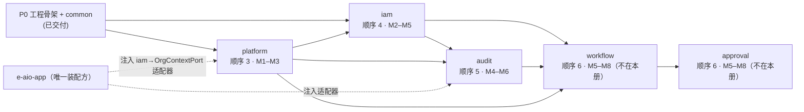

# 企业级一体化管理系统（e-aio）详细设计说明书 · 第 P1 册（批次总册）

> **项目名称**：企业级一体化管理系统（e-aio）
> **编制依据**：GB/T 8567-2006《计算机软件文档编制规范》、GB/T 9385-2008《计算机软件需求规格说明规范》
> **上游文档**：[[01-企业级一体化管理系统-e-aio-可行性研究报告|01-可行性研究报告]]、[[02-企业级一体化管理系统-e-aio-软件需求规格说明书|02-软件需求规格说明书（SRS）]]、[[03-企业级一体化管理系统-e-aio-概要设计说明书|03-概要设计说明书（HLD）]]、[[04-企业级一体化管理系统-e-aio-详细设计说明书-P0-工程地基|04-DD 第 P0 册 · 工程地基]]
> **批次**：P1 平台底座（HLD 13.2 顺序 3–9）
> **本册覆盖窗口**：**M1–M5**（platform / iam，及 audit 的启动部分）
> **版本**：V1.0
> **日期**：2026-09-20

---

## 核心结论（执行摘要）

1. **本批次分三册 + 本总册**。P1 队列共 7 项（HLD 13.2 顺序 3–9），落在 **M1–M5** 窗口内的是 platform、iam 两项全量，以及 audit 的启动部分；`workflow + approval`（M5–M8）、`mdm`（M6–M8）、`oa`（M7–M9）、`portal`（M8–M9）不在本次编写范围，按批次节奏后续成册。
2. **本册是 P1 范围内模块/Schema/错误码段登记的统一来源**。P0 册附录 6.1 建立了登记表制度并声明其为单一事实来源（P0 册 6.1）；P1 新增模块由本册第 6 章接续登记，**两表合并后构成完整登记表**，其余分册不再复制（避免三处漂移）。
3. **P0 的"无可断言对象"在 P1 消除**。P0 册 3.7 声明但无法执行的"模块登记完备""业务错误码落在登记段内"两条 ArchUnit 断言，随 P1 首个真实业务模块落地转为**必须执行的 CI 门禁**（本册 4.1）。这是本批次最重要的隐性交付物——它决定此后所有模块的边界是否可被机器强制。
4. **契约先行的具体形态**：同一 Maven 反应堆内三个模块（`e-aio-platform`、`e-aio-iam`、`e-aio-audit`）的 `api` 包先冻结（接口 + DTO + 事件），实现可错峰。`platform` 会被 `iam` 依赖，但 `platform` 自身又需要"当前组织上下文"——该环由**接口落在 `iam.api`（`TenantCtxProvider`）、`platform` 侧可选注入**打破（iam 册 2.4）。任何"为省事让 platform 反向依赖 iam 实现"的做法都会形成模块环，CI 直接失败。
5. **P1 的四条关键链路**：① 认证到授权的请求全链路（JWT → `TenantCtx` → 权限判定 → 数据权限 SQL 改写 → 审计）；② 文件统一入口（业务模块不自管文件存储，`FileApi` 独占）；③ 审计 WORM 与哈希链（可举证，不只是"有日志"）；④ 参数/字典的分级覆盖与热更新（非关键配置不重启）。这四条链路是 P2 全部业务模块的地基，返工代价最高。
6. **本批次不做的事**（避免范围蔓延）：不做微服务拆分（ADR/`CONTEXT.md` 已定模块化单体）、不做多语言多币种（P3 i18n）、不做 OpenAPI/Webhook 对外开放（P3 integration）、不做 AI 接入（P2 ai）、不做信创数据库方言适配（HLD 12 待细化第 7 条，仍在评估）。
7. **M1–M5 的验收锚点**（HLD 13.3 P1 验收的分段落地）：M3 末 platform 可独立交付并被后续模块引用；M5 末**母子公司权限 E2E 跑通**（组织树 / 数据权限 / SoD / 跨公司审批 → 本窗口内落到"跨公司审批"可用的授权判定，实际审批流转由 M5–M8 的 workflow/approval 承接）、**审计 WORM + 哈希链校验可复现验证**。
8. **代价已显式登记**：审计异步写入存在崩溃窗口（以 STRONG 模式与补偿缓解，audit 册 3.3）；数据权限 SQL 改写带来查询复杂度与索引强依赖（平台底座册 4.5）；参数/权限快照缓存带来一致性延迟（以变更事件与短 TTL 失效，平台底座册 3.4/3.8）。
9. **里程碑口径**：里程碑以 M0 = 项目启动月计（对齐可研 7.1 与 HLD 13.5），"阶段 0（M0–M2）技术预研"与本批次 M1–M3 重叠——重叠期内 P1 的工作以"可运行骨架 + 契约冻结"为交付判据，不以功能齐备为判据。
10. **本册的读者**：架构评审者（看第 4/6 章）、模块负责人（看第 3 章自己的子项）、CI 维护者（看 4.1 门禁增量）。

---

## 1. 引言

### 1.1 编写目的

本册是 P1 平台底座批次的**组织性文档**，回答四个问题：

1. 本批次在 M1–M5 窗口内**交付什么、不交付什么**（第 2、3 章）；
2. 批次内质量门与架构约束相对 P0 **新增了什么强制项**（第 4 章）；
3. 交付物之间**如何验收与追溯**上游 01–03 文档（第 5 章）；
4. P1 新增模块的 **Schema / 错误码段 / 迁移目录登记**，以及跨册一致性约束（第 6、7 章）。

模块级设计细节**不在本册**，见对应分册。本册不重复分册内容，只做批次级裁决与索引。

### 1.2 文档范围

| 项 | 范围 |
|---|---|
| 覆盖队列项 | HLD 13.2 顺序 **3 platform**（M1–M3）、**4 iam**（M2–M5）全量；顺序 **5 audit**（M4–M6）的 M4–M5 落地部分（本批次启动，收口在 M6，见 3.4） |
| 不覆盖 | 顺序 6–9（workflow + approval / mdm / oa / portal）——后续成册；顺序 1–2（工程骨架 / common）已在 P0 册 |
| 覆盖窗口 | M1–M5（里程碑口径见 2.3） |
| 交付形态 | 本总册 + 三份模块分册（platform / iam / audit） |
| 数据库设计 | 不单独成文；由各分册"数据结构设计"章节承载（DD 总册 1 章） |

### 1.3 术语与约定

术语以 [`CONTEXT.md`](../../CONTEXT.md) 为唯一来源，本册直接沿用，不新造词。与批次相关的约定补充如下：

| 约定 | 含义 |
|---|---|
| 分册编号 | 「第 P1 册（分册一/二/三）」分别对应 platform / iam / audit；本文件为「第 P1 册（批次总册）」 |
| 契约先行 | 被依赖模块先冻结 `api` 包（接口 + DTO + 事件）再实现；冻结后变更走评审（HLD 13.4） |
| 缺席降级 | 依赖模块的 `api` 已在编译期可见，但实现尚未落地时，调用方以可选注入处理并记录结构化日志，不得因依赖缺席而启动失败 |
| 登记表 | 模块 ↔ 根包 ↔ Schema ↔ 错误码段 ↔ 迁移目录 的对照表；P0 册附录 6.1 + 本册 6.1 合并构成唯一来源 |
| 里程碑 | M0 为项目启动月（对齐可研 7.1 / HLD 13.5）；本批次窗口 M1–M5 |

### 1.4 与上游文档的追溯关系

```
01 可研 7.1 里程碑 ─┬─ 阶段 0（M0–M2）技术预研 ─┐
                    └─ 阶段 1（M2–M9）MVP ──────┤
02 SRS 3.1 FR-SEC / 3.2 FR-AUD / 3.22 FR-PLT ────┤
03 HLD 5.2/5.3/5.6 模块设计 ────────────────────┤
    HLD 13.2 队列（顺序 3–5） ───────────────────┤
    HLD 13.3 批次验收 ───────────────────────────┤
04-DD P0 册（骨架/契约/common 冻结 V1） ─────────┤
                                                 ▼
                                   04-DD P1 册（本总册 + 三分册）
```

- 需求追溯粒度：**到 FR 编号**（例如 `FR-PLT-03` → platform 册 3.3），不做需求条目复制。
- 冲突判定顺序：AGENTS 系列 > 03 HLD > 02 SRS > 01 可研；已落 ADR 的决策以 ADR 为准（[AGENTS.md](../../AGENTS.md)）。

### 1.5 参考资料

| 文档 | 本册引用点 |
|---|---|
| [[02-企业级一体化管理系统-e-aio-软件需求规格说明书\|SRS]] | FR-SEC-01…15、FR-AUD-01…12、FR-PLT-01…08；NFR-PERF-04、NFR-SEC-01…08、NFR-REL-01…03、NFR-DATA-01…04 |
| [[03-企业级一体化管理系统-e-aio-概要设计说明书\|HLD]] | 2.2 模块边界、3.2 内部接口、3.3/11.2 事件、4.1/4.2 数据结构、5.2/5.3/5.6、8.1/8.2/8.4/8.5、11.1 依赖矩阵、11.3 组件、12 待细化、13.2/13.3/13.4/13.5 |
| [[04-企业级一体化管理系统-e-aio-详细设计说明书-P0-工程地基\|P0 册]] | 3.2 契约与幂等、3.6 Flyway、3.7 ArchUnit、3.8 CI、3.9 前端壳、4 common、6.1–6.3 |
| [ADR-0001](../adr/0001-unified-post-and-always-200-result-contract.md) | 统一 POST + 恒 200；长任务 taskId + 轮询 |
| [ADR-0002](../adr/0002-per-module-schema-and-flyway-instance.md) | 每模块独立 Schema + 独立 Flyway 实例 |
| [ADR-0003](../adr/0003-protocol-endpoint-exceptions.md) | 协议端点例外（OAuth2/SAML2/文件流不套 `Result`） |
| [ADR-0004](../adr/0004-cross-schema-readonly-predicate.md) | 跨 Schema 只读谓词例外（数据权限子树，封闭清单 + 三档降级） |
| [ADR-0005](../adr/0005-platform-zero-dependency-org-context.md) | platform 零反向依赖：自有 `OrgContextPort` + 应用壳注入，环由结构消除 |
| [api-conventions.md](../agents/api-conventions.md) 等 AGENTS 分册 | 接口动作词、错误码分段、五层分包、表约定 |

---

## 2. P1 批次总体设计

### 2.1 批次定位

P0 交付的是"能跑的空壳 + 冻结契约"；P1 交付的是**所有后续模块都要站在上面的地基**。判断某件事是否属于 P1，用一条标准：

> **它是否是"每个业务模块都需要、且各模块自己实现会导致不一致"的能力？**

是 → P1（platform / iam / audit 之一）；否 → 留给业务模块或后续批次。这条标准把大量"顺手能做"的功能挡在批次外（AI、报表、集成、移动端），也正是 P1 分册必须把 API 契约写到接口名层级的理由。

### 2.2 分册索引（本批次实际文件）

| 文件 | 承载 | 章节定位 | 状态 |
|---|---|---|---|
| `04-…-详细设计说明书-P1-1-批次总册.md` | 批次范围、里程碑、跨册裁决、质量门、登记表 | 本文件 | 编写完成，待评审 |
| `04-…-详细设计说明书-P1-2-平台底座.md` | platform（顺序 3）+ iam（顺序 4）合并册，7 章齐全 | 第 3 章 platform、第 4 章 iam、第 5 章数据结构、第 6/7 章质量门与验收 | 编写完成，待评审 |
| `04-…-详细设计说明书-P1-3-platform.md` | platform 单模块册（按能力域展开；**platform 侧 `api` 契约的权威来源**） | 第 2 章总体设计、第 3 章详细设计、第 4 章数据结构 | 编写中 |
| `04-…-详细设计说明书-P1-4-iam.md` | iam 单模块册（**iam 侧 `api` 契约与错误码号的权威来源**） | 第 2 章总体设计、第 3 章详细设计、第 4 章数据结构 | 编写中 |
| `04-…-详细设计说明书-P1-5-audit.md` | audit（顺序 5，M4–M6） | 全 7 章 | 编写中 |

> **多册并存时的权威口径**（按顺序裁决，冲突即缺陷）：
> 1. 模块 / Schema / 错误码**段** / 迁移目录 → 本册 6.1；
> 2. 表名、统一列、索引与 DDL 约定 → 本册 3.5；
> 3. 跨模块依赖方向与"环"的处理 → 本册 3.1；
> 4. **各模块的 `api` 包接口与 DTO 名 → 该模块的单模块册**（platform → `…-P1-3-platform.md`；iam → `…-P1-4-iam.md`；audit → `…-P1-5-audit.md`）；合并册 `…-P1-2-平台底座.md` 保留模块定位、能力清单与数据结构，但其第 3/4 章接口签名**须与单模块册一致**，不一致以单模块册为准；
> 5. **错误码具体号**：同段内以该模块单模块册的号表为唯一号源（iam 段 21000–21999 的具体号以 `…-P1-4-iam.md` 表 7-1 为准，其余文档出现同段内另一套号须改号或删除）。

### 2.3 里程碑口径

| 里程碑 | 时间 | 本批次交付 |
|---|---|---|
| M0 | 项目启动 | P0 完成（tag `v0.1.0-p0`） |
| M1 | +1 月 | platform 骨架与参数/字典；iam `api` 契约冻结 |
| M2 | +2 月 | platform 文件能力；iam 组织模型与认证；阶段 0 技术预研结论（HLD 13.5） |
| M3 | +3 月 | platform 定时任务/Excel/缓存/监测收口；iam 授权与数据权限 |
| M4 | +4 月 | iam 字段权限/SoD/SSO/LDAP；audit 采集与落库启动 |
| M5 | +5 月 | iam 收口（母子公司权限 E2E）；audit WORM + 哈希链；**先冻结 `workflow.api`、再冻结 `approval.api`**（approval 依赖 workflow，顺序 6 起跑） |

> **口径提示**：HLD 13.5 的"阶段 0（M0–M2）技术预研"与本批次 M1–M2 重叠，重叠期内以"骨架可运行 + 契约冻结"为交付判据；audit 的 HLD 队列区间为 M4–M6，本批次只承诺 M4–M5 部分，M6 收口（归档、告警完善、财务审计接入）由后续册承接。

### 2.4 批次组成与依赖



- **链内串行、相邻重叠**（HLD 13.4）：platform → iam → audit 为链，前一模块 `api` 冻结后，后一模块即可开工实现。顺序 6 的两项同属 M5–M8，但**方向明确**：`workflow` 依赖 iam / audit / platform，`approval` 再依赖 `workflow`（审批中心聚合工作流任务）——因此 M5 冻结 `api` 时**先冻结 `workflow.api`，再冻结 `approval.api`**。
- **平台底座零反向依赖（本批次硬约束）**：`platform` **不依赖** `iam` / `audit`（连 `api` 包也不依赖，见 [ADR-0005](../adr/0005-platform-zero-dependency-org-context.md)）；`iam` 不依赖 `audit` 实现。需要"当前组织上下文"时，platform 只声明**自有端口**（`OrgContextPort`），由应用壳注入 iam 适配器——装配边只存在于 `e-aio-app`，模块图因此**无环**（结构消除，不靠框架容忍）。
- **模块载体**：每个模块一个 Maven 模块 `e-aio-<module>`，父 POM `backend/e-aio/pom.xml` 登记；`e-aio-app` 是唯一装配方与唯一 Modulith 应用（`CONTEXT.md`）。

### 2.5 M1–M5 工作分解与交接物

| 里程碑 | platform | iam | audit | 阶段末必须存在的交接物 |
|---|---|---|---|---|
| M1 | 骨架 + 参数中心 + 字典（含迁移 `V2__`/`V3__`、REST 端点、前端页面） | `api` 契约冻结（接口 + DTO + 事件 + 错误码表）；组织模型表设计定稿 | — | platform 可运行；`iam.api` 冻结版进入主分支 |
| M2 | 文件能力中心（存储适配/分片/预签名）；缓存两级 | 组织树 + 用户/岗位 + 认证（密码/MFA）+ 令牌 | — | `FileApi` 可被引用；登录链路 E2E 通过 |
| M3 | 定时任务 + Excel + 监测 + 公告/通知模板；platform 册验收 | RBAC + 数据权限 SQL 改写 | — | platform 册验收清单全绿；数据权限改写有集成测试 |
| M4 | 支撑性缺陷修复与容量验证 | 字段权限 + SoD + SSO/LDAP + 生命周期 | 采集切面 + 审计落库 + 登录日志 | 权限变更/登录全量留痕可查 |
| M5 | 与 iam/audit 的联调收口 | 母子公司权限 E2E 收口；手册与种子数据 | WORM 约束 + 哈希链 + 校验任务 + 查询/举证 | iam/audit 册验收清单全绿；workflow `api` 冻结 |

### 2.6 与 P0 的接续点（逐条）

| # | P0 状态 | P1 动作 | 落点 |
|---|---|---|---|
| 1 | 契约 V1 冻结（`Result`/`PageResult`/`ErrorCode`/异常/幂等） | **不变**；P1 只允许向后兼容新增（`CONTEXT.md` 契约 V1） | 三分册均声明 |
| 2 | `eaio.flyway.modules` 仅 `platform`，且 `eaio_platform` 只有 `V1__baseline.sql` | platform 从 `V2__` 连续编号；新增 `iam`、`audit` 两项登记与各自迁移目录 | 本册 6.1；三册第 4 章 |
| 3 | ArchUnit 只上"可执行规则集"，两条断言无对象 | 补齐 `everyModuleIsDeclared`、`businessErrorCodesWithinRegisteredSegment`（含 `TenantCtxProvider` 接口性）、模块依赖方向断言 | 本册 4.1；测试落点 `e-aio-app` |
| 4 | 前端仅最小壳（请求层/路由壳/布局）；入站链路唯一落点 `DemoController`（`/platform/demo/*`）仅为链路验证存在 | 新增登录页、平台管理页、iam 管理页、公司切换器、个人中心；**platform 首个真实接口落地时删除 `DemoController`**（P0 册 3.9 注 5） | 三分册前端章节 |
| 5 | common 部分门面未落地（`RedisKit`/`SecurityUtils`/加解密/`ExcelKit` 等） | P1 按需补齐，仍在 common（**不建业务逻辑**），业务侧只经门面 | platform 册 3.x、iam 册 3.x |
| 6 | 幂等 `fail-closed`（`10502`）与长任务 `taskId` 口径 | 长任务（Excel 导入导出、审计举证导出、归档）一律 `taskId` + 轮询 | 平台底座册 3.10、audit 册 3.8 |
| 7 | P0 册 6.3 待细化 8 条 | 逐条分流到三分册并在各册附录给"落实对照" | 本册 7.2 |
| 8 | 质量门阶段 6（OWASP）与阶段 7–8（镜像/发布）标 P1 | P1 启用依赖漏洞扫描，交付镜像构建与发布流水线 | 本册 4.3 |
| 9 | P0 册 3.7 注记 3 的 common 暴露清单（`api/util/json/id/exception`）与装配例外清单 | 新增共享类型须显式标 `@NamedInterface`；装配例外按 A4 收紧 | 本册 4.1、三分册附录 |

### 2.7 非目标（本批次明确不做）

| 不做 | 原因 |
|---|---|
| 微服务/独立进程拆分 | 模块化单体是项目定位（`CONTEXT.md`）；拆分不改模块边界，只改部署 |
| 多租户 SaaS 隔离 | 非 SaaS 定位；本批次"多组织"指母子公司，不是多租户实例 |
| 多语言/多币种/时区切换 | P3 i18n；本批次**沿用 P0 第六轮裁决的"全中文 + message 不承载唯一语义"**（前端与排障按 `code` 判定），本批次只把该策略落到页面上（前端不得对 `Result.code` 做中文文案匹配）；时间统一 `TIMESTAMPTZ` UTC 存储，展示不做时区切换（代价见 platform 册 4.1） |
| 信创数据库方言适配 | HLD 12 待细化第 7 条仍在评估；PostgreSQL 17 为唯一验证目标 |
| OpenAPI/Webhook 对外 | P3 integration；本批次接口仅对前端与本应用内模块开放 |
| AI 能力接入 | P2 ai；oa 对 ai 为可选渐进依赖（HLD 13.2 说明） |
| 完整财务审计（账实相符/四流合一/费用合规） | 依赖 finance（P2 顺序 12）；本批次只落"财务审计轨迹"写入与查询 |

---

## 3. 批次内契约裁决

以下为跨册必须一致、单册内无法独立裁决的事项。三分册与后续册均以此为准。

### 3.1 跨模块依赖与"环"的处理

| 关系 | 形态 | 说明 |
|---|---|---|
| iam → platform | 编译期正常依赖 `com.eaio.platform.api` | iam 缺参数/字典/缓存/文件/任务则无法工作，属单向依赖 |
| platform → iam | **不存在**（不依赖其任何包，含 `api`） | platform 需"当前组织"时用**自有端口 `OrgContextPort`**（`com.eaio.platform.api`，内部 Null 默认实现：只读系统级、系统上下文），由 `e-aio-app` 注入 iam 适配器（[ADR-0005](../adr/0005-platform-zero-dependency-org-context.md)）。显式传参优先：`ParamApi.get(key, orgId)` 这类签名把上下文责任交给知道上下文的一侧 |
| platform → audit | 不存在（编译期零依赖） | 文件上传/下载、参数变更的留痕由 **audit 侧**采集（`AuditAspect` + 端口适配器），platform 只发领域事件；app 负责装配 |
| iam → audit | 仅经 `com.eaio.audit.api` 的可选依赖 | 权限变更审计（`UserRoleChangedEvent` + `PermissionAuditApi`）；M4 前 audit 缺席时降级为结构化日志 + 待补队列 |
| audit → iam / platform | 编译期正常依赖 `api` 包 | 审计需用户名/组织名展示（iam）与参数/文件/Excel/任务（platform） |
| approval → workflow（顺序 6，M5–M8，本册只登记方向） | 编译期正常依赖 `com.eaio.workflow.api` | 审批中心聚合工作流引擎的实例/任务（待办、催办、时效统计）并叠加分级审批规则；**两模块各自独立 Schema**（`eaio_workflow` / `eaio_approval`，见 6.1 注 4），依赖走 `api`，与 Schema 归属无关 |

> **为什么不用"事件完全解耦"回避环**：事件适合副作用（缓存失效、索引同步），不适合"取数"（展示用户名、生成文件、按组织取参数），把所有同步取数改事件会把强一致读变成最终一致读，代价更大（HLD 4.4 的强/最终一致分工）。因此本批次采用"**显式传参 + 模块自有端口 + 应用壳装配**"，而不是"全事件化"，也不是"让 platform 反向依赖上层模块"。
>
> **为什么"接口放上游 + 可选注入"也不够**：那仍然是 `platform → iam` 的编译期边，是否成环取决于框架对 `@ApplicationModule` 的容忍；把不变量押在框架行为上，等于把设计缺陷推迟到编码期（[ADR-0005](../adr/0005-platform-zero-dependency-org-context.md) 背景）。

### 3.2 事件与异步

- **事件命名**：`<主体><过去式>Event`（HLD 3.3 风格），载荷为不可变 record，字段含 `eventId`（幂等键）、`occurredAt`、`orgId`。
- **事务性**：跨模块副作用一律 `@TransactionalEventListener(AFTER_COMMIT)`（HLD 4.4）。
- **可靠性**：核心事件（权限变更、组织变更、参数变更）采用**事务性发件箱**（各模块自有 `event_outbox` 表）+ 投递重试（指数退避）+ 死信标记（`dead_letter` 状态 + 人工重放入口）+ 消费幂等（`事件ID + 业务ID` 去重）。P0 册 6.3 第 5 条"事件总线可靠性"由此落实。
- **不允许**：以事件替代同步查询（见 3.1 注）；以事件承载长任务结果（ADR-0001）。

### 3.3 前端分工与页面归属

P1 前端不建独立工程，全部落在 P0 已初始化的 `frontend/`：platform 管理页、iam 管理页、登录页、个人中心、公司切换器。portal（M8–M9）才做门户收口，本批次**不得**提前实现菜单聚合/待办聚合/消息中心。权限驱动渲染（菜单/按钮/字段）依赖 iam 下发的权限树与字段权限矩阵，前端不硬编码权限（HLD 3.4）。

**P1 前端落地口径**（分册按此写，避免各册自定）：

| # | 约定 |
|---|---|
| 1 | **请求形态**：常规接口一律 `POST /api/<module>/<resource>/<Action>`（动作词 `Get`/`GetPage`/`Add`/`Up`/`Del` 等），响应恒 HTTP 200 + `Result<T>`；**协议端点例外**见 [ADR-0003](../adr/0003-protocol-endpoint-exceptions.md)（OAuth2/SAML2/文件流不套 `Result`），前端请求层对例外路径走独立封装 |
| 2 | **错误处理唯一入口**：按 `Result.code` 判定（`10401` → 跳登录并保留原路由；`10403` → 无权限提示；业务码 → 显示 `message`）。**不得对中文 `message` 做字符串匹配**（文案调整与后续 i18n 都会破坏它） |
| 3 | **幂等键**：写接口由前端生成 `Idempotency-Key`（同一表单复用同一个键；提交成功或明确失败后更换）；查询接口不带该头 |
| 4 | **长任务**：Excel 导入导出、审计举证导出等返回 `taskId`，前端轮询任务状态（进度 + 错误明细下载），不做长时间阻塞请求（ADR-0001） |
| 5 | **权限驱动渲染**：菜单/路由/按钮/字段可见性由 iam 下发；前端不硬编码权限判断，也不把"隐藏按钮"当安全边界（后端照常判定） |
| 6 | **公司（组织）切换**：请求头 `X-Org-Id` 由公司切换器设置；后端校验挂载关系，越权切换按数据权限口径拒绝（不静默回退为默认组织） |
| 7 | **P1 页面清单**：登录（含 MFA/SSO 分支）、个人中心（改密/令牌会话/我的组织）、组织树管理、用户管理、角色与权限、数据权限与字段权限、SoD 规则、参数与字典、文件、定时任务、站内消息、审计查询与举证。**菜单聚合/待办聚合/消息中心归 portal（M8–M9）** |
| 8 | **敏感展示**：脱敏由后端下发（`@Sensitive` 序列化），前端不自行拼接完整值；导出/打印走同一脱敏口径 |

### 3.4 audit 的窗口切分

audit 的 HLD 队列区间是 M4–M6，本批次只覆盖 M4–M5。**M6 收口项**（后续册或 P1 补册承接）：时间分区自动维护与历史分区 detach 归档落地、告警通知渠道接通（portal 消息）、财务审计与 finance 的联调（P2）、审计报表（P2 report）。本册 5.2 的验收口径按此分段，不把 M6 项记入 M5 验收。

### 3.5 命名与 DDL 硬约定（跨册一致，不得各册自定）

本批次的表/列/索引/约束命名以本表为准；分册中的写法与此不符即为缺陷（评审驳回）：

| 对象 | 约定 | 理由 |
|---|---|---|
| 表名 | **`snake_case` 单数**，模块内不加模块前缀（Schema 已隔离）：`param`、`dict_type`、`org_node`、`audit_event` | 单复数不承载语义；前缀只是重复 Schema 信息（`eaio_platform.param` 已表意）。本册裁决**单数无前缀**，覆盖 P0 册 3.6 的"复数"措辞（P0 无业务表，改名无迁移代价）。**已登记例外**：iam 的用户主档保留 `sys_user`（与 RuoYi 蓝本一致、由 iam 册声明为保留字例外，仅此一例） |
| 列名 | `snake_case`；统一列 `id` / `created_at` / `created_by` / `updated_at` / `updated_by` / `version` / `deleted`（逻辑删除表） | 跨模块一致的审计与乐观锁列；**只追加表（审计流水、日志）可声明"无 `updated_*`/`version`/`deleted`"例外**，须在册内逐表声明 |
| 主键 | `id BIGINT`（雪花，`IdGenerator`），**不用自增** | 分布式生成、导入导出不冲突（database.md）；审计链的连续序号用 PG `SEQUENCE` 属**已登记例外**（连续性是"第 N 条"的语义要求，audit 册 4.1.2） |
| 时间列 | `TIMESTAMPTZ`（UTC 存储） | 跨公司/跨时区一致；展示层不做时区切换（2.7） |
| 索引 | `idx_<table>_<cols>`；唯一约束 `uk_<table>_<cols>`；外键 `fk_<table>_<ref>`；触发器 `trg_<table>_<purpose>` | 便于从索引名反查表；**禁止多表名串接** |
| DDL 位置 | 每表显式 schema 限定（`eaio_<module>.`），并写 `COMMENT ON TABLE/COLUMN` | 禁跨 Schema + 中文注释随库交付 |
| 布尔 | `BOOLEAN`（不用 `CHAR(1)`/`TINYINT`/`SMALLINT`） | PostgreSQL 原生；`deleted BOOLEAN NOT NULL DEFAULT false` |
| 枚举 | `VARCHAR(32)` + 应用层枚举 + `CHECK` 约束（**不用** PG `ENUM` 类型、**不用**数组类型） | 增删值不需 DDL 迁移 |
| 大文本/半结构化 | `JSONB`（前后值快照、策略 DSL、扩展字段）；确不需查询的用 `TEXT` | 可索引、可校验 |
| DTO 命名 | 跨模块契约用 `*DTO`（`api` 包），入参用 `*Cmd` / `*Query` | 全批次统一；已出现的 `*VO` 视为缺陷需改 `*DTO` |
| 迁移脚本 | 只新增、不改已发布脚本；单脚本内**同类变更**（建表/加列/建索引）；脚本内写 `COMMENT ON` **中文说明** | Flyway 校验和拦截（ADR-0002） |
| 迁移兼容性 | ① 新增（表/列/索引/约束）：默认须**向后兼容**（新列可空或有默认值）；② 收紧（`NOT NULL`/`CHECK`/`UNIQUE`/改类型）：**仅在 ≤1 万行的表上允许**，否则须两步走（先补齐数据再收紧）并写明数据量依据；③ 破坏性变更（改列名/删列）：须同脚本内完成代码侧同步并说明回滚方式 | 面向"可插拔演进 + 不停机升级"（HLD 13.1）；避免一次迁移把启动锁死 |
| 回滚 | Flyway 不提供自动回滚：每个脚本头部注释"反向 SQL 或补偿方案"（一行即可） | 事故时有人能在 5 分钟内知道怎么退 |

### 3.7 评审中已裁决的问题与待 M1 实测项

| # | 问题 | 裁决 / 状态 |
|---|---|---|
| 1 | iam 错误码：合并册 `21100–21146` vs iam 单模块册 `21001–21092` | **以 iam 单模块册表 7-1 为唯一号源**（2.2 权威口径第 5 条）；合并册号表作废 |
| 2 | `PermissionAuditApi` 归属 | 归 **`com.eaio.audit.api`**（audit 是 iam 权限变更的采集方，依赖方向 iam → audit.api 为可选依赖） |
| 3 | 数据权限规模上限 | 三档：≤2000 内联 `IN`；≤50000 走 `EXISTS` 谓词（[ADR-0004](../adr/0004-cross-schema-readonly-predicate.md)）；超限**停用该数据范围规则**（恒假 + 明确错误码 + WARN 告警），不退化为全量可见、也不硬拒绝业务请求 |
| 4 | OAuth2/SAML2/文件流与"恒 200"冲突 | 按 [ADR-0003](../adr/0003-protocol-endpoint-exceptions.md) 开封闭例外清单，逐路径登记到 `api-conventions.md` |
| 5 | `TenantCtx` 与"platform 需要当前组织"的环 | **已定案，不再需要实测定夺**：platform **零反向依赖**（连 `api` 都不依赖），用自有 `OrgContextPort`（Null 默认 = 系统上下文/只读系统级）+ 应用壳注入 iam 适配器；由 **A7 断言**在编译期保证边不存在（[ADR-0005](../adr/0005-platform-zero-dependency-org-context.md)） |
| 6 | 审计写入不走 `event_outbox` | 接受：审计写入为 STRONG 同事务 / 本地有界队列 + 溢出文件，消费幂等靠 `event_uid` 派生键（audit 册 5.4/7.6 已说明）。发件箱仍适用于权限/组织/参数等核心事件（本册 3.2） |
| 7 | FR-AUD-01"查操作"默认不采集 | 接受收窄：默认不采集读路径，以 `capture.read-paths` 白名单 + 敏感读取 STRONG 补偿（audit 册 3.1.3）。理由：容量放大十倍以上且举证价值低；**该收窄须在评审记录中留痕** |
| 8 | `audit_login_log` 保留与 WORM 冲突 | M6 定案（归档不删 或 改按月分区 + 迁移角色分批删）；本批次不做删除动作，保留口径已在 audit 册 7.6 登记 |
| 9 | DTO 后缀 `DTO` vs `VO` | 统一 `*DTO` / `*Cmd` / `*Query`（本册 3.5） |
| 10 | 单册篇幅（iam 2793 行、audit 3856 行） | **不压缩**：细节即可执行性（DDL / 错误码 / 测试点 / 举证步骤）。篇幅不作为验收项，**可执行性与一致性**才是 |

### 3.8 数据与安全底线（批次内不可协商）

1. 跨 Schema **禁止**关联查询与写操作（ADR-0002）；跨模块取数走 `api`。**已登记的两项例外**：① 数据权限子树谓词对 `eaio_iam.org_node_path` 的**只读单表 SELECT**（[ADR-0004](../adr/0004-cross-schema-readonly-predicate.md)，注入点唯一、应用角色无写权限、超限退化恒假而非全量）；② OAuth2/SAML2/文件流的**协议端点**不套 `Result` 包装（[ADR-0003](../adr/0003-protocol-endpoint-exceptions.md)，封闭清单 + 逐路径登记）。两项之外的任何"破例"须先新增 ADR，不得在分册里就地放宽。
2. 密钥/凭据（JWT 私钥、`mfa_secret`、SSO/LDAP 凭据、对象存储 AK/SK）**不得硬编码、不入库明文**：来源为环境变量或参数中心，需加密落库者用 AES-GCM 且密钥独立来源。
3. 敏感字段存原文、展示脱敏（common `@Sensitive`）；**审计留痕不落未脱敏的敏感原文**（audit 册 3.4）。
4. 认证/鉴权失败恒 HTTP 200 + `10401`/`10403`，前端按 `Result.code` 跳登录（ADR-0001）；协议端点按 ADR-0003 例外清单执行。
5. 越权防线至少两道：应用层判定 + 数据层过滤（数据权限改写/DTO 裁剪），不得只靠前端隐藏。
6. **不得静默降级**：安全相关能力（数据权限、SoD、审计写入、幂等）在依赖不可用时要么明确失败（业务码），要么走"更严格"的退化（如恒假谓词），**绝不退化成"放行/全量可见"**。

---

## 4. 质量门与架构约束（相对 P0 的增量）

### 4.1 新增 ArchUnit / Modulith 断言（本批次必须落地）

先厘清 P0 的实况（P0 册 3.7 实现注记）：**已生效**的是"命名接口完备"（每个模块 `api` 包带 `@NamedInterface("api")`，含 common）与"模块边界/分层依赖/无循环"（`ApplicationModules.verify()` + 依赖断言），外加 `rulesHaveNonEmptyScope` / `purityRuleHasTeeth` 两条防假绿元规则；**声明而无可断言对象**的是"模块登记完备"与"业务错误码落段"（P0 册 3.7 注记 5、6.3 第 7 条）。

本批次必须落地以下增量，落点仍是唯一架构测试 `e-aio-app` → `ArchitectureTest`（P0 册 3.7 注记 1）：

| # | 断言 | 类型 | 判据 | 失败示例 |
|---|---|---|---|---|
| A1 | 模块登记完备 | **新增**（P0 册 6.3 第 7 条） | 每个业务模块根包 `package-info.java` 带 `@ApplicationModule`，且其 `name` 与 6.1 登记表的模块名一致 | 新增模块忘写 `package-info` → 失败 |
| A2 | 错误码落在登记段内 | **新增**（P0 册 6.3 第 7 条） | 每个模块的 `*ErrorCode` 枚举，**取值全部**落在 6.1 登记段内且互不重号；模块**必须**存在该枚举（首版即建，避免"暂时借用通用段"） | iam 写出 `20999` → 失败 |
| A3 | 上下文接口形态 | **新增**（本册 3.1 的机器保证） | `TenantCtxProvider` 是 `com.eaio.iam.api` 中的 **interface**；`iam` 侧实现类不得位于 `api` 包 | 把实现类放 `api` → 失败 |
| A4 | 装配例外收紧 | **收紧**（P0 册 3.7 注记 4） | `ASSEMBLY_EXCEPTIONS` 只保留应用壳自身装配所需项；业务模块之间不得引用彼此的装配包 | `iam` 引用 `platform.infrastructure` → 失败 |
| A5 | `internal` 包不可跨模块引用 | **生效**（P0 册 3.7 注记 5） | P1 模块出现 `internal` 包后，跨模块引用必须被 `verify()` 拦下 | 业务模块引用 `iam.internal.*` → 失败 |
| A6 | `api` 包签名约束 | **新增**（P1 起 `api` 被真实依赖） | `api` 包内类型只能引用 `java.*` / common 共享面 / 自身 `api`；不得引用本模块 `application`/`domain`/`infrastructure` | `api` 的 DTO 里出现 `domain` 实体 → 失败 |
| A7 | **平台底座零反向依赖** | **新增**（[ADR-0005](../adr/0005-platform-zero-dependency-org-context.md)） | `com.eaio.platform` **不得引用 `com.eaio.iam` / `com.eaio.audit`（含其 `api` 包）**；需要组织上下文只能用自己的 `OrgContextPort` | `platform.application` import `iam.api.TenantCtxProvider` → 失败 |

> **A1–A6 的作用**：3.1 的"环由接口归属打破"、6.1 的"四处同时改"在没有断言时都只是文档约定；有了 A1–A6，新增模块边界是否合规由 CI 判定，而不是由评审者的记性判定。
>
> **不变项**：契约核心（`Result`/`PageResult`/`ErrorCode`……）P0 已冻结 V1，本批次**不新增 A 类断言改写它**，只在其上做 A2 的"业务段"约束。

### 4.2 依赖与分包规则（P1 生效）

1. 跨模块只依赖 `api` 包（Modulith `@NamedInterface`）；`application` / `domain` / `infrastructure` / `events` 模块内可见。
2. 模块内五层方向：`api` ← `application` → `domain` ← `infrastructure`；`domain` 不引用 `infrastructure`。
3. 禁止跨 Schema SQL；模块间数据交换只能经 `api` 或事件。
4. **可选依赖的写法**：对上游 `api` 用构造器注入 + `ObjectProvider<T>`，或 `@ConditionalOnBean` 装配；缺席时走降级分支并 `log.warn`（含 `traceId`）。禁止 `@Autowired(required=false)` 字段注入（java-conventions 禁字段注入）。

### 4.3 门禁矩阵增量（阶段编号对齐 P0 册 3.8）

| 阶段 | P0 状态 | P1 增量 |
|---|---|---|
| 1 编译 | 启用（`mvn -B compile`） | 三模块纳入反应堆 |
| 2 Lint | 启用（后端 `checkstyle:check` + 前端 `npm run lint`） | 不变，规则集不得放宽 |
| 3 单元测试 | 启用（`mvn -B test`，含 ArchUnit） | 新增 4.1 的 A1–A6；新增算法单测（4.4） |
| 4 架构测试 | 启用（`mvn -B verify -DskipITs`，Modulith verify） | 装配例外收紧生效（A4） |
| 5 集成测试 | 启用（Testcontainers PG17 + Redis 7，无 Docker 跳过） | 新增三模块迁移、参数覆盖、文件往返、数据权限改写、WORM 触发器、哈希链续链用例 |
| 6 安全扫描 | License 启用；**OWASP Dependency-Check 属 P1** | **本批次启用 OWASP**（含 NVD Key 与缓存策略，P0 册 3.8 注）；高危未评审即阻断（NFR-SEC-07、NFR-OSS-04） |
| 7 镜像构建 | **属 P1**（P0 不交付 `Dockerfile`） | **本批次交付**：多阶段构建的单可执行 Jar 镜像（PG/Redis 编排仍按 HLD 9.2，不在本批次） |
| 8 发布 | **属 P1** | **本批次交付**：打 tag 触发 Release 产物（与 P0 标签 `v0.1.0-p0` 衔接） |

> **新增门禁的一致性要求**：阶段 6–8 任一启用后即成为**阻断项**，不得以"先观察"名义长期告警不拦（NFR-OSS-03）。

### 4.4 测试要求（批次级）

| 层 | 要求 |
|---|---|
| 单元 | 算法与规则必须单测：参数分级覆盖、数据范围谓词生成、哈希链哈希与规范化、字段权限裁剪、SoD 冲突判定、cron 校验 |
| 集成 | Testcontainers 真库真 Redis：迁移可重复执行、WORM 触发器拒绝 UPDATE/DELETE、哈希链跨重启可续、文件分片合并校验、任务锁互斥 |
| 架构 | 4.1 断言全集 |
| 安全专项 | 越权（横向/纵向）、令牌重放、暴力破解锁定、数据权限绕过、SoD 绕过、审计篡改未授权（iam 册 6.4、audit 册 6.4） |
| 性能 | 审计异步写入对写接口 P95 影响 ≤ 10%（NFR-PERF-02）；Excel 10 万行内存峰值可控（NFR-PERF-04）；列表分页 P95 < 1s（NFR-PERF-03） |

---

## 5. 交付与验收

### 5.1 本批次交付物清单

| # | 交付物 | 形态 | 验收判据 |
|---|---|---|---|
| 1 | platform 模块 | 代码 + 迁移 + 单测/集成测试 + 前端页面 | platform 册 6.5 清单全绿 |
| 2 | iam 模块 | 同上 | iam 册 6.6 清单全绿 |
| 3 | audit 模块（M4–M5 部分） | 同上 | audit 册 6.6 清单全绿 |
| 4 | 架构门禁 A1–A6 | `e-aio-app` 架构测试 | CI 阶段 2 绿 |
| 5 | 契约清单 | 三分册第 5 章（`api` 包签名 + REST 端点 + 事件） | CI 阶段 7 契约漂移检查绿 |
| 6 | 迁移脚本 | `db/migration/{platform,iam,audit}/V*.sql` | CI 阶段 5 绿；脚本可重复执行 |
| 7 | 种子数据 | 参数/字典/权限点/内置角色/告警规则 | 全新库启动后系统可用（可登录、可授权） |

### 5.2 验收锚点（对照 HLD 13.3 的 P1 行，按 M1–M5 分段）

HLD 13.3 的 P1 验收为四项：**母子公司权限 E2E**、**操作审计 WORM + 哈希链校验**、**工作流 + 审批全链路**、**MVP 种子企业试用反馈**。其中第 3 项属顺序 6（M5–M8），第 4 项属 MVP 收口，均不在 M1–M5 窗口内完成；本批次对第 1、2 项的**分段承诺**如下：

| HLD 13.3 验收项 | M1–M5 承诺 | 证据 | 不承诺部分（后续） |
|---|---|---|---|
| 母子公司权限 E2E（组织树 / 数据权限 / SoD / 跨公司审批） | 组织树无限级与子树查询、数据权限改写生效、SoD 校验拦截、**跨公司审批的授权判定可用**（审批人可跨组织指定并判定通过） | iam 册 6.5 E2E 用例 | 审批流转本体与审批中心聚合（workflow/approval，M5–M8） |
| 操作审计 WORM + 哈希链校验 | 只追加约束（DB 层拒绝改删）、哈希链生成与跨重启续链、校验任务产出校验根、篡改可被检出、举证导出可用 | audit 册 6.4 专项验证 | 分区归档自动化、告警通知渠道、财务审计联调（M6 / P2） |
| 工作流 + 审批全链路 | **仅契约冻结**（`workflow`/`approval` 的 `api` 在 M5 冻结，工程起跑） | workflow 册（待编） | 全链路跑通（M8） |
| MVP 种子企业试用反馈 | 不涉及 | — | 阶段 1 收口（M9） |

> **口径纪律**：本批次不得把"契约冻结"记作"全链路跑通"，也不得把"审计已记录"记作"防篡改已验证"——后者必须由 audit 册 6.4 的篡改检出用例举证。

### 5.3 里程碑评审（每阶段末）

| 评审 | 输入 | 裁决 |
|---|---|---|
| M1 评审 | platform 骨架 + 参数/字典；`iam.api` 冻结版 | 契约是否可支撑 iam 开工；错误码/表名/接口命名是否与登记表一致 |
| M3 评审 | platform 册验收清单；数据权限改写集成测试 | platform 是否可"冻结并被引用"；遗留项登记 |
| M5 评审 | iam / audit 册验收清单；A1–A6 门禁 | 批次验收锚点（5.2）是否达成；后续册承接项确认 |

---

## 6. 登记表

### 6.1 P1 新增模块登记（与 P0 册附录 6.1 合并使用）

| 模块 | Maven 模块 | 根包 | Schema | 错误码段 | 迁移目录 | 状态 |
|---|---|---|---|---|---|---|
| platform | `e-aio-platform` | `com.eaio.platform` | `eaio_platform` | 20000–20999 | `classpath:db/migration/platform` | 本批次（M1–M3） |
| iam | `e-aio-iam` | `com.eaio.iam` | `eaio_iam` | 21000–21999 | `classpath:db/migration/iam` | 本批次（M2–M5） |
| audit | `e-aio-audit` | `com.eaio.audit` | `eaio_audit` | 22000–22999 | `classpath:db/migration/audit` | 本批次（M4–M6，M4–M5 覆盖） |
| workflow | `e-aio-workflow` | `com.eaio.workflow` | `eaio_workflow` | 23000–23999 | `classpath:db/migration/workflow` | 顺序 6（M5–M8），本批次仅冻结 `api` |
| approval | `e-aio-approval` | `com.eaio.approval` | `eaio_approval` | 24000–24999 | `classpath:db/migration/approval` | 顺序 6（M5–M8） |

**登记表使用规则**：

1. 新增模块 = 建 Maven 模块 + 父 POM 登记 + `package-info` 声明模块 + 登记本表 + `eaio.flyway.modules` 追加（**四处同时改**，缺一处 CI 失败，A1 断言兜底）。
2. 错误码段每模块 1000 号，段内分组留空号；**空号不回收**（P0 册 3.2.3）。
3. 本表是 P1 范围内的唯一来源；P0 册 6.1 的行仍有效，两者合并为完整登记表。
4. **上游一致性已同步（2026-09-21）**：HLD 4.2 原把 workflow 与 approval 合并为一行 `eaio_wf`，与"一个模块 = 一个根包 = 一个 Schema"（`CONTEXT.md`）及本表冲突。**已直接修订 HLD 至 V1.2**：拆为 `eaio_workflow` / `eaio_approval` 两行，并把缩写 Schema 名改为模块全称（`eaio_fin` → `eaio_finance`）、补「Schema 名不得缩写、不得多模块共用」与登记表单一事实来源说明（HLD 修订记录 V1.2 留痕）。
   **为什么不能合并**：① 依赖方向是 **approval → workflow**（审批中心聚合工作流引擎的任务与实例，见 3.1 依赖表），两模块共用一个 Schema 会让"负责任何一张表迁移"的边界消失；② 一个 Schema = 一个 Flyway 实例 = 一条版本序列（ADR-0002），两模块的 DDL 混排会把版本号变成运行时约定；③ 裁剪场景（NFR-EXT-01）里"只留引擎不留审批中心"将无法拆分。
   **注意**：合并 Schema 与"approval 依赖 workflow"并不构成矛盾（依赖走 `api`，与数据库归属无关，同 audit → iam、iam → platform 的先例）；被否决的是"共用 Schema"，不是"存在依赖"。

### 6.2 Schema 与迁移登记

| Schema | 创建方 | P1 迁移起点 | 备注 |
|---|---|---|---|
| `eaio_platform` | platform `V1__baseline.sql`（P0 已发布） | **`V2__` 起** | 基线只含 schema，禁止重复创建（ADR-0002） |
| `eaio_iam` | iam `V1__init.sql` | `V1__` 起 | 本模块首次建立 Schema |
| `eaio_audit` | audit `V1__init.sql` | `V1__` 起 | 同上；含分区表与 WORM 触发器 |

- 迁移脚本一经发布**不可修改**（校验和拦截），只能新增；各模块版本号在模块内独立递增（ADR-0002）。
- 生产环境 Schema 由 DBA 预建并授权应用角色；本地/CI 走"应用建 Schema"路径（P0 册 3.6、database.md）。

### 6.3 质量门登记（增量）

| 门禁 | 触发 | 阻断条件 |
|---|---|---|
| A1–A6 架构断言 | 每次提交（CI 阶段 3/4） | 任一断言失败 |
| 业务模块错误码枚举存在且落段 | 每次提交（CI 阶段 3） | 新增模块无 `*ErrorCode` 枚举，或取值越段/重号 |
| OWASP 依赖漏洞扫描 | 每次提交（CI 阶段 6） | 存在高危且无例外评审记录 |
| 迁移可重复执行 | 每次提交（CI 阶段 5） | 空库/非空库重复 migrate 失败 |
| 镜像构建与 Release | tag 推送（CI 阶段 7/8） | 构建失败 |

---

## 7. 附录

### 7.1 跨册一致性约束（写作与评审检查表）

| # | 约束 | 检查方式 |
|---|---|---|
| 1 | 模块/Schema/错误码段/迁移目录与 6.1 一致 | 全文检索配对核对 |
| 2 | `api` 包接口名、DTO 名在正文、契约章、附录三处一致 | 逐名核对 |
| 3 | 表名 `snake_case` **单数**、显式 schema 限定、索引/唯一约束命名符合 3.5 | DDL 通读 |
| 4 | 时间列 `TIMESTAMPTZ`；统一列命名（`created_at`/`created_by`/`updated_at`/`updated_by`/`version`/`deleted`） | DDL 通读 |
| 5 | 错误码不跨段、不重号、空号不回收 | 号表去重 |
| 6 | 上游引用编号真实存在（HLD/SRS/P0 册/ADR） | 回查上游 |
| 7 | 长任务交付方式为 `taskId` + 轮询 | 契约章核对 |
| 8 | 敏感数据与密钥处理符合 3.8 | 设计章核对 |

### 7.2 P0 册 6.3 待细化事项的批次分流

| # | P0 册 6.3 条目 | 分流 |
|---|---|---|
| 1 | `TenantCtx` 实现与过滤器接入 | iam 册 3.10（本批次交付） |
| 2 | `@AuditLog` 切面与 audit 接入 | audit 册 3.1（本批次交付） |
| 3 | platform 参数/字典/`FileApi`/Scheduler 表与契约 | platform 册 3.1–3.4、第 4/5 章（本批次交付） |
| 4 | 数据权限 SQL 改写方案 | 平台底座册 4.5（M3 交付） |
| 5 | 事件总线可靠性（重试/死信/幂等） | 本册 3.2（机制）+ 各册 `event_outbox` 表设计（本批次交付） |
| 6 | 信创数据库适配层（方言抽象） | **不在本批次**（HLD 12 待评估）；本批次只保证 SQL 不越出 PostgreSQL 标准子集可迁移范围，登记为遗留 |
| 7 | ArchUnit 模块登记与错误码段断言 | 本册 4.1 A1/A2（本批次交付） |
| 8 | `eaio.idempotency.fail-open` 开关评估 | 不在本批次；维持 fail-closed（`CONTEXT.md`），评估结论随 P2 高并发验证（NFR-PERF-01）一并给出 |

### 7.3 遗留与后续分册承接

| 遗留项 | 承接 |
|---|---|
| workflow + approval 设计与实现 | 顺序 6 分册（M5–M8） |
| mdm / oa / portal | 顺序 7–9 分册 |
| audit M6 收口（归档自动化、告警通知、财务审计联调） | audit 后续册或 P1 补册 |
| ~~HLD 4.2 与登记表的 Schema 命名不一致~~ | **已关闭（2026-09-21）**：HLD 直接修订到 V1.2（拆 `eaio_workflow`/`eaio_approval`、缩写改全称、命名规范对齐 DD） |
| 信创数据库方言适配 | HLD 12 待细化；P2/P3 评估 |
| 多语言（i18n）与全中文硬编码策略 | P3 i18n 分册 |

### 修订记录

| 版本 | 日期 | 主要修订 |
|---|---|---|
| V1.0 | 2026-09-20 | P1 批次总册初版：批次范围与 M1–M5 窗口、里程碑切分、跨册契约裁决（依赖环处理/事件可靠性/前端分工/审计窗口切分/安全底线）、质量门增量（A1–A6 架构断言、OWASP、契约漂移）、验收锚点按 HLD 13.3 分段承诺、P1 模块与 Schema 登记表、P0 册 6.3 分流与遗留登记 |
| V1.1 | 2026-09-21 | ① 分册命名加子序号（`-P1-1-`…`-P1-5-`，与 DD 总册同步）；② 依赖裁决改定案：**platform 零反向依赖**，组织上下文用自有 `OrgContextPort` + 应用壳注入（[ADR-0005](../adr/0005-platform-zero-dependency-org-context.md)），新增 **A7 断言**，取消"待 M1 实测定环"；③ 数据权限上限 20000→**50000**，超限改"停用规则 + 告警"（[ADR-0004](../adr/0004-cross-schema-readonly-predicate.md)）；④ 新增 3.6 前端落地口径、3.5 增补触发器/枚举/DTO/迁移兼容性与回滚约定；⑤ 3.7 逐条记录本批次已裁决问题（iam 号源、`PermissionAuditApi` 归属、FR-AUD-01 读路径收窄、audit 不走发件箱、篇幅不压缩等） |

---

*本册为 P1 批次入口；模块级设计见 [[04-企业级一体化管理系统-e-aio-详细设计说明书-P1-3-platform|P1-3 · platform]]、[[04-企业级一体化管理系统-e-aio-详细设计说明书-P1-4-iam|P1-4 · iam]]、[[04-企业级一体化管理系统-e-aio-详细设计说明书-P1-5-audit|P1-5 · audit]]，platform+iam 合并册为 [[04-企业级一体化管理系统-e-aio-详细设计说明书-P1-2-平台底座|P1-2 · 平台底座]]。*
