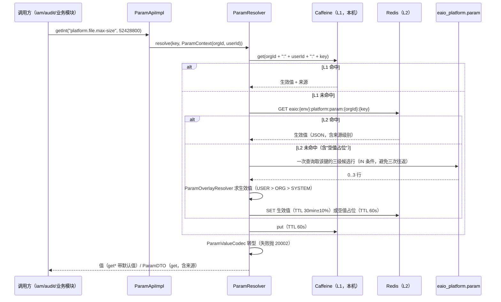
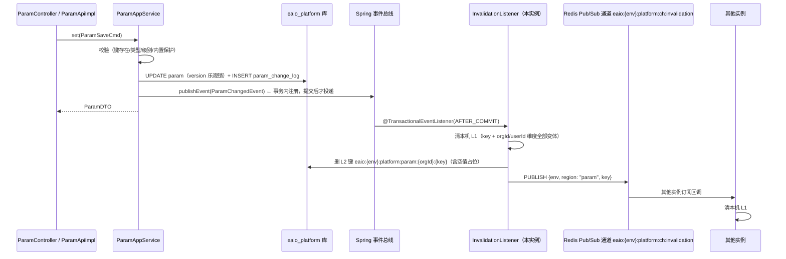
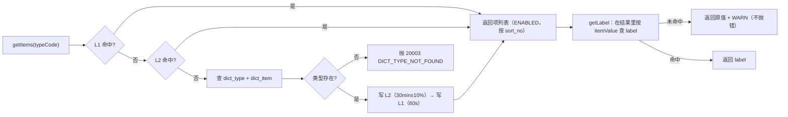
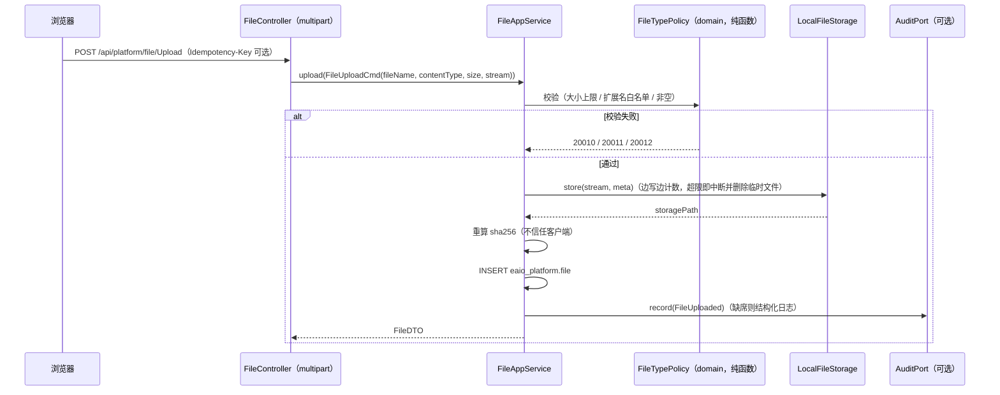
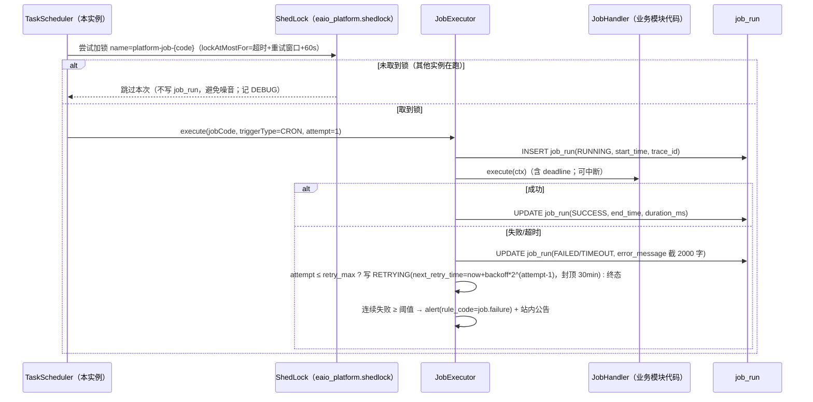
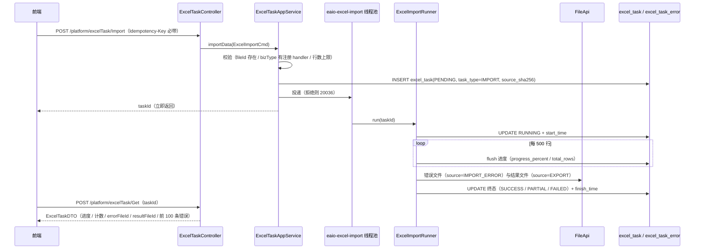
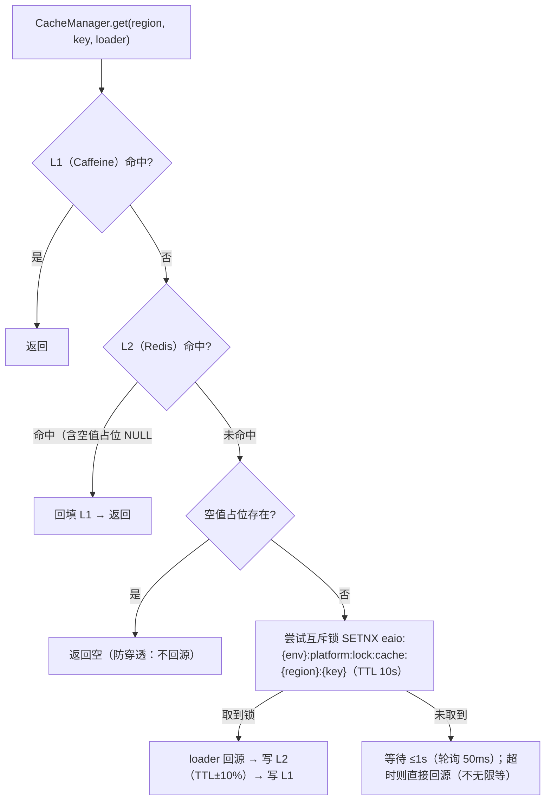
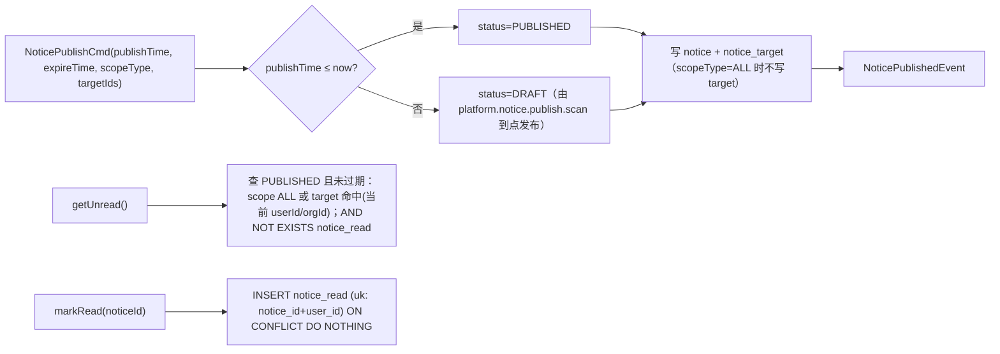
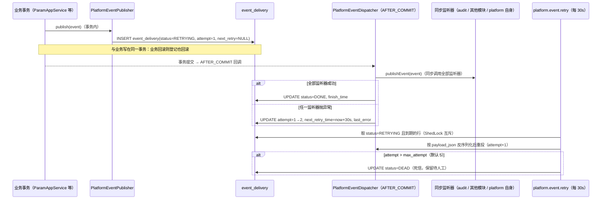
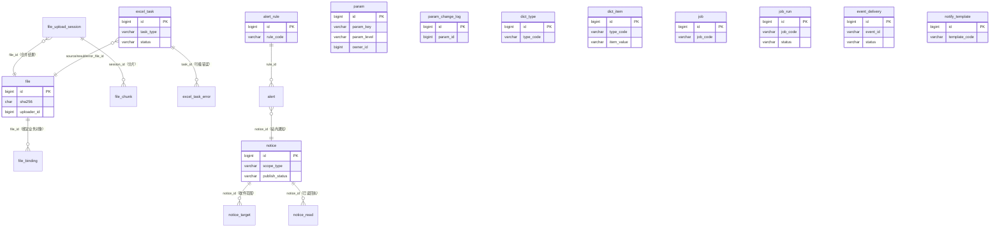

# 企业级一体化管理系统（e-aio）详细设计说明书 · 第 P1 册（分册一）· platform（基础平台能力）

> **项目名称**：企业级一体化管理系统（e-aio）
> **编制依据**：GB/T 8567-2006《计算机软件文档编制规范》；参照 GB/T 9385-2008《计算机软件需求规格说明规范》
> **上游文档**：`02-企业级一体化管理系统-e-aio-软件需求规格说明书.md`（SRS）、`03-企业级一体化管理系统-e-aio-概要设计说明书.md`（HLD）、`04-企业级一体化管理系统-e-aio-详细设计说明书-P0-工程地基.md`（P0 册）、`docs/adr/0001`、`docs/adr/0002`、`docs/agents/*`
> **版本**：V1.0　**日期**：2026-09-20　**状态**：待评审
> **范围**：platform 模块（基础平台能力）的详细设计、数据结构、接口契约 V1、测试与验收、里程碑 M1–M3

## 核心结论（执行摘要）

| # | 结论 | 说明与代价 |
|---|---|---|
| 1 | 本册交付 platform 模块的全部详细设计：8 项能力（FR-PLT-01…08）+ 2 项横切（事件总线可靠性、前端页面与权限点） | 对应 HLD 5.6、13.2（队列顺序 3）；实现落 M1–M3 三个里程碑（6.6） |
| 2 | 冻结 9 个跨模块命名接口（`ParamApi`/`DictApi`/`FileApi`/`SchedulerApi`/`ExcelApi`/`CacheApi`/`MonitorApi`/`NoticeApi`/`NotifyTemplateApi`）与全部 DTO 名，落在 `com.eaio.platform.api`（`@NamedInterface("api")`） | 跨模块只能依赖该包；`api` 包不含 `@RestController`、不含领域实体、不含 Mapper |
| 3 | 冻结 20 张表（`eaio_platform` Schema，snake_case 单数、模块内不加前缀），迁移从 **V2__** 起连续编号至 V9__，另有 1 个可重复种子脚本 `R__platform_seed.sql` | V1__baseline.sql 只建 Schema（ADR-0002），本册**不得**重复建 Schema；已发布脚本不可修改 |
| 4 | 冻结 platform 错误码段 **20000–20999**，本册实际占用 45 个号，按能力每 10 号一组、组内留空号；空号不回收 | 与 P0 册 3.2.3（通用段 10000–19999）拼接；`ErrorCode` 通用码不得被 platform 复用；编号表见 7.1 |
| 5 | 参数中心分级覆盖顺序 **USER > ORG > SYSTEM**，取值路径 L1 Caffeine → L2 Redis → DB → Spring 配置 → 代码默认；变更发 `ParamChangedEvent` 并**跨实例广播失效** | 代价：多一条 Redis Pub/Sub 通道（故障面 + 测试面）；Redis 不可用时退化为 L1 TTL 兜底（最大不一致窗口 60s） |
| 6 | 文件能力统一收口到 `FileApi`，存储适配器 `FileStorage` 有 `LocalFileStorage`（默认）与 `S3FileStorage`（可选 profile）两个实现 | 代价：本地盘实现必须自签时效 token（HMAC）替代 S3 预签名，且**不做**秒传/去重（去重会把删除变成引用计数问题） |
| 7 | 定时任务选型 Spring Task + **ShedLock（jdbc-template provider，锁表 `eaio_platform.shedlock`）**，任务可执行点只能来自代码注册的 `JobHandler` | 明确否决 RuoYi `invoke_target` 式"按 DB 字符串反射调用任意 bean 方法"（RCE 面）；代价：新增任务必须发版，不能纯配置上线 |
| 8 | Excel 导入导出用 Fesod 流式 + 异步任务表 + 进度 + 错误明细（行号/列/原因）+ 结果文件走 `FileApi`；10 万行在 `-Xmx512m` 下内存峰值 ≤384MB | 长任务结果交付一律 `taskId` + 轮询，**不用幂等键承担结果交付**（ADR-0001 后果）；≤20000 行整批一个事务，超出按 1000 行/批提交并明确记 `PARTIAL` |
| 9 | 缓存两级（Caffeine L1 + Redis L2），空值短 TTL 防穿透、互斥重建防击穿、TTL 随机 ±10% 防雪崩；`CacheRegion` 用**枚举**登记，未登记区域编译期即不可表达 | 代价：新增缓存区需改代码发版；换来的是键规范与 TTL 不会被字符串拼错悄悄绕过 |
| 10 | 监测走 Actuator + Micrometer → Prometheus，应用侧只做"指标阈值 / 任务连续失败 → `alert` 表 + 站内公告"，**不实现告警推送通道** | 与 HLD 9.4、NFR-MAINT-04 一致：Grafana/Alertmanager 属部署组件，本册不引入部署改动 |
| 11 | 事件总线在 platform 侧的可靠性边界：**登记与业务同事务**（`event_delivery`，轻量 outbox，只覆盖 platform 事件）→ `AFTER_COMMIT` 同步投递 → 失败指数退避重试 → 超限为死信（可人工重放；`eventId` 为消费侧幂等键） | 代价：每事件多一次同事务 INSERT（平台事件 QPS < 5，可忽略）+ 表增长（`DONE` 记录保留 7 天）；换来的是崩溃窗口不丢事件、死信可运营。跨模块统一 outbox 仍留 P2 复核 |
| 12 | platform **编译期只依赖 `e-aio-common`**，不依赖任何业务模块；对 iam/audit 的"契约先行 + 缺席降级"通过**端口 + 适配器 + `ObjectProvider` 可选注入**实现 | 理由：Maven 模块图不允许 `platform → iam` 与 `iam → platform` 同时存在（成环即构建失败）；详见 2.4 与 7.5 |

> **与 P0 的接续一句话**：P0 交付的是骨架与契约（common 门面、统一返回体、幂等链路、每模块独立 Flyway、ArchUnit 闸门），本册是**第一个真实业务模块**，因此同时承担"把 P0 留的 3 处缺口补齐"的责任——业务错误码落段断言、`internal` 包跨模块引用断言、`DemoController` 退役（P0 册 3.3、3.7、6.3）。

## 1. 引言

### 1.1 编写目的

本文档面向 platform 模块（基础平台能力）的**实现者、评审者与测试者**，把 HLD 5.6 的能力清单与 SRS 3.22 的 8 条功能需求，逐条落到可编码、可建表、可测、可验收的粒度：

- 对**实现者**：给出表结构 DDL、接口方法签名、DTO 字段、错误码、事件契约、迁移脚本清单——拿本文档可直接开工，无需再猜；
- 对**评审者**：给出每一处关键取舍的"为什么"与"代价"，以及被否决的备选方案——评审的对象是决策，不是代码风格；
- 对**测试者**：给出单元测试点、集成测试（Testcontainers PostgreSQL 17 / Redis 7）、架构测试断言与性能验收口径——验收条件都是可执行的（6.5）。

本文档**不重复** P0 册已有的内容（统一返回体、幂等键链路、Flyway 装配、ArchUnit 骨架、日志与 traceId），只在必须衔接处引用其编号（如 `P0 册 3.2.5`）。

### 1.2 文档范围

| 里程碑 | 范围 | 交付物 |
|---|---|---|
| **M1** | 模块骨架、参数中心、数据字典、错误码枚举、V2/V3 迁移、种子脚本、`ParamApi`/`DictApi` 冻结 | `com.eaio.platform` 五层分包落地；`PlatformErrorCode`（20000 段）落地；参数/字典的 REST + 前端页面；ArchUnit 业务错误码落段断言补齐 |
| **M2** | 统一文件能力中心、两级缓存管理、事件投递可靠性 | `FileStorage` SPI + `LocalFileStorage`；分片上传与合并校验；预签名 token；`CacheApi`；`event_delivery` 与重试任务 |
| **M3** | 定时任务、Excel 导入导出、监测告警、公告与通知模板 | ShedLock 接入与 6 个内置任务；`ExcelApi` 异步任务；`alert_rule`/`alert`；`NoticeApi`/`NotifyTemplateApi`；前端补齐 4 个页面 |

**不在本册范围**：iam（认证/授权/组织/数据权限）、audit（审计落库与哈希链）、workflow/approval、任何业务模块的任务实现。这些在 HLD 13.2 的队列里各自成册。

### 1.3 术语与约定

术语一律沿用 `CONTEXT.md`（唯一术语表），本册不新造词。使用到的核心术语：

| 术语 | 含义（与 CONTEXT.md 一致） |
|---|---|
| 模块 | 一个 Maven 模块 + 一个根包 + 一个 Schema 的一一对应体；platform 对应 `e-aio-platform` / `com.eaio.platform` / `eaio_platform` |
| 技术底座（common） | `com.eaio.common`，只被依赖、不依赖任何模块；platform 的唯一编译期模块依赖 |
| 五层分包 | `api` / `application` / `domain` / `infrastructure` / `events`（HLD 2.2.2） |
| 命名接口 | 用 `@NamedInterface("api")` 标记的包，是模块对外的唯一可见面（跨模块只能依赖它） |
| 契约 V1 | 本册 5.4 冻结的 Java 接口签名；向后兼容只增不改（新增方法给 `default` 实现或新增接口） |
| 统一返回体 | `Result<T>`（`code`/`message`/`data`/`traceId`），HTTP 恒 200（ADR-0001） |
| 错误码分段 | 0 成功；10000–19999 通用；20000 起每模块 1000 号；platform = 20000–20999 |
| 幂等键 | `Idempotency-Key` 请求头；服务端占位键 `eaio:{env}:idem:{sha256(uri+key)}`（P0 册 3.2.5） |
| 每模块独立 Schema | platform 全部对象显式限定 `eaio_platform.`，禁跨 Schema 关联查询与写（ADR-0002） |
| 逻辑删除 | `deleted BOOLEAN NOT NULL DEFAULT false`；查询默认 `deleted = false`；物理清理由保留策略任务负责 |
| 批次 | P0–P3；本册属 P1，不实现 P2/P3 的能力（如报表、门户推送） |

**本册新增的书写约定**（不改术语，只规定写法）：

1. 表名、列名、索引名一律小写 snake_case；表名**单数**（依据 P1 批次总册 3.5 裁决，覆盖 HLD 4.2 与 P0 册 3.6 的"复数"措辞；本册任务书原文写"复数"，冲突与映射表见 7.5 疑点 Q1）；索引 `idx_<table>_<cols>`，唯一约束 `uk_<table>_<cols>`，主键 `pk_<table>`，检查约束 `ck_<table>_<col>`，外键 `fk_<table>_<ref>`。
2. 统一列：`id`（BIGINT，雪花 `IdGenerator`）、`created_at`、`created_by`、`updated_at`、`updated_by`、`version`（INT，MyBatis-Plus `@Version` 乐观锁）；逻辑删除表加 `deleted BOOLEAN NOT NULL DEFAULT false`。纯 append-only 日志表省略 `updated_at`/`updated_by`/`version`。
3. 时间列一律 `TIMESTAMPTZ`（UTC 存储）；展示时区由组织/全局参数决定，见 4.1.3。
4. 所有跨模块编号引用写成 `HLD 5.6`、`SRS FR-PLT-03`、`P0 册 3.6`、`ADR-0002` 形式；**引用不到编号的结论不写**。
5. 凡本册新增（P0 尚未落地的类、表、接口、脚本），正文显式标注 **「P1 新增」**；P0 已存在的类（`Result`/`ErrorCode`/`IdempotencyStore`/`IdGenerator`/`PageResult` 等）不得被描述为新增。
6. 枚举行一律 `VARCHAR(32)` + 应用层枚举 + `CHECK` 约束（**不用** PostgreSQL `ENUM` 类型：增删值不需要 DDL 迁移）。

### 1.4 与上游文档的追溯关系

| 本册章节 | 上游来源 | 追溯性质 |
|---|---|---|
| 2.1 模块定位与边界 | HLD 2.2.2、HLD 5.6、HLD 11.1 | 承接（边界不放宽） |
| 2.2 能力清单与 FR 对照 | SRS 3.22（FR-PLT-01…08） | 逐条落实 |
| 2.3 五层分包 | HLD 2.2.2、P0 册 3.1.3 | 细化（Controller 归属为 P1 裁决） |
| 2.4 依赖方向与契约先行 | HLD 2.4.1/2.4.2、ADR-0002、CONTEXT.md | 深化（编译期/运行期边界） |
| 2.5 与 P0 的接续点 | P0 册 3.6、3.7、3.9、6.1、6.2、6.3 | 承接 + 补齐 |
| 3.1–3.8 八个能力域 | SRS FR-PLT-01…08、HLD 5.6、HLD 9.3/9.4 | 细化到类与流程 |
| 3.9 事件可靠性 | HLD 2.4.3、NFR-REL-02/03、P0 册 6.3 第 5 条 | 落实 platform 侧部分 |
| 3.10 前端 | P0 册 3.9、`docs/agents/frontend-conventions.md` | 细化到页面与权限点 |
| 4 数据结构 | HLD 4.1–4.5、`docs/agents/database.md`、ADR-0002 | 细化到 DDL |
| 5 接口契约 | HLD 3.2、P0 册 3.2、`docs/agents/api-conventions.md`、ADR-0001 | 冻结 V1 |
| 6 测试与验收 | HLD 10.1–10.3、NFR-PERF-01/03/04、P0 册 4.8 | 给出可执行验证 |
| 7.4 P0 册 6.3 对照 | P0 册 6.3（8 条待细化） | 逐条回应 |

### 1.5 参考资料

| 文档 | 用途 |
|---|---|
| `docs/02-企业级一体化管理系统-e-aio-软件需求规格说明书.md` | FR-PLT-01…08、NFR-PERF/ SEC/ MAINT/ REL、数据分级（6.1/6.2） |
| `docs/03-企业级一体化管理系统-e-aio-概要设计说明书.md` | 模块边界（2.2）、依赖矩阵（11.1）、内部接口（3.2）、缓存与任务（2.5、6.3）、技术组件（11.3） |
| `docs/04-企业级一体化管理系统-e-aio-详细设计说明书-P0-工程地基.md` | 格式范本；返回体/错误码/幂等（3.2）、异常与日志（3.3/3.4）、Flyway（3.6）、ArchUnit（3.7）、前端（3.9）、common 冻结清单（6.2）、P1 待细化（6.3） |
| `docs/adr/0001-统一-post-json-与恒-200-响应.md` | 全 POST、HTTP 恒 200、长任务结果交付口径 |
| `docs/adr/0002-每模块独立-schema-与-flyway.md` | 独立 Schema、独立 Flyway、脚本编号与登记后果 |
| `docs/agents/api-conventions.md` | 路径与动作词、分页入参、幂等键强制范围 |
| `docs/agents/database.md` | 建表/字段/逻辑删除/审计字段约定 |
| `docs/agents/java-conventions.md` | 构造器注入、MapStruct、common 门面强制 |
| `docs/agents/frontend-conventions.md` | 统一 POST 请求层、字典缓存、按钮权限 |
| `docs/agents/architecture.md` | 五层可见性、新增模块登记点、ArchUnit 固化 |
| `CONTEXT.md` | 术语唯一来源 |

## 2. platform 总体设计

### 2.1 模块定位与职责边界

platform 是**通用能力层**的第一个模块，向全部模块提供"与业务无关、但所有业务都要用"的基础设施能力（HLD 2.4.1、5.6）。

**做**（8 项，对应 SRS FR-PLT-01…08）：

1. 参数配置中心（分级配置、热更新，FR-PLT-01）；
2. 数据字典（FR-PLT-02）；
3. 统一文件能力中心（`FileApi`：存储适配、分片、预签名、权限、留痕，FR-PLT-03）；
4. 定时任务（注册、启停、日志、失败重试、告警，FR-PLT-04）；
5. Excel 导入导出（模板、校验、错误回显、异步任务与进度，FR-PLT-05）；
6. 缓存管理（两级缓存、键规范、失效事件、穿透/击穿/雪崩防护，FR-PLT-06）；
7. 系统监测与告警（指标、快照、规则与告警记录，FR-PLT-07）；
8. 公告与通知模板（公告发布/已读，模板渲染，FR-PLT-08）。

**不做**（越界即评审否决）：

| 不做的事 | 归属 | 本册的处理方式 |
|---|---|---|
| 认证、授权、组织树、角色、数据权限 SQL 改写 | iam | platform 只消费**权限码字符串**（`@PreAuthorize("hasAuthority('platform:param:list')")`），不引用 iam 类型；见 2.4 |
| 审计落库、哈希链、WORM 存储 | audit（HLD 13.2 队列顺序 5） | platform 只**发布事件 + 调可选端口**；audit 缺席时降级为结构化日志（3.3.7） |
| 业务任务的实现（库存预警、逾期提醒、对账、归档等，HLD 6.3） | 业务模块（P2/P3） | platform 只提供注册点与调度器（3.4.5） |
| 告警推送通道（邮件/短信/企业微信/Alertmanager 集成） | 部署侧 + portal（P2） | 应用侧只写 `alert` 表与站内公告；**不假装发送成功**（3.7.5） |
| 跨时区 i18n 与报表按组织时区聚合 | i18n/报表（P2） | P1 统一 UTC 存储 + 单一展示时区参数；代价见 4.1.3 |
| 文件秒传/物理去重、内容级病毒扫描 | 无（不做） | 明确登记为非目标（2.6），避免"以为有其实没有" |
| 工作流、BPM、门户消息推送（WebSocket） | workflow/portal | platform 只保证表与 API，不做推送 |

### 2.2 能力清单与 FR 对照表

| FR 编号（SRS 3.22） | 能力 | 优先级 | 本册章节 | 关键交付物 |
|---|---|---|---|---|
| FR-PLT-01 | 参数配置中心（分级、热更新） | P0 | 3.1 | `param`/`param_change_log`；`ParamApi`；`ParamChangedEvent`；前端参数页 |
| FR-PLT-02 | 数据字典 | P0 | 3.2 | `dict_type`/`dict_item`；`DictApi`；`DictChangedEvent`；前端字典页 |
| FR-PLT-03 | 统一文件上传/下载（`FileApi`） | P0 | 3.3 | `file`/`file_upload_session`/`file_chunk`/`file_binding`；`FileStorage` SPI；预签名；前端文件页 |
| FR-PLT-04 | 定时任务（注册、启停、日志、重试、告警） | P1 | 3.4 | `job`/`job_run`/`shedlock`；`JobHandler` 注册表；`SchedulerApi`；前端任务页 |
| FR-PLT-05 | Excel 导入导出（模板、校验、错误回显、异步+进度） | P1 | 3.5 | `excel_task`/`excel_task_error`；`ExcelApi`；`ExcelKit` 落地（common）；前端 Excel 任务页 |
| FR-PLT-06 | 缓存管理（两级、失效事件、穿透防护） | P1 | 3.6 | `CacheApi`；`CacheRegion` 枚举；失效广播通道 |
| FR-PLT-07 | 系统监测（指标、日志、链路、告警） | P1 | 3.7 | `alert_rule`/`alert`；`MonitorApi`；Micrometer 指标；告警评估任务 |
| FR-PLT-08 | 消息模板（邮件/短信/站内模板管理） | P1 | 3.8 | `notice`/`notice_target`/`notice_read`/`notify_template`；`NoticeApi`/`NotifyTemplateApi`；前端公告页与模板页 |
| （横切） | 事件总线可靠性（platform 侧） | P1 | 3.9 | `event_delivery`；重试任务；死信重放 REST |
| （横切） | 前端页面与权限点 | P1 | 3.10 | `frontend/src/api/platform/*.js`；8 个管理页；权限点总表（7.3） |

> **对照表的作用**：任何一条 FR 在本册找不到落点，或找到落点却没有对应表/接口/测试点，都算文档缺陷。6.5 的验收清单按此表逐条给出验证方式。

### 2.3 五层分包与包结构

```text
com.eaio.platform
├─ package-info.java              @ApplicationModule(allowedDependencies = {"common", "common::api"})   ← P1 收紧（P0 为空注解）
│                                  注：Modulith 把命名接口当独立目标，只写 "common" 时引用 com.eaio.common.redis/api 会报
│                                  "depends on named interface(s) 'common :: api' … Allowed targets: common"（M1 实测）；
│                                  "common::api" 仍属 common，未引入任何业务模块依赖
├─ api/                           @NamedInterface("api")：只有 interface + record + enum（跨模块唯一可见面）
│   ├─ ParamApi DictApi FileApi SchedulerApi ExcelApi CacheApi MonitorApi NoticeApi NotifyTemplateApi
│   ├─ dto/                       ParamDTO ParamSaveCmd ParamWithSourceDTO DictTypeDTO …（5.3）
│   ├─ CacheRegion.java CacheKey.java
│   └─ port/                      AuditPort、OrgContextPort（P1 新增；由 audit/iam 反向实现，见 2.4）
├─ application/                   用例编排、@Transactional 边界、事件发布
│   ├─ ParamAppService DictAppService FileAppService JobAppService
│   ├─ ExcelTaskAppService NoticeAppService NotifyTemplateAppService AlertAppService
│   ├─ param/ParamResolver.java   分级覆盖 + 两级缓存 + 广播失效（3.1.4）
│   ├─ file/FileStorageRouter.java 存储适配器选择与健康检查（3.3.3）
│   ├─ job/JobRegistry.java JobExecutor.java JobRetryScanner.java（3.4）
│   └─ cache/CacheManager.java    L1/L2 + 空值 + 互斥重建 + 抖动（3.6.3）
├─ domain/                        实体/值对象/领域服务/仓储接口（不依赖 Spring Web、不依赖 MyBatis）
│   ├─ param/  ParamItem ParamLevel ParamOverlayResolver  ParamRepository
│   ├─ dict/   DictType DictItem DictRepository
│   ├─ file/   FileMeta StoragePathPolicy FileTypePolicy  FileRepository
│   ├─ job/    JobDefinitionEntity JobRun CronSpec RetryPolicy  JobRepository
│   ├─ excel/  ExcelTask ExcelRowError RowValidator  ExcelTaskRepository
│   └─ notice/ Notice NotifyTemplate TemplateRenderer(纯函数)  NoticeRepository
├─ infrastructure/
│   ├─ persistence/               MyBatis-Plus Mapper + 仓储实现（*Mapper.java / *RepositoryImpl.java）
│   ├─ storage/                   FileStorage、LocalFileStorage、S3FileStorage、PresignTokenService
│   ├─ cache/                     CaffeineRegionCache、RedisRegionCache、InvalidationSubscriber
│   ├─ scheduler/                 ShedLockConfig、JobSchedulerRegistrar
│   ├─ monitor/                   MicrometerBindings、MetricSnapshotReader
│   └─ web/                       @RestController（入站适配器）+ RestExceptionHandler（模块内异常补全）
└─ events/                        ParamChangedEvent DictChangedEvent FileUploadedEvent FileDeletedEvent
                                  JobFailedEvent ExcelTaskFinishedEvent NoticePublishedEvent AlertRaisedEvent
```

**裁决 P1-C1（本册新增）：Controller 放 `infrastructure/web`，不放 `api`。**
理由：Controller 是入站适配器，与出站 Mapper 同属 infrastructure；`api` 包会被其他模块依赖，混入 `@RestController` 会让"契约"带上 Web 依赖，与 P0 册 3.7 `commonIsPure` 的同类洁癖一致。代价：本模块 REST 层与跨模块契约不在同一包，新人容易以为"接口在 api 包就等于 HTTP 端点"，因此在 2.3 与 5.1 各说明一次。

**裁决 P1-C2：`api` 包内不放领域实体与 Mapper。**
跨模块 DTO 一律 `record`；`api` 包内类型的字段类型只能是 JDK 类型、`java.time.*`、其他 `api` DTO、`PageResult`（`com.eaio.common.api`）、以及 `org.springframework.core.io.Resource`（`FileApi.download` 用，理由见 5.4.3）。领域实体 ↔ DTO 用 MapStruct 在 `application` 层映射（`componentModel = "spring"`、`unmappedTargetPolicy = ERROR`），漏字段编译期失败（`docs/agents/java-conventions.md`）。

**裁决 P1-C3：MapStruct 映射器只出现在 `application` 与 `infrastructure/web` 两层。**
`web` 层需要 Cmd → DTO 的直接映射（避免为每个 REST 动作写一个 AppService 方法），但**不反向**（DTO → 领域实体一律经 AppService，保证校验与事件在一个地方）。

### 2.4 依赖方向与契约先行

#### 2.4.1 冻结的依赖方向

| 关系 | 方向 | 依据 |
|---|---|---|
| platform → common | 允许（唯一编译期模块依赖） | HLD 11.1（platform 依赖列为"—"，即仅 common） |
| 任意模块 → platform.`api` | 允许（iam、audit、workflow/approval、业务模块都消费 `ParamApi`/`DictApi`/`FileApi`） | HLD 3.2、2.4.2 |
| platform → 任意业务模块 | **禁止** | HLD 2.2.2、2.4.1 |
| platform → iam / audit（编译期） | **禁止** | 见 2.4.2（成环） |
| platform → iam / audit（运行期能力） | 允许，经端口 + 适配器 + `ObjectProvider` | 本册 P1-C4 |

#### 2.4.2 为什么"platform 编译期不依赖 iam/audit"不是偷懒，而是唯一可行解

需求（§任务书第 9 条）要求："platform 对 iam 只能经 `com.eaio.iam.api`，对 audit 同理，契约先行、实现可缺席"。把它落到 Maven 模块图上会立刻撞墙：

- iam **必须**依赖 platform（它要调 `ParamApi`/`DictApi`/`FileApi`），这是 HLD 11.1 的既定方向；
- 若 platform 的 POM 再声明 `e-aio-iam`，则 `e-aio-platform ⇄ e-aio-iam` 形成**模块级依赖环**，Maven 在 reactor 排序阶段直接失败（不是运行期问题，是构建期硬失败）；
- 即使写成 `<optional>true</optional>` 的 `iam.api` 依赖，**编译期边依然存在**，Modulith 的 `verify()` 判的就是模块依赖图；是否被容忍取决于框架的 `allowedDependencies` 行为——**架构不变量不押在框架容忍度上**（[ADR-0005](adr/0005-platform-zero-dependency-org-context.md)）；
- 把 iam 的 `api` 包拆成独立 artifact 可以破环，但 CONTEXT.md 冻结"模块 = 一个 Maven 模块 + 一个根包 + 一个 Schema"，拆 artifact 会破坏该对应关系，且要给全部模块各拆一次——代价远大于收益。

**裁决 P1-C4（本册新增，2026-09-21 按 ADR-0005 定案）：编译期零模块依赖 + 运行期自有端口/适配器。**

1. **编译期**：`e-aio-platform/pom.xml` 只依赖 `e-aio-common`（外加 Spring/MyBatis-Plus/Redis/ShedLock/Fesod 等三方依赖）。**不出现** `e-aio-iam`、`e-aio-audit`，**也不出现** `com.eaio.iam.*` / `com.eaio.audit.*` 的任何 import——由架构断言 **A7** 在编译期拦住（批次总册 4.1）。
2. **运行期契约先行**：platform 在 `com.eaio.platform.api.port` 声明它需要的外部能力：
   - `AuditPort`（P1 新增）：`void record(AuditRecord record)`，用于文件上传/下载/删除、参数变更、导出等留痕；
   - `OrgContextPort`（P1 新增，**与 iam 册同名同形**）：`Optional<Long> currentUserId()`、`Optional<Long> currentOrgId()`、`boolean isSystemContext()`，用于文件可见性判定与"我的未读公告"。位置 `com.eaio.platform.api.port`（本册 P1-C4 第 2 条），实现由 iam 侧适配器提供、application shell 装配（[ADR-0005](adr/0005-platform-zero-dependency-org-context.md)）。
3. **适配器由能力提供方实现**（方向单一，不成环）：audit 模块提供 `AuditPort` 的 `@Component` 实现，内部转调 `com.eaio.audit.api` 的 **`AuditApi`（写入）**——`AuditQueryApi`（查询）/`AuditChainApi`（举证）/`AuditAlertApi`（告警）是 audit 的对外接口，platform 不需要它们（只登记其存在，避免"平台去查审计"的反向依赖）；iam 模块提供 `OrgContextPort` 实现（内部读 `TenantCtx`/`com.eaio.iam.api.UserApi`），**由 `e-aio-app` 装配注入**。platform 侧一律 `ObjectProvider<AuditPort>` / `ObjectProvider<OrgContextPort>` 形式注入（构造器注入 `ObjectProvider`，**不**用 `@Autowired(required=false)` 字段注入——`docs/agents/java-conventions.md` 禁字段注入）。
4. **缺席降级**（本册明确定义，不允许"什么都不做"）：

| 端口 | 缺席时的行为 | 安全性方向 |
|---|---|---|
| `AuditPort` | 写结构化审计日志（`logger` 名 `com.eaio.platform.audit.fallback`，字段含 `traceId`/`operatorId`/`action`/`resource`/`result`/`bizType`），并在 `MonitorApi.metrics()` 暴露 `platform.audit.fallback.count` | 留痕能力降级但**不静默丢弃**：日志可被采集，且计数可告警 |
| `OrgContextPort` | 文件可见性判定退化为"**仅上传者本人 + 管理员**"；`NoticeApi.getUnread` 只返回 `scopeType = ALL` 的公告 | **fail-closed**：拒绝多于放行。绝不出现"拿不到身份就当作有权限" |

5. **降级不是永久态**：`OrgContextPort` 缺席（iam 未就绪）期间，platform 的 HTTP 面**不得对公网暴露**（3.10.6 风险条目）；这是 M1–M3 的部署约束，不是设计意图。

> **被否决的备选**：「platform 直接 `import com.eaio.iam.api.UserApi`」——编译期成环，构建失败；「把 TenantCtx 放 platform，iam 反向填充」——`TenantCtx` 属 common（被全部模块只读消费），放 platform 会让 common 层失去该上下文，且 iam 会在自己的启动期依赖 platform 的类加载顺序，脆弱。

#### 2.4.3 同名能力不要两套入口

跨模块与 HTTP 两个入口**写路径必须共用同一个 `application` 服务**：REST Controller（如 `ParamController`）调 `ParamAppService`，`ParamApi` 的实现类（`ParamApiImpl`，`@Component`，放 `application` 层）也调同一个 `ParamAppService`；其余同理（`DictApiImpl`→`DictAppService`、`FileApiImpl`→`FileAppService`、`ExcelApiImpl`→`ExcelTaskAppService`）。理由：校验、幂等语义、事件发布、缓存失效只写一遍。代价：`api` 实现类是多一层薄壳（每个方法 1–3 行），但换掉的是"REST 改了、跨模块没改"这类最难查的不一致。

### 2.5 与 P0 的接续点

| 接续点 | P0 现状（已核实） | 本册要做的事 |
|---|---|---|
| 迁移脚本 | `e-aio-platform/src/main/resources/db/migration/platform/V1__baseline.sql` 仅含 `CREATE SCHEMA IF NOT EXISTS eaio_platform` | P1 从 **V2__** 起连续编号至 V9__ + 1 个可重复种子脚本；**禁止**再建 Schema、禁止修改 V1 |
| 迁移登记表 | `application.yml` 的 `eaio.flyway.modules` 已含 `platform`（`ModuleFlywayProperties` 为 `record(boolean enabled, List<String> modules)`，`locationOf`/`schemaOf` 派生目录与 Schema） | **无需改动登记表**——脚本放进 `classpath:db/migration/platform` 即被装配；本册新增的只是脚本内容 |
| 模块登记 | `com.eaio.platform.package-info` 已有 `@ApplicationModule`（无 `allowedDependencies`） | M1 收紧为 `allowedDependencies = {"common"}`；`api/package-info.java` 标 `@NamedInterface("api")`（P0 已对 `com.eaio.common.api` 做过同款，照抄） |
| ArchUnit 缺口 1：业务错误码落段 | `ArchitectureTest#errorCodeSegmentsHold` 目前只覆盖 `common` 通用段（P0 册 3.7 自述缺口） | M1 落地 `PlatformErrorCode` 后补断言：模块 `BusinessErrorCode` 实现类中，platform 的全部码 ∈ [20000, 20999]；并加"故意越界即失败"的 `*RuleHasTeeth` 同类用例 |
| ArchUnit 缺口 2：`internal` 包不可跨模块引用 | P0 未覆盖 | M1 补断言（platform 的 `application`/`domain`/`infrastructure` 不得被其他模块引用），并把 platform 作为第一个"有真实 internal 内容的样本"纳入 |
| `DemoController` 退役 | P0 册 3.3 已登记"P1 platform 首个真实接口落地时应删除" | M1 首个接口（`param/GetPage`）合入的同一个 PR 内删除 |
| common 门面补齐 | `ExcelKit`、`redis.RedisKit`/`DistributedLock`/`RateLimiter`/`RedisKeys`、`validation`（`@EnumValid` 等）、`TreeUtils`/`CollectionUtils`/`BeanUtils` 均**未实现**（P0 册 4.8 注记、6.2 冻结清单） | 由本册触发、**在 common 内落地**（不改契约）：M1 落 `RedisKeys`/`RedisKit`（参数广播与缓存需要）、M2 落 `DistributedLock`、M3 落 `ExcelKit` + 校验注解 |
| 依赖引入 | MyBatis-Plus 3.5.17、Redisson 4.7.0、Fesod 2.0.2-incubating 在 P0 册 3.1.2 已登记为 P1 引入；Hutool **未引入** | M1 引 MyBatis-Plus + Redisson；M3 引 Fesod。**不引 Hutool**（模板渲染用自研 `${var}` 替换，见 3.8.4） |

### 2.6 非目标与不做的事

以下条目在评审时**不作为缺陷**（明确登记为不做），但在 P2/P3 分册需要重新评估：

1. **不做秒传与物理去重**：内容相同的文件落两份。理由：去重把"删除文件"变成引用计数问题（跨模块引用无法穷举），P1 无此需求；`file.sha256` 仅用于完整性校验与导入任务去重（3.5.6）。
2. **不建跨模块统一 outbox**：platform 只登记**自己的**事件（轻量 outbox，见 3.9.2）；业务模块事件的可靠性归各自分册，全局统一方案留 P2 复核。
3. **不做告警推送通道**：不集成邮件/短信/企业微信/Alertmanager，不承诺"告警已送达"。
4. **不做按角色投递的公告**：`notice_target.target_type ∈ {ORG, USER}`；`ROLE` 需要 iam 角色，留 P2（`NOTICE` 表结构与 REST 已为其预留扩展位，见 3.8.3）。
5. **不做跨时区展示切换与报表按组织时区聚合**：P1 一个展示时区（参数 `platform.time.display-zone`，默认 `Asia/Shanghai`）。
6. **不做文件内容解析/病毒扫描/图片压缩**：上传只做类型白名单、大小上限、sha256 完整性；解析与扫描属安全加固专项（P2 评估）。
7. **不做 Grafana 面板与 Prometheus 规则文件**：本册只暴露 `/actuator/prometheus` 与只读快照接口。
8. **不做分布式事务**：跨模块一致性靠"同事务调 API"（HLD 2.4.2）与事件最终一致（3.9）。
9. **不做平台侧的权限缓存**：iam 的权限数据由 iam 自己缓存（避免权限撤销被 platform 的 TTL 掩盖）。
10. **不做信创数据库方言抽象**：P0 册 6.3 第 6 条仍在 P1 内另册，本册 DDL 只用 PostgreSQL 17 语法。

## 3. 详细设计（按能力域）

本章每节固定六段：**设计目标 → 组件与类 → 关键流程 → 关键取舍与代价 → 边界条件与失败模式 → 测试点**。所有表名、字段、错误码均以第 4、5、7 章为准；正文出现的不一致一律算文档缺陷（自检脚本 `scripts/check-p1-platform-doc.ps1` 会机械校验这些名字）。

### 3.1 参数配置中心（分级配置与热更新）

#### 3.1.1 设计目标

| 目标 | 量化口径 | 依据 |
|---|---|---|
| 分级覆盖 | 同键可同时存在 SYSTEM/ORG/USER 三级值，生效顺序 **USER > ORG > SYSTEM** | FR-PLT-01、HLD 9.3 |
| 热更新 | 改值后**不重启**即生效；多实例最大不一致窗口 ≤ 60s（广播正常时 ≤ 1s） | FR-PLT-01、NFR-MAINT-02 |
| 读性能 | 命中本地缓存时单次解析 < 10µs，不产生 DB/Redis 往返 | NFR-PERF-02 |
| 可追溯 | 每次改值落一条 `param_change_log`（旧值/新值/操作者/traceId） | NFR-SEC-04、SRS 6.2 |
| 安全 | `value_type = SECRET` 的值 AES-GCM 加密落库，接口永不回显明文 | NFR-SEC-02、NFR-SEC-03 |

#### 3.1.2 组件与类

```text
infrastructure/web/ParamController                     ← REST（/api/platform/param/*）
application/ParamAppService                            ← 写路径：校验 → 落库 → 事件 → 失效
application/ParamApiImpl                               ← 跨模块入口（实现 api/ParamApi），薄壳转 AppService
application/param/ParamResolver                        ← 读路径：分级覆盖 + L1/L2 缓存 + 空值占位
domain/param/ParamItem（实体）、ParamLevel（枚举 SYSTEM/ORG/USER）
domain/param/ParamOverlayResolver                      ← 纯函数：给定三级值求生效值（无 IO，可单测）
domain/param/ParamValueCodec                           ← STRING/INT/BOOL/DECIMAL/JSON/SECRET 的类型校验与转换
infrastructure/persistence/ParamMapper、ParamChangeLogMapper（MyBatis-Plus）
infrastructure/cache/InvalidationSubscriber            ← 订阅失效广播，清本机 L1（P1 新增）
events/ParamChangedEvent                               ← 事务提交后发布（3.9）
```

`ParamOverlayResolver` 与 `ParamValueCodec` 刻意做成**无 IO 的纯逻辑**：分级覆盖顺序、类型转换、越界判定这些最容易出错的规则全部在单元测试里跑，不需要数据库（6.1）。

#### 3.1.3 关键流程：取值的四条路径



四条路径的语义（必须与实现逐条对齐）：

1. **`getInt/getBool/getString(key, defaultValue)`**：键未定义（三级都无）→ 返回 `defaultValue`，来源标 `DEFAULT`；类型不匹配 → 抛 `20002 PARAM_TYPE_MISMATCH`（**不**静默回退默认值，否则配置写错会变成"悄无声息地用了默认值"）。
2. **`get(key)`**：返回 `ParamDTO`（生效值 + 生效级别 + 来源）；键未定义 → 抛 `20001 PARAM_NOT_FOUND`。理由：`get` 的调用方是从"必须有值"的语义出发的（如读 SMTP 配置），返回 `null` 会让空值一路漂到下游才炸。
3. **`listByGroup(paramGroup)`**：返回该组的全部键及其生效值，用于管理页与"一次取一组配置"的场景。
4. **`getAll()`**：返回全量键值映射（键 → `ParamDTO`），仅用于**缓存预热**与**快照导出**（内部接口）；调用方拿到的是浅拷贝，改动不影响缓存。

#### 3.1.4 写路径与热更新



要点（每条都有代价，写清）：

- **事件在事务内注册、提交后投递**（`@TransactionalEventListener(AFTER_COMMIT)`，HLD 2.4.3）：避免"事务回滚了但缓存已失效/广播已发出"。
- **广播用 Redis Pub/Sub，不引入 MQ**：Pub/Sub 是 Redis 原生能力（不新增部署件），消息即焚、不持久化。代价：订阅者掉线期间的消息**永久丢失**，只能靠 L1 TTL（60s）兜底；对配置类数据可接受。
- **本机失效 + 广播失效 + L2 删除**三件事都做：只做广播会在发布者自己的实例上留脏（发布者不一定订阅自己的消息，取决于 Redis 客户端行为，不能赌）；只做本机失效会让其他实例最长 60s 读到旧值。
- **写路径失败回滚后不留痕**：`param_change_log` 与 `param` 在同一事务，回滚一起回滚——审计"谁改成了什么"只看已提交的历史。
- **`refresh(String key)` / `refresh()`**：不写库，只清缓存并重新加载（管理页"刷新缓存"按钮）；`refresh()` 全量清空本 region 的本机与 L2 键，用于参数被**绕过接口**直接改库（DBA 修数据）后的兜底。

#### 3.1.5 关键取舍与代价

| 取舍 | 选择 | 备选（被否决） | 代价 / 理由 |
|---|---|---|---|
| 缓存粒度 | 缓存**生效后的最终值**（键含 `orgId` 上下文） | 缓存三级原始行，每次在内存里合成 | 选前者：读路径一次命中即返回（NFR-PERF-02）；代价是参数变更需按"所有受影响上下文"失效，故失效用**前缀删除 + 广播**而不是单键删除 |
| 用户级值的缓存位置 | 用户级 override **只进 L1**（60s），不进 L2 | 用户级也进 L2（键 `…:param:{orgId}:u{userId}:{key}`） | 键空间 = 用户数 × 键数，Redis 会被低频偏好类参数撑爆；用户级参数对"跨实例秒级一致"没有需求 |
| 失效通道 | Redis Pub/Sub 广播 + L1 TTL 兜底 | 纯 TTL 兜底（无广播） | 广播把常态不一致窗口从 60s 压到 ~1s，代价是多一条通道与其测试面；**若 Redis 不可用，读路径照常工作（回源 DB），只是退化为 TTL 语义** |
| 空值处理 | 未定义键**不写空值占位**（直接回源，一次 DB 查询成本可接受） | 为未定义键也写 60s 空值占位 | 参数键是**有限集合**（7.2 全表登记），不存在的键多半是代码拼错，缓存拼错的键会把错误藏 60s；字典与文件元数据才需要空值占位（3.6.3） |
| 敏感值 | `value_type = SECRET` 且 `encrypted = true`，AES-GCM 落库；`getAll()`/管理页返回 `******`；写 `param_change_log` 时新旧值都记 `******` | 明文落库 + 列级权限 | 明文一旦落库，备份、日志、慢 SQL 都是泄漏面（NFR-SEC-02）；代价是运维无法直接从库里读密钥，必须走管理页或环境变量 |

**实现注记（T3/T4 已落地，2026-09-19）**——落地时与本册口径的差异/补充，逐条登记（评审按此对照）：

| # | 本册口径 | 落地实现 | 理由 |
|---|---|---|---|
| 1 | 5.3 的 `ParamDTO` 字段表未列 `id` | DTO 带 `id` | 5.2 的 `Del` 入参是 `{id, version}`，不给 id 前端无法定位行 |
| 2 | 5.2 的 `Get`/`Del` 入参只写了字段、未命名 DTO | 新增 `ParamGetCmd`、`ParamDelCmd`（字段与 5.2 逐字一致） | 用 `Map<String,Object>` 收参会让校验、契约与前端文档全靠约定 |
| 3 | 3.1.3 图示"L1 → L2 → DB" | 带用户上下文的请求**不读 L2**（L1 → DB）；只有"无用户上下文"的请求读 L2 | 3.1.5 规定用户级 override 不进 L2，而"该用户有无 override"只有查库才知道；无脑读 L2 会在有 override 时返回组织级旧值 |
| 4 | 取值链"DB → Spring 配置 → 代码默认"（未定属性名） | Spring 配置层约定属性名 `eaio.param.<key>`（`source=YAML`） | 链路要能用就必须有命名约定；改约定只需改 `ParamResolver` 一处 |
| 5 | 3.1.4 写路径要"本机失效 + L2 删除 + 广播失效"三件事 | T3 做前两件；**第三件（广播）在 T4 补齐**：`ParamInvalidationPublisher`（通道 `eaio:{env}:platform:ch:invalidation`、载荷 `{env, region, key}`，用 `StringRedisTemplate.convertAndSend`——`RedisKit` 冻结方法集里没有 Pub/Sub）+ `ParamInvalidationSubscriber` + `RedisMessageListenerContainer` | 广播是"三件事"里唯一跨进程的一件；缺它时其他实例最长 60s 读旧值（= L1 TTL）。`refresh` **刻意不广播**：它的语义是"本机缓存脏了"（DBA 绕过接口改库的兜底），不是"值变了" |
| 6 | 4.5 种子里 `platform.file.local-root` 默认含运行期占位 `${user.home}` | 迁移装配需显式 `placeholder("user.home", "${user.home}")` 才能原样入库 | Flyway 默认把 `${...}` 当自己的占位符、缺值时直接失败（实测），且不能靠转义 |
| 7 | 5.2 的 `Up` 错误码含 20004 | `Up` 不产生 20004（不支持改名）；20004 只在 `Add` 撞唯一键时出现 | `(param_key, param_level, owner_id)` 是行身份，改键等于删了重建 |
| 8 | 7.3 权限点表 | 端点已按 7.3 逐字写 `@PreAuthorize("hasAuthority('platform:param:*')")`；iam 交付前是**契约载体**、尚不生效 | 授权由 iam 能力装配；T14 的 `PermissionCodeContractTest` 与 7.3 逐条比对 |
| 9 | 3.1.4 订阅侧"清本机 L1" | 订阅侧调 `ParamResolver.invalidate(key)`（L1 全部上下文变体 + L2 前缀删除），不只清 L1 | 发布方的 L2 前缀删除是尽力而为（失败只记 WARN），只清 L1 会把脏 L2 留在原地；参数键量级 ≤2000（7.2），多一次前缀删除的代价可接受 |
| 10 | 3.1.6"写：L2 删除失败记 ERROR，广播跳过" | L2 删除失败与广播失败都记 **WARN**；广播失败不影响本机 L1/L2 失效 | Redis 缺失/抖动时 ERROR 会持续刷屏，而"靠 L1 TTL 兜底"是 3.1.5 设计内的降级路径，不是故障；WARN 已带 key 与原因，仍可检索 |
| 11 | 3.1.6"广播订阅回调抛异常：捕获并记录" | `ParamInvalidationSubscriber.onMessage` 整体 try/catch（解析与 resolver 调用都在内），失败只记 WARN | 订阅线程挂掉会让**所有**实例的失效都失灵——这条是安全边界，不是日志风格 |
| 12 | 3.1.4 未写订阅容器如何装配 | `ParamInvalidationBroadcastConfig` 建 `RedisMessageListenerContainer`，判定用 platform 侧唯一实现 `RedisPresence.isConfigured`：`spring.data.redis.host` **或** `.port` 任一存在（与装配层 `WebConfig` 的判定逐字相同——模块边界禁止共享代码，故登记为"两份实现、一条规则"） | 没配 Redis 时不建容器（bean 方法返回 null）：否则它会持续重连并把"无库无 Redis 的空应用"刷满 WARN，而那是明确支持的形态（镜像默认形态）。不用 `@ConditionalOnProperty` 是因为判定是 OR 而该注解多属性是 AND，分叉的后果是"幂等走 Redis、跨实例失效却没订阅"这种只在多实例下暴露的静默降级 |
| 13 | P1-2 册 331 行"修改时传空表示不变更"（避免误清空） | `ParamAppService.up`：`paramValue` 为空且**值类型未变** → 原样保留原值（SECRET 行因此保住密文）；为空且**值类型变了** → 显式拒绝 20002；非空 → 按新类型写入（SECRET 加密）。前端写页面按"掩码行留空"实现并只按 `Result.code` 分支 | "留空 = 不变更"只在类型不变时成立：跨类型时旧值无法充当新类型的值（STRING 的明文不是密文、SECRET 的密文不是明文），静默保留要么把明文标成 `encrypted = true`（读路径解密失败，对外 10500），要么把密文当明文回给调用方——两者都是"配置写错却看不出来" |
| 14 | P0 册 3.2.5"业务失败立即释放占位" | `IdempotencyFilter` 不再按 HTTP 状态码判成败（本工程 HTTP 恒 200，等于恒判成功），改用 `ContentCachingResponseWrapper` 读响应体 `Result.code`：`code ≠ 0` 或状态 ≥ 400 即 `release`；每条路径都 `copyBodyToResponse()` | 按状态码判定会把业务失败记成 DONE，调用方带着同一个幂等键重试永远拿到 10501——失败从此不可重试。本类 javadoc 原本就写着"判定依据是响应体里的 code"，实现此前与契约不符 |
| 15 | 两级缓存的 L2 由谁提供 `RedisKit` | 装配层 `WebConfig` 注册 `@Bean RedisKit`（配了 Redis 才注册，未配返回 null），幂等占位与 platform 的两个 L2（`ParamL2Cache`/`DictL2Cache`）共用同一个 bean | 此前只有 `RedisIdempotencyStore` 内部 `new SpringRedisKit(...)`，全仓没有 `RedisKit` bean → platform 的 `ObjectProvider<RedisKit>` 恒为 null、L2 读永不命中、写直接返回：L2 在生产上等于不存在，且相关 IT 去掉 evict 仍会绿（无牙） |
| 16 | Redis 键 `{env}` 段怎么取（7.2 只登记了 `EAIO_ENV`） | 规则唯一实现落在 common 的 `RedisKeys.envOf(configuredEnv, activeProfiles)`（纯函数，不读 Spring 配置）：`eaio.env`/`EAIO_ENV` 优先 > 首个激活 profile > `default`；装配层与 platform 的 `CacheEnv` 都调它 | 两套键空间（`eaio:{env}:platform:…` 与 `eaio:{env}:idem:…`）各写一份规则会算出两个 env 前缀——不报错，只在多实例排查时暴露 |
| 17 | 5.3 的 `ParamSaveCmd` 有 `remark`，而 `ParamDTO` 没有 | 管理页**不提供**备注输入框（写路径仍接受 `remark`；读契约不含该字段） | 读不到的字段做成"只能写不能读"的入口：用户看不到当前值，留空是否清库还取决于 ORM 的更新策略——与 `dict_item.remark` 同一先例（T5 注记）。要让备注可维护，先改 DTO 契约并走评审 |
| 18 | 3.10.2"页面按钮级控制留待 iam 的 `v-hasPermi` 接入" | 前端删掉自建的 `hasPermission` 与按钮 `v-if`（后端 `@PreAuthorize` 仍是权威，越权请求返回 10403） | M1–M2 明确不做前端隐藏；自建一套 fail-open 的权限判定既与 3.10.2 冲突，又会被 `v-hasPermi` 取代——等 iam 交付后一次性接入 |
| 19 | 5.2 的 `/param/GetAll` 入参 `{paramGroup?}` 未命名类型 | 新增 `ParamGroupCmd(paramGroup)`，`GetAll` 确实按分组过滤（为空 = 全量） | 与第 2 条同因；原实现收了入参却恒传 null，分组过滤被静默忽略 |
| 20 | 3.9.1"事件前两字段为 `eventId`/`occurredAt`" | `ParamChangedEvent` 补 `occurredAt`（业务发生时间，非投递时间）；6.3 的 `eventRecordsHaveEventIdFirst` 收紧为**前两组件**并新增控制组 `MissingOccurredAtProbe` | 只有 eventId 时，重试场景分不清"业务何时发生"与"何时投递"；断言只查第一位等于规则没牙 |
| 密钥来源 | 加密主密钥与预签名密钥来自**环境变量**（`EAIO_PARAM_CRYPTO_KEY`、`EAIO_FILE_PRESIGN_SECRET`），不进参数中心 | 密钥也放参数中心 | 自举问题：解密参数中心需要密钥，密钥不能存在参数中心里 |

#### 3.1.6 边界条件与失败模式

| 场景 | 行为 | 错误码 |
|---|---|---|
| 键不存在且调用 `get(key)` | 抛业务异常，不返回 null | 20001 |
| 键存在但值不符合 `value_type`（如 INT 键写了 `abc`） | 写时校验拒绝；读时若历史脏值被读到，抛异常并记 ERROR（附 `paramKey`） | 20002 |
| `param_level = SYSTEM` 但 `owner_id ≠ 0` | 写时拒绝（CHECK 约束 + 应用层校验双保险） | 20006 |
| 修改 `builtin = true` 的键的**值** | 允许（值可改） | — |
| 删除 `builtin = true` 的键 | 拒绝 | 20005 |
| 改值被并发修改（乐观锁 `version` 不匹配） | 抛通用冲突码（不新增平台码） | 10003 |
| Redis 不可用 | 读：跳过 L2 直接回源 DB（记 WARN + 指标）；写：L2 删除失败记 ERROR，广播跳过，靠 TTL 兜底 | — |
| 广播订阅回调抛异常 | 捕获并记录，不影响订阅线程（Pub/Sub 订阅线程挂掉会导致**所有**失效失效，必须兜住） | — |
| 参数中心自身参数（`platform.*`）被误删 | 启动期校验 7.2 表中 `required = 是` 的键存在且类型正确，缺失则 **ERROR 日志 + `MonitorApi.metrics()` 暴露 `platform.param.missing` 计数**，不阻塞启动（避免"配置错一点就起不来"） | — |

#### 3.1.7 测试点

| 被测类 | 场景 | 断言 |
|---|---|---|
| `ParamOverlayResolver` | 三级都存在 | 返回 USER 级值，来源 `DB:USER` |
| `ParamOverlayResolver` | 只有 SYSTEM | 返回 SYSTEM 值，来源 `DB:SYSTEM` |
| `ParamOverlayResolver` | 三级都无 | 返回 `Optional.empty()`（由调用方决定默认值/抛错） |
| `ParamValueCodec` | INT 键值 `"abc"` | 抛 `BusinessException(20002)` |
| `ParamValueCodec` | BOOL 键值 `"TRUE"/"1"/"yes"` | 统一按 `"true"/"false"` 解析，其余抛 20002（不做宽松解析，避免"1"与"true"两套写法） |
| `ParamResolver` | L1 命中 | 无 DB/Redis 调用（用 mock 计数断言 0 次） |
| `ParamResolver` | 未定义键 | 不写空值占位，第二次调用仍回源（断言 DB 调用 2 次） |
| `ParamAppService` | 改 SECRET 键 | `param_change_log.old_value/new_value` 均为 `******`；`param.param_value` 非明文 |
| `ParamAppService` | 改值成功 | 提交后收到 `ParamChangedEvent`；事务回滚时不发事件 |
| `InvalidationSubscriber` | 收到广播 | 本机 L1 对应键被清（用 `CacheStats` 或第二次读取的 DB 调用次数断言） |

### 3.2 数据字典

#### 3.2.1 设计目标

| 目标 | 口径 | 依据 |
|---|---|---|
| 全量可缓存 | 单个 `typeCode` 的项一次性全取（字典项量级：个位到百位），不做分页读 | FR-PLT-02、HLD 2.5 |
| 标签解析不阻断渲染 | `getLabel(typeCode, value)` 未命中时返回原值 + WARN 日志，**不抛异常** | 列表页渲染不能因为脏字典整页失败 |
| 历史引用不断 | 字典项支持停用（`status = DISABLED`），停用项不出现在 `getItems`，但 `getLabel` 仍能解析（保证历史数据可读） | SRS 6.2 |
| 变更即刻生效 | 类型/项的增删改都发 `DictChangedEvent` 并失效缓存 | FR-PLT-02、HLD 2.5 |

#### 3.2.2 组件与类

```text
infrastructure/web/DictTypeController、DictItemController
application/DictAppService（类型与项的写路径，共用一套校验与事件）
application/DictApiImpl（实现 api/DictApi）
application/dict/DictResolver（getItems/getLabel + L1/L2 缓存，复用 3.6 的 CacheManager）
domain/dict/DictType、DictItem（实体）
infrastructure/persistence/DictTypeMapper、DictItemMapper
```

#### 3.2.3 关键流程



**写路径**：`Add/Up/Del`（类型）与 `Add/Up/Del`（项）→ 校验（`type_code` 唯一、`item_value` 同类型内唯一、`status` 合法）→ 落库 → `DictChangedEvent(typeCode)` → 失效 `eaio:{env}:platform:dict:items:{typeCode}`（本机 + L2 + 广播）。

#### 3.2.4 关键取舍与代价

| 取舍 | 选择 | 代价 / 理由 |
|---|---|---|
| 类型与项是否分两个接口 | `DictApi` 里类型维护用 `add/up/del`（冻结名），项维护用 `addItem/upItem/delItem`（P1 新增名） | 不用重载（`add(DictTypeSaveCmd)` 与 `add(DictItemSaveCmd)` 在调用点不可读）；代价是接口方法数变多，换来的是调用点一眼知道在改什么 |
| 字典项的删除语义 | `del` = 逻辑删除；同时提供"停用"（`status = DISABLED`），管理页默认引导用停用 | 逻辑删掉的项在历史单据里只能显示原值（`getLabel` 查不到）→ 因此管理页文案明确"删除后历史数据将显示原始值，建议改用停用" |
| 类型删除 | 允许逻辑删除**已无启用项**的类型；类型被引用与否**不做跨模块引用计数**（无法穷举引用方） | 20003 会在引用方调用时暴露"类型不存在"；这是"不建跨模块引用计数"的必然代价，写进管理页文案 |
| 扩展信息 | 项上的 `ext_json`（颜色/图标/前端渲染提示） | 不为每种扩展加列（YAGNI）；代价是字段内容无结构校验，靠前端容错 |
| 唯一性 | `type_code` 与 `(type_code, item_value)` 用**部分唯一索引**（`WHERE deleted = false`） | 允许"删除后重建同名 code"；代价是"类型 → 项"不能建物理外键（部分唯一索引不能作为 FK 目标），改由应用层校验（20003） |
| 字典变更是否记审计 | 不单独记（`param` 有专门的变更日志表，字典没有） | 依据 P0 册 3.2.5 同类判断：字典是配置数据，操作级审计由 audit 的通用操作审计覆盖；若 audit 未就绪，`DictChangedEvent` 仍带 `operatorId`，可后补 |

#### 3.2.5 边界条件与失败模式

| 场景 | 行为 | 错误码 |
|---|---|---|
| `getItems` 引用不存在的 `typeCode` | 抛异常（这是配置错误，必须显式暴露） | 20003 |
| 同类型下重复 `item_value` | 写时拒绝（DB 部分唯一索引 + 应用层预校验） | 20007 |
| 删除仍有项的类型 | 拒绝 | 20008 |
| `getLabel` 值不在字典（历史脏数据） | 返回原值 + WARN 日志；`MonitorApi.metrics()` 暴露 `platform.dict.label.miss` 计数 | — |
| 停用项被 `getItems` 请求 | 不返回；但 `getLabel` 可解析（停用 ≠ 不存在） | — |
| 缓存里存了已删除类型的项 | 删除动作本身会失效缓存；即使漏失效，TTL ≤ 30min 后自愈 | — |
| 字典项数量异常大（> 2000） | `getItems` 仍全量返回但记 WARN + 指标（提示该"字典"应改为业务表） | — |

#### 3.2.6 测试点

| 被测类 | 场景 | 断言 |
|---|---|---|
| `DictResolver` | 两次 `getItems` 同 `typeCode` | DB 只查 1 次（第二次命中 L1） |
| `DictResolver` | `getLabel` 未命中 | 返回入参原值，且不抛异常 |
| `DictAppService` | 新增重复 `item_value` | 20007 |
| `DictAppService` | 删除有项的类型 | 20008 |
| `DictAppService` | 停用项后 `getItems` | 结果不含该项；`getLabel` 仍返回其 label |
| `DictAppService` | 改项 label | 发 `DictChangedEvent`，缓存键被删除（断言缓存中不存在） |

**实现注记（T5 已落地，2026-09-19）**——落地时与本册口径的差异/补充，逐条登记（评审按此对照）：

| # | 本册口径 | 落地实现 | 理由 |
|---|---|---|---|
| 1 | 3.2.2 组件写 `DictTypeController` + `DictItemController` 两个类 | 合并为单个 `infrastructure/web/DictController`（11 个端点，`/platform/dictType/*` 与 `/platform/dictItem/*` 两个前缀写在**方法**上） | 两类共用同一个 `DictAppService` 与同一套错误码，拆开只多一个文件与一处权限注解抄写；类级 `@RequestMapping` 只能挂一个前缀，故前缀下沉到方法 |
| 2 | 5.4 的 `DictApi.del(long id)` javadoc 写"实际参数为类型 id：`del(long id, int version)`"（签名与 javadoc 自相矛盾） | 按 javadoc 的"实际参数"落地：`del(long id, int version)`、`delItem(long id, int version)` | 与 5.2 端点入参 `{id, version}` 逐字一致；删除带乐观锁版本，只给 id 就成了"无视并发改动的盲删" |
| 3 | 5.3 未给 `DictTypeSaveCmd`/`DictItemSaveCmd`/`DictTypeQuery`/`DictItemQuery` 的字段名 | 新增四个 record：Cmd = DTO 的可写字段 + `version`（按 `typeCode` / `(typeCode, itemValue)` 定位行，不带 `id`）；Query = 5.3 的过滤字段 + 分页公共入参 | 用 `Map<String,Object>` 收参会让校验、契约与前端文档全靠约定（同 T3 的登记）；`DictItemSaveCmd` **不带 `remark`**：5.3 的 `DictItemDTO` 没有该字段，契约里不可见的字段不做成"只能写不能读"的隐性入口（`dict_item.remark` 列因此无写入入口） |
| 4 | 5.2 的 `Get`/`Del`/`GetItems`/`Refresh` 入参只写了字段、未命名 DTO | 新增 `DictGetCmd`、`DictDelCmd`、`DictTypeCodeCmd`（`GetItems` 与 `Refresh` 同形，共用一个 record） | 同 T3 的 `ParamGetCmd`/`ParamDelCmd` 登记；同形共用一个 record 是因为"指定一个类型"的语义完全相同 |
| 5 | 3.2.3 流程图"查 dict_type + dict_item → 写 L2/L1"未区分启用/停用 | 缓存里存**该类型下全部未删除项（含停用）**；`getItems` 在解析层过滤 `status = ENABLED` 并按 `sort_no` 返回 | 3.2.5 要求停用项对 `getItems` 不可见、对 `getLabel` 可解析；若按流程图字面只缓存启用项，停用项在列表页会退化成原始值——正是 3.2.1"历史引用不断"要防的事 |
| 6 | 3.6.1 区域表标 DICT"空值占位 = 是（60s）" | **T5 不做空值占位与互斥重建**：不存在的 `typeCode` 直接抛 20003、不缓存；这两件事归 T6(#18) 的通用 `CacheManager`（3.6.2 的落点），届时 `DictResolver` 改接它 | 3.2.5 已定"类型不存在是配置错误，必须显式暴露"，错误路径不在热路径上；先做一份"占位 + SETNX 重建"会在 T6 落地时被替换掉。**代价**：脏 `typeCode` 每次调用都回源。另：P1-2 册 3.15 登记表的 `eaio.dict.cache-ttl-seconds` 默认值已由 300 改为 **60**（与 3.6.1 区域表对齐，登记表是单一来源），同节 379 行残留的旧写法 `eaio.cache.redis.ttl` 一并改为 `eaio.cache.redis.ttl-seconds` |
| 7 | 7.1 段内没有 dict 专用的"内置只读"码；DDL 注释与 4.5 种子都要求"内置类型不可删除" | 内置类型及其下的字典项删除时**复用 20005**（`PARAM_BUILTIN_READONLY`），消息按字典语义给（"平台内置字典类型及其字典项不可删除"） | 段内唯一的内置只读码；7.1 明令空号不回收（20009/20019 不得新分配）、T1 已冻结段内号位。**代价**：常量名带 `PARAM_` 前缀，读代码时要靠消息与 javadoc 分辨 |
| 8 | DDL 注释要求内置类型不可删，但未定它与 20008（仍有项）的判定顺序 | 顺序：类型不存在 20003 → **仍有项 20008** → 内置只读 20005 → version 过期 10003 | 种子 4 个内置类型都带项，"仍有项"才是可执行的原因（先删/停用项）；先报 20005 会让内置类型的删除永远只有一句"不可删"。两种情况下类型都不会被删 |
| 9 | 5.2 给 `dictItem/Up` 列了 20007 | `Up` 不产生 20007：`item_value` 是行身份、不可改，更新时不可能撞"同类型值重复" | 与 T3 对 `param/Up` 列 20004 的处理同款：端点表的码是"该端点可能出现的全集"，实现按能力落地 |
| 10 | 5.2 给 `dictType/Add` 的唯一业务码是 20003 | 类型编码重复也报 **20003**（消息写明"字典类型编码已存在"） | 段内没有 dict 专用的重复码；"不得新增号"是 T1 的冻结口径，冲突时以冻结点为准 |
| 11 | 3.9.1 的载荷 `eventId, occurredAt, typeCode, itemValue(可空), action(ADD/UP/DEL), operatorId` | 逐字落地 `events/DictChangedEvent`（前两个组件固定 `eventId`/`occurredAt`） | 6.3 的 `eventRecordsHaveEventIdFirst` 要求 `eventId` 在首位；`occurredAt` 紧随其后是 3.9 的统一约定 |
| 12 | 3.2.3 写路径要"本机失效 + L2 删除 + 广播" | 新增 `DictInvalidationPublisher`/`DictInvalidationSubscriber` + 独立 `RedisMessageListenerContainer`；与参数**共用同一条通道** `eaio:{env}:platform:ch:invalidation`，靠载荷 `region = "dict"` 区分；`refresh` **不广播** | 4.6 只有一条失效通道，新增 region 比新增通道便宜；新建独立容器是为了不改动 T4 已验证的 `ParamInvalidationBroadcastConfig`（代价：同一通道两个订阅连接）。`refresh` 与 T3 同款：它的语义是"这台机器的缓存脏了"，不是"值变了" |
| 13 | 3.2.1"未命中返回原值 + WARN"只覆盖"值不在字典里" | 类型不存在时（`getItems` 会抛 20003）`getLabel` **同样返回原值 + WARN**，不抛 20003 | 3.2.1 的理由是"列表页渲染不能因为脏字典整页失败"；类型编码拼错与值不在字典对渲染是同一种脏数据。要暴露配置错误用 `getItems` |
| 14 | 3.2.5 要求 `platform.dict.label.miss` 计数与"项数 > 2000 记指标" | T5 只记 WARN 日志（含 `typeCode`/`value`）；**指标计数归 monitor 票**（`MonitorApi` 尚未交付）；项数 > 2000 仍全量返回 | 不写空壳计数器：指标门面还不存在，先落地"不阻断 + 可检索"的部分，计数随 monitor 票接入 |
| 15 | 4.3.4 的 `ext_json` 是 JSONB，而 5.3 的 `DictItemDTO.extJson` 是 String | 自定义 `infrastructure/persistence/JsonbStringTypeHandler`（`Types.OTHER` 绑定，不引 PG 专有类）+ `@TableName(autoResultMap = true)` + `@TableField(typeHandler = …)`；`is_default` 用显式 `@TableField("is_default")` | PG 不把 `varchar` 隐式转 `jsonb`，普通 String 绑定写入直接失败；`getIsDefault()` 的属性名与列名不同名，靠命名推导不稳。覆写 `setParameter` 是因为 MyBatis 在"值为 null 且 jdbcType 未指定"时会抛 `TypeException`，而 `extJson` 可为空 |
| 16 | 3.2.2 未提 DTO 映射器；5.3 要求 `DictTypeDTO.itemCount` 由查询聚合得到 | 新增 `application/dict/DictDtoMapper`（MapStruct，`unmappedTargetPolicy = ERROR`，裁决 P1-C3）；`itemCount` 用 `selectMaps` 分组聚合**一次**查出（不做逐行 count） | 裁决 P1-C3 是该册的既定口径；列表页按行 count 是典型的 N+1 |
| 17 | 3.10.3 说 API 文件拆 `dictType.js` / `dictItem.js` | 落地单文件 `frontend/src/api/platform/dict.js`，用命名空间导出 `dictType` / `dictItem`（方法名与 3.10.3 一致） | 本票要求单文件；两者共用同一套错误码与分页整形，拆开会让提示文案各写两份 |
| 18 | 3.10.2 的"路由 + 按钮级控制"（1151 行：M1–M2 期间按钮不做前端隐藏） | 路由 `platform/dict` 已登记并声明 `meta.permission = 'platform:dict:list'`；**页面按钮全部渲染**，权限由后端 `@PreAuthorize` 兜底 | 遵循 1151 行的临时态：按钮隐藏等 iam 的 `v-hasPermi`（7.5 遗留），避免"隐藏即安全"的错觉 |
| 19 | 4.5 写"字典 4 类型 + **14 项**" | 按逐项枚举落地 **15 项**（3+3+6+3）；类型 ID 21–24、项 ID 31–45，`created_by = 0`，全部 `ON CONFLICT DO NOTHING` | 枚举是权威清单（`platform_param_level(3)` + `platform_job_trigger_type(3)` + `platform_excel_task_status(6)` + `platform_alert_severity(3)`），少种一项会让某个值查不到标签。`is_default`/`ext_json` 册面未指定，取列默认值（`false`/`NULL`） |
| 20 | 3.2.4"字典变更不单独记审计" | 落地不建字典变更日志表；`DictChangedEvent` 携带 `operatorId` 供 audit 后补 | 册面明文；audit 未交付，事件载荷已把"谁改的"带出去 |
| 21 | 5.3 未规定 `status` 空值的语义（DDL 给的是 `DEFAULT 'ENABLED'`） | `Add` 时空值按 `ENABLED`；**`Up` 时空值保持原状态** | 两个方向的风险不对称：`Up` 统一按 `ENABLED` 会让"请求没带状态"悄悄把停用项启用回来（停用是 3.2.4 推荐的替代删除手段，被静默撤销的代价最大） |

### 3.3 统一文件能力中心（`FileApi`：存储适配 / 分片 / 预签名 / 权限 / 审计）

#### 3.3.1 设计目标

| 目标 | 口径 | 依据 |
|---|---|---|
| 单一出口 | 全系统文件一律经 `FileApi`，业务模块不得自建存储目录或直连 S3 | FR-PLT-03、HLD 4.3 |
| 存储可换 | 本地盘（默认，零依赖）与 MinIO/S3 兼容（可选 profile）之间切换，**历史文件不失效** | HLD 11.3 |
| 大文件稳 | 分片上传（默认 5MB/片，最多 10000 片），合并时校验 sha256 | FR-PLT-03 |
| 带外下载 | 预签名 URL 供浏览器直下，**不绕过数据权限** | HLD 4.3、NFR-SEC-04 |
| 全程留痕 | 上传/下载/删除/绑定四类动作写审计（`AuditPort` 或降级日志） | NFR-SEC-08、SRS 6.2 |

#### 3.3.2 组件与存储适配器

```java
// infrastructure/storage/FileStorage.java（P1 新增；模块内 SPI，不进 api 包）
public interface FileStorage {
    String type();                                            // "LOCAL" / "S3"
    String store(InputStream in, StoredFileMeta meta);         // 返回相对存储路径（不含根目录）；流式拷贝
    InputStream open(String storagePath);                      // 调用方负责关闭
    void delete(String storagePath);
    boolean exists(String storagePath);
    FileUrlDTO presignGet(FileMetaFile meta, int expireSeconds);
}
```

| 实现 | 启用条件 | 关键行为 |
|---|---|---|
| `LocalFileStorage`（P1 新增，默认） | `platform.file.storage-type = LOCAL` | 根目录 `platform.file.local-root`（默认 `${user.home}/.eaio/files`）；落盘路径 `{root}/{yyyy}/{MM}/{dd}/{id%100:02d}/{fileId}.{ext}`；分片 `{root}/chunks/{uploadId}/{index:06d}.part`；启动时校验根目录可写（不可写则**拒绝启动**，不让故障推迟到第一次上传） |
| `S3FileStorage`（P1 新增，可选） | `platform.file.storage-type = S3` 且 profile `s3`（需 `minio`/`s3` 客户端依赖） | 对象键 `{prefix}/{yyyy}/{MM}/{dd}/{fileId}.{ext}`；预签名用 SDK 的 `presignGetObject`；连接参数（endpoint/bucket/ak/sk）来自环境变量，密钥不进库 |

**裁决 P1-C5（本册新增）：存储类型记录在文件行上（`file.storage_type`），路由按行选择适配器。**
理由：若按"当前配置"选择适配器，切换 `platform.file.storage-type` 的瞬间，**历史文件全部读不到**（本地盘文件去找 S3，反之亦然）。代价：`file.storage_type` 成为不可变列（写入后不允许改），且删除/下载路径必须按行取适配器（多一次 map 查表，忽略不计）。

#### 3.3.3 上传路径



**分片上传**（大文件）：

1. `uploadChunk(FileChunkCmd)`：首次调用携带 `uploadId`（客户端生成 UUID）、`fileName`、`expectedSize`、`chunkTotal`、`chunkSize` → 无会话则 `INSERT file_upload_session`（`expire_time = now + 24h`，参数 `platform.file.session-ttl-hours`）；随后每片校验（片序号 ∈ [0, chunkTotal)、片大小 ≤ chunkSize、sha256 与片内容一致）→ 落盘 `chunks/{uploadId}/{index}.part` + `INSERT file_chunk`（唯一键 `(session_id, chunk_index)`，**重传同片天然幂等：覆盖写 + UPSERT**）。
2. `mergeChunks(FileMergeCmd)`：校验会话存在且未过期（20018）、片齐全（缺片 → 20013）、按 `chunk_index` 升序拼接并**边写边算 sha256**；与 `session.sha256`（客户端声明的整文件摘要）比对，不一致 → 20013 并保留分片供重传；一致 → `INSERT file` → 会话置 `DONE` 并记 `file_id` → 删除分片文件与分片行。
3. **合并幂等由服务端承担**：会话已 `DONE` 时 `mergeChunks` 直接返回既有 `fileId`（浏览器网络抖动重试合并是常态；若改用幂等键，重试会得到 10501 而拿不到文件）。因此 `UploadChunk`/`MergeChunks`/`Upload` **不要求幂等键**（5.6 有完整例外清单）。

#### 3.3.4 下载与预签名

| 路径 | 权限判定 | 说明 |
|---|---|---|
| 跨模块 Java：`FileApi.download(FileDownloadCmd)` | **不判权限**（调用方已鉴权；HLD 2.4.2 "调用方鉴权"） | 返回 `Resource`，调用方负责关闭；`FileDownloadCmd` 可带 `operatorId` 供留痕 |
| HTTP：`POST /platform/file/Download` | `uploader_id` 本人 / 同组织（`accessPort.currentOrgId()`）/ 管理员权限点 `platform:file:download` | 判定失败 → 20017；组织上下文缺席时**只允许本人**（2.4.2 fail-closed） |
| HTTP：预签名 `POST /platform/file/GetUrl` | 同上一行（先判权限，再签 token） | 返回 `FileUrlDTO(url, expireAt)` |

**本地盘预签名（`PresignTokenService`，P1 新增）**：`url = /api/platform/file/Download?fileId={id}&exp={epochSecond}&sig={hmac}`，其中 `sig = hex(HMAC-SHA256(secret, fileId + "|" + exp))`，`secret` 来自环境变量 `EAIO_FILE_PRESIGN_SECRET`（≥32 字节）。校验：`exp > now`、签名常量时间比较（`MessageDigest.isEqual`）、随后**仍走同一套权限判定**。取舍：token 不是一次性、不可撤销（撤销需轮换 secret，会让全部历史链接立刻失效）——对"浏览器直下不便带 header"的场景够用；敏感文件的真正锁定靠权限判定而非 token。

**响应头（防注入与缓存泄漏）**：`Content-Disposition: attachment; filename*=UTF-8''<percent-encoded>`（文件名先过滤 CR/LF）、`Content-Type` 取库中记录值、`X-Content-Type-Options: nosniff`、`Cache-Control: private, no-store`。

#### 3.3.5 信任边界校验（逐条实现，顺序即短路顺序）

| # | 校验 | 失败码 | 备注 |
|---|---|---|---|
| 1 | 声明大小 `size > platform.file.max-size` | 20011 | 先看声明值**早拒绝**，不读流 |
| 2 | 扩展名不在 `platform.file.allowed-ext` 白名单 | 20012 | 以**扩展名白名单**为主判据；`Content-Type` 只作记录（客户端可伪造） |
| 3 | 实际字节数 = 0 | 20010 | |
| 4 | 流式拷贝过程中计数 > 上限 | 20011 | 立即中断并删除临时文件（不留下半截文件） |
| 5 | 路径穿越 | 20010/20016 | 落盘路径**全部由服务端生成**（`fileId` + 白名单扩展名）；`root.relativize(resolve(path).normalize())` 必须仍在 `root` 内 |
| 6 | 合并摘要不匹配 | 20013 | 服务端重算 sha256，不信任客户端声明 |

#### 3.3.6 留痕与降级

`FileAppService` 在动作完成后调用 `ObjectProvider<AuditPort>`：存在则 `record(AuditRecord(action, fileId, bizType, bizId, operatorId, orgId, sizeBytes, sha256, traceId))`；缺席则写 `com.eaio.platform.audit.fallback` 日志（同字段）并递增 `platform.audit.fallback.count` 指标（2.4.2 降级表）。同时发布 `FileUploadedEvent`/`FileDeletedEvent`（3.9），audit 就绪后按事件落 WORM。**不因为留痕失败而回滚文件写入**（除财务等强审计场景，P1 无此场景），但下载失败/拒绝（20017）也要留痕——"谁试图下载了不该下载的文件"是安全事件。

#### 3.3.7 关键取舍与代价

| 取舍 | 选择 | 代价 |
|---|---|---|
| 秒传 / 物理去重 | 不做 | 同内容多份存储（磁盘换简单性）；`file.sha256` 只用于完整性校验与导入任务冲突检测 |
| 逻辑删除与物理清理 | 删除 = 逻辑删除 + 事件；物理清理由 `platform.file.orphan.clean` 负责（未绑定且超过 `platform.file.orphan-retain-days` 才软删，再超过 `platform.file.purge-days` 物理删） | 删除后磁盘不会立刻释放；换来的是误删可恢复 |
| 本地盘分片落盘 | 分片直接落磁盘（不进 DB 存二进制） | 需要清理任务处理过期会话（`platform.file.session.expire`）；DB 只存元数据 → DB 体积可控 |
| 是否允许业务带自定义元数据 | 不允许（`FileDTO.remark` 一个自由文本字段） | 少一层灵活性，避免 platform 表被业务字段污染；业务元数据放业务表 |
| 上传幂等 | 不做（同文件重复上传 = 两份记录） | 前端需避免"双击提交"；换来的是分片重传/合并重试的语义清晰（3.3.3） |

#### 3.3.8 边界条件与失败模式

| 场景 | 行为 | 码 |
|---|---|---|
| 磁盘满 / IO 异常 | 抛存储异常，回滚 DB 行，清临时文件，记 ERROR（含 `storagePath`） | 20015 |
| 会话过期后继续上传分片 | 拒绝，提示重新发起（前端应在此场景自动重建会话） | 20018 |
| 合并时缺片 | 拒绝，返回缺片索引列表（放在 `message` 里，便于前端提示重传哪几片） | 20013 |
| 预签名链接过期 / 签名被改 | 拒绝（先比签名再比时效，避免"猜签名"的时序侧信道） | 20016 |
| S3 服务不可达（已配置 S3） | 上传/下载失败并在 `MonitorApi.metrics()` 暴露 `platform.file.storage.error`；**不自动回落本地盘**（静默切换存储会造成文件分散在两处） | 20015 |
| 文件被引用后删除 | 允许（逻辑删除）；`file_binding` 行仍在，业务读文件时得到"已删除"→ 由业务模块决定提示文案 | 20014 |
| 下载文件名含 CR/LF 或超长 | 过滤换行、截断到 200 字符后再编码 | — |

#### 3.3.9 测试点

| 被测类 | 场景 | 断言 |
|---|---|---|
| `FileTypePolicy` | 扩展名 `.exe`、`.jsp`、`.sh` | 20012（白名单外） |
| `FileTypePolicy` | 扩展名大小写混合 `Report.PDF` | 通过（统一小写比较） |
| `LocalFileStorage` | `store` 后 `open` | 字节完全一致；路径在 root 内 |
| `LocalFileStorage` | 传入 `../../etc/passwd` 作为 storagePath | 抛异常（穿越被拒） |
| `PresignTokenService` | 签名有效/过期/被篡改 | 通过 / 20016 / 20016（三种独立用例） |
| `FileAppService` | 流式上传超过上限 | 20011，且临时文件被删除（断言目录为空） |
| `FileAppService` | 分片齐全合并 | `file.sha256` 等于服务端重算值；分片行与分片文件被清理 |
| `FileAppService` | 合并摘要不匹配 | 20013，会话仍为 `OPEN`（可重传） |
| `FileAppService` | 重复调 `mergeChunks` | 第二次返回同一 `fileId`（不新建 `file` 行） |
| `FileController`（集成） | 无权限下载他人文件 | 20017，且写了一条"拒绝下载"的留痕 |

### 3.4 定时任务（Spring Task + ShedLock：注册 / 启停 / 日志 / 重试 / 告警）

#### 3.4.1 设计目标与安全边界

| 目标 | 口径 | 依据 |
|---|---|---|
| 注册可审计 | 任务的**可执行点只能来自代码**（`JobHandler` Bean），DB 只决定"开/关/参数/超时/重试" | FR-PLT-04、安全边界 |
| 多实例互斥 | 同一 `job_code` 在集群内任一时刻最多一个实例执行 | HLD 2.5 |
| 可观测 | 每次执行落 `job_run`（含 `trace_id`），成功/失败/超时/跳过四态可查 | FR-PLT-04 |
| 失败可控 | 指数退避重试（默认 3 次）+ 连续失败告警（写 `alert` + 站内公告） | NFR-REL-02 |

**明确否决**：按 DB 里的字符串（如 `invoke_target = "userService.sendMsg('1')"`）反射调用任意 Bean 方法（RuoYi 蓝本的做法）。那是**远程代码执行面**（能写 `job` 表 = 能执行任意方法），与 AGENTS 安全边界冲突。代价：新增任务必须发版，不能纯配置上线——这个代价我们**主动接受**。

#### 3.4.2 组件与类

```java
// api/JobHandler 的落地形态（P1 新增）：业务模块实现后在容器里注册
public interface JobHandler {
    String code();                                   // 与 job.handler_code、JobDefinition.handlerCode 一致
    void execute(JobContext ctx);                     // 抛异常 = 失败（由框架记录与重试）
}
// JobContext（P1 新增）：jobCode、params(Map)、runId、attempt、traceId、deadline(Instant)
```

| 组件 | 职责 |
|---|---|
| `JobHandlerRegistry`（`application/job`） | 启动期扫描全部 `JobHandler` Bean → `Map<code, handler>`；**重复 code 直接启动失败**（配置错误必须在启动期暴露）；提供 `require(code)`（未命中 → 20023） |
| `JobSchedulerRegistrar`（`infrastructure/scheduler`） | 按 `job` 表建 `TaskScheduler` 任务（`CronTrigger`）；`enable/disable/Up/Del` 触发取消 + 重建；启动期校验 cron（20022）与 handler（20023），**单个坏任务只跳过自己并记 ERROR**，不阻断启动 |
| `JobExecutor`（`application/job`） | 执行壳：写 `job_run(RUNNING)` → 调 handler（可超时/中断）→ 写终态；发布 `JobFailedEvent` |
| `JobRetryScanner`（`application/job`） | 扫描 `RETRYING` 且到期的 `job_run` 重投（3.4.4） |
| `ShedLockConfig`（P1 新增） | `@EnableSchedulerLock` + `JdbcTemplateLockProvider`（`usingDbTime()`，锁表 `eaio_platform.shedlock`） |

#### 3.4.3 关键流程



#### 3.4.4 重试、超时、告警

- **超时**：`timeout_seconds`（默认 300）到点 `Future.cancel(true)` 中断线程 → 状态 `TIMEOUT`；`JobContext.deadline` 供 handler 主动检查（长循环任务应每 N 次迭代检查一次，这是 handler 的责任，文档在 `JobHandler` javadoc 里写明）。
- **重试**：失败后不 sleep 占线程，而是写 `job_run(status=RETRYING, attempt+1, next_retry_time)`；`platform.job.retry.scan` 每 30 秒取一批（默认 100 条，参数 `platform.job.retry.batch-size`）重投，重投时 `trigger_type = RETRY`。
- **重试上限**：`job.retry_max`（默认 3，`CHECK <= 10`），退避 `job.backoff_seconds * 2^(attempt-1)` 封顶 30 分钟。
- **告警**：同一 `job_code` 连续失败次数 ≥ `platform.job.alert.fail-threshold`（默认 3）→ `INSERT alert`（`rule_code = job.failure`，详情含 jobCode/最后错误/traceId）+ 经 `NoticeApi.publish` 发站内公告给管理员；同一告警在 `platform.alert.silence-seconds` 内不重复新建（更新 `last_trigger_time` 与 `trigger_count`）。
- **保留**：`job_run` 保留 `platform.job.log.retain-days`（默认 90）天，由 `platform.job.log.clean` 每天 03:00 分批（1000 行/批）删除，避免一次 DELETE 撑爆 WAL。

#### 3.4.5 内置任务清单（M3 必须落地）

| job_code | handler_code | cron（Spring 6 段） | 用途 |
|---|---|---|---|
| `platform.job.log.clean` | `platform.job.log.clean` | `0 0 3 * * *` | 清理 90 天前的 `job_run` |
| `platform.file.session.expire` | `platform.file.session.expire` | `0 */10 * * * *` | 过期分片会话置 `EXPIRED` + 删分片文件 |
| `platform.file.orphan.clean` | `platform.file.orphan.clean` | `0 30 3 * * *` | 无 `file_binding` 且超期的 `file` 软删 → 再超期物理删 |
| `platform.event.retry` | `platform.event.retry` | `*/30 * * * * *` | 重投 `event_delivery`（3.9） |
| `platform.alert.evaluate` | `platform.alert.evaluate` | `0 * * * * *` | 评估 `alert_rule`（3.7） |
| `platform.notice.publish.scan` | `platform.notice.publish.scan` | `0 * * * * *` | 到点的定时公告由 `DRAFT` 置 `PUBLISHED` |

> HLD 6.3 列出的业务任务（库存预警、逾期、对账、归档、数仓校验、定时报表、令牌清理、Webhook 重试）**一律不在本表**：它们由业务模块在自己的分册里用 `SchedulerApi.register(JobDefinition)` + `JobHandler` 注册（P2/P3）。platform 只保证"注册得到、调度得动、失败看得见"。

#### 3.4.6 关键取舍与代价

| 取舍 | 选择 | 代价 / 理由 |
|---|---|---|
| 分布式锁实现 | ShedLock + `JdbcTemplateLockProvider`（锁表 `eaio_platform.shedlock`，`usingDbTime()`） | 与既有"锁表"思路一致，不依赖 Redisson 的看门狗语义；`usingDbTime()` 用 DB 时钟避免应用与 DB 时钟漂移导致锁提前失效。**风险**：ShedLock 对 Spring Boot 4.1 的兼容性需在 M1 首个 PR 实测（`@EnableSchedulerLock` 与 `TaskScheduler` 装配）；若不可用，回退方案为自建锁表 + `SELECT ... FOR UPDATE`（表结构不变） |
| 调度器 | Spring `ThreadPoolTaskScheduler`（pool 4，默认不加队列） | 任务在同一时刻超过 4 个时会等待线程（Spring 会排队执行、`next_run_time` 可能已过）→ 因此每次执行前检查"上次是否仍在跑"，仍在跑则记 `SKIPPED`（除 `allow_concurrent = true`） |
| cron 方言 | Spring `CronExpression`（6 段，**不支持** Quartz 的 `?`/`L`/`W`/`#`） | 从 RuoYi/Quartz 迁来的表达式可能非法 → 保存时校验 20022 + 前端给出合法示例；不支持"每月最后一个工作日"这类语义（需要就写进 handler 自己判断） |
| 任务状态存哪 | 元数据与开关在 `job` 表，运行事实在 `job_run` 表，调度事实在内存 | `job.next_run_time` 只作展示（执行后回写），**不参与调度决策**——避免 DB 与调度器状态不一致导致重复/漏跑 |
| 停用语义 | `enabled = false` 时既不再按 cron 触发，也拒绝手动 `trigger`（20024） | 明确"停用"= 不可执行；运维若只想临时停 cron 而保留手动能力，用 `pause`（`SchedulerApi.pause` 只取消调度、不清 `enabled`）——两个动作语义不同，都提供 |

#### 3.4.7 边界条件与失败模式

| 场景 | 行为 | 码 |
|---|---|---|
| 注册的任务 `handler_code` 未注册 | 保存/启用拒绝 | 20023 |
| 手动触发已停用任务 | 拒绝 | 20024 |
| 手动触发正在运行的任务（`allow_concurrent = false`） | 拒绝 | 20021 |
| 任务执行超时 | 中断 + `TIMEOUT`，进入重试判定 | 20025（仅 API 响应；`job_run` 记状态） |
| cron 非法 | 保存拒绝 | 20022 |
| 任务不存在 | 查询/触发拒绝 | 20020 |
| 实例在任务执行中宕机 | ShedLock 锁到期后其他实例可接管；本次 `job_run` 永远停在 `RUNNING` → `platform.job.log.clean` 顺带把超过 `lockAtMostFor × 2` 仍为 `RUNNING` 的行标记为 `FAILED`（"疑似实例宕机"） | — |
| 重试扫描任务本身失败 | 它自己也是 `job`（可被监控与告警），但**不重试自己**（避免重试风暴）：`retry_max = 0` | — |

#### 3.4.8 测试点

| 被测类 | 场景 | 断言 |
|---|---|---|
| `JobHandlerRegistry` | 注册两个同 code 的 handler | 启动失败（`IllegalStateException`，消息含 code） |
| `JobHandlerRegistry` | `require("no.such")` | 20023 |
| `JobAppService` | 保存 `cron = "0 0 25 * * *"` | 20022 |
| `JobAppService` | 停用后 `trigger` | 20024 |
| `JobExecutor` | handler 抛异常 | `job_run.status = FAILED`，`attempt = 1`，`next_retry_time` 已设置（退避 = backoff） |
| `JobExecutor` | 第 4 次失败（retry_max = 3） | 终态 `FAILED`，不再写 `RETRYING` |
| `JobExecutor` | 超过 `timeout_seconds` | 状态 `TIMEOUT`，线程被中断（handler 里 `Thread.currentThread().isInterrupted()` 断言为真） |
| `JobRetryScanner`（集成，两实例上下文） | 同一条 `RETRYING` 行被两个实例同时扫描 | 只重投一次（ShedLock 生效） |
| `SchedulerApiImpl` | `register` 后查 `job` | `handler_code` 与 `JobDefinition.handlerCode` 一致；`enabled` 取 `defaultEnabled` |

**实现注记（T7 已落地，2026-09-19）**——落地时与本册口径的差异/补充，逐条登记（评审按此对照）：

| # | 本册口径 | 落地实现 | 理由 |
|---|---|---|---|
| 1 | 3.4.6/3.4.2 写 ShedLock **6.6.0** | 落地 **7.10.1**（`shedlock-core` + `shedlock-provider-jdbc-template`，JDBC template provider + `usingDbTime()`，锁表 `eaio_platform.shedlock` 不变） | 6.x 依赖 Spring Framework 6，而本工程是 Boot 4.1 / Spring 7（7.x 起才支持 Spring 7，实测）。读 7.10.1 源码确认：DB 时间模式下 provider 生成的 SQL 用 `timezone('utc', CURRENT_TIMESTAMP)` 与 `make_interval(secs => :lockAtMostForInterval)` 表达"锁到什么时候"，**不往时间列绑参数**，与 4.3.11 的 TIMESTAMPTZ 三列兼容 → **Q3 的自建锁表退路未启用**（表结构一字未改） |
| 2 | 3.4.2 的 `ShedLockConfig` = `@EnableSchedulerLock` + `JdbcTemplateLockProvider` | **不启用 `@EnableSchedulerLock`**：锁由 `infrastructure/scheduler/JobLocker` 持有，任务体内用 `LockProvider.lock(LockConfiguration)` 程序化获取（ShedLock 官方程序化用法） | 那套注解 AOP 服务的是"用 `@Scheduled` 声明的静态任务"，而本票按 3.4.2 从 `job` 表**动态**建 `CronTrigger`，没有注解可挂。**没有注解不等于漏了**：锁仍然真实存在、仍然进 `shedlock` 表、仍然跨实例互斥（`SchedulerLockIT` 用两个应用实例证明）。下一个人若想补 `@EnableSchedulerLock`，先注意它对本票的调度路径**没有任何作用** |
| 3 | 3.4.2 未说 provider 怎么装配；P0 冻结"无库也能启动" | `LockProvider` **不做成 Bean**，而是 `JobLocker`（`@Component`，构造器注入 `ObjectProvider<DataSource>`）的字段：有 DataSource 才建 provider，没有就 `available()=false` | `@Bean` 返回 `null`（NullBean）与用户配置类上的 `@ConditionalOnBean` 都会把"能否启动"变成"取决于装配顺序"。无库时**调度整体停用并记一次 WARN**，绝不用进程内锁假装互斥（两个实例各持一把进程内锁 = 同一任务跑两遍，比不跑更糟） |
| 4 | 5.3 **没有 `JobDTO` 字段行**（5.2 只给返回类型 `PageResult<JobDTO>`） | **契约补全**：`JobDTO` 18 字段 = `job` 表的列投影（`id`/`jobCode`/`jobName`/`handlerCode`/`cron`/`params`/`enabled`/`timeoutSeconds`/`retryMax`/`backoffSeconds`/`allowConcurrent`/`nextRunTime`/`lastRunTime`/`lastStatus`/`remark`/`version`）+ 2 个**派生字段**（`scheduled`、`running`）+ `nextRunTime` 取现算值 | 管理页要能一眼看出"排期了吗/正在跑吗/下次几点"，这三者都不在 `job` 行上：`scheduled` 来自内存调度器、`running` 来自 `job_run`（跨实例）、`nextRunTime` 由 `CronExpression.next(now)` 现算（`job.next_run_time` 只是展示用回写，4.3.9）。`params` 以 `Map<String,String>` 出参而不是 JSONB 原文：与 `JobSaveCmd.params` 对称，且不让前端去解析 JSON 字符串 |
| 5 | 5.3 的 `JobRunDTO` 10 字段 | 多一个 **`nextRetryTime`**（补全） | 票面验收 4"失败按退避重投"要能让运维看见"下一次什么时候重投"；只有 `status=RETRYING` 时非空。缺它就只能靠状态猜 |
| 6 | 5.2 的入参只写了字段（`{jobCode}`/`{jobCode, version}`/`{runId}`） | 落成具名 record：`JobCodeCmd`（Get/Pause/Resume 共用）、`JobDelCmd`、`JobRunIdCmd`（jobRun/Get 与 jobRun/Retry 共用）、出参 `JobRunIdDTO` | 同 T3/T4/T5 的先例（5.2 给字段不给类型名）；同形共用一个 record 是因为"指定一个任务/一次运行"的语义完全相同 |
| 7 | 3.10.2 页面表（1175 行）给任务页列了 `platform:job:pause`/`platform:job:resume`；7.3 权限点总表**没有**这两个码 | 以 **7.3 为准**：`Pause`/`Resume` 挂 `platform:job:run`（与 5.2 端点表逐字一致）；`platform:job:*` 只落地 6 个码 | 页面表多列了两个不存在的码（与 7.3 自相矛盾）；7.3 是权限点的单一来源，且 5.2 已经给这两个端点指定了 `:run`。**不是漏实现** |
| 8 | 3.4.6 的 cron 方言：Spring 6 段，**不支持** Quartz 的 `?`/`L`/`W`/`#` | `JobCron` 在 Spring 语法校验之外**显式拒绝**这四个字符；判定时先剔除月名/周名（`JAN…DEC`/`MON…SUN`）再找方言字符 | **实测新事实**：Spring Framework 7 的 `CronExpression` 其实**接受** `?`、`L`、`#`（`CronTrigger` javadoc 也明说支持 day-of-month/week 的 `L/#`）。只靠 `parse` 的结果会出现"保存成功（不报 20022）、运行时按另一套语义触发"，从 RuoYi/Quartz 迁来的表达式正好落在这个缝里。剔除名字是必须的：`WED` 含 `W`、`JUL` 含 `L`，直接 `contains` 会把"每周三 09:00"和"7 月 1 日"判成非法（`JobCronTest` 两条守卫用例钉住） |
| 9 | 3.4.3 时序"取锁 → 写 job_run → 调 handler（可中断）→ 写终态"；3.4.4"超时 `Future.cancel(true)` 中断线程" | 处理点跑在 **worker 线程**（`Executors.newCachedThreadPool` 守护线程 `eaio-job-worker-N`），执行壳在 `future.get(timeout)` 上等，到点 `cancel(true)` 后**无条件**写 `TIMEOUT`；**cron 路径同步等**（锁必须在执行期间一直持有），手动触发与重投异步（立即返回 runId） | 超时要"状态明确"而不是"永远 RUNNING"：中断只是请求，处理点吞掉中断也得把状态写定。worker 池用无界缓存池是因为等待线程（cron 是调度器线程、手动/重投是 worker 线程）会"在池里等池"，固定池会自锁；并发度由调度器线程池（`platform.scheduler.pool-size`，默认 4）与"同一任务不并发"共同决定 |
| 10 | 3.4.4 写重投扫描器是 `platform.job.retry.scan`（每 30 秒一批）；4.5 的种子只有 3.4.5 的 6 个任务（不含它） | 落成**内部固定 30 秒任务**（`scheduleWithFixedDelay`），**不种成 `job` 行**；锁名用独立命名空间 `platform-internal-retry-scan` | 票面只让种 6 条（3.4.5 清单没有它）。锁名必须是**构造上不可能**与任务锁相撞的：任务锁恒为 `platform-job-{code}`，内部锁恒为 `platform-internal-*`，两个前缀互不为前缀 → 任何 `job_code`（含 `retry-scan`）都撞不上（`JobLockWindowTest` 钉住这个不变量）。**代价**：管理页看不到它、也不能暂停/手动触发它——这正是 3.4.7 要的"重投类任务不重试自己"；它的失败只记 ERROR，不产生重试风暴 |
| 11 | 4.5"内置任务（6 条）… 全部 `enabled = true`、`retry_max = 0`（重试扫描任务）或 `3`（其余）" | 种子 ID **51–56**、`created_by = 0`、`ON CONFLICT DO NOTHING`；6 条里**重投扫描语义**的是 `platform.event.retry`（`*/30 * * * * *`，重投 `event_delivery`）→ `retry_max = 0`，其余 5 条取 3；`handler_code` 与 `job_code` 逐字相同 | 4.5 只说"重试扫描任务"，6 条里唯一匹配该语义的就是 `platform.event.retry`；真正让扫描器互斥的是第 10 条的锁，不靠这条 `retry_max`。**T7 只注册 `platform.job.log.clean` 一个处理点**：其余 5 个能力的表（file/event/alert/notice）在 V5 时点还不存在，按 3.4.2"单个坏任务只跳过自己并记 ERROR，不阻断启动"处理（任务行先种下 = 注册表元数据，处理点随各能力的票注册；`SchedulerLockIT#seededBuiltinJobsAreUsable` 断言这 6 条与跳过路径都不会炸上下文） |
| 12 | 3.4.4 告警："同一 `job_code` 连续失败 ≥ `platform.job.alert.fail-threshold` → `INSERT alert` + 经 `NoticeApi.publish` 发站内公告" | **未做到**（登记承接方）：只在**终态**失败/超时时发布 `events/JobFailedEvent`（一次），阈值参数留给告警能力自己读 | `alert` 表在 V9、`NoticeApi` 尚未交付，T7 无法落库也无法投递；每次尝试都发事件会让告警在重投期间反复响铃（抑制窗口是给"连续失败"用的）。承接方：告警能力（3.7 的票，落 `rule_code = job.failure`） |
| 13 | 3.4.6"`pause` 只取消调度、不清 `enabled`" | 一致；但**暂停是运行期状态**（不落库）：重启后按 `enabled` 重新排期 | `job` 表没有 `paused` 列（DDL 冻结，4.3.9 不可改）；要持久停用只能 `Up` 把 `enabled` 置 false（那会连手动触发一起拒，20024——语义区别已在页面文案里写明） |
| 14 | 5.2 给 `job/Add` 的错误码只有 20022/20023；7.1 段内没有"任务编码重复"码 | `job_code` 已存在 → **通用段 10003**（`DATA_CONFLICT`）；字段级非法值（`timeoutSeconds ≤ 0`、`retryMax > 10`、参数键名疑似密钥）→ **通用段 10000**（`PARAM_INVALID`） | 7.1 明令空号不回收（20026–20029 是预留空号），T1 已冻结段内号位 → 不新增号；"编码重复"是数据冲突的正牌语义（同 T5 对 `dictType/Add` 复用 20003 的先例），"入参写错"用通用参数非法码比硬套 20020（任务不存在）更不误导 |
| 15 | 5.2 给 `job/Run` 的错误码没列 20023 | 未注册处理点被触发时返回 **20023**（`jobRun/Retry` 与 `Resume` 同样补上 20023） | 票面验收 2 明确要求"未注册的处理点、非法 cron、已停用任务被触发，分别得到明确业务码"；5.2 的码列是该端点"可能出现的全集"的近似，冲突时以验收为准（同 T5 对 `dictItem/Up` 列 20007 的处理） |
| 16 | 3.4.7"手动触发正在运行的任务（`allow_concurrent = false`）→ 拒绝 20021" | 两道判定：`job_run` 里**跨实例**查"未结束且不算僵尸"的运行 → 20021；再取 ShedLock 试锁（原子）→ 拿不到也 20021 | 前者给得出可读的原因，后者挡得住"同一毫秒两个实例都判为没在跑"。**残留竞态已登记**：`job_run` 上没有 `(job_code) WHERE status = 'RUNNING'` 的部分唯一索引（DDL 冻结，加不了），毫秒级窗口内两次手动触发理论上都能通过"查在跑"这一步，但**执行令牌**只发一把，第二个仍会停在 20021 |
| 17 | 3.4.4"重投时 `trigger_type = RETRY`"；`job_run` 无参数列 | 手动触发传入的 `params` **只对本次执行有效**；重投用 `job.params_json` | `job_run` 没有 `params` 列（4.3.10 冻结）：手动触发那次是一次性的，重投属于任务本身的自动行为，用任务保存的参数更可解释。重投复用**同一条** `job_run` 行（`attempt + 1`，认领是 `UPDATE … WHERE status = 'RETRYING'`），所以 6.2 的"同一行只被一个实例认领"成立 |
| 18 | 裁决 P1-C3"实体 ↔ DTO 用 MapStruct" | `application/job/JobDtoMapper` **手写**（`@Component`，非 MapStruct 接口） | 两处不是字段搬运：`params_json`（JSONB 文本）↔ `Map<String,String>` 要处理"合法 JSON 但值不是字符串"；`JobDTO` 的 `scheduled`/`running`/`nextRunTime` 是运行期事实，必须由调用方传参。用 MapStruct 只能靠 `expression` 硬写，读起来比手写更差 |
| 19 | 2.3 的应用层清单写 `job/JobRegistry` | 落地 `application/job/JobHandlerRegistry` | 3.4.2 的组件表写的是 `JobHandlerRegistry` 且带 `require(code)`/重复 code 启动失败的行为口径；组件表比包清单更具体，以 3.4.2 为准 |
| 20 | 3.4 未指定 cron 的时区 | cron 按 **JVM 默认时区**解释（`CronTrigger` 不带时区时的行为，也是 `ThreadPoolTaskScheduler` 的行为）；`platform.time.display-zone`（7.2）只管展示 | 自托管部署里"03:00 就是这个机器所在地的凌晨三点"最不意外；把展示时区与调度时区绑在一起会让"改展示时区"变成"改任务触发时刻"，那是运维事故 |
| 21 | 4.3.10 的 `attempt INT NOT NULL DEFAULT 1` | 实体字段用包装类型 `Integer`，终态与重投两条路径都**显式**写 `attempt` | **实测缺陷**：状态流转是"按 id 局部更新"（MyBatis-Plus 只写非 null 字段），基本类型 `int` 在部分更新的临时实体上恒为 0 且不算 null，于是"写终态"会把库里的 `attempt` 一起改写成 0，重投上限判定（`attempt ≤ retry_max`）随之失效（`SchedulerLockIT#manualRetryReusesSameRunRow` 抓到） |
| 22 | 3.4.8 的测试点（9 条） | 单测 37 条：`JobRetryPolicyTest`（退避/封顶/上限边界）、`JobCronTest`（6 段 + 方言 + 名字守卫）、`JobLockWindowTest`（锁名不变量/持锁与僵尸窗口）、`JobParamRulesTest`（4.7 密钥键名）、`JobHandlerRegistryTest`（重复 code 启动失败/20023/空注册表）、`JobDtoMapperTest`、`JobExecutorTest`（成功/重投/终态/真超时中断/错误截断/运行时处理点消失/SKIPPED/异步参数）、`JobLockerTest`（无 DataSource 即不可用）。IT `SchedulerLockIT` 13 条：**两实例同一任务只执行一次**（`SpringApplicationBuilder` 起第二个上下文，同 DB/Redis，`WebApplicationType.NONE`，用完显式 `close()`）、两个 `LockProvider` 抢同一锁名每轮一个赢家、20021/20022/20023/20024、超时中断、指数退避真值（落库 600s→1200s）与封顶 1800s、用尽重投即终态、手动重试复用同一 `runId`、日志清理 1005 行分批 + 僵尸 RUNNING 置 FAILED、种子 6 条 | 6.2 的 `SchedulerLockIT` 口径（"两个 Spring 上下文"）用真上下文实现；重投用例把 `backoff_seconds` 设 600 秒，让后台 30 秒一次的内部扫描"看不见"这些行，再由用例把到期时刻提到当前、手动扫一轮——既确定，又顺带证明退避真值与封顶确实进了库 |
| 23 | 3.4.5 的"6 个内置任务"与 3.4.7 的"僵尸 RUNNING 置 FAILED" | `platform.job.log.clean` 的处理点落地两件事：把"超过 `lockAtMostFor × 2` 仍为 RUNNING"的行置 `FAILED`（判定线按**每个任务自己**的超时与退避算）、按 `platform.job.log-retain-days`（默认 90）**1000 行/批**物理删除（单次最多 100 批，剩的留给下次） | 3.4.4 要"分批删避免一次 DELETE 撑爆 WAL"，3.4.7 要宕机残留有终态；批数上限是为了"某次积压巨大"不把调度线程占死（超时中断是另一线程的事，长循环主动退出才是处理点的责任，`JobHandler` javadoc 写明） |
| 24 | 4.3.11 显式建 `shedlock` 表 | 一致（V5 建表，列名/类型逐字 provider 契约：`name`/`lock_until`/`locked_at`/`locked_by`，无统一列）；`shedlock` 表的 `name` 是 `VARCHAR(64)`，锁名长度远小于它（`JobLockWindowTest` 断言） | provider 的 SQL 直接引用这四列，加一列改名都会在运行期报错；锁名超长会被 PG 截断/报错，所以长度也进断言 |

### 3.5 Excel 导入导出（模板 / 校验 / 错误回显 / 异步任务与进度）

#### 3.5.1 设计目标

| 目标 | 口径 | 依据 |
|---|---|---|
| 长任务不阻塞请求 | 受理即返回 `taskId`，结果与进度靠 `taskId` 轮询 | FR-PLT-05、ADR-0001 后果 |
| 错误可回显 | 每行错误含**行号 + 列 + 原因**，落库 + 生成错误文件 | FR-PLT-05 |
| 内存可控 | 10 万行流式处理，`-Xmx512m` 下堆峰值 ≤ 384MB | NFR-PERF-04 |
| 事务诚实 | ≤20000 行整批提交；超出分批提交并明确标 `PARTIAL` + 成功行数 | FR-PLT-05 |
| 导出留痕 | 导出动作记操作者/条件/行数，前端提示敏感数据外传风险 | NFR-SEC-05 |

#### 3.5.2 组件与类

```java
// application/excel/ExcelImportHandler.java（P1 新增；业务模块实现，platform 不依赖业务）
public interface ExcelImportHandler<T> {
    String bizType();                                   // 与 ExcelImportCmd.bizType 一致
    Class<T> rowType();                                 // Fesod 映射的行对象
    void handleRow(T row, ImportRowContext ctx);        // 单行落库；抛异常 = 行失败（记错误明细）
    default void beforeBatch(int batchNo) {}
    default void afterBatch(int batchNo, int successRows) {}
}
```

| 组件 | 职责 |
|---|---|
| `ExcelTaskAppService` | 受理（校验 + 落 `excel_task` + 投递线程池）、查询（内存进度优先，回查 DB）、取消 |
| `ExcelImportRunner` | Fesod 流式读 → 逐行校验 → 调 handler → 收集错误 → 分批提交 → 生成错误文件 |
| `ExcelExportRunner` | 分页游标查询（每批 5000 行）→ Fesod 流式写 → 落 `file` → 记 `result_file_id`；超限 20033（**不静默截断**） |
| `ExcelTaskExecutorConfig` | 两个线程池：`eaio-excel-import-*`（2 线程）、`eaio-excel-export-*`（4 线程）；队列 50；拒绝策略 `AbortPolicy` → 20036 |
| 进度 | `ConcurrentHashMap<taskId, Progress>` + 每 `platform.excel.progress-flush-rows`（默认 500）行刷 `excel_task`；`getTask` 跨实例回查 DB |

#### 3.5.3 关键流程



#### 3.5.4 行级校验与错误明细

1. **静态校验**：`ExcelImportCmd.templateCode` 指定的表头必须与行对象字段顺序/名称匹配（`ExcelTemplatePolicy`，纯函数）→ 不匹配 20032（表头错位是最常见的用户错误，必须单独给码，不能笼统报"解析失败"）。
2. **字段校验**：Common 的校验注解（`@EnumValid`/`@Mobile`/`@IdCard`/`@Money`，P0 册 6.2 已冻结签名、**P1 随本册落地实现**）→ 失败转 `ExcelRowError(rowNum, column, cellValue, message)`。
3. **业务校验**：`handleRow` 抛出的业务异常 → 同结构错误（`message` 用异常 message；`column` 可为空表示"整行错误"）。
4. **错误上限**：`platform.excel.error-max`（默认 1000）条；超出后**只计数不再收集**（避免错误风暴打爆内存与 DB），`ExcelTaskDTO.errorTruncated = true` 让前端明确告知用户"错误只展示了前 1000 条，完整清单见错误文件"。
5. **批内事务**：≤ `platform.excel.atomic-max-rows`（默认 20000）行时整批一个事务（要么全成要么全不成）；超过时每 1000 行一批提交，`excel_task.status = PARTIAL`，成功行数如实记录。

#### 3.5.5 关键取舍与代价

| 取舍 | 选择 | 代价 |
|---|---|---|
| 结果交付 | `taskId` + 轮询；**不用幂等键承担结果交付** | 前端需要写轮询（2s 起，退避到 10s）；换来的是长任务与请求生命周期解耦（ADR-0001） |
| 重复导入 | 同 `task_type + biz_type + submitter + source_sha256` 且既有任务 `PENDING/RUNNING` → **直接返回既有 taskId**（幂等，不报错），`ExcelTaskDTO.deduplicated = true` | 用户看到"复用了正在跑的任务"而不是新建；若确实要并行两份，显式带 `force = true` → 20034 提示先取消或等待 |
| 进度存储 | 内存 + 每 500 行刷 DB；**不写 Redis 进度键** | 跨实例查询走 DB（稍慢但正确）；少一个键空间与失效面 |
| 错误明细存储 | 全量落 `excel_task_error`（受上限约束）+ 错误文件走 `FileApi` | 每次导入最多多 1000 行 + 1 个文件；换来的是"离线排查"能力（用户下载错误文件改完再传） |
| 导出内存 | 流式写 + 分页游标（每批 5000 行） | 导出大表时 DB 连接占用时间长（游标持有）→ 用"按主键区间分批"而不是服务端游标（避免长事务/长连接），代价是并发写入时可能重复/漏行——因此导出条件默认按 `id` 快照范围（记录下界与上界，UI 明示"导出的是提交时刻的数据"） |
| 水印 | **不做**（P2 评估二进制水印） | 本册只做留痕 + 前端提示；**不宣称已做水印**（避免合规误判） |
| 模板文件 | 走 `FileApi` + 参数 `platform.excel.template.{code} = {fileId}` | 不建 `excel_template` 表（P1 模板 ≤ 3 个，建表是过度设计）；代价是模板变更需改参数（有变更日志） |

#### 3.5.6 边界条件与失败模式

| 场景 | 行为 | 码 |
|---|---|---|
| 文件不是合法 xlsx | `ExcelKit` 解析异常 → 任务 `FAILED`，`error_message` 记根因（不含堆栈） | 20030 |
| 表头与模板不匹配 | 受理后第一步失败 | 20032 |
| 行数超过 `platform.excel.max-import-rows`（默认 20 万） | 受理时拒绝（先数行再入队代价高 → 读表头后由 Fesod 顺序计数，超限即中止并置 `FAILED`） | 20033 |
| 导出结果超过 100 万行 | 拒绝并要求缩小条件（不静默截断） | 20033 |
| `bizType` 无注册 handler | 受理拒绝 | 20037 |
| 线程池队列满 | 受理拒绝（任务未落库，用户可重试） | 20036 |
| `taskId` 无效/已过期（> 90 天清理） | 查询拒绝 | 20035 |
| 实例在任务执行中宕机 | 任务停在 `RUNNING`；`platform.excel.task.recover`（合并进 `platform.job.log.clean` 的同一实现）把超过 2 小时仍 `RUNNING` 的任务置 `FAILED`（"疑似实例宕机"）+ 允许用户重新提交 | — |
| 导入文件被删除（file 逻辑删除） | 受理时校验文件存在且未删除 | 20014 |

#### 3.5.7 测试点

| 被测类 | 场景 | 断言 |
|---|---|---|
| `ExcelTemplatePolicy` | 表头顺序颠倒 | 20032 |
| `ExcelImportRunner` | 10 万行导入（Testcontainers） | `total_rows = 100000`；`-Xmx512m` 下不 OOM；用时记入测试报告 |
| `ExcelImportRunner` | 错误超过 1000 条 | `excel_task_error` 恰好 1000 行；`fail_rows` 计数正确；`errorTruncated = true` |
| `ExcelImportRunner` | 超过 `atomic-max-rows` | `status = PARTIAL`，`success_rows` = 已提交批次的成功行数（非 0） |
| `ExcelExportRunner` | 超过导出上限 | 20033，且**没有**生成结果文件 |
| `ExcelTaskAppService` | 同源文件重复提交 | 返回同一 `taskId`，`deduplicated = true`，`excel_task` 只有 1 行 |
| `ExcelTaskAppService` | 队列满 | 20036，且 `excel_task` 无新行 |
| `ExcelTaskAppService` | `getTask` 在另一个实例上下文 | 能读到 DB 中的进度（跨实例可查） |

### 3.6 缓存管理（两级缓存 / 键规范 / 失效事件 / 穿透击穿雪崩防护）

#### 3.6.1 目标与 `CacheRegion` 命名规范

`CacheRegion` 是**枚举**（不是字符串）：未登记的区域在编译期就不可表达，键规范与默认 TTL 不会被拼错的字符串绕过。

| `CacheRegion` | 键前缀 | L1 TTL | L2 TTL | 空值占位 | 数据来源 / 失效事件 |
|---|---|---|---|---|---|
| `PARAM` | `eaio:{env}:platform:param:` | 60s | 30min±10% | 否（见 3.1.5） | `param` 表 / `ParamChangedEvent` |
| `DICT` | `eaio:{env}:platform:dict:items:` | 60s | 30min±10% | 是（60s） | `dict_item` 表 / `DictChangedEvent` |
| `NOTIFY_TEMPLATE` | `eaio:{env}:platform:notifyTemplate:` | 60s | 30min±10% | 是（60s） | `notify_template` 表 / 模板保存 |
| `FILE_META` | `eaio:{env}:platform:file:meta:` | 30s | 5min | 是（60s） | `file` 表 / 文件删除 |
| `ALERT_RULE` | `eaio:{env}:platform:alertRule:` | 60s | 10min | 否 | `alert_rule` 表 / 规则保存 |

#### 3.6.2 读路径与三种防护



| 风险 | 机制 | 代价 |
|---|---|---|
| 穿透 | 空值占位（`NULL` 标记 + 短 TTL 60s），仅用于"键可能不存在且被高频查"的区域（DICT/`FILE_META`/`NOTIFY_TEMPLATE`） | 新增的键最长 60s 内不可见（与"不存在的键"没有区别，因为业务上它确实还不存在） |
| 击穿 | 互斥重建（Redis `SETNX`）+ **最多等 1s 后放手回源** | 极端情况下仍可能多个请求同时回源（优于无限等待导致的线程堆积） |
| 雪崩 | TTL 随机 ±10%；L1 与 L2 的 TTL 不同（L1 先过期） | 缓存命中率略降（1% 量级），换来的是过期时间被摊平 |

#### 3.6.3 写与失效

`put(key, value, ttlSeconds)`（显式 TTL 覆盖 region 默认值）、`evict(key)`、`evictByPrefix(region, keyPrefix)`（用 `SCAN` 游标，**不用 `KEYS`**，避免阻塞 Redis）。失效动作 = 删 L2 + 删本机 L1 + Pub/Sub 广播（通道 `eaio:{env}:platform:ch:invalidation`，与参数中心共用一条通道，消息体含 `region`+`key`/`prefix`）。Redis 不可用时：读路径回源 DB（不阻断）；`put/evict` 失败只记 ERROR 与指标（`platform.cache.op.error`），**不抛异常**——缓存是加速层，不能让"缓存抖动"升级为业务失败；代价是失效失败会导致脏读到 TTL 到期为止，因此**缓存里不放"撤销后必须立刻生效"的数据**（权限数据属 iam，明确不进 platform 缓存）。

#### 3.6.4 边界条件与失败模式

| 场景 | 行为 |
|---|---|
| value 序列化后 > 64KB | 拒绝入缓存 + WARN（大 value 会把 Redis 变成慢查询源），业务仍返回正确结果 |
| `CacheKey.region` 与 `keyPrefix` 不匹配 | 拒绝并在开发期抛 `IllegalArgumentException`（defensive：广播消息被伪造/串台时会删错区域） |
| Redis 主从切换导致的短暂不可用 | 读回源；写忽略；`MonitorApi.metrics()` 暴露 `platform.cache.unavailable` |
| 同一个键被两个 region 使用 | 不可能（键前缀含 region），广播消息也带 region |
| 参数键（`platform.cache.*.ttl`）被改小 | 立即生效（参数中心自己的 TTL 也受参数控制，但**参数中心的 TTL 不缓存**：TTL 参数每次从 L2 读时现取，避免"读 TTL 需要缓存、缓存需要 TTL"的循环） |

#### 3.6.5 测试点

| 被测类 | 场景 | 断言 |
|---|---|---|
| `CacheManager` | 空值占位命中 | loader 不被调用（防穿透生效） |
| `CacheManager` | 10 个并发请求同一未缓存键 | loader 调用次数 = 1（互斥重建；允许 ≤2 以容忍锁竞争） |
| `CacheManager` | TTL 抖动 | 100 次写入的 TTL 落在 ±10% 区间且非全部相同 |
| `CacheManager` | value > 64KB | 不入缓存，但返回值正确 |
| `InvalidationSubscriber` | 收到 `evictByPrefix` 消息 | 本机 L1 中该前缀键全部被清 |
| `CacheManager` | Redis 客户端抛异常 | 读路径仍返回正确值（回源），且不抛异常 |

**实现注记（T6 已落地，2026-09-20）**——落地时与本册口径的差异/补充，逐条登记（评审按此对照）：

| # | 本册口径 | 落地实现 | 理由 |
|---|---|---|---|
| 1 | 3.6/2.3 只给了缓存能力的职责与落点（`application` 的 `CacheManager` + `infrastructure/cache` 的实现类） | 落地 `application/cache/CacheManager`（策略：三防护 + TTL + 失效）、`application/cache/CacheApiImpl`（§5.4 的薄壳）、`infrastructure/cache/CaffeineRegionCache`（L1）、`RedisRegionCache`（L2 原语）、`CacheInvalidationPublisher`/`Subscriber`/`BroadcastConfig`（广播） | 策略只写一处（application）、"Redis 怎么用"只写一处（infrastructure）；薄壳是 2.4.3 的既有口径。**本票无 REST 端点**：5.2 的资源清单与 7.3 的权限点表里都没有 cache |
| 2 | 3.6.1 的区域表（`keyPrefix`/L1 TTL/L2 TTL/空值占位） | `api/CacheRegion` 逐字落地五个区域：`keyPrefix` 存**含 `{env}` 的模板**（表列原文），另加 `code`（广播/锁/空值键的区域段）+ `l1TtlSeconds`/`l2TtlSeconds`/`nullCaching`；值键 = `模板.replace("{env}", env) + key`，锁键与空值键仍由 `RedisKeys.of` 构造（4.6 逐字） | 模板是键前缀的**唯一构造点**（P1-2 册 3.8）；`code` 与 `keyPrefix` 分开是因为 `param`/`dict` 两段已被 3.1.4/3.2.3 的广播载荷登记，不能因"键前缀带 `:items:`"而改变 |
| 3 | 3.6.4"`region` 与 `keyPrefix` 不匹配 → 开发期抛 `IllegalArgumentException`"；7.1 的 20051 `CACHE_REGION_UNKNOWN` | 两分：`CacheKey` 构造与 `evictByPrefix` 的**代码错误**抛 `IllegalArgumentException`（含"键自带区域前缀/整键是完整 Redis 键"两种静默错键）；20051 只用于**外部文本**（参数/配置里的区域名）解析失败（`CacheRegion.of`/`requireRegistered`） | 一个是调用方传错（能编译期表达就该抛），一个是配置写错（要能报给运维）。7.1 给 20050 的适用场景是"Redis 不可达且调用要求强一致"，而 3.6.3 明令缓存写失败只记错误不抛，故本票**不抛 20050**，它留给 MonitorApi/管理端的强一致口径 |
| 4 | 3.1.3/3.1.5 的参数 L2（T4 已交付） | `ParamL2Cache` 降为 `CacheManager` 的**薄适配器**（保留 `keyOf`/`get`/`put`/`evict`/`evictAll` 与"跨组织前缀失效"语义）；`ParamResolver` 只在 `userId == 0` 的路径加 `tryLock`/`awaitValue`/`unlock`（3.6.2 防击穿），取值链 L1 → L2 → DB → YAML 与既有单测/IT 断言**全部不变** | 收敛而不是重写：键字面量（`eaio:{env}:platform:param:{orgId}:{key}`）、TTL 1800±10%、前缀扫描 pattern、失败降级都由 CacheManager 唯一实现，参数侧只剩自己的键形状与区域语义；锁只加在"会读 L2"的那条路径上（带用户上下文的请求不读 L2，也就没有击穿 L2 这回事） |
| 5 | 3.6.1 区域表标 DICT"空值占位 = 是（60s）"；T5 注记第 6 条"空值占位与互斥重建归 T6" | **取代关系**：本票按 3.6.1 给 DICT 写空值占位（`DictResolver` 冷读时 `isAbsent`/`markAbsent`）并加互斥重建；**PARAM 区不写占位**（3.6.1 该列为"否"，3.1.5 的"未定义键不写空值占位"继续成立）。`DictResolver.invalidateAll` 从"枚举 `store.allTypes()` 逐个删键"改为按区域前缀 SCAN（3.6.3 + 票面验收 2）。两条语义**各自钉在测试里**：`CacheCenterIT#paramRegionNeverWritesNullPlaceholder` 断言 Redis 里没有 `eaio:*:platform:cache:null:param:*`；`CacheCenterIT#nullPlaceholderBlocksRepeatLookups` 断言未知 `typeCode` 在直连建库后仍 20003（占位命中、不再回源），`refresh` 清掉占位后立即可读 | 两张表各自的口径并不矛盾：参数键是**有限登记集合**（7.2 全表），字典类型是**开放集合**（业务可建），前者拼错要暴露、后者脏编码要挡住流量。占位随 `invalidate` 一起删（值键与占位键是两个键空间，前缀失效两个都扫），所以"类型重建后 60s 内读不到"不会发生 |
| 6 | 3.6.3 广播"消息体含 `region`+`key`/`prefix`"；3.1.4/3.2.3 的载荷是 `{env, region, key}` | 新增 `CacheInvalidationPublisher`/`Subscriber`（共用同一条通道 `eaio:{env}:platform:ch:invalidation`，独立容器 `cacheInvalidationContainer`）；载荷多一个 `keyPrefix` 段，**前缀消息里 `key` 与 `keyPrefix` 同值**。区域段：`param`/`dict` 沿用已登记值，新增 `notify_template`/`file_meta`/`alert_rule` | 前缀消息若把 `key` 置空，T3/T4 的订阅方会把它读成"全量失效"（它们的判据就是 `key` 为空）——同一条通道上多一个 region 不能让既有订阅方改变语义；同值时它们按"单键"处理，最多多清一点本机 L1。独立容器同 T5 的理由：不改已验证的装配代码（代价：同一通道多一个订阅连接） |
| 7 | 3.6.2 互斥重建"未取到锁则等待 ≤1s（50ms 轮询），超时直接回源" | 一致；唯一补充：**Redis 不可用时 `tryLock` 返回 `true`（fail-open）**，同时记 ERROR + 累加错误计数 | 拿不到锁时的等待是"等别人填缓存"，Redis 不可用时没人能填，等待只给冷读白加 1s 延迟；退化为并发回源，不损失正确性（"Redis 不可用时读路径必须可用"包含延迟可用） |
| 8 | 3.7 的 `eaio_platform_cache_hit_total`/`_miss_total`/`_op_error_total`（tag region/op） | **归 T13**：platform 模块没有 micrometer 依赖（本票不加依赖），先在模块内累加两个计数：`CacheManager.opErrorCount()`（缓存操作失败）与 `rebuildCount(region)`（互斥重建被授权次数） | 3.6.5 的"loader 调用次数 = 1"在真实 Redis 下无法数 SQL，`rebuildCount` 是它的可观测口径（`CacheCenterIT` 断 10 并发只涨 1）；T13 接 Micrometer 时把这两个计数转成指标，`hit/miss` 在 L1/L2 各自命中点补 |
| 9 | 3.6.4"参数键（`platform.cache.*.ttl`）被改小立即生效" | **未做到**（登记承接方）：CacheManager 不读参数中心，TTL 取"显式入参 > `eaio.cache.<region-kebab>.l2-ttl-seconds` > 既有 `eaio.cache.redis.ttl-seconds`（P1-2 册 3.15 已登记，不能静默失效）> 区域登记值"；空值占位 TTL 取 `eaio.cache.null-ttl-seconds`（默认 60，7.2 的默认值） | 从 CacheManager 读 `platform.cache.*` 会形成 `ParamResolver → ParamL2Cache → CacheManager → ParamApi → ParamResolver` 的**无界递归**（正是 3.6.4 自己点出的"读 TTL 需要缓存、缓存需要 TTL"的循环），且这些参数键尚未种子化（`R__platform_seed.sql` 的参数 1–10 属其他票，本票不动）。承接方：参数中心需要一条"不过缓存"的直读通道（建议 `ParamApi` 增直读方法或 TTL 参数单独走配置） |
| 10 | 4.6 的通用行 `eaio:{env}:platform:cache:{region}:{key}` | **未采用**：值键按 3.6.1 的区域前缀落地（`…:platform:param:`、`…:platform:dict:items:`、`…:platform:notifyTemplate:`、`…:platform:file:meta:`、`…:platform:alertRule:`）；锁键 `…:platform:lock:cache:{region}:{key}` 与空值键 `…:platform:cache:null:{region}:{key}` 按 4.6 逐字 | 4.6 的两行（`param`/`dict` 专行与通用行）本就在同一张表里并存，而 3.6.1 的区域前缀与 T3/T4 已交付的键字面量逐字相同；改用通用行会让 `ParamCenterIT`/`DictCacheIT` 的键断言与既有 L2 键全部失效（缓存是透明的，但键是运维与排障的接口）。区域段用 `code`（`file_meta` 等），与 4.6 的 `{region}` 占位一致 |
| 11 | 3.6.4"value 序列化后 > 64KB 拒绝入缓存"未定"序列化"的口径 | 按 **UTF-8 字节数**判定（`JsonUtils.toJson(value).getBytes(UTF_8).length > 65536`），拒绝时连 L1 也不写；`null` 值同样拒绝（空值请用空值占位表达） | L1 命中会绕过 L2 的检查，两处都判才不会出现"L1 里躺着 1MB 的对象"；按字节而不是字符，是因为 Redis 的值上限是字节数 |
| 12 | 3.6.5 的测试点 | Unit：`CacheRegionTest`（登记面 + L1 必短于 L2 + 键/锁/空值键字面量）、`CacheKeyTest`、`CacheManagerTest`（抖动上下界、TTL 覆盖与 L1 封顶、>64KB 与 null 拒绝、占位开关、前缀失效两个键空间、重建计数）、`RedisRegionCacheTest`、`CacheInvalidationPublisherTest`/`SubscriberTest`、`ParamL2CacheTest`（参数区值键与锁键字面量）、`DictL2CacheTest`（既有 6 条断言一字未改 + 新增 `putRoutesToExactRedisKey` 钉"适配器 → 真 Redis 键"的路由）。IT：`e-aio-app/src/test/java/com/eaio/it/CacheCenterIT.java`（真 PG 17 + 真 Redis 7：穿透用"直连建库后仍 20003"证明、击穿用 10 并发 `rebuildCount` = 1、雪崩用真实 TTL 落在 270–330s 且不全相同、Redis 不可用用"指向不可达端口的真 Lettuce 客户端 + 真 DB 回源"证明读回源/写不抛/错误计数累加） | 3.6.5 的六条测试点里五条落在 IT（"Redis 客户端抛异常"那条若停共享容器会污染同 JVM 的其他 IT —— `IntegrationTestBase` 的容器是 JVM 内单例，故用不可达端口构造真实失败）。两条落地细节：① `DictL2CacheTest` 只把构造参数换成真实装配链上的 CacheManager，既有断言（含整键字面量）不改——**`keyOf` 的契约是"完整 Redis 键"（T5 既有断言钉住），缓存操作用 8 处 `regionKey` 传相对键、前缀由 `CacheRegion` 加**，两种语义分开后不可能双重前缀；`ParamL2Cache` 的私有同名方法一并更名 `regionKey`。② `CacheManagerTest` 对 `expiresAfter` 用"配置值附近的窗口"（1s→±100ms、30s→±3s）而不是精确相等：Caffeine 的 `VarExpiration.getExpiresAfter` 返回**剩余**时长，精确相等会随断言前耗时天然漂移；没做封顶时会拿到区域 L1 的 30s（差 30 倍），窗口断言必红，性质未放宽 |
| 13 | 3.6.1 区域表的"L1 TTL < L2 TTL"（5 行：60/60/60/30/60 < 1800/1800/1800/300/600） | 区域默认值下**结构性成立**（`CacheRegionTest#l1AlwaysExpiresBeforeL2` 钉住）；L2 带 ±10% 抖动、L1 不抖动（3.6.2 只要求 L2 防雪崩），故**显式 TTL 恰好等于区域 L1 时**（如 FILE_META 显式 30s）L1 可能比抖到 27s 的 L2 晚过期 ≤10% | 已知、接受：真正要守的对外性质是"配置变更最坏 60s 生效"（= L1 TTL 上限），该场景下 L1 仍在 30s 过期；给 L1 也加抖动会把"传播窗口"变成随机量（排查更难），只为消掉 ≤10% 的窗口不值得 |

### 3.7 系统监测与告警

#### 3.7.1 目标与指标清单

Actuator + Micrometer → Prometheus（HLD 9.4、NFR-MAINT-04）；应用侧**只做**"指标暴露 + 规则评估 + 告警记录 + 站内通知"，**不做**推送通道、不改 Grafana/Prometheus 部署件。

| 指标 | 类型 | 标签 | 用途 |
|---|---|---|---|
| `eaio_platform_job_run_total` | Counter | `job_code`、`status` | 任务成功/失败/超时/跳过计数 |
| `eaio_platform_job_duration_seconds` | Timer | `job_code` | 任务耗时分布（P95 用于发现变慢） |
| `eaio_platform_file_upload_bytes_total` | Counter | `storage_type`、`source` | 上传吞吐与来源分布 |
| `eaio_platform_excel_task_rows_total` | Counter | `task_type`、`status` | 导入/导出行数与结果 |
| `eaio_platform_cache_hit_total` / `_miss_total` | Counter | `region` | 缓存效率 |
| `eaio_platform_cache_op_error_total` | Counter | `op` | 缓存降级次数 |
| `eaio_platform_event_delivery_total` | Counter | `event_type`、`status` | 事件投递/重试/死信 |
| `eaio_platform_audit_fallback_total` | Counter | `action` | audit 缺席降级留痕次数（2.4.2） |
| `eaio_platform_param_missing` | Gauge | — | 必需参数缺失数（3.1.6） |

暴露配置：`management.endpoints.web.exposure.include = health,info,prometheus`；`management.endpoint.health.show-details = when-authorized`（明细只给管理员，避免泄露连接串/主机名）。

#### 3.7.2 `MonitorApi` 只读快照与告警评估

- `metrics()` → `MetricSnapshotDTO`：JVM（堆/非堆/GC 次数与耗时）、CPU（进程/系统）、线程（活跃/峰值）、HikariCP（活跃/空闲/等待）、Redis 连通与延迟、任务最近失败计数、缓存命中率、事件死信数。**只读**，需要 `platform:monitor:metrics` 权限。
- `health()` → `Map<String,String>`（组件 → `UP`/`DOWN`/`UNKNOWN`）：不新造 DTO（Actuator 已给键值结构，包一层 record 无收益）。
- `alerts()` → `List<AlertDTO>`（默认只返回 `OPEN`，可按状态过滤）。
- **告警评估**（`platform.alert.evaluate`，每分钟，ShedLock）：读指标快照 → 对每条 `enabled` 规则比对（`metric_key` + `operator` + `threshold`）→ 若超过 `duration_seconds` 要求，则用 Redis 键 `eaio:{env}:platform:alert:pending:{rule_code}` 记录首次越线时间（TTL = `duration_seconds × 2`），到时长才触发；触发时按 `silence_seconds` 判断是否新建：窗口内已有 `OPEN` 告警则只更新 `last_trigger_time`/`trigger_count`/`metric_value`，否则 `INSERT alert` + （`notify_site = true` 时）经 `NoticeApi.publish` 发站内公告给管理员。
- **ACK/RESOLVED**：管理页显式操作（`ack_by`/`ack_time`/`resolve_time`）；`RESOLVED` 后同规则再次越线视为新告警（新建行），保留历史。

#### 3.7.3 取舍与边界

| 项 | 决策 | 代价 |
|---|---|---|
| 链路追踪 | 沿用 P0 的 `TraceIdFilter` + `traceId` 入 Result 与日志 | 不做 Micrometer Tracing/OTel 桥接（没有 collector 时只增加依赖与配置，无可观测收益）→ 留 P2 |
| 规则来源 | 应用侧 `alert_rule` 表（管理页可维护）+ 部署侧 Prometheus 规则各管一段 | 两处规则可能重复；分工写清：**应用内在指标**（任务失败、事件死信、缓存降级、audit 降级）用 `alert_rule`；**基础设施指标**（主机、磁盘、容器）用部署侧 |
| 内置规则 | 种子提供 3 条：`job.failure`（任务连续失败）、`event.dead-letter`（死信数 > 0）、`cache.degraded`（缓存错误率） | `builtin = true` 的规则不可删，只可停用 |
| `MONITOR_UNAVAILABLE` | Actuator 端点被关闭/采集失败 → `health()` 返回 `UNKNOWN` + WARN | 用 20080 表意（而不是 10500），便于前端区分"系统错"与"监测未开启" |

#### 3.7.4 测试点

| 被测类 | 场景 | 断言 |
|---|---|---|
| `AlertRuleEvaluator` | 值越线但 `duration_seconds` 未到 | 不新建 `alert`；Redis pending 键存在 |
| `AlertRuleEvaluator` | 值越线且时长满足 | 新建 `alert`，`notify_site` → 产生公告 |
| `AlertRuleEvaluator` | 抑制窗口内二次越线 | 不新建行，`trigger_count = 2` |
| `MetricSnapshotReader` | Actuator 端点关闭 | `health()` 返回 `UNKNOWN`，不抛异常 |
| `MonitorApiImpl` | 无权限调用 `metrics()` | 10403（由 Spring Security 抛，platform 不新增码） |

### 3.8 公告与通知模板（消息模板）

#### 3.8.1 目标与组件

FR-PLT-08 在本册落两件事：**公告**（`NoticeApi`：`publish`/`getUnread`/`markRead`/`getPage`）与**通知模板**（`NotifyTemplateApi`：`render`/`getPage`/`save`）。渠道只落地**站内**：`channel = EMAIL/SMS` 的模板可以保存与渲染（`render` 只是字符串替换，不涉及渠道），但**本册不提供发送接口**——发送编排属 portal（P2）。这是刻意的：没有实现就**不暴露"发送成功"的假象**。

#### 3.8.2 发布与已读



**收件范围**：`scope_type ∈ {ALL, ORG, USER}` + `notice_target(target_type ∈ {ORG, USER})` 关系表。**不做 `ROLE`**（需要 iam 角色，会引入 2.4.2 明令禁止的编译期依赖），留 P2；代价是"按角色发公告"在 P1 只能退化为"发给若干组织/用户"。`ALL` 范围不写 target 行（避免为一次全员公告写 N 行）；`getUnread` 的 `ALL` 分支只查 `notice` 表，按 `top_flag DESC, publish_time DESC` 排序并分页。

#### 3.8.3 模板渲染

- 语法：`${var}`（**只做字符串替换，不执行表达式**）；变量必须在 `variables_json` 中声明。
- 未声明的占位符出现 → 20043（渲染失败）；声明的变量缺失 → 20042（**不渲染出 `${var}` 给用户看**）。
- 实现：自研正则替换（约 20 行），**不引 Hutool**（P0 册 4.8 注记 4：Hutool 未引入；为一个模板渲染引一个工具包不划算）。
- 缓存：渲染结果**不缓存**（含运行时变量，缓存等于把用户数据放进 Redis）；模板本体按 `NOTIFY_TEMPLATE` region 缓存。
- XSS：公告/模板内容一律**文本渲染**，前端禁止 `v-html`（内容含用户可控数据）。这条同时写进 5.6 前端约定。

#### 3.8.4 取舍与边界

| 项 | 决策 | 代价 |
|---|---|---|
| 公告内容格式 | 纯文本 + 换行（`\n`） | 不做富文本/Markdown 渲染（富文本编辑器 + 消毒是独立课题，P2 若要做必须带 HTML 白名单消毒） |
| 公告删除 | 逻辑删除；已读记录保留 | 用户"已读"历史不随公告删除消失（一致性上更安全） |
| 模板删除 | 逻辑删除；引用模板的代码（`templateCode`）在渲染时报 20040 | 与字典同款代价：删除前无法穷举引用方，靠错误暴露 |
| 模板变更历史 | **不建历史表**（`updated_at`/`updated_by` 可查最近一次） | 需要"模板回滚"时只能靠备份；P1 模板数量少（≤ 10），不建版本表（YAGNI） |
| 渠道实现 | 只 SITE；EMAIL/SMS 存模板不发送 | 需要"发邮件"的业务在 P2 portal 落地后接入 |

#### 3.8.5 测试点

| 被测类 | 场景 | 断言 |
|---|---|---|
| `TemplateRenderer` | 声明齐全 | 正确替换，保留未匹配的普通文本 |
| `TemplateRenderer` | 缺变量 | 20042 |
| `TemplateRenderer` | 模板含未声明占位符 `${x}` | 20043 |
| `NoticeAppService` | `scopeType = USER` + 3 个 target | `notice_target` 3 行；非目标用户 `getUnread` 不可见 |
| `NoticeAppService` | `publishTime` 为未来 | 状态 `DRAFT`；`platform.notice.publish.scan` 到点后置 `PUBLISHED` |
| `NoticeAppService` | 重复 `markRead` | 只有 1 行 `notice_read`（`ON CONFLICT DO NOTHING`） |
| `NoticeAppService` | 过期公告（`expire_time < now`） | `getUnread` 不返回 |

### 3.9 事件总线可靠性（platform 侧：登记 / 重试 / 死信 / 幂等）

#### 3.9.1 事件清单（`com.eaio.platform.events`，P1 新增）

| 事件 | 载荷（record 字段） | 发布时机 | 消费者（P1） |
|---|---|---|---|
| `ParamChangedEvent` | `eventId, occurredAt, paramKey, paramLevel, ownerId, oldValueMasked, newValueMasked, operatorId` | 参数写事务提交后 | platform 自身（缓存失效/广播）、audit（P1 后半） |
| `DictChangedEvent` | `eventId, occurredAt, typeCode, itemValue(可空), action(ADD/UP/DEL), operatorId` | 字典写事务提交后 | platform（缓存失效）、audit |
| `FileUploadedEvent` | `eventId, occurredAt, fileId, bizType, bizId, sizeBytes, sha256, uploaderId, uploaderOrgId` | 上传/合并成功提交后 | audit、业务模块（如 CRM 客户附件索引） |
| `FileDeletedEvent` | `eventId, occurredAt, fileId, operatorId` | 逻辑删除提交后 | audit |
| `JobFailedEvent` | `eventId, occurredAt, jobCode, attempt, failCount, lastError(截断), traceId` | 任务失败且重试用尽/超阈值 | audit、监测告警 |
| `ExcelTaskFinishedEvent` | `eventId, occurredAt, taskId, taskType, bizType, status, totalRows, successRows, failRows, submitterId` | Excel 任务终态提交后 | audit、业务模块（导入完成后的后续处理） |
| `NoticePublishedEvent` | `eventId, occurredAt, noticeId, scopeType, publisherId` | 公告发布提交后 | audit、portal（P2 推送） |
| `AlertRaisedEvent` | `eventId, occurredAt, alertId, ruleCode, severity, metricValue` | 新建告警提交后 | audit、portal（P2 通知） |

统一约定：每个事件 record 的前两个字段**固定**为 `eventId`（字符串，雪花 `nextStr()`）与 `occurredAt`（`Instant`）；`eventId` 是**消费侧幂等键**。测试用反射断言这两个字段存在（6.3）。

#### 3.9.2 投递链路（登记表 + 提交后投递 + 重试 + 死信）



**四条硬口径**（写清就不可含糊）：

1. **登记与业务同事务**：`event_delivery` 行在业务事务内插入，因此"业务提交了但事件没登记"不可能发生；业务回滚时事件登记一起回滚（不会发出不存在的事件）。这实际上是一个**轻量 outbox**（只覆盖 platform 事件，QPS < 5，成本可忽略）。**被否决的备选**：完全依赖 Spring Modulith 的 `spring-modulith-events-jdbc` 事件发布登记表——它能覆盖"未完成投递的重发"，但**不提供尝试次数、无法表达死信与暂停**，且要求事件 payload 满足其序列化约束；hand-rolled 方案多写约 200 行代码，换来的是死信可人工处置与告警可对齐（若 P2 需要，再评估切换到框架实现）。
2. **消费者契约**：平台事件用**同步**监听器消费（`@EventListener`）；异步消费由消费者自己在监听器内投递线程池完成——此时失败**不被** platform 的重试覆盖（写入 5.5 契约表）。监听器必须幂等（按 `eventId` 去重），因为重试与人工重放都会重复投递。
3. **重试**：`next_retry_time = now + platform.event.retry-backoff-seconds × 2^(attempt-1)`（默认 30s 起，封顶 30min）；`max_attempt` 默认 5（参数 `platform.event.retry-max`）。重投在 `platform.event.retry` 任务里执行，任务本身 `retry_max = 0`（避免重试风暴）。
4. **死信**：超过上限 → `status = DEAD`，不再自动重投；写 `alert`（`rule_code = event.dead-letter`）；管理页与 REST（`/platform/eventDelivery/GetPage`、`/Replay`）提供人工重放（重放时 `status` 重置为 `RETRYING`、`attempt = 1`，保留 `last_error` 追加一次）。**不用幂等键承担结果交付**：重放的"结果"是投递记录状态，不是 HTTP 响应（ADR-0001）。

#### 3.9.3 边界条件与失败模式

| 场景 | 行为 |
|---|---|
| 无任何监听器（audit 未就绪，platform 自身监听器仍在） | platform 自身监听器（缓存失效）成功 → `DONE`；这是**正常的降级态**，不是失败 |
| 监听器执行很慢 | 阻塞"提交后回调"线程（HTTP 请求线程），因此监听器**不得**做重活：约定单监听器执行 < 100ms，重活自己投线程池（这条写进 5.5 契约，违反会导致接口 P95 劣化） |
| `payload_json` 反序列化失败（事件类被重命名/删除） | 记 ERROR + 置 `DEAD`（不无限重试一个永远解不开的记录） |
| 重放时消费者已处理过该 `eventId` | 消费者幂等去重，无副作用（这是"幂等键"存在的唯一目的） |
| 事件表增长 | `DONE` 记录保留 7 天（参数 `platform.event.delivery-retain-days`）后由 `platform.event.retry` 顺带清理；`DEAD` 保留至人工处理 |
| 同一事务发布多个事件 | 各自一行，互不影响；**不做批量合并**（保持简单） |

#### 3.9.4 测试点

| 被测类 | 场景 | 断言 |
|---|---|---|
| `PlatformEventPublisher` | 业务事务回滚 | `event_delivery` 无行 |
| `PlatformEventDispatcher` | 监听器抛异常 | `status = RETRYING`，`attempt = 2`，`next_retry_time` 已设置 |
| `PlatformEventDispatcher` | 监听器全部成功 | `status = DONE`，`finish_time` 非空 |
| `EventRetryScanner` | 到达 `max_attempt` 仍失败 | `status = DEAD`，产生 `alert`，且不再被扫描（断言筛选条件排除 DEAD） |
| `EventRetryScanner` | 两实例并发扫描 | 同一条记录只重投一次（ShedLock） |
| `EventDeliveryController` | 重放 `DEAD` 记录 | `status` 回 `RETRYING`，`attempt = 1`，`last_error` 保留历史 |
| `EventContractTest`（架构/契约测试） | 遍历 `events` 包全部 record | 前两个字段为 `eventId`/`occurredAt`（用反射断言） |

### 3.10 前端页面与权限点

#### 3.10.1 P0 现状与真实路径（先对齐事实）

P0 册 3.9.2 写的请求层路径是 `src/utils/request.js`；**仓库实际落位**是 `frontend/src/api/request.js`（同目录还有 `codes.js`、`idempotency.js`），另有 `src/auth/session.js`、`src/router/index.js`、`src/layout/AppLayout.vue`、`src/views/HomeView.vue`、`src/views/LoginView.vue`。本册一律按**实际路径**引用；P0 册 3.9.2 与 `docs/agents/frontend-conventions.md` 的措辞已同步为实际路径。

#### 3.10.2 页面清单与路由

| 页面 | 路由 | 视图文件（P1 新增） | 权限点（列表/动作） |
|---|---|---|---|
| 参数管理 | `/platform/param` | `views/platform/param/ParamList.vue` | `platform:param:list` / `:get` `:add` `:up` `:del` `:refresh` |
| 字典管理 | `/platform/dict` | `views/platform/dict/DictList.vue`（左侧类型 + 右侧项） | `platform:dict:list` / `:get` `:add` `:up` `:del` `:refresh` |
| 文件管理 | `/platform/file` | `views/platform/file/FileList.vue` | `platform:file:list` / `:get` `:upload` `:download` `:del` `:bind` |
| 定时任务 | `/platform/job` | `views/platform/job/JobList.vue` + `JobRunList.vue` | `platform:job:list` / `:get` `:add` `:up` `:del` `:run` `:pause` `:resume` |
| Excel 任务 | `/platform/excelTask` | `views/platform/excel/ExcelTaskList.vue` + `ExcelErrorDrawer.vue` | `platform:excelTask:list` / `:get` `:export` `:import` `:download` `:cancel` |
| 公告管理 | `/platform/notice` | `views/platform/notice/NoticeList.vue` | `platform:notice:list` / `:get` `:add` `:up` `:del` `:publish` `:revoke` |
| 通知模板 | `/platform/notifyTemplate` | `views/platform/notice/TemplateList.vue` | `platform:notifyTemplate:list` / `:get` `:save` `:del` |
| 监测与告警 | `/platform/monitor` | `views/platform/monitor/MonitorView.vue`（快照 + 告警列表 + 事件投递/死信） | `platform:monitor:metrics` / `platform:alert:list` `:ack` `:resolve` / `platform:alertRule:list` `:add` `:up` `:del` / `platform:eventDelivery:list` `:replay` |

路由与菜单在 `frontend/src/router/index.js` 内新增（P0 最小壳是静态路由；**动态菜单与 `v-hasPermi` 由 P1 的 iam 阶段提供**，本册页面先用路由 `meta.permission` 声明权限点 + 按钮级控制留待指令接入）。**代价**：M1–M2 期间页面按钮不做前端隐藏，权限只靠后端 `@PreAuthorize` 兜底；这是"等 iam 指令"的临时态，记入 7.5 遗留。

#### 3.10.3 API 文件（`frontend/src/api/platform/*.js`，P1 新增）

| 文件 | 导出（对应 REST 动作） |
|---|---|
| `param.js` | `getPage` `get` `getAll` `add` `up` `del` `refresh` |
| `dictType.js` / `dictItem.js` | `getPage` `get` `add` `up` `del` `refresh` / `getItems` `getPage` `add` `up` `del` |
| `file.js` | `upload`（`FormData`）`uploadChunk` `mergeChunks` `getMeta` `getUrl` `download`（`blob`）`bind` `del` `getPage` |
| `job.js` | `getPage` `get` `add` `up` `del` `run` `pause` `resume` `getRunPage` |
| `excelTask.js` | `export` `import`（`FormData`）`get` `getPage` `downloadResult` `getErrorPage` `cancel` |
| `notice.js` | `getPage` `get` `up` `del` `publish` `revoke` `getUnread` `markRead` |
| `notifyTemplate.js` | `getPage` `get` `save` `del` `render` |
| `monitor.js` | `metrics` `health` `alerts` `alertAck` `alertResolve` `alertRuleGetPage` `alertRuleAdd` `alertRuleUp` `alertRuleDel` `eventDeliveryGetPage` `eventDeliveryReplay` |

#### 3.10.4 与请求层的约定（`frontend/src/api/request.js`）

1. **统一 POST + JSON**（ADR-0001）；`Idempotency-Key` 由 `src/api/idempotency.js` 生成（每个用户动作一次），写动作**必须**带（5.6 列例外）。
2. **认证失败按 body.code 判定**（`10401`/`10403`）：用 P0 已有的 `src/api/codes.js`，**禁止**按 HTTP 401/403 判断。
3. **例外只有两类**：上传用 `multipart/form-data`（`file/Upload`、`file/UploadChunk`、`excelTask/Import`），下载用 `responseType: 'blob'`（`file/Download`、`excelTask/DownloadResult`）；两者的错误体仍是 `Result`（blob 响应里也要解析 JSON 错误——实现方式：`Content-Type` 是 `application/json` 时按错误处理，写进请求封装）。
4. **字典/参数缓存**：前端只缓存**字典**（`sessionStorage`，key 含 `typeCode` + 版本），参数不缓存（参数决定 UI 行为，读错会显示错误的功能状态）。
5. **轮询**：Excel 任务与事件投递列表用 2s→5s→10s 退避轮询；页面隐藏（`document.hidden`）时暂停，恢复可见时立即拉一次（避免后台标签页打满接口）。

#### 3.10.5 测试点（前端）

| 场景 | 断言 |
|---|---|
| 写动作未带幂等键 | 请求守卫抛错（开发期即暴露），不发出请求 |
| 上传接口 | 走 `FormData`，不设置 `Content-Type`（让浏览器带 boundary） |
| 下载接口返回 JSON 错误（如 20014） | 前端展示错误消息，不把 JSON 当文件保存 |
| Excel 任务轮询 | 任务终态后停止轮询（用假定时器断言调用次数） |
| 权限点拼写 | 与 7.3 权限点总表逐条比对（脚本校验） |

## 4. 数据结构设计

### 4.1 Schema 与命名规范

**Schema**：全部对象在 `eaio_platform`（ADR-0002），DDL 一律显式限定 `eaio_platform.`；**禁止**跨 Schema 外键、跨 Schema 关联查询（HLD 2.4.4）。`V1__baseline.sql` 已建 Schema，本册**不得**重复 `CREATE SCHEMA`。

| 规范项 | 口径 |
|---|---|
| 表名 | `snake_case` **单数**、模块内不加 `platform_` 前缀（Schema 已隔离），如 `param`、`job_run` |
| 主键 | `id BIGINT NOT NULL`，雪花 `IdGenerator` 生成（不依赖 DB 序列/自增） |
| 统一列 | `created_at TIMESTAMPTZ NOT NULL DEFAULT now()`、`created_by BIGINT`、`updated_at TIMESTAMPTZ`、`updated_by BIGINT`、`version INT NOT NULL DEFAULT 0`、`deleted BOOLEAN NOT NULL DEFAULT false`（逻辑删除表） |
| 时间列 | 一律 `TIMESTAMPTZ`（UTC 存储）；JDBC 连接串固定会话时区，**pgjdbc 写法是 `?options=-c%20timezone%3DUTC`**（`TimeZone=UTC` 是 MySQL Connector/J 的参数，pgjdbc 当未知属性静默忽略；P1 修改 `application-local.yml` 的 datasource url；非本册代码范围，登记在 7.5） |
| 枚举 | `VARCHAR(32)` + `CHECK` 约束（不用 PostgreSQL `ENUM`） |
| 索引 / 约束 | `idx_<table>_<cols>` / `uk_<table>_<cols>` / `pk_<table>` / `ck_<table>_<col>` / `fk_<table>_<ref>` |
| 逻辑删除 | `deleted = true` 后查询默认不可见；唯一索引一律带 `WHERE deleted = false`（允许"删除后重建同键"） |
| 乐观锁 | `version` 由 MyBatis-Plus `@Version` 维护；更新影响 0 行 → 抛 `DATA_CONFLICT`（通用码 10003，**不新增平台码**） |

**统一列的显式例外**（不参与更新/逻辑删除的**只追加**表，省略 `updated_at`/`updated_by`/`version`/`deleted`）：`param_change_log`、`job_run`、`excel_task_error`、`event_delivery`（有状态流转，保留 `updated_*`+`version`，但**不做逻辑删除**）、`file_chunk`、`file_binding`（关系行，解绑即物理删）、`notice_target`、`notice_read`。**`shedlock` 例外**：列名与类型由 ShedLock JDBC provider 的 SQL 契约决定，**不加任何统一列**（加列会破坏 provider 的 INSERT/SELECT）。

**外键策略**：模块内建物理外键（同 Schema 成本低、能挡脏数据）；**日志/关系表按值引用、不建外键**（日志必须比被引用行活得久，如 `param_change_log.param_id`）。

### 4.2 物理模型 ER



**无外键关联的表**（图示省略）：`shedlock`（第三方契约）、`file_upload_session`（除 `file_id` 外无出边）、`file_chunk`、`notice_read`、`alert` 之外的三张日志表以业务键（`job_code`/`event_id`/`param_key`）弱引用。

### 4.3 表结构 DDL

> 以下 DDL 为 PostgreSQL 17 语法、可直接执行（`psql -f` 或 Flyway）；每张表给出用途、索引、约束与保留策略。`COMMENT ON` 只对"看名字猜不出语义"的表与列书写（全部列都写注释会淹没真正需要解释的列）。

#### 4.3.1 `param` — 参数中心（FR-PLT-01）

预估 200–2000 行（键数 × 级别数）；永久保留，变更走 `param_change_log`。

```sql
CREATE TABLE eaio_platform.param (
    id          BIGINT       NOT NULL,
    param_key   VARCHAR(128) NOT NULL,
    param_level VARCHAR(32)  NOT NULL,
    owner_id    BIGINT       NOT NULL DEFAULT 0,
    param_value TEXT,
    value_type  VARCHAR(32)  NOT NULL DEFAULT 'STRING',
    param_group VARCHAR(64)  NOT NULL DEFAULT 'default',
    encrypted   BOOLEAN      NOT NULL DEFAULT false,
    builtin     BOOLEAN      NOT NULL DEFAULT false,
    hot_reload  BOOLEAN      NOT NULL DEFAULT true,
    remark      VARCHAR(255),
    created_at  TIMESTAMPTZ  NOT NULL DEFAULT now(),
    created_by  BIGINT,
    updated_at  TIMESTAMPTZ,
    updated_by  BIGINT,
    version     INT          NOT NULL DEFAULT 0,
    deleted     BOOLEAN      NOT NULL DEFAULT false,
    CONSTRAINT pk_param PRIMARY KEY (id),
    CONSTRAINT ck_param_level CHECK (param_level IN ('SYSTEM', 'ORG', 'USER')),
    CONSTRAINT ck_param_value_type CHECK (value_type IN ('STRING', 'INT', 'BOOL', 'DECIMAL', 'JSON', 'SECRET')),
    CONSTRAINT ck_param_owner CHECK ((param_level = 'SYSTEM' AND owner_id = 0) OR (param_level <> 'SYSTEM' AND owner_id > 0))
);
CREATE UNIQUE INDEX uk_param_key_level_owner ON eaio_platform.param (param_key, param_level, owner_id) WHERE deleted = false;
CREATE INDEX idx_param_group ON eaio_platform.param (param_group);
CREATE INDEX idx_param_level_owner ON eaio_platform.param (param_level, owner_id);
COMMENT ON TABLE eaio_platform.param IS '参数中心：分级配置（USER > ORG > SYSTEM 覆盖）；SECRET 类值为 AES-GCM 密文，接口不回显明文';
COMMENT ON COLUMN eaio_platform.param.owner_id IS '归属 ID：SYSTEM 级恒为 0，ORG 级为组织 ID，USER 级为用户 ID';
COMMENT ON COLUMN eaio_platform.param.hot_reload IS 'false 表示改值需重启才生效（前端提示"重启生效"）';
```

#### 4.3.2 `param_change_log` — 参数变更历史（只追加）

预估 1000–20000 行/年；保留 `platform.param.change-log-retain-days`（默认 365）天。

```sql
CREATE TABLE eaio_platform.param_change_log (
    id          BIGINT       NOT NULL,
    param_id    BIGINT       NOT NULL,
    param_key   VARCHAR(128) NOT NULL,
    param_level VARCHAR(32)  NOT NULL,
    owner_id    BIGINT       NOT NULL,
    old_value   TEXT,
    new_value   TEXT,
    operator_id BIGINT,
    trace_id    VARCHAR(64),
    created_at  TIMESTAMPTZ  NOT NULL DEFAULT now(),
    created_by  BIGINT,
    CONSTRAINT pk_param_change_log PRIMARY KEY (id)
);
CREATE INDEX idx_param_change_log_key_time ON eaio_platform.param_change_log (param_key, created_at DESC);
COMMENT ON TABLE eaio_platform.param_change_log IS '参数变更历史（只追加，不更新不删除）；SECRET 参数的 old/new_value 记 ****** 而非明文';
```

#### 4.3.3 `dict_type` — 字典类型（FR-PLT-02）

预估 50–500 行；永久保留（逻辑删除）。

```sql
CREATE TABLE eaio_platform.dict_type (
    id          BIGINT       NOT NULL,
    type_code   VARCHAR(64)  NOT NULL,
    type_name   VARCHAR(128) NOT NULL,
    status      VARCHAR(32)  NOT NULL DEFAULT 'ENABLED',
    builtin     BOOLEAN      NOT NULL DEFAULT false,
    remark      VARCHAR(255),
    created_at  TIMESTAMPTZ  NOT NULL DEFAULT now(),
    created_by  BIGINT,
    updated_at  TIMESTAMPTZ,
    updated_by  BIGINT,
    version     INT          NOT NULL DEFAULT 0,
    deleted     BOOLEAN      NOT NULL DEFAULT false,
    CONSTRAINT pk_dict_type PRIMARY KEY (id),
    CONSTRAINT ck_dict_type_status CHECK (status IN ('ENABLED', 'DISABLED'))
);
CREATE UNIQUE INDEX uk_dict_type_code ON eaio_platform.dict_type (type_code) WHERE deleted = false;
CREATE INDEX idx_dict_type_status ON eaio_platform.dict_type (status);
COMMENT ON TABLE eaio_platform.dict_type IS '字典类型；内置类型 builtin=true 不可删除';
```

#### 4.3.4 `dict_item` — 字典项（FR-PLT-02）

预估 500–5000 行；永久保留（逻辑删除 + 停用双语义，见 3.2.4）。

```sql
CREATE TABLE eaio_platform.dict_item (
    id         BIGINT       NOT NULL,
    type_code  VARCHAR(64)  NOT NULL,
    item_value VARCHAR(128) NOT NULL,
    item_label VARCHAR(128) NOT NULL,
    sort_no    INT          NOT NULL DEFAULT 0,
    status     VARCHAR(32)  NOT NULL DEFAULT 'ENABLED',
    is_default BOOLEAN      NOT NULL DEFAULT false,
    ext_json   JSONB,
    remark     VARCHAR(255),
    created_at TIMESTAMPTZ  NOT NULL DEFAULT now(),
    created_by BIGINT,
    updated_at TIMESTAMPTZ,
    updated_by BIGINT,
    version    INT          NOT NULL DEFAULT 0,
    deleted    BOOLEAN      NOT NULL DEFAULT false,
    CONSTRAINT pk_dict_item PRIMARY KEY (id),
    CONSTRAINT ck_dict_item_status CHECK (status IN ('ENABLED', 'DISABLED'))
);
CREATE UNIQUE INDEX uk_dict_item_type_value ON eaio_platform.dict_item (type_code, item_value) WHERE deleted = false;
CREATE INDEX idx_dict_item_type_sort ON eaio_platform.dict_item (type_code, sort_no);
COMMENT ON COLUMN eaio_platform.dict_item.ext_json IS '前端渲染扩展（颜色/图标等）；不为每种扩展加列（3.2.4）';
```

#### 4.3.5 `file` — 文件元数据（FR-PLT-03）

预估 1 万–100 万行；`deleted = true` 后按 `platform.file.purge-days`（默认 30 天）物理删除。

```sql
CREATE TABLE eaio_platform.file (
    id              BIGINT       NOT NULL,
    original_name   VARCHAR(255) NOT NULL,
    extension       VARCHAR(32),
    content_type    VARCHAR(128),
    size_bytes      BIGINT       NOT NULL,
    sha256          CHAR(64)     NOT NULL,
    storage_type    VARCHAR(32)  NOT NULL DEFAULT 'LOCAL',
    storage_path    VARCHAR(512) NOT NULL,
    uploader_id     BIGINT,
    uploader_org_id BIGINT       NOT NULL DEFAULT 0,
    source          VARCHAR(32)  NOT NULL DEFAULT 'UPLOAD',
    created_at      TIMESTAMPTZ  NOT NULL DEFAULT now(),
    created_by      BIGINT,
    updated_at      TIMESTAMPTZ,
    updated_by      BIGINT,
    version         INT          NOT NULL DEFAULT 0,
    deleted         BOOLEAN      NOT NULL DEFAULT false,
    CONSTRAINT pk_file PRIMARY KEY (id),
    CONSTRAINT ck_file_storage_type CHECK (storage_type IN ('LOCAL', 'S3')),
    CONSTRAINT ck_file_source CHECK (source IN ('UPLOAD', 'CHUNK', 'EXPORT', 'IMPORT_ERROR', 'TEMPLATE')),
    CONSTRAINT ck_file_size CHECK (size_bytes >= 0)
);
CREATE INDEX idx_file_sha256 ON eaio_platform.file (sha256);
CREATE INDEX idx_file_uploader ON eaio_platform.file (uploader_id);
CREATE INDEX idx_file_org ON eaio_platform.file (uploader_org_id);
CREATE INDEX idx_file_created_at ON eaio_platform.file (created_at);
COMMENT ON TABLE eaio_platform.file IS '文件元数据；二进制在存储适配器（本地盘/S3），库内只存元数据与存储路径';
COMMENT ON COLUMN eaio_platform.file.storage_type IS '写入后不可变：下载/删除按行选择适配器（P1-C5），否则切换存储会导致历史文件读不到';
```

#### 4.3.6 `file_upload_session` — 分片上传会话（FR-PLT-03）

预估 100–5000 行（活跃会话）；`EXPIRED` 会话由 `platform.file.session.expire` 清理（行保留至 `platform.file.session-retain-days`，默认 7 天）。

```sql
CREATE TABLE eaio_platform.file_upload_session (
    id            BIGINT       NOT NULL,
    upload_id     VARCHAR(64)  NOT NULL,
    file_name     VARCHAR(255) NOT NULL,
    extension     VARCHAR(32),
    expected_size BIGINT       NOT NULL,
    chunk_size    INT          NOT NULL,
    chunk_total   INT          NOT NULL,
    sha256        CHAR(64),
    storage_type  VARCHAR(32)  NOT NULL DEFAULT 'LOCAL',
    status        VARCHAR(32)  NOT NULL DEFAULT 'OPEN',
    expire_time   TIMESTAMPTZ  NOT NULL,
    file_id       BIGINT,
    created_at    TIMESTAMPTZ  NOT NULL DEFAULT now(),
    created_by    BIGINT,
    updated_at    TIMESTAMPTZ,
    updated_by    BIGINT,
    version       INT          NOT NULL DEFAULT 0,
    CONSTRAINT pk_file_upload_session PRIMARY KEY (id),
    CONSTRAINT ck_file_upload_session_status CHECK (status IN ('OPEN', 'MERGING', 'DONE', 'EXPIRED', 'FAILED')),
    CONSTRAINT ck_file_upload_session_chunk CHECK (chunk_total > 0 AND chunk_size > 0),
    CONSTRAINT fk_file_upload_session_file FOREIGN KEY (file_id) REFERENCES eaio_platform.file (id)
);
CREATE UNIQUE INDEX uk_file_upload_session_upload_id ON eaio_platform.file_upload_session (upload_id);
CREATE INDEX idx_file_upload_session_status_expire ON eaio_platform.file_upload_session (status, expire_time);
```

#### 4.3.7 `file_chunk` — 分片（只追加，覆盖写）

预估 100–50000 行（活跃会话 × 片数）；随会话 `DONE` 立即删除行与分片文件。

```sql
CREATE TABLE eaio_platform.file_chunk (
    id           BIGINT       NOT NULL,
    session_id   BIGINT       NOT NULL,
    chunk_index  INT          NOT NULL,
    chunk_size   INT          NOT NULL,
    sha256       CHAR(64)     NOT NULL,
    storage_path VARCHAR(512) NOT NULL,
    created_at   TIMESTAMPTZ  NOT NULL DEFAULT now(),
    created_by   BIGINT,
    CONSTRAINT pk_file_chunk PRIMARY KEY (id),
    CONSTRAINT ck_file_chunk_index CHECK (chunk_index >= 0),
    CONSTRAINT fk_file_chunk_session FOREIGN KEY (session_id) REFERENCES eaio_platform.file_upload_session (id)
);
CREATE UNIQUE INDEX uk_file_chunk_session_index ON eaio_platform.file_chunk (session_id, chunk_index);
COMMENT ON TABLE eaio_platform.file_chunk IS '分片元数据；唯一键 (session_id, chunk_index) 使"重传同一片"天然幂等（UPSERT 覆盖写）';
```

#### 4.3.8 `file_binding` — 文件与业务对象绑定（关系行）

预估 1 万–100 万行；解绑即物理删除。

```sql
CREATE TABLE eaio_platform.file_binding (
    id         BIGINT      NOT NULL,
    file_id    BIGINT      NOT NULL,
    biz_type   VARCHAR(64) NOT NULL,
    biz_id     BIGINT      NOT NULL,
    created_at TIMESTAMPTZ NOT NULL DEFAULT now(),
    created_by BIGINT,
    CONSTRAINT pk_file_binding PRIMARY KEY (id),
    CONSTRAINT fk_file_binding_file FOREIGN KEY (file_id) REFERENCES eaio_platform.file (id)
);
CREATE UNIQUE INDEX uk_file_binding_triple ON eaio_platform.file_binding (file_id, biz_type, biz_id);
CREATE INDEX idx_file_binding_biz ON eaio_platform.file_binding (biz_type, biz_id);
COMMENT ON COLUMN eaio_platform.file_binding.biz_type IS '业务类型后缀（如 crm.customer）；platform 不解释其含义，只做索引';
```

#### 4.3.9 `job` — 定时任务注册表（FR-PLT-04）

预估 20–200 行；永久保留（逻辑删除）。

```sql
CREATE TABLE eaio_platform.job (
    id               BIGINT       NOT NULL,
    job_code         VARCHAR(64)  NOT NULL,
    job_name         VARCHAR(128) NOT NULL,
    handler_code     VARCHAR(128) NOT NULL,
    cron             VARCHAR(64)  NOT NULL,
    params_json      JSONB,
    enabled          BOOLEAN      NOT NULL DEFAULT true,
    timeout_seconds  INT          NOT NULL DEFAULT 300,
    retry_max        INT          NOT NULL DEFAULT 3,
    backoff_seconds  INT          NOT NULL DEFAULT 30,
    allow_concurrent BOOLEAN      NOT NULL DEFAULT false,
    next_run_time    TIMESTAMPTZ,
    last_run_time    TIMESTAMPTZ,
    last_status      VARCHAR(32),
    remark           VARCHAR(255),
    created_at       TIMESTAMPTZ  NOT NULL DEFAULT now(),
    created_by       BIGINT,
    updated_at       TIMESTAMPTZ,
    updated_by       BIGINT,
    version          INT          NOT NULL DEFAULT 0,
    deleted          BOOLEAN      NOT NULL DEFAULT false,
    CONSTRAINT pk_job PRIMARY KEY (id),
    CONSTRAINT ck_job_timeout CHECK (timeout_seconds > 0),
    CONSTRAINT ck_job_retry CHECK (retry_max >= 0 AND retry_max <= 10),
    CONSTRAINT ck_job_last_status CHECK (last_status IS NULL OR last_status IN ('SUCCESS', 'FAILED', 'TIMEOUT', 'SKIPPED'))
);
CREATE UNIQUE INDEX uk_job_code ON eaio_platform.job (job_code) WHERE deleted = false;
CREATE INDEX idx_job_enabled ON eaio_platform.job (enabled);
COMMENT ON COLUMN eaio_platform.job.handler_code IS '必须命中 JobHandlerRegistry（代码注册的可执行点），否则保存/启用报 20023；禁止反射调用任意 Bean 方法';
COMMENT ON COLUMN eaio_platform.job.next_run_time IS '仅供管理页展示（执行后回写）；调度决策以内存中的调度器为准，不用本列';
```

#### 4.3.10 `job_run` — 任务运行日志（只追加）

预估 1000–50000 行/月；保留 `platform.job.log-retain-days`（默认 90）天。

```sql
CREATE TABLE eaio_platform.job_run (
    id              BIGINT      NOT NULL,
    job_code        VARCHAR(64) NOT NULL,
    trigger_type    VARCHAR(32) NOT NULL DEFAULT 'CRON',
    status          VARCHAR(32) NOT NULL DEFAULT 'RUNNING',
    attempt         INT         NOT NULL DEFAULT 1,
    start_time      TIMESTAMPTZ NOT NULL DEFAULT now(),
    end_time        TIMESTAMPTZ,
    duration_ms     INT,
    next_retry_time TIMESTAMPTZ,
    node_id         VARCHAR(64),
    trace_id        VARCHAR(64),
    error_message   TEXT,
    created_at      TIMESTAMPTZ NOT NULL DEFAULT now(),
    created_by      BIGINT,
    CONSTRAINT pk_job_run PRIMARY KEY (id),
    CONSTRAINT ck_job_run_trigger CHECK (trigger_type IN ('CRON', 'MANUAL', 'RETRY')),
    CONSTRAINT ck_job_run_status CHECK (status IN ('RUNNING', 'SUCCESS', 'FAILED', 'TIMEOUT', 'RETRYING', 'SKIPPED'))
);
CREATE INDEX idx_job_run_code_start ON eaio_platform.job_run (job_code, start_time DESC);
CREATE INDEX idx_job_run_status_start ON eaio_platform.job_run (status, start_time);
CREATE INDEX idx_job_run_retry ON eaio_platform.job_run (next_retry_time) WHERE status = 'RETRYING';
COMMENT ON COLUMN eaio_platform.job_run.error_message IS '截断到 2000 字符：错误信息可能含业务数据，不落完整堆栈';
```

#### 4.3.11 `shedlock` — 分布式锁表（ShedLock JDBC provider 契约）

预估 10–200 行（每个任务一行）；无保留策略（provider 自行维护）。

```sql
CREATE TABLE eaio_platform.shedlock (
    name       VARCHAR(64)  NOT NULL,
    lock_until TIMESTAMPTZ  NOT NULL,
    locked_at  TIMESTAMPTZ  NOT NULL,
    locked_by  VARCHAR(255) NOT NULL,
    CONSTRAINT pk_shedlock PRIMARY KEY (name)
);
COMMENT ON TABLE eaio_platform.shedlock IS 'ShedLock JDBC provider 约定表：列名/类型由 provider 的 SQL 决定，禁止加列改名（统一列口径的显式例外，4.1）';
```

#### 4.3.12 `excel_task` — Excel 异步任务（FR-PLT-05）

预估 1000–20000 行/月；保留 `platform.excel.task-retain-days`（默认 90）天。

```sql
CREATE TABLE eaio_platform.excel_task (
    id               BIGINT       NOT NULL,
    task_type        VARCHAR(32)  NOT NULL,
    biz_type         VARCHAR(64)  NOT NULL,
    template_code    VARCHAR(64),
    status           VARCHAR(32)  NOT NULL DEFAULT 'PENDING',
    progress_percent SMALLINT     NOT NULL DEFAULT 0,
    total_rows       INT          NOT NULL DEFAULT 0,
    success_rows     INT          NOT NULL DEFAULT 0,
    fail_rows        INT          NOT NULL DEFAULT 0,
    deduplicated     BOOLEAN      NOT NULL DEFAULT false,
    source_file_id   BIGINT,
    result_file_id   BIGINT,
    error_file_id    BIGINT,
    request_json     JSONB,
    submitter_id     BIGINT,
    submitter_org_id BIGINT       NOT NULL DEFAULT 0,
    source_sha256    CHAR(64),
    start_time       TIMESTAMPTZ,
    finish_time      TIMESTAMPTZ,
    error_message    TEXT,
    created_at       TIMESTAMPTZ  NOT NULL DEFAULT now(),
    created_by       BIGINT,
    updated_at       TIMESTAMPTZ,
    updated_by       BIGINT,
    version          INT          NOT NULL DEFAULT 0,
    CONSTRAINT pk_excel_task PRIMARY KEY (id),
    CONSTRAINT ck_excel_task_type CHECK (task_type IN ('IMPORT', 'EXPORT')),
    CONSTRAINT ck_excel_task_status CHECK (status IN ('PENDING', 'RUNNING', 'SUCCESS', 'PARTIAL', 'FAILED', 'CANCELLED')),
    CONSTRAINT ck_excel_task_progress CHECK (progress_percent BETWEEN 0 AND 100),
    CONSTRAINT fk_excel_task_source_file FOREIGN KEY (source_file_id) REFERENCES eaio_platform.file (id),
    CONSTRAINT fk_excel_task_result_file FOREIGN KEY (result_file_id) REFERENCES eaio_platform.file (id),
    CONSTRAINT fk_excel_task_error_file FOREIGN KEY (error_file_id) REFERENCES eaio_platform.file (id)
);
CREATE INDEX idx_excel_task_submitter_status ON eaio_platform.excel_task (submitter_id, status);
CREATE INDEX idx_excel_task_status_created ON eaio_platform.excel_task (status, created_at);
CREATE INDEX idx_excel_task_conflict ON eaio_platform.excel_task (task_type, biz_type, submitter_id, source_sha256) WHERE status IN ('PENDING', 'RUNNING');
COMMENT ON COLUMN eaio_platform.excel_task.request_json IS '导出条件/导入参数摘要（用于留痕与"导出的是提交时刻的数据"提示）；禁止放密钥';
```

#### 4.3.13 `excel_task_error` — 行级错误明细（只追加）

预估 0–1000 行/任务（受 `platform.excel.error-max` 上限约束）；随任务保留。

```sql
CREATE TABLE eaio_platform.excel_task_error (
    id            BIGINT       NOT NULL,
    task_id       BIGINT       NOT NULL,
    row_num       INT          NOT NULL,
    column_name   VARCHAR(128),
    cell_value    VARCHAR(512),
    error_message VARCHAR(512) NOT NULL,
    created_at    TIMESTAMPTZ  NOT NULL DEFAULT now(),
    created_by    BIGINT,
    CONSTRAINT pk_excel_task_error PRIMARY KEY (id),
    CONSTRAINT fk_excel_task_error_task FOREIGN KEY (task_id) REFERENCES eaio_platform.excel_task (id)
);
CREATE INDEX idx_excel_task_error_task_row ON eaio_platform.excel_task_error (task_id, row_num);
COMMENT ON COLUMN eaio_platform.excel_task_error.cell_value IS '截断到 512 字符：单元格可能含敏感数据，错误明细只作排查用';
```

#### 4.3.14 `event_delivery` — 事件投递登记与死信（3.9）

预估 1000–50000 行/月；`DONE` 保留 7 天，`DEAD` 保留至人工处理。

```sql
CREATE TABLE eaio_platform.event_delivery (
    id              BIGINT       NOT NULL,
    event_id        VARCHAR(64)  NOT NULL,
    event_type      VARCHAR(128) NOT NULL,
    payload_json    JSONB        NOT NULL,
    status          VARCHAR(32)  NOT NULL DEFAULT 'RETRYING',
    attempt_count   INT          NOT NULL DEFAULT 1,
    max_attempt     INT          NOT NULL DEFAULT 5,
    next_retry_time TIMESTAMPTZ,
    last_error      TEXT,
    trace_id        VARCHAR(64),
    finish_time     TIMESTAMPTZ,
    created_at      TIMESTAMPTZ  NOT NULL DEFAULT now(),
    created_by      BIGINT,
    updated_at      TIMESTAMPTZ,
    updated_by      BIGINT,
    version         INT          NOT NULL DEFAULT 0,
    CONSTRAINT pk_event_delivery PRIMARY KEY (id),
    CONSTRAINT ck_event_delivery_status CHECK (status IN ('RETRYING', 'DONE', 'DEAD'))
);
CREATE UNIQUE INDEX uk_event_delivery_event_id ON eaio_platform.event_delivery (event_id);
CREATE INDEX idx_event_delivery_status_retry ON eaio_platform.event_delivery (status, next_retry_time);
CREATE INDEX idx_event_delivery_type ON eaio_platform.event_delivery (event_type);
COMMENT ON TABLE eaio_platform.event_delivery IS '事件投递登记（与业务同事务写入）+ 重试 + 死信；event_id 是消费侧幂等键';
COMMENT ON COLUMN eaio_platform.event_delivery.payload_json IS '事件载荷快照（用于重投）：只放 ID 与标量，禁止放文件内容或密钥';
```

#### 4.3.15 `alert_rule` — 告警规则（FR-PLT-07）

预估 10–100 行；永久保留（逻辑删除）。种子提供 3 条内置规则。

```sql
CREATE TABLE eaio_platform.alert_rule (
    id               BIGINT        NOT NULL,
    rule_code        VARCHAR(64)   NOT NULL,
    rule_name        VARCHAR(128)  NOT NULL,
    metric_key       VARCHAR(128)  NOT NULL,
    operator         VARCHAR(32)   NOT NULL,
    threshold        NUMERIC(18,4) NOT NULL,
    duration_seconds INT           NOT NULL DEFAULT 0,
    severity         VARCHAR(32)   NOT NULL DEFAULT 'WARN',
    silence_seconds  INT           NOT NULL DEFAULT 1800,
    notify_site      BOOLEAN       NOT NULL DEFAULT true,
    enabled          BOOLEAN       NOT NULL DEFAULT true,
    builtin          BOOLEAN       NOT NULL DEFAULT false,
    remark           VARCHAR(255),
    created_at       TIMESTAMPTZ   NOT NULL DEFAULT now(),
    created_by       BIGINT,
    updated_at       TIMESTAMPTZ,
    updated_by       BIGINT,
    version          INT           NOT NULL DEFAULT 0,
    deleted          BOOLEAN       NOT NULL DEFAULT false,
    CONSTRAINT pk_alert_rule PRIMARY KEY (id),
    CONSTRAINT ck_alert_rule_operator CHECK (operator IN ('GT', 'GTE', 'LT', 'LTE', 'EQ')),
    CONSTRAINT ck_alert_rule_severity CHECK (severity IN ('INFO', 'WARN', 'CRITICAL'))
);
CREATE UNIQUE INDEX uk_alert_rule_code ON eaio_platform.alert_rule (rule_code) WHERE deleted = false;
CREATE INDEX idx_alert_rule_enabled ON eaio_platform.alert_rule (enabled);
COMMENT ON COLUMN eaio_platform.alert_rule.metric_key IS 'Micrometer 指标名（3.7.1 清单）；基础设施指标由部署侧 Prometheus 规则承担，不在此表';
```

#### 4.3.16 `alert` — 告警记录（FR-PLT-07）

预估 100–5000 行/年；保留 `platform.alert.retain-days`（默认 180）天。

```sql
CREATE TABLE eaio_platform.alert (
    id                 BIGINT        NOT NULL,
    rule_id            BIGINT,
    rule_code          VARCHAR(64)   NOT NULL,
    severity           VARCHAR(32)   NOT NULL,
    status             VARCHAR(32)   NOT NULL DEFAULT 'OPEN',
    title              VARCHAR(255)  NOT NULL,
    detail             TEXT,
    metric_value       NUMERIC(18,4),
    threshold_value    NUMERIC(18,4),
    first_trigger_time TIMESTAMPTZ   NOT NULL DEFAULT now(),
    last_trigger_time  TIMESTAMPTZ   NOT NULL DEFAULT now(),
    trigger_count      INT           NOT NULL DEFAULT 1,
    ack_by             BIGINT,
    ack_time           TIMESTAMPTZ,
    resolve_time       TIMESTAMPTZ,
    notice_id          BIGINT,
    created_at         TIMESTAMPTZ   NOT NULL DEFAULT now(),
    created_by         BIGINT,
    updated_at         TIMESTAMPTZ,
    updated_by         BIGINT,
    version            INT           NOT NULL DEFAULT 0,
    CONSTRAINT pk_alert PRIMARY KEY (id),
    CONSTRAINT ck_alert_status CHECK (status IN ('OPEN', 'ACKED', 'RESOLVED')),
    CONSTRAINT ck_alert_severity CHECK (severity IN ('INFO', 'WARN', 'CRITICAL')),
    CONSTRAINT fk_alert_rule FOREIGN KEY (rule_id) REFERENCES eaio_platform.alert_rule (id),
    CONSTRAINT fk_alert_notice FOREIGN KEY (notice_id) REFERENCES eaio_platform.notice (id)
);
CREATE INDEX idx_alert_status_severity ON eaio_platform.alert (status, severity, last_trigger_time DESC);
CREATE INDEX idx_alert_rule_time ON eaio_platform.alert (rule_code, first_trigger_time DESC);
COMMENT ON COLUMN eaio_platform.alert.trigger_count IS '抑制窗口内重复越线的次数（只累加，不新建行）';
```

#### 4.3.17 `notice` — 公告（FR-PLT-08）

预估 100–5000 行/年；保留 3 年（公告类内容的实际查阅窗口很短，长保留只为追溯）。

```sql
CREATE TABLE eaio_platform.notice (
    id               BIGINT       NOT NULL,
    title            VARCHAR(200) NOT NULL,
    content          TEXT         NOT NULL,
    scope_type       VARCHAR(32)  NOT NULL DEFAULT 'ALL',
    publish_status   VARCHAR(32)  NOT NULL DEFAULT 'DRAFT',
    publish_time     TIMESTAMPTZ,
    expire_time      TIMESTAMPTZ,
    top_flag         BOOLEAN      NOT NULL DEFAULT false,
    publisher_id     BIGINT,
    publisher_org_id BIGINT       NOT NULL DEFAULT 0,
    created_at       TIMESTAMPTZ  NOT NULL DEFAULT now(),
    created_by       BIGINT,
    updated_at       TIMESTAMPTZ,
    updated_by       BIGINT,
    version          INT          NOT NULL DEFAULT 0,
    deleted          BOOLEAN      NOT NULL DEFAULT false,
    CONSTRAINT pk_notice PRIMARY KEY (id),
    CONSTRAINT ck_notice_scope CHECK (scope_type IN ('ALL', 'ORG', 'USER')),
    CONSTRAINT ck_notice_publish_status CHECK (publish_status IN ('DRAFT', 'PUBLISHED', 'REVOKED')),
    CONSTRAINT ck_notice_expire CHECK (expire_time IS NULL OR publish_time IS NULL OR expire_time > publish_time)
);
CREATE INDEX idx_notice_publish_status ON eaio_platform.notice (publish_status, publish_time DESC);
CREATE INDEX idx_notice_expire_time ON eaio_platform.notice (expire_time) WHERE publish_status = 'PUBLISHED';
COMMENT ON COLUMN eaio_platform.notice.content IS '纯文本（含换行）；前端禁止 v-html 渲染（3.8.4）';
```

#### 4.3.18 `notice_target` — 公告收件范围（关系行）

预估 = 公告数 × 目标数；随公告逻辑删除而失效（行保留，随公告清理）。

```sql
CREATE TABLE eaio_platform.notice_target (
    id          BIGINT      NOT NULL,
    notice_id   BIGINT      NOT NULL,
    target_type VARCHAR(32) NOT NULL,
    target_id   BIGINT      NOT NULL,
    created_at  TIMESTAMPTZ NOT NULL DEFAULT now(),
    created_by  BIGINT,
    CONSTRAINT pk_notice_target PRIMARY KEY (id),
    CONSTRAINT ck_notice_target_type CHECK (target_type IN ('ORG', 'USER')),
    CONSTRAINT fk_notice_target_notice FOREIGN KEY (notice_id) REFERENCES eaio_platform.notice (id)
);
CREATE UNIQUE INDEX uk_notice_target_triple ON eaio_platform.notice_target (notice_id, target_type, target_id);
CREATE INDEX idx_notice_target_lookup ON eaio_platform.notice_target (target_type, target_id, notice_id);
COMMENT ON TABLE eaio_platform.notice_target IS '收件范围用关系表而非 JSON：getUnread 需要按当前用户/组织做可索引过滤（3.8.2）；ROLE 范围留 P2';
```

#### 4.3.19 `notice_read` — 公告已读回执（只追加）

预估 = 已读数；随公告保留。

```sql
CREATE TABLE eaio_platform.notice_read (
    id         BIGINT      NOT NULL,
    notice_id  BIGINT      NOT NULL,
    user_id    BIGINT      NOT NULL,
    created_at TIMESTAMPTZ NOT NULL DEFAULT now(),
    created_by BIGINT,
    CONSTRAINT pk_notice_read PRIMARY KEY (id),
    CONSTRAINT fk_notice_read_notice FOREIGN KEY (notice_id) REFERENCES eaio_platform.notice (id)
);
CREATE UNIQUE INDEX uk_notice_read_notice_user ON eaio_platform.notice_read (notice_id, user_id);
COMMENT ON TABLE eaio_platform.notice_read IS '阅读时间即 created_at；唯一键保证重复标记已读幂等（ON CONFLICT DO NOTHING）';
```

#### 4.3.20 `notify_template` — 通知模板（FR-PLT-08）

预估 10–200 行；永久保留（逻辑删除）。

```sql
CREATE TABLE eaio_platform.notify_template (
    id               BIGINT       NOT NULL,
    template_code    VARCHAR(64)  NOT NULL,
    template_name    VARCHAR(128) NOT NULL,
    channel          VARCHAR(32)  NOT NULL DEFAULT 'SITE',
    title_template   VARCHAR(255),
    content_template TEXT         NOT NULL,
    variables_json   JSONB,
    status           VARCHAR(32)  NOT NULL DEFAULT 'ENABLED',
    builtin          BOOLEAN      NOT NULL DEFAULT false,
    remark           VARCHAR(255),
    created_at       TIMESTAMPTZ  NOT NULL DEFAULT now(),
    created_by       BIGINT,
    updated_at       TIMESTAMPTZ,
    updated_by       BIGINT,
    version          INT          NOT NULL DEFAULT 0,
    deleted          BOOLEAN      NOT NULL DEFAULT false,
    CONSTRAINT pk_notify_template PRIMARY KEY (id),
    CONSTRAINT ck_notify_template_channel CHECK (channel IN ('SITE', 'EMAIL', 'SMS')),
    CONSTRAINT ck_notify_template_status CHECK (status IN ('ENABLED', 'DISABLED'))
);
CREATE UNIQUE INDEX uk_notify_template_code ON eaio_platform.notify_template (template_code) WHERE deleted = false;
CREATE INDEX idx_notify_template_channel ON eaio_platform.notify_template (channel, status);
COMMENT ON COLUMN eaio_platform.notify_template.variables_json IS '声明的变量名与示例值；渲染时缺变量报 20042，出现未声明占位符报 20043';
COMMENT ON COLUMN eaio_platform.notify_template.channel IS 'P1 只落地 SITE；EMAIL/SMS 可保存与渲染但本册不提供发送接口（3.8.4）';
```

### 4.4 迁移脚本组织（`classpath:db/migration/platform`）

| 脚本 | 内容 | 幂等性 / 回滚 |
|---|---|---|
| `V2__param_center.sql` | `param`、`param_change_log` | 版本化脚本只执行一次；Flyway Community 无 undo → **回滚策略 = 前向补偿脚本**（`DROP TABLE` 需另写 V10 并走评审）；已发布脚本**不可修改**（改动会导致 checksum 校验失败） |
| `V3__dict.sql` | `dict_type`、`dict_item` | 同上 |
| `V4__file_center.sql` | `file`、`file_upload_session`、`file_chunk`、`file_binding` | 同上 |
| `V5__scheduler.sql` | `job`、`job_run`、`shedlock` | `shedlock` 表也可由 provider 自动建；本册显式建表**以统一 Schema 归属与列类型**（provider 的 `createTable` 需显式开启，我们不依赖它） |
| `V6__excel_task.sql` | `excel_task`、`excel_task_error` | 同上 |
| `V7__event_delivery.sql` | `event_delivery` | 同上 |
| `V8__notice_template.sql` | `notice`、`notice_target`、`notice_read`、`notify_template` | 同上 |
| `V9__monitor_alert.sql` | `alert_rule`、`alert` | 在 V8 之后：`alert.notice_id` 外键指向 `notice`（脚本顺序即依赖顺序） |
| `R__platform_seed.sql` | 种子数据（4.5） | 可重复迁移：checksum 变化即重跑；全部语句 `ON CONFLICT DO NOTHING`，**不覆盖用户改过的值** |

**为什么种子用可重复迁移（`R__`）而不是版本化脚本**：种子要能"补新键"（每次发版可能新增参数）。`ON CONFLICT DO NOTHING` 保证已有行不被覆盖——代价是**修改默认值不会自动生效**：默认值变更必须走新的 `V<n>__` 脚本显式 `UPDATE`（并同步代码内默认值），这条写进评审清单，避免"改了种子但环境上没变"。

### 4.5 种子数据（`R__platform_seed.sql`）

种子行使用**固定字面量 ID**（区间 `1–9999`，雪花 ID 远大于此，不会碰撞）；`created_by = 0` 表示系统。所有 INSERT 以 `ON CONFLICT DO NOTHING` 结尾。

| 类别 | 内容（摘要） |
|---|---|
| 参数（10 条） | `platform.file.max-size`、`platform.file.allowed-ext`、`platform.file.chunk-size`、`platform.file.local-root`、`platform.file.session-ttl-hours`、`platform.excel.atomic-max-rows`、`platform.excel.max-import-rows`、`platform.excel.max-export-rows`、`platform.excel.error-max`、`platform.time.display-zone`（完整清单见 7.2） |
| 字典（4 类型 + 14 项） | `platform_param_level`（SYSTEM/ORG/USER）、`platform_job_trigger_type`（CRON/MANUAL/RETRY）、`platform_excel_task_status`（PENDING/RUNNING/SUCCESS/PARTIAL/FAILED/CANCELLED）、`platform_alert_severity`（INFO/WARN/CRITICAL） |
| 通知模板（2 条） | `platform.job.failed`（站内：任务 ${jobCode} 连续失败 ${failCount} 次）、`platform.alert.raised`（站内：告警 ${ruleName}，当前值 ${metricValue}） |
| 内置任务（6 条） | 3.4.5 的 6 个 `platform.*` 任务，全部 `enabled = true`、`retry_max = 0`（重试扫描任务）或 `3`（其余） |
| 内置告警规则（3 条） | `job.failure`、`event.dead-letter`、`cache.degraded`（`builtin = true`，不可删） |

**不种子化**：字典的业务字典（`crm_customer_level` 等属业务模块）、示例文件、示例公告——测试数据由集成测试自造，不进生产种子。

### 4.6 Redis 键空间与 TTL 规范

| 键模式 | 类型 | TTL | 写方 | 失效方式 |
|---|---|---|---|---|
| `eaio:{env}:platform:param:{orgId}:{key}` | String(JSON) | 30min ±10% | `ParamResolver` | 改值失效 + 广播；`refresh` 主动清 |
| `eaio:{env}:platform:dict:items:{typeCode}` | String(JSON) | 30min ±10% | `DictResolver` | `DictChangedEvent` |
| `eaio:{env}:platform:notifyTemplate:{code}` | String(JSON) | 30min ±10% | `NotifyTemplateAppService` | 模板保存 |
| `eaio:{env}:platform:file:meta:{fileId}` | String(JSON) | 5min | `FileAppService` | 文件删除 |
| `eaio:{env}:platform:cache:{region}:{key}` | String(JSON) | 按 region（3.6.1） | `CacheManager` | `evict` / `evictByPrefix` / 过期 |
| `eaio:{env}:platform:cache:null:{region}:{key}` | String(`NULL`) | 60s | `CacheManager` | 过期 / `evict` |
| `eaio:{env}:platform:lock:cache:{region}:{key}` | String(SETNX) | 10s | `CacheManager` | 自动过期（互斥重建） |
| `eaio:{env}:platform:ch:invalidation` | Pub/Sub 频道 | — | `InvalidationPublisher` | 消息即焚（无持久化） |
| `eaio:{env}:platform:alert:pending:{ruleCode}` | String(epoch) | `duration_seconds × 2` | `AlertRuleEvaluator` | 自动过期（持续时长判定） |
| `eaio:{env}:idem:{sha256(uri+key)}` | String | PROCESSING 10min / DONE 24h | `IdempotencyStore`（P0 已有，非本册新增） | 占位改写 / TTL |

**未使用的键**（明确不做）：Excel 进度键（改走 DB，3.5.5）、事件重试队列键（改走 `event_delivery` 表）、Redis 分布式锁 for 任务（改走 ShedLock 锁表）。少一条通道就少一份故障面与测试面。

### 4.7 数据分类分级与保留（对照 SRS 6.1 / 6.2）

| 数据 | 分级（SRS 6.1） | 保护措施 | 保留策略 |
|---|---|---|---|
| `param`（`value_type = SECRET`） | 高敏感 | AES-GCM 加密落库；接口不回显；变更日志记 `******`；主密钥在环境变量 | 永久（值变更留痕 365 天） |
| `param`（普通配置） | 内部 | 管理权限点 + 变更留痕 | 永久 |
| `file` | **随业务**（`biz_type` 决定） | platform 只做"上传者/组织/管理员"粗过滤；细粒度由业务模块的数据权限判定；下载/拒绝均留痕 | 逻辑删除 30 天后物理删（`platform.file.purge-days`） |
| `job` / `job_run` | 内部 | `params_json` 拒绝含 `password`/`secret`/`token`/`key` 的键名（保存时校验）；`error_message` 截 2000 字符 | `job_run` 90 天 |
| `excel_task` / `excel_task_error` | 内部（可能含敏感单元格） | `cell_value` 截 512 字符；导出留痕 + 前端外传提示；`request_json` 禁放密钥 | 90 天（含错误明细与结果文件） |
| `event_delivery` | 内部 | 载荷只放 ID 与标量 | `DONE` 7 天；`DEAD` 至人工处理 |
| `notice` / `notify_template` | 公开（公告）/ 内部（模板） | 公告内容纯文本渲染（禁 `v-html`） | 3 年 |
| `alert` / `alert_rule` | 内部 | 只读接口按权限点收敛 | 180 天 |

## 5. 接口契约（冻结 V1）

### 5.1 契约总览（`com.eaio.platform.api`，`@NamedInterface("api")`）

| 命名接口 | 能力 | 消费者（HLD 3.2 / 13.2） | 实现类 |
|---|---|---|---|
| `ParamApi` | 参数中心（分级读取、写入、刷新） | 全部模块 | `ParamApiImpl`（application 层） |
| `DictApi` | 数据字典（项/标签读取，类型与项维护） | 全部模块 | `DictApiImpl` |
| `FileApi` | 统一文件（上传/分片/合并/下载/预签名/元数据/删除/绑定） | 全部模块 | `FileApiImpl` |
| `SchedulerApi` | 定时任务（注册/触发/暂停/恢复/运行日志） | 有定时需求的模块（P2 起） | `SchedulerApiImpl` |
| `ExcelApi` | Excel 导入导出（受理/查询/结果下载/错误明细/取消） | 有导入导出需求的模块（P2 起） | `ExcelApiImpl` |
| `CacheApi` | 两级缓存（读/写/精确失效/前缀失效） | 全部模块 | `CacheApiImpl` |
| `MonitorApi` | 监测（指标快照/健康/告警列表，只读） | 管理端与其他模块的只读诊断 | `MonitorApiImpl` |
| `NoticeApi` | 公告与站内消息（发布/未读/已读/分页） | 全部模块（业务通知） | `NoticeApiImpl` |
| `NotifyTemplateApi` | 通知模板（渲染/分页/保存） | 需要发通知的模块（P2 起） | `NotifyTemplateApiImpl` |
| `port/AuditPort`、`port/OrgContextPort`（P1 新增） | 由 audit / iam 反向实现的端口（2.4.2） | — | audit / iam 侧适配器 |

**契约规则**：只增不改（新增方法给 `default` 实现或新增接口）；跨模块禁止引用 `application`/`domain`/`infrastructure`（ArchUnit + Modulith 双重拦截）；`api` 包内不放 `@RestController`、领域实体、Mapper。

### 5.2 REST 端点清单

> 路径省略 context-path `/api`（P0 册 3.5.2：`server.servlet.context-path=/api`）；全部 POST + JSON（ADR-0001）；`幂等` 列 `是` = 缺 `Idempotency-Key` 时返回 10001（5.6 收紧口径），`否` = 白名单例外。

| 路径 | 权限点 | 幂等 | 入参 → 出参 | 错误码 |
|---|---|---|---|---|
| `/platform/param/GetPage` | `platform:param:list` | 否 | `ParamQuery` → `PageResult<ParamWithSourceDTO>` | — |
| `/platform/param/Get` | `platform:param:get` | 否 | `{paramKey, paramLevel?, ownerId?}` → `ParamWithSourceDTO` | 20001 |
| `/platform/param/GetAll` | `platform:param:list` | 否 | `{paramGroup?}` → `List<ParamWithSourceDTO>` | — |
| `/platform/param/Add` | `platform:param:add` | 是 | `ParamSaveCmd` → `ParamDTO` | 20002 20004 20006 |
| `/platform/param/Up` | `platform:param:up` | 是 | `ParamSaveCmd` → `ParamDTO` | 20001 20002 20004 10003 |
| `/platform/param/Del` | `platform:param:del` | 是 | `{id, version}` → `Void` | 20001 20005 10003 |
| `/platform/param/Refresh` | `platform:param:refresh` | 是 | `{paramKey?}` → `Void` | 20001 |
| `/platform/dictType/GetPage` | `platform:dict:list` | 否 | `DictTypeQuery` → `PageResult<DictTypeDTO>` | — |
| `/platform/dictType/Get` | `platform:dict:get` | 否 | `{id}` → `DictTypeDTO` | 20003 |
| `/platform/dictType/Add` | `platform:dict:add` | 是 | `DictTypeSaveCmd` → `DictTypeDTO` | 20003 |
| `/platform/dictType/Up` | `platform:dict:up` | 是 | `DictTypeSaveCmd` → `DictTypeDTO` | 20003 10003 |
| `/platform/dictType/Del` | `platform:dict:del` | 是 | `{id, version}` → `Void` | 20003 20008 10003 |
| `/platform/dictType/Refresh` | `platform:dict:refresh` | 是 | `{typeCode}` → `Void` | 20003 |
| `/platform/dictItem/GetItems` | `platform:dict:get` | 否 | `{typeCode}` → `List<DictItemDTO>` | 20003 |
| `/platform/dictItem/GetPage` | `platform:dict:list` | 否 | `DictItemQuery` → `PageResult<DictItemDTO>` | — |
| `/platform/dictItem/Add` | `platform:dict:add` | 是 | `DictItemSaveCmd` → `DictItemDTO` | 20003 20007 |
| `/platform/dictItem/Up` | `platform:dict:up` | 是 | `DictItemSaveCmd` → `DictItemDTO` | 20003 20007 10003 |
| `/platform/dictItem/Del` | `platform:dict:del` | 是 | `{id, version}` → `Void` | 20003 10003 |
| `/platform/file/Upload` | `platform:file:upload` | 否 | `multipart` → `FileDTO` | 20010 20011 20012 20015 |
| `/platform/file/UploadChunk` | `platform:file:upload` | 否 | `multipart` + `FileChunkCmd` → `{uploadId, received}` | 20011 20012 20013 20018 |
| `/platform/file/MergeChunks` | `platform:file:upload` | 否 | `FileMergeCmd` → `FileDTO` | 20013 20018（已 DONE 返回既有 `fileId`） |
| `/platform/file/GetMeta` | `platform:file:get` | 否 | `{fileId}` → `FileDTO` | 20014 20017 |
| `/platform/file/GetUrl` | `platform:file:get` | 否 | `{fileId, expireSeconds}` → `FileUrlDTO` | 20014 20016 20017 |
| `/platform/file/Download` | `platform:file:download` | 否 | `{fileId}` → 二进制（`blob`） | 20014 20016 20017 |
| `/platform/file/Bind` | `platform:file:bind` | 是 | `{bizType, bizId, fileIds[]}` → `Void` | 20014 |
| `/platform/file/Del` | `platform:file:del` | 是 | `{fileId, version}` → `Void` | 20014 20017 10003 |
| `/platform/file/GetPage` | `platform:file:list` | 否 | `FileQuery` → `PageResult<FileDTO>` | — |
| `/platform/job/GetPage` | `platform:job:list` | 否 | `JobQuery` → `PageResult<JobDTO>` | — |
| `/platform/job/Get` | `platform:job:get` | 否 | `{jobCode}` → `JobDTO` | 20020 |
| `/platform/job/Add` | `platform:job:add` | 是 | `JobSaveCmd` → `JobDTO` | 20022 20023 |
| `/platform/job/Up` | `platform:job:up` | 是 | `JobSaveCmd` → `JobDTO` | 20020 20022 20023 10003 |
| `/platform/job/Del` | `platform:job:del` | 是 | `{jobCode, version}` → `Void` | 20020 20021 10003 |
| `/platform/job/Run` | `platform:job:run` | 是 | `JobTriggerCmd` → `{runId}` | 20020 20021 20024 |
| `/platform/job/Pause` | `platform:job:run` | 是 | `{jobCode}` → `Void` | 20020 |
| `/platform/job/Resume` | `platform:job:run` | 是 | `{jobCode}` → `Void` | 20020 20022 |
| `/platform/jobRun/GetPage` | `platform:job:list` | 否 | `JobRunQuery` → `PageResult<JobRunDTO>` | — |
| `/platform/jobRun/Get` | `platform:job:list` | 否 | `{runId}` → `JobRunDTO` | 20020 |
| `/platform/jobRun/Retry` | `platform:job:run` | 是 | `{runId}` → `{runId}` | 20021 20023 20024 |
| `/platform/excelTask/Export` | `platform:excelTask:export` | 是 | `ExcelExportCmd` → `{taskId}` | 20033 20036 20037 |
| `/platform/excelTask/Import` | `platform:excelTask:import` | 是 | `multipart` + `ExcelImportCmd` → `ExcelTaskDTO`（含 `taskId`） | 20010 20011 20032 20034 20036 20037 |
| `/platform/excelTask/Get` | `platform:excelTask:get` | 否 | `{taskId}` → `ExcelTaskDTO`（含前 100 条错误） | 20035 |
| `/platform/excelTask/GetPage` | `platform:excelTask:list` | 否 | `ExcelTaskQuery` → `PageResult<ExcelTaskDTO>` | — |
| `/platform/excelTask/DownloadResult` | `platform:excelTask:download` | 否 | `{taskId}` → 二进制（`blob`） | 20014 20035 |
| `/platform/excelTask/GetErrorPage` | `platform:excelTask:list` | 否 | `{taskId, pageNum, pageSize}` → `PageResult<ExcelRowError>` | 20035 |
| `/platform/excelTask/Cancel` | `platform:excelTask:cancel` | 是 | `{taskId}` → `Void` | 20035 |
| `/platform/notice/GetPage` | `platform:notice:list` | 否 | `NoticeQuery` → `PageResult<NoticeDTO>` | — |
| `/platform/notice/Get` | `platform:notice:get` | 否 | `{id}` → `NoticeDTO` | 20044 |
| `/platform/notice/GetUnread` | （登录即可） | 否 | `{pageNum, pageSize}` → `PageResult<NoticeDTO>` | — |
| `/platform/notice/Add` | `platform:notice:add` | 是 | `NoticePublishCmd`（`publishTime` 未来） → `NoticeDTO` | 20045 |
| `/platform/notice/Up` | `platform:notice:up` | 是 | `NoticePublishCmd` → `NoticeDTO` | 20044 20045 10003 |
| `/platform/notice/Publish` | `platform:notice:publish` | 是 | `{id, publishTime?}` → `NoticeDTO` | 20044 20045 |
| `/platform/notice/Revoke` | `platform:notice:publish` | 是 | `{id}` → `Void` | 20044 |
| `/platform/notice/Del` | `platform:notice:del` | 是 | `{id, version}` → `Void` | 20044 10003 |
| `/platform/notice/MarkRead` | （登录即可） | 是 | `{noticeId}` → `Void` | 20044 |
| `/platform/notifyTemplate/GetPage` | `platform:notifyTemplate:list` | 否 | `NotifyTemplateQuery` → `PageResult<NotifyTemplateDTO>` | — |
| `/platform/notifyTemplate/Get` | `platform:notifyTemplate:get` | 否 | `{templateCode}` → `NotifyTemplateDTO` | 20040 |
| `/platform/notifyTemplate/Save` | `platform:notifyTemplate:save` | 是 | `NotifyTemplateSaveCmd` → `NotifyTemplateDTO` | 20040 20041 10003 |
| `/platform/notifyTemplate/Del` | `platform:notifyTemplate:del` | 是 | `{templateCode, version}` → `Void` | 20040 10003 |
| `/platform/notifyTemplate/Render` | `platform:notifyTemplate:get` | 否 | `{templateCode, params}` → `{title, content}` | 20040 20042 20043 |
| `/platform/monitor/Metrics` | `platform:monitor:metrics` | 否 | `{}` → `MetricSnapshotDTO` | 20080 |
| `/platform/monitor/Health` | `platform:monitor:metrics` | 否 | `{}` → `Map<String,String>` | 20080 |
| `/platform/monitor/Alerts` | `platform:alert:list` | 否 | `{status?}` → `List<AlertDTO>` | — |
| `/platform/alert/GetPage` | `platform:alert:list` | 否 | `AlertQuery` → `PageResult<AlertDTO>` | — |
| `/platform/alert/Ack` | `platform:alert:ack` | 是 | `{id}` → `AlertDTO` | 20062 |
| `/platform/alert/Resolve` | `platform:alert:resolve` | 是 | `{id}` → `AlertDTO` | 20062 |
| `/platform/alertRule/GetPage` | `platform:alertRule:list` | 否 | `AlertRuleQuery` → `PageResult<AlertRuleDTO>` | — |
| `/platform/alertRule/Add` | `platform:alertRule:add` | 是 | `AlertRuleSaveCmd` → `AlertRuleDTO` | 20061 |
| `/platform/alertRule/Up` | `platform:alertRule:up` | 是 | `AlertRuleSaveCmd` → `AlertRuleDTO` | 20060 20061 10003 |
| `/platform/alertRule/Del` | `platform:alertRule:del` | 是 | `{ruleCode, version}` → `Void` | 20060 10003 |
| `/platform/eventDelivery/GetPage` | `platform:eventDelivery:list` | 否 | `EventDeliveryQuery` → `PageResult<EventDeliveryDTO>` | — |
| `/platform/eventDelivery/Get` | `platform:eventDelivery:list` | 否 | `{eventId}` → `EventDeliveryDTO` | 20070 |
| `/platform/eventDelivery/Replay` | `platform:eventDelivery:replay` | 是 | `{eventId}` → `EventDeliveryDTO` | 20070 20071 |

### 5.3 DTO 定义

**分页公共入参**（所有 `*Query` 继承/内嵌）：`pageNum`（默认 1，≥1）、`pageSize`（默认 20，1–200）、`orderBy`（白名单列名，非法值忽略并记 WARN——**不接受任意列名拼 SQL**）、`orderDir`（`ASC`/`DESC`）。分页出参统一 `PageResult<T>`（P0 已冻结：`total/pageNum/pageSize/records`）。

| DTO | 字段（类型，必填） | 校验与说明 |
|---|---|---|
| `ParamDTO` | `paramKey`(String,必)、`paramLevel`(枚举名,必)、`ownerId`(long,必)、`paramValue`(String)、`valueType`(String,必)、`paramGroup`(String,必)、`encrypted`(boolean)、`builtin`(boolean)、`hotReload`(boolean)、`version`(int)、`updatedAt`(Instant) | `encrypted = true` 时 `paramValue` 恒为 `******` |
| `ParamSaveCmd` | `paramKey`(String,必,≤128)、`paramLevel`(必)、`ownerId`(long)、`paramValue`(String)、`valueType`(必)、`paramGroup`、`remark`(≤255)、`version`(int,`Up` 必填) | `paramLevel = SYSTEM` 时 `ownerId` 必须为 0（否则 20006） |
| `ParamWithSourceDTO` | `paramKey`、`effectiveValue`、`source`(`DEFAULT`/`YAML`/`DB`)、`sourceLevel`(`SYSTEM`/`ORG`/`USER`，可为空)、`candidates`(`List<ParamDTO>`，三级候选)、`hotReload` | 管理页用它展示"值从哪来、被谁覆盖" |
| `DictTypeDTO` | `id`、`typeCode`(必)、`typeName`(必)、`status`、`builtin`、`itemCount`(int)、`remark`、`version` | `itemCount` 由查询聚合得到（列表页展示） |
| `DictItemDTO` | `id`、`typeCode`(必)、`itemValue`(必,≤128)、`itemLabel`(必,≤128)、`sortNo`(int)、`status`、`isDefault`(boolean)、`extJson`(String)、`version` | `extJson` 为 JSON 字符串（前端自行解析） |
| `DictTypeSaveCmd` / `DictItemSaveCmd` | 同 DTO 的可写字段 + `version` | `typeCode` 不可在 `Up` 时修改（改类型 = 删了重建） |
| `FileDTO` | `id`、`originalName`、`extension`、`contentType`、`sizeBytes`、`sha256`、`storageType`、`uploaderId`、`uploaderOrgId`、`source`、`createdAt`、`version`、`url`(可空，带外下载时填充) | 不含 `storage_path`（**不外泄物理路径**） |
| `FileUploadCmd` | `fileName`(必)、`contentType`、`size`(long,必；未知传 -1 表示流式计数)、`content`(`InputStream`,必)、`bizType`、`bizId` | 流的关闭责任在调用方（HTTP 层由框架管） |
| `FileDownloadCmd` | `fileId`(必)、`operatorId`(可空，留痕用)、`inline`(boolean，默认 false) | 跨模块调用不判权限（5.1） |
| `FileChunkCmd` | `uploadId`(必)、`chunkIndex`(int,必)、`chunkTotal`(int)、`chunkSize`(int)、`chunkSha256`(String)、`fileName`(首片必)、`expectedSize`(首片必)、`fileSha256`(可空)、`content`(InputStream,必) | 首片建会话，其余片只带 `uploadId` + `chunkIndex` |
| `FileMergeCmd`（P1 新增） | `uploadId`(必)、`bizType`、`bizId` | 已 `DONE` 时幂等返回既有文件 |
| `FileUrlDTO` | `fileId`、`url`、`expireAt`(Instant)、`storageType` | 本地盘为 HMAC 签名链接；S3 为预签名 URL |
| `JobDefinition` | `jobCode`(必,≤64)、`jobName`(必)、`cron`(必)、`handlerCode`(必)、`description`、`timeoutSeconds`(默认 300)、`retryMax`(默认 3)、`backoffSeconds`(默认 30)、`allowConcurrent`(默认 false)、`defaultEnabled`(默认 true) | `register` 时校验 cron（20022）与 handler（20023） |
| `JobRunDTO` | `id`、`jobCode`、`triggerType`、`status`、`attempt`、`startTime`、`endTime`、`durationMs`、`errorMessage`、`traceId` | 列表默认按 `start_time DESC` |
| `JobTriggerCmd` | `jobCode`(必)、`params`(Map<String,String>) | Java 面 `SchedulerApi.trigger(jobCode, params)` 不额外包装 DTO |
| `JobSaveCmd`（P1 新增） | `jobCode`、`jobName`、`handlerCode`、`cron`、`params`(Map)、`enabled`、`timeoutSeconds`、`retryMax`、`backoffSeconds`、`allowConcurrent`、`remark`、`version` | `jobCode` 创建后不可改 |
| `ExcelExportCmd` | `bizType`(必)、`templateCode`、`queryJson`(String，条件摘要，≤4000)、`fileName`(可空)、`maxRows`(可空，≤100 万) | `queryJson` 落 `excel_task.request_json`（留痕） |
| `ExcelImportCmd` | `bizType`(必)、`templateCode`、`fileId`(必)、`sheetIndex`(默认 0)、`force`(默认 false) | `force = true` 且在跑 → 20034 |
| `ExcelTaskDTO` | `taskId`(String)、`taskType`、`bizType`、`status`、`progressPercent`、`totalRows`、`successRows`、`failRows`、`deduplicated`、`sourceFileId`、`resultFileId`、`errorFileId`、`errorTruncated`、`startTime`、`finishTime`、`errorMessage`、`errors`(`List<ExcelRowError>`，前 100 条) | `taskId` = `excel_task.id` 的十进制字符串（不引入 `task_no`） |
| `ExcelRowError` | `rowNum`(int)、`columnName`(可空)、`cellValue`(可空,≤512)、`message`(必,≤512) | 与 `excel_task_error` 列一一对应 |
| `CacheKey` | `region`(`CacheRegion`,必)、`key`(String,必,≤256) | `key` 不含 region 前缀（前缀由 `CacheRegion` 补） |
| `CacheRegion`（枚举） | 常量：`PARAM`/`DICT`/`NOTIFY_TEMPLATE`/`FILE_META`/`ALERT_RULE`；字段：`keyPrefix`、`l1TtlSeconds`、`l2TtlSeconds`、`nullCaching` | 枚举而非 String（3.6.1）；`l2TtlSeconds` 可被参数覆盖 |
| `AlertDTO` | `id`、`ruleCode`、`severity`、`status`、`title`、`detail`、`metricValue`、`thresholdValue`、`firstTriggerTime`、`lastTriggerTime`、`triggerCount`、`ackBy`、`ackTime`、`resolveTime`、`noticeId` | `MonitorApi.alerts()` 默认只返回 `OPEN` |
| `AlertRuleDTO` / `AlertRuleSaveCmd`（P1 新增） | `ruleCode`、`ruleName`、`metricKey`、`operator`、`threshold`、`durationSeconds`、`severity`、`silenceSeconds`、`notifySite`、`enabled`、`builtin`、`version` | `builtin = true` 的规则不可删（20060 拒绝） |
| `MetricSnapshotDTO` | `capturedAt`、`jvm`(堆/非堆/GC)、`cpu`(进程/系统)、`threads`(活跃/峰值)、`dbPool`(活跃/空闲/等待)、`redis`(status/latencyMs)、`jobs`(近 24h 失败数)、`cache`(命中率)、`events`(死信数)、`alerts`(OPEN 数)、`fallback`(`auditFallbackCount`/`paramMissing`) | 全部为原始数值，不做格式化（格式化是前端的事） |
| `EventDeliveryDTO`（P1 新增） | `eventId`、`eventType`、`status`、`attemptCount`、`maxAttempt`、`nextRetryTime`、`lastError`、`traceId`、`createdAt`、`finishTime`、`payloadPreview`(≤1000 字符) | 载荷只给预览（避免管理页成为数据外泄面） |
| `NoticeDTO` | `id`、`title`、`content`、`scopeType`、`publishStatus`、`publishTime`、`expireTime`、`topFlag`、`read`(boolean，`GetUnread` 时为 false)、`publisherId`、`version` | `read` 只对当前用户有意义 |
| `NoticePublishCmd` | `id`(`Up` 时必)、`title`(必,≤200)、`content`(必)、`scopeType`(必)、`targetType`(`ORG`/`USER`，`scopeType ≠ ALL` 时必)、`targetIds`(`List<Long>`)、`publishTime`(可空=立即)、`expireTime`、`topFlag` | `scopeType ≠ ALL` 且 `targetIds` 为空 → 20045 |
| `NotifyTemplateDTO` | `id`、`templateCode`、`templateName`、`channel`、`titleTemplate`、`contentTemplate`、`variables`(`List<String>`)、`status`、`builtin`、`version` | `variables` 由 `variables_json` 的键集合投影 |
| `NotifyTemplateSaveCmd`（P1 新增） | `templateCode`、`templateName`、`channel`、`titleTemplate`、`contentTemplate`、`variables`(`List<String>`)、`status`、`remark`、`version` | `contentTemplate` 中的 `${x}` 必须都在 `variables` 中（保存时校验，避免运行期 20043） |

**分页查询入参**（均含公共分页字段）：`ParamQuery`(`paramKey` 模糊/`paramLevel`/`ownerId`/`paramGroup`)、`DictTypeQuery`(`typeCode` 模糊/`typeName` 模糊/`status`)、`DictItemQuery`(`typeCode`/`itemValue` 模糊/`status`)、`FileQuery`(`originalName` 模糊/`bizType`+`bizId`(经 `file_binding` 关联)/`uploaderId`/`uploaderOrgId`/`source`/`createdFrom`+`createdTo`)、`JobQuery`(`jobCode` 模糊/`enabled`)、`JobRunQuery`(`jobCode`/`status`/`startFrom`+`startTo`)、`ExcelTaskQuery`(`taskType`/`bizType`/`status`/`submitterId`)、`NoticeQuery`(`title` 模糊/`publishStatus`/`scopeType`)、`AlertQuery`(`ruleCode`/`severity`/`status`)、`AlertRuleQuery`(`ruleCode` 模糊/`metricKey`/`enabled`)、`EventDeliveryQuery`(`eventId`/`eventType`/`status`/`createdFrom`+`createdTo`)、`NotifyTemplateQuery`(`templateCode` 模糊/`channel`/`status`)。

### 5.4 跨模块 Java API 签名（契约 V1）

```java
package com.eaio.platform.api;

/** 参数中心：分级读取（USER > ORG > SYSTEM）、写入与缓存刷新。所有方法在调用方线程同步执行，无事务传播。 */
public interface ParamApi {
    /** 生效值 + 来源；键未定义抛 BusinessException(20001)。耗时 = 缓存命中 <1ms / 回源 <20ms。 */
    ParamDTO get(String key);
    /** 不存在返回 defaultValue；类型不匹配抛 20002。 */
    int getInt(String key, int defaultValue);
    boolean getBool(String key, boolean defaultValue);
    String getString(String key, String defaultValue);
    /** 按分组取全量（管理页/批量读取）。 */
    List<ParamDTO> listByGroup(String paramGroup);
    /** 全量键值快照（仅缓存预热/导出用）。 */
    Map<String, ParamDTO> getAll();
    /** 写入：仅允许 ORG/USER 级；SYSTEM 级内置参数报 20006（防止模块改平台配置）。调用方需自带事务语义（本方法不开启事务）。 */
    ParamDTO set(ParamSaveCmd cmd);
    /** 清缓存并重载；key 为空 = 刷新该 region 全部。 */
    void refresh(String key);
}

/** 数据字典。读方法有缓存（L1+L2）；写方法与 HTTP 管理端共用同一 AppService（2.4.3）。 */
public interface DictApi {
    /** 启用项（按 sortNo）；类型不存在抛 20003。 */
    List<DictItemDTO> getItems(String typeCode);
    /** 标签；值未命中返回原值 + WARN（不抛异常，见 3.2.1）。 */
    String getLabel(String typeCode, String value);
    PageResult<DictTypeDTO> getPage(DictTypeQuery query);
    DictTypeDTO add(DictTypeSaveCmd cmd);
    DictTypeDTO up(DictTypeSaveCmd cmd);
    /** 逻辑删除字典类型；仍有项时抛 20008。实际参数为类型 id：del(long id, int version)。 */
    void del(long id);
    void refresh(String typeCode);
    /* 字典项维护（P1 新增方法名：与类型维护区分，避免同名重载歧义，见 3.2.4） */
    DictItemDTO addItem(DictItemSaveCmd cmd);
    DictItemDTO upItem(DictItemSaveCmd cmd);
    void delItem(long id);
}

/** 统一文件能力。上传/下载为流式：调用方负责关闭流；不判权限（调用方已鉴权）。 */
public interface FileApi {
    /** 单文件上传；耗时与文件大小成正比（50MB ≈ 1–3s，本地盘）。 */
    FileDTO upload(FileUploadCmd cmd);
    /** 分片上传：首片建会话，其余片续传；同片重传幂等（UPSERT）。 */
    FileChunkResult uploadChunk(FileChunkCmd cmd);
    /** 合并 + 服务端重算 sha256 校验；会话已 DONE 时返回既有文件。 */
    FileDTO mergeChunks(FileMergeCmd cmd);
    /** 下载：返回 Resource（含 contentLength 与文件名），调用方负责关闭；FileDownloadCmd.inline 控制展示方式。 */
    Resource download(FileDownloadCmd cmd);
    /** 带外下载链接：本地盘为 HMAC 时效 token，S3 为预签名 URL；不绕过数据权限。 */
    FileUrlDTO getUrl(long fileId, int expireSeconds);
    FileDTO getMeta(long fileId);
    /** 逻辑删除；物理清理由 platform.file.orphan.clean 负责。 */
    void del(long fileId);
    /** 绑定业务对象（幂等：重复绑定不报错）。 */
    void bind(String bizType, long bizId, List<Long> fileIds);
}

/** 定时任务：模块在代码里声明任务（可执行点必须是 JobHandler Bean），DB 只决定开关与参数。 */
public interface SchedulerApi {
    /** 注册元数据；cron 非法 20022；handlerCode 未命中注册表 20023。重复注册同 code = 覆盖元数据（不重建调度器）。 */
    void register(JobDefinition definition);
    /** 手动触发（异步执行）；已停用 20024；运行中且不允许并发 20021。返回 runId。 */
    long trigger(String jobCode, Map<String, String> params);
    void pause(String jobCode);    // 只取消 cron 调度，保留 enabled 与手动触发能力
    void resume(String jobCode);
    PageResult<JobRunDTO> listRuns(JobRunQuery query);
}

/** Excel 导入导出：受理即返回 taskId；结果交付一律 taskId + 轮询（ADR-0001），不使用幂等键。 */
public interface ExcelApi {
    String export(ExcelExportCmd cmd);
    String importData(ExcelImportCmd cmd);
    /** 进度：内存优先、回查 DB（跨实例可查）。 */
    ExcelTaskDTO getTask(String taskId);
    Resource downloadResult(String taskId);
    /* P1 新增（管理页错误回显） */
    List<ExcelRowError> getErrors(String taskId, int limit);
    void cancel(String taskId);
}

/** 两级缓存：region 是枚举（未登记区域编译期不可表达）；evict 失败只记日志不抛（3.6.3）。 */
public interface CacheApi {
    <T> Optional<T> get(CacheKey key, Class<T> type);
    /** ttlSeconds ≤ 0 表示用 region 默认 TTL。 */
    void put(CacheKey key, Object value, int ttlSeconds);
    void evict(CacheKey key);
    void evictByPrefix(CacheRegion region, String keyPrefix);
}

/** 监测：只读。metrics/health 需要 platform:monitor:metrics 权限（HTTP 面）；跨模块调用不做权限判定。 */
public interface MonitorApi {
    MetricSnapshotDTO metrics();
    /** 组件 → UP/DOWN/UNKNOWN；Actuator 关闭时返回 UNKNOWN 而非抛异常。 */
    Map<String, String> health();
    /** 默认只返回 OPEN 告警。 */
    List<AlertDTO> alerts();
}

/** 公告与站内消息。getUnread/markRead 依赖 OrgContextPort 取当前用户（缺席时只返回 ALL 范围，2.4.2）。 */
public interface NoticeApi {
    long publish(NoticePublishCmd cmd);
    List<NoticeDTO> getUnread();            // 内部按分页默认值取前 20 条
    void markRead(long noticeId);
    PageResult<NoticeDTO> getPage(NoticeQuery query);
}

/** 通知模板：render 只做 ${var} 字符串替换，不执行表达式；缺变量 20042、未声明占位符 20043。 */
public interface NotifyTemplateApi {
    /** 返回渲染后的标题与正文（record RenderedTemplate(String title, String content)）。 */
    RenderedTemplate render(String templateCode, Map<String, String> params);
    PageResult<NotifyTemplateDTO> getPage(NotifyTemplateQuery query);
    NotifyTemplateDTO save(NotifyTemplateSaveCmd cmd);
}
```

**事务与耗时语义（契约的一部分，不允许实现悄悄改变）**：`ParamApi`/`DictApi`/`CacheApi`/`MonitorApi`/`NoticeApi`/`NotifyTemplateApi` 的方法**不开启事务**（由调用方决定，跨模块同事务由调用方的事务覆盖，HLD 2.4.2）；`FileApi.upload/mergeChunks` 与 `ExcelApi.export/importData` **自己开启独立事务**（文件与任务的元数据写入必须原子，且不应把调用方事务拖长）；所有方法**同步返回**，长耗时操作（Excel 执行、任务执行）一律异步并由 `taskId`/`runId` 交付结果。

### 5.5 事件契约

事件清单（名称、载荷、时机）见 3.9.1，本节只冻结**消费契约**（消费方必须满足，否则平台侧的重试语义不成立）：

| 契约项 | 约定 |
|---|---|
| 消费方式 | **同步** `@EventListener`（在发布方 `AFTER_COMMIT` 回调线程内执行）；异步消费需消费者自己在监听器内投递线程池，其失败**不被** platform 重试覆盖 |
| 执行时长 | 单个监听器 < 100ms（它占用 HTTP 请求线程）；重活自己投线程池（3.9.3） |
| 幂等 | 消费侧必须按 `eventId` 去重（重试与人工重放都会重复投递）；建议在消费者侧落唯一索引 |
| 事务 | 监听器**不得**假设自己在业务事务内（事务已提交）；需要写库时自建事务（`REQUIRES_NEW`） |
| 异常 | 抛异常 = 投递失败 → 进 `event_delivery` 重试；**不要**用异常做流程控制（会产生死信噪音） |
| 载荷 | 只放 ID 与标量（不放大对象、不放文件内容与密钥）；跨模块消费不要求事件类在 `api` 包（事件类在 `com.eaio.platform.events`，其他模块可只依赖 `String`/`long` 字段解构，P2 若需外部化再讨论） |
| 新增事件 | 向后兼容：新增事件 = 新增 record，不改已有事件字段（改字段 = 破 V1） |

### 5.6 与前端约定

1. **统一 POST + JSON**（ADR-0001）；认证失败只按 `body.code`（`10401`/`10403`）判定（P0 册 3.9）。
2. **幂等键强制范围（P1 收紧，P0 册 3.2.5 的"缺键放行 + WARN"到此结束）**：写动作（`Add`/`Up`/`Del`/`Save`/`Run`/`Publish`/`Revoke`/`Bind`/`Ack`/`Resolve`/`Replay`/`Refresh`/`Import`(受理)/`Export`) **必须**带 `Idempotency-Key`，缺键 → `10001 PARAM_MISSING`；**例外（不要求键）**：`/file/Upload`、`/file/UploadChunk`、`/file/MergeChunks`（服务端自身幂等，3.3.3）、全部 `Get*`/`List*` 查询、`Download*`（二进制）。`ExcelTask/Import` 是"受理"动作（返回 `taskId`），带键；其**执行进度与结果**不经幂等键（3.5.5）。
3. **上传/下载例外**：上传 `multipart/form-data`，下载 `responseType: 'blob'`；两者的错误响应仍是 JSON `Result`，请求层需按 `Content-Type` 区分（3.10.4）。
4. **字典缓存**：前端缓存字典（`sessionStorage`，键含 `typeCode`）；参数不缓存。
5. **权限点**：与后端 `@PreAuthorize("hasAuthority('platform:param:list')")` 字符串逐字一致（7.3 为唯一清单，形如 `platform:<resource>:<action>`）；拼错不会报错、只会永远无权限，因此由 `PermissionCodeContractTest` 与 7.3 逐条比对（6.5 第 9 条）。

## 6. 测试与验收

### 6.1 单元测试点

各节的"测试点"小节（3.1.7、3.2.6、3.3.9、3.4.8、3.5.7、3.6.5、3.7.4、3.8.5、3.9.4、3.10.5）是**测试清单的权威来源**，本节只补充跨节约定与覆盖率口径。

| 层次 | 被测对象 | 断言重点 | 是否需容器 |
|---|---|---|---|
| 纯逻辑（domain） | `ParamOverlayResolver`、`ParamValueCodec`、`FileTypePolicy`、`ExcelTemplatePolicy`、`TemplateRenderer`、`AlertRuleEvaluator`、`RetryPolicy`（退避计算）、`CronSpec` | 无 IO、无 Spring 上下文；**这几处必须是纯函数**（设计使然，见各节组件图） | 否 |
| 应用服务（application） | `ParamAppService`、`DictAppService`、`FileAppService`、`JobExecutor`、`ExcelTaskAppService`、`NoticeAppService`、`PlatformEventDispatcher` | Mockito 替身仓储 + 事件收集器；断言"事件是否发布""缓存是否失效""事务回滚时不留痕" | 否 |
| 基础设施（infrastructure） | `LocalFileStorage`、`PresignTokenService`、`CacheManager`（Caffeine 真实实例 + Mock Redis）、`InvalidationSubscriber` | 路径穿越、签名时效、TTL 抖动、前缀失效 | 否（Caffeine 真实、Redis 用 mock） |
| 契约（api） | 全部 9 个命名接口的实现类 | 方法名/签名与 5.4 逐字一致（反射断言，防止实现侧"顺手改名"） | 否 |
| 事件契约 | `com.eaio.platform.events` 全部 record | 前两个字段为 `eventId`/`occurredAt`（3.9.4） | 否 |

覆盖率口径沿用 P0 册 4.8：**可执行核心（domain + application）行覆盖 100%**，模块整体 ≥80%；`infrastructure/web` 的 getter 型代码不计入。

### 6.2 集成测试（Testcontainers PostgreSQL 17 / Redis 7）

沿用既有写法：`e-aio-app/src/test/java/com/eaio/it/IntegrationTestBase.java` + `@Testcontainers(disabledWithoutDocker = true)`（既有 `PlatformMigrationIT` 同款，P0 册 3.8；本机无 Docker 时跳过——**存在"本地绿、CI 红"的口子，因此 CI 必须跑全量集成测试**）。

| 测试类（P1 新增，除首个） | 场景 | 关键断言 |
|---|---|---|
| `PlatformMigrationIT`（既有） | 迁移可执行 | 8 个版本化脚本 + 1 个可重复脚本全部成功；`flyway_schema_history` 中 platform 版本 2–9；重跑 `R__` 不报错 |
| `ParamCenterIT` | 三级覆盖 + 热更新 | USER 覆盖 ORG 覆盖 SYSTEM；改值后另一实例上下文（模拟：清 L1 后）读到新值；`param_change_log` 有 1 行 |
| `DictCacheIT` | 字典缓存与失效 | 两次 `getItems` 只 1 次 DB 查询；改项后缓存被清且新值可见 |
| `FileRoundTripIT` | 上传→下载→删除 | 字节一致、sha256 一致、`storage_path` 在 root 内；删除后 `file.deleted = true` 且下载报 20014 |
| `ChunkUploadIT` | 分片上传合并 | 乱序上传仍能合并；缺片 20013；重复合并返回同一 `fileId`；过期会话 20018 |
| `SchedulerLockIT` | 两实例并发（两个 Spring 上下文，同一 DB） | 同一 `job_run` 重试只被一个实例认领；`shedlock` 表有 1 行 |
| `ExcelTaskIT` | 10 万行导入（NFR-PERF-04）+ 错误明细 | `total_rows = 100000`；`-Xmx512m` 不 OOM；错误明细上限 1000；`PARTIAL` 语义正确 |
| `NoticeIT` | 范围投递与已读 | `USER` 范围只对目标用户可见；重复 `markRead` 只有 1 行；定时公告到期发布 |
| `EventRetryIT` | 失败重投与死信 | 监听器首次抛异常 → `RETRYING`；扫到 `max_attempt` → `DEAD` + `alert`；重放后 `RETRYING` |

### 6.3 架构测试（ArchUnit / Spring Modulith）

唯一落点 `backend/e-aio/e-aio-app/src/test/java/com/eaio/arch/ArchitectureTest.java`（P0 册 3.7），本册**新增/收紧**以下断言（每条都要有对应的"故意越界即失败"用例，沿用 `*RuleHasTeeth` 命名）：

| 断言 | 内容 | 依据 |
|---|---|---|
| `everyModuleIsDeclared`（已有） | `com.eaio.platform` 必须在 `MODULE_NAMES` 与登记表中 | P0 册 3.7 |
| `everyApiPackageIsNamedInterface`（已有） | `com.eaio.platform.api` 有 `@NamedInterface("api")` | P0 册 3.7 |
| `moduleErrorCodesWithinSegment`（**P1 新增**） | `PlatformErrorCode` 的每个常量码 ∈ [20000, 20999]，且与 `ErrorCode`（通用段）无重号 | P0 册 6.3 第 7 条 |
| `platformInternalIsNotReferenced`（**P1 新增**） | 非 `com.eaio.platform` 的类不得依赖 `com.eaio.platform.{application,domain,infrastructure}` | P0 册 6.3 第 7 条 |
| `platformDoesNotDependOnBusinessModules`（**P1 新增**） | `com.eaio.platform` 不得依赖 `com.eaio.{iam,audit,workflow,approval,mdm,report,oa,portal,ai}`（含 `api` 包） | 2.4.2（成环） |
| `platformModuleAllowedDependencies`（**P1 新增**） | `package-info` 的 `allowedDependencies` 只含 `common` 与其命名接口（`common::api`；Modulith 把命名接口当独立目标，M1 实测） | P0 册 3.7 |
| `eventRecordsHaveEventIdFirst`（**P1 新增**） | `events` 包全部 record 的前两个字段为 `eventId`/`occurredAt` | 3.9.1 |
| Modulith `ApplicationModules.verify()`（P0 已接入） | 模块边界与命名接口在真实依赖图上成立 | HLD 10.1 |

### 6.4 性能与容量验收

| NFR | 本册可验收的部分 | 验收方式（可执行） |
|---|---|---|
| NFR-PERF-01（2000 并发） | 本册**不做**全链路压测（属 P1 验收的 E2E，HLD 13.3）；只保证 platform 接口无阻塞式长事务 | 见下行 |
| NFR-PERF-02（常规接口 P95 < 500ms） | `param/Get`、`dictItem/GetItems`、`file/GetMeta` 缓存命中时 P95 < 50ms；`job/GetPage` 等分页 P95 < 500ms | `ExcelTaskIT` 之外的轻量压测脚本（JMeter/Gatling，P1 阶段用 100 并发 × 60s 采样） |
| NFR-PERF-03（百万级分页 P95 < 1s） | `file/GetPage`、`excelTask/GetPage` 在 100 万行 `file` 表上 P95 < 1s | 集成测试前置：脚本灌 100 万行 `file`（不含二进制），再跑分页断言 |
| NFR-PERF-04（Excel 10 万行内存可控） | `-Xmx512m` 下 10 万行导入/导出不 OOM，堆峰值 ≤ 384MB | `ExcelTaskIT` 断言 + 采样 `MemoryMXBean.getHeapMemoryUsage().getPeak()` |
| 容量基线（本册自定） | 参数 ≤ 2000 键、字典项 ≤ 5000、任务 ≤ 200、并发 Excel 任务 ≤ 6（导入 2 + 导出 4） | 文档口径；超过时按 3.6/3.5 的扩容方向（都是加实例或调参数，不需改表） |

### 6.5 本册验收清单（每条给可执行验证方式）

| # | 验收项 | 验证方式 |
|---|---|---|
| 1 | 迁移脚本可执行且顺序正确（V2–V9 + R__） | `mvn -B test -Dtest=PlatformMigrationIT`（需 Docker；CI 必跑） |
| 2 | `eaio_platform` 表结构与 4.3 一致（表名/列/索引/约束） | 迁移后执行 `\d+` 断言脚本，或 `PlatformMigrationIT` 内的元数据断言（`information_schema`） |
| 3 | 参数分级覆盖与热更新 | `mvn -B test -Dtest=ParamCenterIT` |
| 4 | 文件往返（上传/分片/合并/下载/删除/留痕） | `mvn -B test -Dtest=FileRoundTripIT+ChunkUploadIT` |
| 5 | 任务互斥与重试 | `mvn -B test -Dtest=SchedulerLockIT` |
| 6 | Excel 10 万行与错误明细 | `mvn -B test -Dtest=ExcelTaskIT`（含 `-Xmx512m` 的 forked JVM 配置） |
| 7 | 事件重试/死信/重放 | `mvn -B test -Dtest=EventRetryIT` |
| 8 | 公告范围投递与已读 | `mvn -B test -Dtest=NoticeIT` |
| 9 | 权限点与前端 API 文件一致（无拼写漂移） | `mvn -B test -Dtest=PermissionCodeContractTest`（7.3 权限点总表 ∪ 5.2 端点的 `@PreAuthorize` ∪ 3.10.3 前端调用串三者比对） |
| 10 | 契约签名未被改名 | `mvn -B test -Dtest=ApiContractTest`（反射比对 5.4 的方法名集合） |
| 11 | 错误码落段且无重号 | `mvn -B test -Dtest=ArchitectureTest#moduleErrorCodesWithinSegment` |
| 12 | 模块边界与 `api` 包可见性 | `mvn -B test -Dtest=ArchitectureTest` |
| 13 | 全量门禁 | `cd backend/e-aio && mvn -B test`（单测 + ArchUnit + Modulith verify） |

### 6.6 里程碑（M1–M3）

| 里程碑 | 内容 | 完成判据（Exit Criteria） |
|---|---|---|
| **M1**（骨架 + 参数/字典） | 五层分包与 `package-info` 收紧；`PlatformErrorCode`（20000 段）；V2/V3 + `R__platform_seed.sql`；`ParamApi`/`DictApi` 与实现；参数/字典 REST + 前端页面；`RedisKeys`/`RedisKit` 在 common 落地；ArchUnit 4 条新断言；删除 `DemoController` | 6.5 的 1/2/3/9/10/11/12 全绿；参数与字典页面可用 |
| **M2**（文件 + 缓存 + 事件） | `FileStorage` SPI 与 `LocalFileStorage`；直传/分片/合并/预签名；`CacheApi` + 两级缓存 + 失效广播；V4/V7；`event_delivery` + 重试任务 + 死信重放；`AuditPort`/`OrgContextPort` 端口与降级 | 6.5 的 4/7 全绿；文件页可用；`event_delivery` 死信可重放 |
| **M3**（任务 + Excel + 监测 + 公告） | ShedLock 接入（锁表 `shedlock`）+ 6 个内置任务；`ExcelKit`（common）与 `ExcelApi` 异步任务；V5/V6/V8/V9；`alert_rule`/`alert` + 评估任务；`NoticeApi`/`NotifyTemplateApi`；监测页与告警页 | 6.5 的 5/6/8 全绿；Excel 任务页含错误明细下载；监测页展示快照与告警 |

## 7. 附录

### 7.1 错误码表（20000–20999，本册占用 45 个号）

| 码 | 枚举名 | 消息（中文） | 触发场景 |
|---|---|---|---|
| 20001 | `PARAM_NOT_FOUND` | 参数不存在 | `get(key)` 未定义；改/删不存在的参数 |
| 20002 | `PARAM_TYPE_MISMATCH` | 参数值类型不匹配 | `value_type` 校验失败（如 INT 键写 `abc`） |
| 20003 | `DICT_TYPE_NOT_FOUND` | 字典类型不存在 | 引用未定义的 `typeCode` |
| 20004 | `PARAM_DUPLICATED` | 参数键在该级别已存在 | 同 `(param_key, param_level, owner_id)` 重复新增 |
| 20005 | `PARAM_BUILTIN_READONLY` | 系统内置参数不可删除 | 删除 `builtin = true` 的键 |
| 20006 | `PARAM_SCOPE_INVALID` | 参数归属非法 | SYSTEM 级写非 0 `owner_id`；模块经 `ParamApi.set` 写 SYSTEM 级 |
| 20007 | `DICT_ITEM_DUPLICATED` | 字典项值重复 | 同类型下 `item_value` 重复 |
| 20008 | `DICT_TYPE_IN_USE` | 字典类型下仍有字典项 | 删除仍有项的字典类型 |
| 20010 | `FILE_EMPTY` | 上传文件为空 | 0 字节上传 |
| 20011 | `FILE_TOO_LARGE` | 文件超过大小上限 | `platform.file.max-size`（声明值或流式计数超限） |
| 20012 | `FILE_TYPE_NOT_ALLOWED` | 文件类型不在白名单 | 扩展名不在 `platform.file.allowed-ext` |
| 20013 | `FILE_CHUNK_INVALID` | 分片校验失败 | 缺片、片摘要不符、合并摘要与声明不符 |
| 20014 | `FILE_NOT_FOUND` | 文件不存在 | `fileId` 无效或已删除 |
| 20015 | `FILE_STORAGE_ERROR` | 文件存储读写失败 | 磁盘/IO/S3 异常 |
| 20016 | `FILE_SIGNATURE_INVALID` | 下载签名无效或已过期 | 预签名 token 校验失败 |
| 20017 | `FILE_ACCESS_DENIED` | 无权访问该文件 | 可见性判定失败（携带文件上下文，**不是** 10403） |
| 20018 | `FILE_SESSION_NOT_FOUND` | 分片上传会话不存在或已过期 | `uploadId` 无效/过期 |
| 20020 | `JOB_NOT_FOUND` | 任务不存在 | `jobCode`/`runId` 无效 |
| 20021 | `JOB_RUNNING` | 任务正在执行 | 不允许并发时重复触发；删除运行中的任务 |
| 20022 | `JOB_CRON_INVALID` | Cron 表达式非法 | Spring `CronExpression` 解析失败 |
| 20023 | `JOB_HANDLER_NOT_REGISTERED` | 任务处理器未注册 | `handler_code` 不在 `JobHandlerRegistry` |
| 20024 | `JOB_DISABLED` | 任务已停用 | 停用后手动触发 |
| 20025 | `JOB_TIMEOUT` | 任务执行超时 | 超过 `timeout_seconds` |
| 20030 | `EXCEL_PARSE_FAILED` | Excel 解析失败 | 文件损坏、非 xlsx、sheet 不存在 |
| 20031 | `EXCEL_ROW_INVALID` | Excel 行校验失败 | 错误率超过 `platform.excel.error-ratio-abort` 时中止任务（默认 100% 才中止） |
| 20032 | `EXCEL_TEMPLATE_MISMATCH` | Excel 模板不匹配 | 表头/列顺序与模板不符 |
| 20033 | `EXCEL_ROW_LIMIT_EXCEEDED` | 超出单次导入/导出行数上限 | `max-import-rows` / `max-export-rows` |
| 20034 | `EXCEL_TASK_CONFLICT` | 已存在相同导入任务 | `force = true` 且同源文件任务仍在跑 |
| 20035 | `EXCEL_TASK_NOT_FOUND` | 异步任务不存在或已过期 | `taskId` 无效/已清理 |
| 20036 | `EXCEL_QUEUE_FULL` | Excel 任务队列已满 | 线程池拒绝（`AbortPolicy`） |
| 20037 | `EXCEL_HANDLER_NOT_REGISTERED` | 导入处理器未注册 | `bizType` 无对应 `ExcelImportHandler` |
| 20040 | `NOTIFY_TEMPLATE_NOT_FOUND` | 通知模板不存在 | `templateCode` 无效或已删除 |
| 20041 | `NOTIFY_TEMPLATE_CODE_DUPLICATED` | 模板编码已存在 | 新增重复 `template_code` |
| 20042 | `NOTIFY_VARIABLE_MISSING` | 模板变量缺失 | `render` 缺少声明过的变量 |
| 20043 | `NOTIFY_RENDER_FAILED` | 模板渲染失败 | 出现未声明的 `${x}` 占位符 |
| 20044 | `NOTICE_NOT_FOUND` | 公告不存在 | `noticeId` 无效或已删除 |
| 20045 | `NOTICE_PUBLISH_INVALID` | 公告发布参数非法 | 非 ALL 范围但无收件目标；`expireTime ≤ publishTime` |
| 20050 | `CACHE_UNAVAILABLE` | 缓存服务不可用 | Redis 不可达且调用要求强一致（`evict` 返回失败） |
| 20051 | `CACHE_REGION_UNKNOWN` | 未登记的缓存区 | 参数/配置中的 region 文本无法解析为 `CacheRegion` |
| 20060 | `ALERT_RULE_NOT_FOUND` | 告警规则不存在 | `ruleCode` 无效 |
| 20061 | `ALERT_RULE_INVALID` | 告警规则非法 | `metric_key` 未登记、阈值/时长非法、删除内置规则 |
| 20062 | `ALERT_NOT_FOUND` | 告警记录不存在 | `alertId` 无效 |
| 20070 | `EVENT_DELIVERY_NOT_FOUND` | 事件投递记录不存在 | `eventId` 无效 |
| 20071 | `EVENT_REPLAY_NOT_ALLOWED` | 该事件状态不允许重放 | `status = DONE` 或正在重投 |
| 20080 | `MONITOR_UNAVAILABLE` | 监测数据不可用 | Actuator 端点关闭/采集失败 |

**空号与预留**：`20009`、`20019`、`20026–20029`、`20038–20039`、`20046–20049`、`20052–20059`、`20063–20069`、`20072–20079`、`20081–20999` 预留。**空号不回收**：删除的码保留空洞，新码只从段尾追加，避免历史日志/前端映射被"码复用"污染。通用段码（10000/10001/10003/10401/10403/10500/10501/10502）不得被 platform 重新定义（P0 册 3.2.3）。

### 7.2 参数键总表（`param_group` 为分组名；级别一律 SYSTEM，组织级覆盖由使用方按需创建）

| 键 | 默认值 | 类型 | 热更新 | 说明 |
|---|---|---|---|---|
| `platform.time.display-zone` | `Asia/Shanghai` | STRING | 是 | 展示时区（4.1.3）；跨时区组织差异化留 P2 |
| `platform.file.max-size` | `52428800` | INT | 是 | 单文件上限（字节，50MB） |
| `platform.file.allowed-ext` | `jpg,jpeg,png,gif,webp,bmp,pdf,doc,docx,xls,xlsx,ppt,pptx,txt,csv,zip,7z` | STRING | 是 | 扩展名白名单（逗号分隔，小写） |
| `platform.file.chunk-size` | `5242880` | INT | 是 | 分片大小（5MB；上限 10000 片 → 单文件最大 50GB） |
| `platform.file.local-root` | `${user.home}/.eaio/files` | STRING | **否** | 本地盘根目录（重启生效；启动校验可写） |
| `platform.file.session-ttl-hours` | `24` | INT | 是 | 分片会话有效期 |
| `platform.file.session-retain-days` | `7` | INT | 是 | 过期会话行保留天数 |
| `platform.file.orphan-retain-days` | `7` | INT | 是 | 未绑定文件多少天后软删 |
| `platform.file.purge-days` | `30` | INT | 是 | 软删后多少天物理删除 |
| `platform.excel.atomic-max-rows` | `20000` | INT | 是 | ≤ 此行数整批一个事务（3.5.4） |
| `platform.excel.max-import-rows` | `200000` | INT | 是 | 单次导入行数上限 |
| `platform.excel.max-export-rows` | `1000000` | INT | 是 | 单次导出行数上限（超限 20033） |
| `platform.excel.error-max` | `1000` | INT | 是 | 错误明细收集上限 |
| `platform.excel.error-ratio-abort` | `100` | INT | 是 | 错误率（%）达到即中止任务并记 20031 |
| `platform.excel.task-retain-days` | `90` | INT | 是 | 任务与错误明细保留天数 |
| `platform.job.log-retain-days` | `90` | INT | 是 | `job_run` 保留天数 |
| `platform.job.retry-batch-size` | `100` | INT | 是 | 重试扫描每批条数 |
| `platform.job.alert.fail-threshold` | `3` | INT | 是 | 连续失败触发告警的阈值 |
| `platform.event.retry-max` | `5` | INT | 是 | 事件最大投递尝试次数（超过进死信） |
| `platform.event.retry-backoff-seconds` | `30` | INT | 是 | 重试退避基数（指数退避，封顶 30min） |
| `platform.event.delivery-retain-days` | `7` | INT | 是 | `DONE` 记录保留天数（`DEAD` 不自动清理） |
| `platform.alert.default-silence-seconds` | `1800` | INT | 是 | 新建告警规则的默认抑制窗口 |
| `platform.alert.retain-days` | `180` | INT | 是 | 告警记录保留天数 |
| `platform.param.change-log-retain-days` | `365` | INT | 是 | 参数变更历史保留天数 |
| `platform.notice.retain-days` | `1095` | INT | 是 | 公告保留天数（3 年） |
| `platform.cache.local.ttl-seconds` | `60` | INT | 是 | L1 默认 TTL（region 可覆盖） |
| `platform.cache.local.max-size` | `10000` | INT | **否** | L1 最大条目数（Caffeine 构建期固定） |
| `platform.cache.null-ttl-seconds` | `60` | INT | 是 | 空值占位 TTL |
| `platform.cache.param.l2-ttl-seconds` | `1800` | INT | 是 | `PARAM` region 的 L2 TTL |
| `platform.cache.dict.l2-ttl-seconds` | `1800` | INT | 是 | `DICT` region 的 L2 TTL |
| `platform.cache.file-meta.l2-ttl-seconds` | `300` | INT | 是 | `FILE_META` region 的 L2 TTL |
| `platform.scheduler.pool-size` | `4` | INT | **否** | 调度线程池大小（重启生效） |
| `platform.excel.import.threads` | `2` | INT | **否** | 导入线程数（重启生效） |
| `platform.excel.export.threads` | `4` | INT | **否** | 导出线程数（重启生效） |

**环境变量（不进参数中心）**：`EAIO_PARAM_CRYPTO_KEY`（参数值 AES-GCM 主密钥）、`EAIO_FILE_PRESIGN_SECRET`（本地盘预签名 HMAC 密钥，≥32 字节）、`EAIO_ENV`（环境标识，用于 Redis 键的 `{env}` 段）。理由见 3.1.5（自举问题）。

### 7.3 权限点总表（`platform:<resource>:<action>`；与 3.10.2 页面、5.2 端点逐字一致）

| 资源 | 权限点 |
|---|---|
| param | `platform:param:list`、`platform:param:get`、`platform:param:add`、`platform:param:up`、`platform:param:del`、`platform:param:refresh` |
| dict | `platform:dict:list`、`platform:dict:get`、`platform:dict:add`、`platform:dict:up`、`platform:dict:del`、`platform:dict:refresh` |
| file | `platform:file:list`、`platform:file:get`、`platform:file:upload`、`platform:file:download`、`platform:file:del`、`platform:file:bind` |
| job | `platform:job:list`、`platform:job:get`、`platform:job:add`、`platform:job:up`、`platform:job:del`、`platform:job:run` |
| excelTask | `platform:excelTask:list`、`platform:excelTask:get`、`platform:excelTask:export`、`platform:excelTask:import`、`platform:excelTask:download`、`platform:excelTask:cancel` |
| notice | `platform:notice:list`、`platform:notice:get`、`platform:notice:add`、`platform:notice:up`、`platform:notice:del`、`platform:notice:publish` |
| notifyTemplate | `platform:notifyTemplate:list`、`platform:notifyTemplate:get`、`platform:notifyTemplate:save`、`platform:notifyTemplate:del` |
| monitor | `platform:monitor:metrics` |
| alert | `platform:alert:list`、`platform:alert:ack`、`platform:alert:resolve` |
| alertRule | `platform:alertRule:list`、`platform:alertRule:add`、`platform:alertRule:up`、`platform:alertRule:del` |
| eventDelivery | `platform:eventDelivery:list`、`platform:eventDelivery:replay` |

**登录即可、不需权限点**：`/platform/notice/GetUnread`、`/platform/notice/MarkRead`（"我的公告"是所有登录用户的基础能力）。**权限码由 iam 在运行时装配**（platform 只持有字符串，2.4.2）；`platform:*` 全量权限点必须在 iam 的权限表初始化脚本中登记（P1 iam 分册的登记点）。

### 7.4 与 P0 册 6.3 待细化事项的落实对照

| P0 册 6.3 条目 | 本册落实 | 结论/承接 |
|---|---|---|
| ① `TenantCtx` 实现与过滤器 | **不在本册** | 归 iam 册；platform 只消费 `OrgContextPort`（2.4.2），缺席时 fail-closed |
| ② `@AuditLog` 切面与 audit 接入 | **部分**：platform 侧提供 `AuditPort` 端口 + 事件 + 降级口径（3.3.6） | 切面与 WORM 落库归 audit 册 |
| ③ platform 参数/字典/`FileApi`/`Scheduler` 表结构与 API 契约 | **本册落实**：4.3（20 张表）、5.4（9 个接口冻结 V1） | 完成，冻结 |
| ④ 数据权限 SQL 改写 | **不在本册** | 归 iam 册；platform 的文件可见性只做粗过滤（3.3.4），细粒度由 iam 数据权限落地后接管 |
| ⑤ 事件总线可靠性（重试/死信/幂等） | **platform 侧落实**：3.9（登记表 + 重试 + 死信 + `eventId` 幂等 + 消费者契约） | 全局方案（跨模块统一、外部化）仍待 P1 审计/工作流阶段复核；本册不预建跨模块统一 outbox |
| ⑥ 信创数据库方言抽象 | **不在本册** | 仍在 P1 另册；本册 DDL 只用 PostgreSQL 17 语法，且**不写 PG 专有类型**（无 `ENUM`、无 `jsonb` 之外的专有特性；`jsonb` 已在此登记为方言风险点） |
| ⑦ ArchUnit 模块登记完备 + 业务错误码落段断言 | **本册补齐**：6.3 的 4 条新断言（`moduleErrorCodesWithinSegment`、`platformInternalIsNotReferenced`、`platformDoesNotDependOnBusinessModules`、`platformModuleAllowedDependencies`） | 完成；后续模块照抄即可 |
| ⑧ `eaio.idempotency.fail-open` 开关评估 | **本册给出结论**：保持恒 fail-closed（P0 册 3.2.5），**不引入 fail-open 开关**——需要开关就意味着"允许重复写"，而重复写的损失（重复文件、重复导入、重复公告）远大于一次 10502 的重试成本；同时把"缺键放行"收紧为"写动作缺键报 10001"（5.6） | 关闭该待办 |

### 7.5 遗留与后续分册承接

| 编号 | 遗留项 | 承接方 |
|---|---|---|
| L1 | `TenantCtx`、认证/授权、动态菜单、`v-hasPermi` 指令、数据权限细粒度 | iam 册（P1 队列顺序 4） |
| L2 | `AuditApi` 落库、WORM、哈希链、（可选）`@AuditLog` 切面 | audit 册（P1 队列顺序 5） |
| L3 | 业务流程任务（库存预警、逾期、对账、归档等，HLD 6.3）的 handler 实现 | 业务模块分册（P2/P3） |
| L4 | 富文本公告 + HTML 白名单消毒、公告按角色投递（`ROLE`） | P2（portal/通知专项） |
| L5 | EMAIL/SMS 渠道发送编排、模板多语言 | P2（portal） |
| L6 | 二进制水印（PDF/Excel 内嵌）、文件内容病毒扫描 | P2（安全专项） |
| L7 | 跨时区展示切换与报表按组织时区聚合 | P2（i18n/报表） |
| L8 | Micrometer Tracing/OTel 桥接、Grafana 面板与 Prometheus 规则文件 | P2（可观测性专项） |
| L9 | 信创数据库方言抽象（含 `jsonb` 替代） | P1 另册（P0 册 6.3 第 6 条） |
| L10 | `application-local.yml` 的 datasource URL 固定会话时区——**M1 已落地，但处方已更正（2026-09-19 实测）**：pgjdbc 42.7.5 + `pgvector/pgvector:pg17`（容器时区 Asia/Shanghai）下，`?options=-c%20timezone%3DUTC`、`?options=-c timezone=UTC`、`?TimeZone=UTC` 三种 URL 写法读到的会话时区**都是 Asia/Shanghai**（静默无效，配了等于没配）；有效做法是 Hikari 的 `connection-init-sql: SET TIME ZONE 'UTC'`（落在基础配置 `application.yml`，有数据源时逐连接生效），并由集成测试断言 `current_setting('timezone') = UTC` 守住。P0 册 3.9.2 的 `src/utils/request.js` 措辞同步为实际路径 `src/api/request.js` | 余文档措辞（P1 收尾） |

**本册遗留的疑点（评审需裁决）**：

| 编号 | 疑点 | 本册的处理与代价 |
|---|---|---|
| Q1 | **表名单复数**：本册任务书冻结"复数"，P1 批次总册 3.5 裁决"单数"（并覆盖 HLD 4.2 / P0 册 3.6 的措辞）。本册按**批次总册 · 单数**执行 | 若评审改回复数：20 张表机械改名（`param→params`、`dict_type→dict_types`、`dict_item→dict_items`、`file→files`、`file_upload_session→file_upload_sessions`、`file_chunk→file_chunks`、`file_binding→file_bindings`、`job→jobs`、`job_run→job_runs`、`excel_task→excel_tasks`、`excel_task_error→excel_task_errors`、`event_delivery→event_deliveries`、`alert_rule→alert_rules`、`alert→alerts`、`notice→notices`、`notice_target→notice_targets`、`notice_read→notice_reads`、`notify_template→notify_templates`、`param_change_log→param_change_logs`；`shedlock` 不动），索引名随表名同步；脚本与代码未落地，故**零迁移成本** |
| Q2 | 统一列词根 | **已定案**：全批次统一 `created_at / created_by / updated_at / updated_by / version / deleted`（`deleted` 为 `BOOLEAN`），`docs/agents/database.md` 已按此同步；`BaseDO` 字段名与列名一一对应 |
| Q3 | ShedLock 的 Spring Boot 4.1 兼容性 | 本册按 `jdbc-template` provider 设计（锁表 `shedlock`）；若 M1 实测不兼容，回退为自建锁表 + `SELECT … FOR UPDATE`，**表结构不变** |
| Q4 | `AuditPort`/`OrgContextPort` 端口位置（`com.eaio.platform.api.port`）；原任务书要求"platform 经 iam/audit 的 `api` 包" | **已由 [ADR-0005](adr/0005-platform-zero-dependency-org-context.md) 定案**：platform **零反向依赖**（连 `api` 包都不依赖），需求一律经自有端口 + 应用壳装配满足；原"可选依赖 `iam.api`"写法作废（成环 + 押框架容忍度）。端口 + 反向适配器（2.4.2）：Maven 模块图不允许双向边；若评审坚持字面口径，需先拆出 `e-aio-platform-api` 之类 artifact（破坏"一模块一 artifact"约定） |
| Q5 | 事件可靠性采用自建 `event_delivery`（轻量 outbox）而非 Spring Modulith 的事件发布登记表 | 自建方案多约 200 行代码与一张表，换来尝试次数/死信/人工重放/告警对齐；若 P2 评估切换为框架实现，`event_delivery` 需迁移（代价已登记） |

### 修订记录

| 版本 | 日期 | 修订内容 | 作者 |
|---|---|---|---|
| V1.0 | 2026-09-20 | 首版：platform 模块详细设计（8 个能力域 + 事件可靠性 + 前端）、20 张表 DDL、9 个命名接口冻结 V1、45 个错误码、M1–M3 里程碑与验收清单 | platform 分册编制 |
| V1.0 | 2026-09-20 | 评审前自检：表名统一为 `snake_case` 单数（对齐 P1 批次总册 3.5，见 Q1）；统一列改为 `created_at/created_by/updated_at/updated_by/version/deleted`；索引/唯一约束命名落地（`idx_`/`uk_`）；补齐 `NoticeApi`/`NotifyTemplateApi` 与事件清单 | platform 分册编制 |


