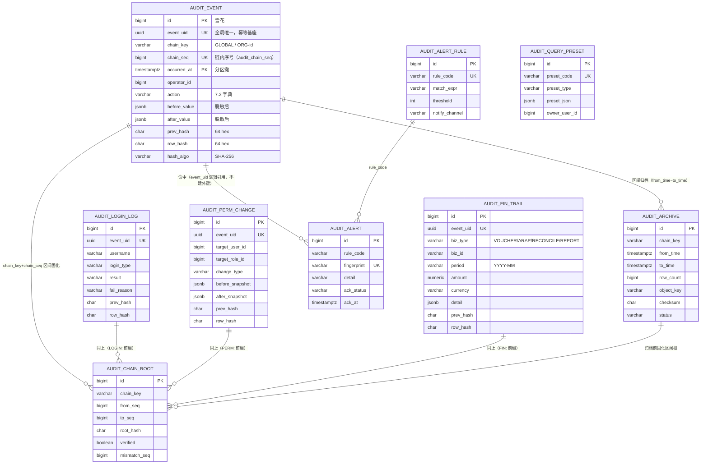

# 企业级一体化管理系统（e-aio）详细设计说明书 · 第 P1 册（分册三）· audit（双审计引擎）

> **项目名称**：企业级一体化管理系统（e-aio）
> **项目定位**：通用能力大一统 + 业务逻辑按企业定制的企业级开源系统
> **编制依据**：GB/T 8567-2006《计算机软件文档编制规范》、GB/T 9385-2008《计算机软件需求规格说明规范》
> **上游文档**：[[01-企业级一体化管理系统-e-aio-可行性研究报告|01-可行性研究报告]]、[[02-企业级一体化管理系统-e-aio-软件需求规格说明书|02-软件需求规格说明书（SRS）]]、[[03-企业级一体化管理系统-e-aio-概要设计说明书|03-概要设计说明书（HLD）]]、[[04-企业级一体化管理系统-e-aio-详细设计说明书-P0-工程地基|04-DD 第 P0 册 · 工程地基]]、[[04-企业级一体化管理系统-e-aio-详细设计说明书-P1-平台底座|04-DD P1 册 · 平台底座]]
> **版本**：V1.0（M4–M5 落地部分；M6 归档/告警收口段随下一段续编）
> **日期**：2026-09-20
> **分册归属**：本文档为详细设计说明书 **第 P1 册（分册三）· audit**，覆盖 HLD 13.2 开发队列 **顺序 5**（audit 双审计引擎，M4–M6）。

---

## 核心结论（执行摘要）

本册把 HLD 5.3「双审计引擎」与 SRS FR-AUD-01…12，落到**类级、表级、可验证**的粒度。审计模块的特殊性在于：它的正确性不是"功能对不对"，而是"**改没改得动、赖不赖得掉**"——因此本册的技术核心是 **WORM 防篡改 + 哈希链**，且每一层防线都必须给出**举证方式**（怎么证明它真的生效）。

| 设计主题 | 关键决策 | 落点 |
|---|---|---|
| 模块定位 | **双审计**：系统操作审计（`audit_event`）+ 财务专项审计（`audit_fin_trail`），另有登录认证与权限变更两张专项表 | 2.1、3.2 |
| 采集 | 注解 `@AuditLog` + `AuditAspect`（Service 层语义）+ Web 层拦截器（请求级兜底），**同一请求只留一条**（MDC 去重标记） | 3.1 |
| 写入链路 | 业务事务**提交后异步**落库（`@TransactionalEventListener(AFTER_COMMIT)` + 有界队列 + 批量 flush + 重试）；**高合规场景走 `sync=true`（默认 STRONG）** | 3.3 |
| 默认模式 | 登录/登出、权限变更、财务轨迹、导出、告警规则变更 → **STRONG**（同事务同步写）；普通查询类与低频普通写 → **ASYNC** | 3.3.2 |
| 敏感性 | 前后值快照经 `@Sensitive` 路径表**脱敏后入审计**（原文不入审计）；IP/UA 一并收敛；**明确承认"审计存不到原文"的合规代价** | 3.4 |
| WORM 三道防线 | ① 应用层仓储只暴露 `insert`/`select`（无 update/delete 代码路径）；② 数据库触发器 `BEFORE UPDATE OR DELETE` → `raise exception`；③ 应用角色 `REVOKE UPDATE, DELETE` | 3.5 |
| 哈希链 | `row_hash = SHA-256( canonical_json(业务字段有序) ‖ prev_hash )`；规范化规则精确到可复现；**禁止直接哈希 JSONB 文本输出** | 3.6、7.3 |
| 并发串行化 | 事务级 **PostgreSQL advisory lock**（`pg_advisory_xact_lock`）+ `nextval` + 唯一约束 `(chain_key, chain_seq)`；不用"锁链尾行"（会锁到用户行并放大热点） | 3.6.3 |
| 校验与举证 | 定时 `verifyChain` + 校验根 `audit_chain_root`；不一致 → 告警 + **冻结该链后续写入**；对外 `verify` / `exportProof` | 3.7 |
| 归档 | `audit_event` 按月 `PARTITION BY RANGE (occurred_at)`；detach → 导出 → 校验和 → 对象存储 → 台账；**归档前固化区间 root，链不断** | 3.9 |
| 分级审计 | 查询强制经 `DataScopeApi` 过滤；超级审计员 `audit:query:all`；**审计查询本身不产生审计事件**（防自环），导出必留痕 | 3.8.4 |
| 本册不做什么 | 账实相符/四流合一/费用合规（SRS FR-AUD-08/09/10，P1 重要度但**P2 批次**）只留接入点，不在 M4–M5 实现 | 3.10、2.6 |

**本册的验收锚点（对齐 HLD 13.3 P1）**：**操作审计 WORM + 哈希链校验验证** —— 即"改一条审计记录会被数据库拒绝（可举证）"+"改一条审计记录（DBA 越过防线）会被校验发现（可举证）"两件事同时成立，且有可执行的测试与对外举证接口。

---

## 1. 引言

### 1.1 编写目的

本文档对 e-aio 的 **audit 模块（双审计引擎）** 进行详细设计，将其职责、边界、接口、数据结构与防篡改机制落实到**可编码、可测试、可验收**的粒度，作为 M4–M6 编码、测试与验收的直接依据。

本册同时也是 P0 册 6.3「待 P1 细化事项」中**第 2 条（`@AuditLog` 切面与 audit 接入）**与**第 5 条（事件总线可靠性）**的唯一落点：P0 的 `@AuditLog` 只有占位说明，本册给出注解定义、切面实现口径、失败语义与死信处置。

### 1.2 文档范围

| 开发队列（HLD 13.2） | 本文档覆盖 | 里程碑 | 本册章节 |
|---|---|---|---|
| 顺序 5 `audit`（双审计引擎） | ✅ 本次详设 | M4–M6 | 第 3–7 章 |
| M6 段（归档策略调优 / 告警通知渠道接 portal） | 🔶 设计已定，落地随 M6 | M6 | 3.9、3.11、6.7 |
| 顺序 6 及以后（workflow/approval/mdm/oa/portal） | ❌ 不在本册 | — | — |
| SRS FR-AUD-08/09/10（账实相符、四流合一、费用合规） | ❌ SRS 标 P1 重要度但**属 P2 批次**（HLD 13.2 顺序 12 finance 起） | P2 | 3.10.4 只留接入点 |
| P3 integration（审计对外 API/Webhook 举证） | ❌ | P3 | 7.6 登记承接 |

**范围口径的三条硬约束**：

1. **只覆盖 M4–M5 可落地的部分**：写入链路、WORM、哈希链、查询、分级审计、财务轨迹模型、告警规则引擎；归档的"历史分区搬运"与"告警通知到人"在 M6 收口（表与接口在 M4 一次建齐，避免二次搬迁）。
2. **不改任何既有代码契约**：`Result<T>` / `PageResult<T>` / `ErrorCode` / 幂等键 / 每模块独立 Schema 与 Flyway 实例（P0 册 3.2、3.6、ADR-0002）**一行不改**；本册只在 `22000–22999` 空段内新增业务错误码。
3. **不写前端代码文件、不改 `frontend/`**：3.12 只给页面清单、交互口径与权限点；前端实现随 portal 批次（顺序 9）统一挂载。

### 1.3 术语与约定

术语一律取 [`CONTEXT.md`](../CONTEXT.md)（模块 / 五层分包 / 命名接口 / 统一返回体 / HTTP 状态码恒 200 / 错误码分段 / 每模块独立 Schema / 命名接口 / 逻辑删除）。本册新增并沿用以下**本册定义**的词汇：

| 术语 | 本册定义 |
|---|---|
| 审计事件（audit event） | `eaio_audit.audit_event` 的一行；一次"被审计的操作"的不可变记录 |
| 双审计 | 系统操作审计（全模块全操作）+ 财务专项审计（finance/fund/crm 等财务关键链路），二者共用同一套 WORM 与哈希链机制 |
| 链（chain） | 由 `chain_key` 标识的一串同表记录；本册**每个表各成一条（或按组织分链的多条）链**，四张流水表的链互不混排（理由见 3.6.2） |
| 链键（chain_key） | `GLOBAL`（默认，全集团单链）或 `ORG:<orgId>`（按组织分链，可配） |
| 链内序号（chain_seq） | 同表同 `chain_key` 内的序号，由该表专属序列分配；唯一约束保证不重号 |
| 创世哈希（genesis hash） | 链首行的 `prev_hash`，固定为 64 个 `0`（`0000…0000`） |
| 行哈希（row_hash） | 该行业务字段规范化后的 SHA-256 摘要，见 3.6.1 与 7.3 |
| 校验根（chain root） | `audit_chain_root` 一行：某区间 `[from_seq, to_seq]` 校验通过后的**末端行哈希**，供归档后区间外推校验 |
| 证明包（proof） | `exportProof` 导出的某区间哈希链证明文件（逐行链值 + 首尾根 + 校验方法说明），供司法/审计举证 |
| STRONG 模式 | 审计写入与业务同事务同步落库，审计写失败即业务回滚（强审计口径） |
| ASYNC 模式 | 业务事务提交后异步落库，审计写失败不回滚业务（默认，除 3.3.2 清单外的场景） |
| 链冻结（chain freeze） | 校验发现不一致后，对该 `chain_key` 停止追加写入，直到人工裁决（3.7.4） |
| 自审计抑制 | audit 自身运行产生的事件（分区创建、链校验、归档、告警写库）**不再反向写审计表**，避免自环与噪声 |
| 审计留痕 vs 审计查询 | 「留痕」= 被审计操作写事件；「查询」= 读审计表，**查询本身不写事件**（导出除外） |

### 1.4 追溯关系

| 本册章节 | 上游来源 | 对齐说明 |
|---|---|---|
| 2.1 模块定位 | HLD 5.3、HLD 2.3、CONTEXT「通用能力层」 | 双审计职责边界与"不做业务"的判定线 |
| 2.2 能力清单 | SRS 3.2 FR-AUD-01…12 | 逐条 FR → 本册章节，无遗漏映射 |
| 2.3 五层分包 | HLD 2.2.2、P0 册 3.1.3、P1 册 3.2（裁决 C-19） | Controller 落 `infrastructure/web`，`api` 只放契约 |
| 2.4 依赖方向 | HLD 11.1、`docs/agents/architecture.md`、P1 册 2.2 | audit → iam/platform（只经 `api`）；audit 被全部模块依赖 |
| 3.1 采集 | HLD 5.3、P1 册 2.4（审计挂钩冻结项）、platform 3.13 事件 | P0 册 6.3 第 2 条落点 |
| 3.3 写入可靠性 | HLD 4.4、SRS NFR-REL-02、P0 册 6.3 第 5 条 | 事件可靠性最小实现 |
| 3.5 WORM | SRS FR-AUD-03、SRS NFR-SEC-08、HLD 8.4、HLD 13.3 | 本册验收核心 |
| 3.6 哈希链 | SRS FR-AUD-04、HLD 12 第 4 条「审计哈希链的具体实现与校验工具」 | 本册验收核心 |
| 3.8 分级审计 | SRS FR-AUD-06、HLD 8.2、P1 册 4.6 `DataScopeApi` | 母子公司隔离 |
| 3.9 归档 | SRS FR-AUD-05、SRS 6.2、SRS NFR-DATA-03、HLD 4.5、HLD 6.3 | 分区 + 归档 + 链不断 |
| 3.10 财务审计 | SRS FR-AUD-07、HLD 5.3、HLD 11.2（`VoucherPostedEvent`） | 财务轨迹接入点 |
| 3.11 告警 | SRS FR-AUD-12、HLD 9.4 | 规则 + 命中 + 通知 |
| 3.12 前端 | HLD 3.4、`docs/agents/frontend-conventions.md` | 页面清单与权限点 |
| 4.x 数据结构 | HLD 4.1.4、HLD 4.3、P0 册 3.6、ADR-0002 | DDL 与迁移 |
| 6.4 防篡改专项 | HLD 13.3（P1 验收"操作审计 WORM + 哈希链校验验证"） | 专项验证用例 |

### 1.5 参考资料

1. [[03-企业级一体化管理系统-e-aio-概要设计说明书|HLD]]：2.2.2 模块化单体边界、2.3 模块划分、2.4 模块间交互机制、3.2 内部模块接口、3.3 核心事件清单、4.1.4 审计域实体、4.3 数据存储分工、4.4 数据一致性策略、5.3 audit、6.3 定时任务设计、7.1/7.2 出错处理、8.4 审计安全、8.5 等保三级对照、11.1 依赖矩阵、11.2 核心事件清单、11.3 主要技术组件清单、12 待详细设计阶段细化事项第 4 条、13.2/13.3 开发队列与验收。
2. [[02-企业级一体化管理系统-e-aio-软件需求规格说明书|SRS]]：C-07 双审计约束、2.2 角色（审计员/集团管理员/子公司管理员/财务人员）、3.2 FR-AUD-01…12、4.3 NFR-SEC-06/08、4.8 NFR-REL-02、6.1 数据分类分级、6.2 数据保留与归档。
3. [[04-企业级一体化管理系统-e-aio-详细设计说明书-P0-工程地基|P0 册]]：3.1.3 命名空间与包结构、3.2.5 幂等键拦截、3.3 全局异常处理、3.4 日志与链路基础、3.6 Flyway 每模块独立实例、3.7 ArchUnit 质量门、6.1 模块登记表、6.3 待 P1 细化事项（第 2、5 条）。
4. [[04-企业级一体化管理系统-e-aio-详细设计说明书-P1-平台底座|P1 册 · 平台底座]]：2.4 链式契约先行冻结项、2.5 裁决表（C-1、C-7、C-13、C-19）、2.6 P0 遗留销账、3.3 platform 对外契约（`FileApi`/`ExcelApi`/`ParamApi`/`CacheApi`/`SchedulerApi`）、3.10 Excel 导出留痕、3.13 事件与投递口径、4.2–4.9 iam 契约（`UserApi`/`OrgApi`/`DataScopeApi`/`PermissionApi`/权限变更事件）、4.9 事件可靠性。
5. [`ADR-0001`](adr/0001-unified-post-and-always-200-result-contract.md)（统一 POST + 恒 200）、[`ADR-0002`](adr/0002-per-module-schema-and-flyway-instance.md)（每模块 Schema + 独立 Flyway 实例）。
6. [`docs/agents/`](agents/)：architecture / api-conventions / database / java-conventions / frontend-conventions / build-and-test / tech-stack（评审基准，冲突时优先级高于 03/02）。
7. PostgreSQL 17 官方文档：`CREATE TABLE ... PARTITION BY RANGE`、`CREATE TRIGGER`、`pg_advisory_xact_lock`、`REVOKE`、`ALTER TABLE ... DETACH PARTITION`。

> **同批次兄弟册说明**：本册编写时，仓库内 P1 段仅有 `04-…-P1-平台底座.md`（platform + iam 合册，M1–M5 段），**不存在**独立的 `04-…-P1-platform.md` 与 `04-…-P1-iam.md`。本册以该合册的第 3、4 章（含 2.4 冻结项与附录 7.4 交接清单）作为兄弟册契约对齐来源；若后续拆册，`FileApi`/`ExcelApi`/`OrgApi`/`UserApi`/`DataScopeApi` 的签名以拆册后的 `api` 为准，本册据此做**向后兼容**复核（见 7.6）。

---

## 2. audit 总体设计

### 2.1 模块定位与双审计职责边界

**一句话**：audit 是 e-aio 的**证据层**——所有模块把"发生了什么"交给它，它负责**不可篡改地存下来、可校验地证明没被改过、按组织分级地查出来**。

HLD 5.3 给 audit 的职责是「系统操作审计 + 财务专项审计」。本册把这条职责拆成**四条产品线**，并明确各自的边界（越界即评审否决）：

| 产品线 | 表 | 回答的问题 | 典型消费者 | 本册实现度 |
|---|---|---|---|---|
| 系统操作审计 | `audit_event` | 谁在什么时候对什么做了什么、结果如何 | 全部模块（`@AuditLog`） | M4–M5 完整 |
| 登录认证审计 | `audit_login_log` | 登录/登出/认证失败（含失败原因、设备、会话） | iam 认证链路 | M4–M5 完整 |
| 权限变更审计 | `audit_perm_change` | 谁改了谁的什么权限，改前改后是什么（快照） | iam 角色/授权链路 | M4–M5 完整 |
| 财务专项审计 | `audit_fin_trail` | 凭证/应收应付/对账/报表的财务关键操作轨迹（金额+期间+币种） | finance / fund / crm（P2） | M4–M5 落**模型与接入点**；P2 业务侧填充 |

**做**：

- 采集（注解 + 切面 + Web 层兜底）、缓冲、落库、链化、校验、举证、查询、统计、导出、告警规则匹配、归档。
- 持有 `eaio_audit` Schema 下的全部表；对外只暴露 `com.eaio.audit.api` 的四个接口。
- 向 iam 注册审计自身的定时任务（链校验、分区维护、归档、告警扫描）。

**不做**（逐条给判定线，避免"顺手做了"）：

| 不做 | 判定线 | 归属 |
|---|---|---|
| 不解析业务语义（如"这张合同能不能改"） | audit 只记录，不裁决；出现任何 `if (业务规则)` 即越界 | 业务模块 |
| 不查业务表、不 JOIN 其他 Schema | 需要对象名称时经 `UserApi`/`OrgApi` 取，或由调用方在 `AuditEventCmd` 里带上 | ADR-0002 |
| 不实现鉴权判定 | `hasPermission` 属 iam；audit 只用权限码字符串做 `@PreAuthorize` | iam |
| 不做业务对账（账实相符/四流合一/费用合规） | 需要读业务单据与财务数据 → P2（3.10.4） | P2 finance |
| 不直接实现通知通道（邮件/短信/企微） | 只落 `audit_alert` + 调 portal 通知（P1 先落库 + ERROR 日志） | portal（顺序 9） |
| 不做日志采集（应用日志） | JSON 日志走 logback（P0 册 3.4），与审计是两件事 | app |
| 不保存敏感字段原文 | 见 3.4：脱敏后入审计，原文不落审计表 | 本册硬约束 |
| 不做防篡改的"绝对承诺" | DBA 拥有物理权限；audit 保证**改得动必被发现**，不承诺改不动 | 3.5.5 诚实口径 |

### 2.2 能力清单与 FR 对照表

SRS 3.2 的 12 条 FR，逐条映射到本册章节 + 验收方式（**不允许出现"有 FR 无落点"**）：

| FR | 需求（SRS 3.2） | 优先级 | 本册章节 | 落地方式 | 验收 |
|---|---|---|---|---|---|
| FR-AUD-01 | 系统操作审计：登录/登出、增删改查、导出、权限变更全量留痕 | P0 | 3.1、3.2 | `@AuditLog` + `AuditAspect` + Web 层拦截器（MDC 去重） | 6.2.1 覆盖矩阵用例 |
| FR-AUD-02 | 审计要素：操作人、时间、IP、模块、对象、动作、前后值、结果 | P0 | 3.2.2 | `audit_event` 列与 `AuditEventCmd` 字段一一对应（7.3 逐字段规范化） | 6.1.1 字段完备性单测 |
| FR-AUD-03 | 审计日志只追加（WORM），数据库层禁止 UPDATE/DELETE | P0 | 3.5 | 三道防线：仓储无写改路径 / `BEFORE UPDATE OR DELETE` 触发器 / `REVOKE` | 6.4.1、6.4.2 |
| FR-AUD-04 | 哈希链防篡改（每条含前一条哈希，定期校验根） | P0 | 3.6、3.7 | `prev_hash`/`row_hash` + `verifyChain` + `audit_chain_root` | 6.1.2、6.4.3 |
| FR-AUD-05 | 审计数据独立存储周期与备份策略 | P1 | 3.9 | 按月分区 + detach 归档 + `audit_archive` 台账 + 独立备份口径 | 6.2.4、6.6 |
| FR-AUD-06 | 集团分级审计：母公司全集团、子公司仅本组织 | P0 | 3.8.4 | 查询强制经 `DataScopeApi`；`audit:query:all` 超级审计员 | 6.2.3 |
| FR-AUD-07 | 财务审计：凭证/账务/报表全链路留痕 | P0 | 3.10 | `audit_fin_trail` + `AuditApi.recordFinTrail`（STRONG 默认） | 6.2.5 |
| FR-AUD-08 | 账实相符：对账任务 + 差异追踪 | P1 | 3.10.4 | **P2 承接**（需读业务单据） | 7.6 登记 |
| FR-AUD-09 | 四流合一：合同/物流/资金/发票关联校验 | P1 | 3.10.4 | **P2 承接** | 7.6 登记 |
| FR-AUD-10 | 费用合规审计：预算与制度规则引擎 | P1 | 3.10.4 | **P2 承接** | 7.6 登记 |
| FR-AUD-11 | 审计查询：多维检索、报表、导出 | P1 | 3.8 | `AuditQueryApi`（`getPage`/`stats`/`export`），导出走 `ExcelApi` 异步任务 | 6.2.2、6.5 |
| FR-AUD-12 | 审计告警：异常操作/越权访问实时告警 | P2 | 3.11 | `audit_alert_rule` + 异步匹配 + `audit_alert` | 6.2.6 |

**非 FR 但本册必须交付的工程项**：

| 项 | 来源 | 落点 |
|---|---|---|
| `@AuditLog` 切面本体 | P0 册 6.3 第 2 条 | 3.1.2、7.5 |
| 事件总线可靠性最小实现（重试/死信/幂等） | P0 册 6.3 第 5 条、P1 册 2.6 | 3.3.5、3.3.6、7.5 |
| 审计死信表 | P1 册 3.13「死信表随 audit 落地」 | `audit_event.source='RETRY'` + 3.3.6（**不新增表**，理由见 3.3.6） |
| 业务错误码枚举 | P0 册 3.7「业务错误码落段断言」 | 7.1（`22000–22999`） |
| ArchUnit 断言对象 | P0 册 6.3 第 7 条 | 6.3 |

### 2.3 五层分包

沿用 P0 册 3.1.3 的五层分包与 P1 册裁决 C-19（**Controller 放 `infrastructure/web`**，`api` 只放跨模块契约）：

```
backend/e-aio/e-aio-audit/                                  # M4 新增 Maven 模块（P1 新增）
├─ pom.xml                                                  # 依赖：e-aio-common、e-aio-platform、e-aio-iam
└─ src/main/
   ├─ java/com/eaio/audit/
   │  ├─ package-info.java          @ApplicationModule(allowedDependencies = {"platform", "iam"})
   │  ├─ api/                       @NamedInterface("api")：只有 interface + record + 枚举
   │  │  ├─ package-info.java
   │  │  ├─ AuditApi.java                   写：record / recordBatch / recordLogin / recordPermissionChange / recordFinTrail
   │  │  ├─ AuditQueryApi.java              读：get / getPage / getPageByOperator / export / stats / getLoginPage / getFinTrailPage
   │  │  ├─ AuditChainApi.java              举证：verify / latestRoot / exportProof
   │  │  ├─ AuditAlertApi.java              告警：listRules / saveRule / listAlerts / ack
   │  │  ├─ AuditSnapshotProvider.java      前后值快照提供者（模块实现）
   │  │  ├─ AuditLog.java                   @AuditLog 注解（全模块用）
   │  │  ├─ AuditMode.java                  STRONG / ASYNC
   │  │  ├─ AuditAction.java / AuditResult.java / AuditSource.java   枚举
   │  │  └─ dto/                            Cmd / Query / DTO / Result（见 5.3）
   │  ├─ application/               用例编排：AuditRecordAppService / AuditQueryAppService /
   │  │                             AuditChainAppService / AuditAlertAppService /
   │  │                             AuditArchiveAppService（事件监听、事务边界、MapStruct 映射）
   │  ├─ domain/                    领域模型：AuditEvent / LoginLog / PermChange / FinTrail /
   │  │                             ChainRoot / Archive / AlertRule / Alert（值对象）
   │  │                             + 仓储接口（只 insert/select）+ ChainHasher（哈希算法，纯函数）
   │  ├─ infrastructure/
   │  │  ├─ persistence/            MyBatis-Plus Mapper + 仓储实现（**无 update/delete 方法**）
   │  │  ├─ queue/                  有界队列 + 批量 flush 调度器 + 重试
   │  │  ├─ chain/                  PostgresChainLock（advisory lock）+ 分区维护 + 归档搬运
   │  │  ├─ alert/                  规则表达式求值器（受限语法，非通用脚本）
   │  │  ├─ job/                    审计定时任务 handler（注册到 platform SchedulerApi）
   │  │  └─ web/                    @RestController（仅出站适配，鉴权用权限码字符串）
   │  └─ events/                    AuditChainBrokenEvent（链不一致）、AuditWriteFailedEvent（写失败）
   └─ resources/db/migration/audit/   每模块独立 Flyway 实例（P0 册 3.6、ADR-0002）
```

**新增模块的 11 个登记点**（P0 册 3.1.3 + P1 册 3.2，逐条照做，漏一条架构测试即红）：

| # | 登记点 | audit 的取值 |
|---|---|---|
| 1 | 父 POM `<modules>` | 追加 `e-aio-audit`（当前 `pom.xml` 只有 common/platform/app） |
| 2 | 模块根包 `package-info.java` | `@ApplicationModule(allowedDependencies = {"platform", "iam"})` |
| 3 | `api/package-info.java` | `@NamedInterface("api")` |
| 4 | 五层目录 | api / application / domain / infrastructure / events |
| 5 | 迁移目录 | `classpath:db/migration/audit` |
| 6 | Schema | `eaio_audit`（Flyway `createSchemas` 创建） |
| 7 | `application.yml` 的 `eaio.flyway.modules` | 追加 `- audit`（当前只有 `- platform`） |
| 8 | 错误码枚举 | `com.eaio.audit.api.AuditErrorCode implements BusinessErrorCode`，全部落在 `22000–22999` |
| 9 | `ArchitectureTest` 的 `MODULE_NAMES` 与白名单 | 追加 `"audit"`；`crossModuleRuleHasTeeth` 的 allowed 追加 `com.eaio.audit.api..` |
| 10 | 不写 `@ComponentScan` | 启动类在 `com.eaio` 自动向下扫描 |
| 11 | P0 册附录 6.1 登记表 | 已登记（`audit` / `com.eaio.audit` / `eaio_audit` / `22000–22999`），本册不改 |

> **`allowedDependencies` 的写法**：Modulith 的模块依赖**不按包名**（无 `com.eaio.iam.api..` 这种写法），只按模块名或命名接口名。本册采用 `{"platform", "iam"}`（依赖对方模块的**共享面**，即其命名接口）——写法比 `{"platform::api", "iam::api"}` 更宽松，但更稳：**收紧到 `::api` 需要对方模块的命名接口已在同一构建中可见**，而 iam 的 `api` 命名接口在 M4 才随 iam 落地；M4 落地后若 `::api` 可用，按 7.6 收紧。两种写法都不改变"只许用 api 包"的实质约束（由 ArchUnit 的跨模块规则兜底）。

### 2.4 依赖方向与契约

```
common ──▶ platform ──▶ iam ──▶ audit ──▶ workflow/approval ──▶ …
                                                        （HLD 13.2 / 11.1）
```

| 方向 | 内容 | 约束 |
|---|---|---|
| audit → platform | `ParamApi`（阈值/开关）、`FileApi`（归档文件、举证文件）、`ExcelApi`（导出任务）、`CacheApi`（统计缓存失效）、`SchedulerApi`（注册定时任务） | 只经 `com.eaio.platform.api` |
| audit → iam | `UserApi`（操作人/目标用户名称）、`OrgApi`（组织名称与子树）、`DataScopeApi`（分级审计过滤）、`PermissionApi`（`hasPermission` 判定，供超级审计员例外） | 只经 `com.eaio.iam.api` |
| audit ← 全部模块 | `@AuditLog` 注解 + `AuditApi` 写入 + `AuditSnapshotProvider` 实现 | 消费方只依赖 `com.eaio.audit.api` |
| audit ✗ workflow / 业务模块 | **禁止**：审计不得依赖任何业务模块（否则业务模块 → audit → 业务模块成环） | ArchUnit + Modulith 双拦 |
| audit ✗ 其他 Schema | **禁止跨 Schema 查询/写入**：audit 只写 `eaio_audit` | ADR-0002 |

**Modulith 事件与同步调用的分工（对齐 P1 册 3.13 裁决 C-7）**：

- **业务审计走同步 `AuditApi`（或注解切面）**，不走事件总线。理由：事件是"解耦的异步副作用"，而审计**需要携带上下文**（前后值、对象、结果），这些信息只在调用点的栈上；把审计做成事件订阅会让每个模块都要自己拼事件载荷，反而更脆。**P1 册 3.13 冻结的 `FileUploadedEvent`/`ExcelExportedEvent`/`ParamChangedEvent` 等平台事件由 audit 用 `@ApplicationModuleListener` 订阅**（platform 不依赖 audit，只能走事件）。
- **iam 的 `UserRoleChangedEvent`（P1 册 4.5/4.9，AFTER_COMMIT）由 audit 订阅**，但 iam 侧**同时**会调 `AuditApi.recordPermissionChange`（STRONG）——二者以 `event_uid` 派生幂等键去重（见 3.3.4），不会双份。

**审计模块对 iam/platform 未就绪的降级（M4 早期）**：

| 缺失依赖 | 降级行为 | 恢复条件 |
|---|---|---|
| `UserApi` 不可用 | 展示层**不解析用户名**，`operator_name` 存 `AuditEventCmd` 传入的原值（可为空），查询降级为显示 `operator_id` | iam `api` 就绪后自动生效（`ObjectProvider` 注入，运行期探测） |
| `OrgApi` 不可用 | 组织树展示降级为扁平的 `org_id` 列表 | 同上 |
| `DataScopeApi` 不可用 | **fail-closed**：除 `audit:query:all` 持有者外，一律只返回**本组织**（由 `iam.api.TenantCtxProvider` 取当前 `org_id`；无上下文则拒绝查询并报 `10403`） | iam 就绪 |

> 注入一律用 `ObjectProvider<T>`（`getIfAvailable()`），**不用 `@Autowired(required=false)` 的隐式语义**——降级路径必须是显式代码，能在测试里被覆盖（6.1.3）。

### 2.5 审计数据流总览

```
① 采集                ② 缓冲                  ③ 落库                ④ 链化
┌──────────────┐   ┌──────────────────┐   ┌────────────────┐   ┌──────────────────┐
│ @AuditLog    │   │ 有界队列          │   │ INSERT 批量     │   │ prev_hash=链尾    │
│ AuditAspect  │──▶│ ArrayBlockingQueue│──▶│ (JDBC batch)   │──▶│ row_hash=H(canon)│
│ Web 拦截器    │   │ 容量 10000（可配） │   │ 500 条/批       │   │ advisory lock 串行│
└──────────────┘   └──────────────────┘   └────────────────┘   └──────────────────┘
        │                    │                                            │
        │ STRONG：同事务直插 ─┘（不经队列）                                 │
        ▼                                                                 ▼
⑤ 校验                          ⑥ 归档                         ⑦ 查询
┌────────────────────┐   ┌────────────────────┐   ┌──────────────────────────┐
│ verifyChain(定时)   │   │ 分区 detach → 导出   │   │ DataScopeApi 过滤         │
│ root → chain_roots  │──▶│ → 对象存储 → 台账    │   │ 热表 + 归档文件（跨区间）  │
│ 不一致 → 告警 + 冻结 │   │ root 先固化（链不断）│   │ 导出 → ExcelApi 异步任务  │
└────────────────────┘   └────────────────────┘   └──────────────────────────┘
```

**七段的失败模式各不同**，本册逐段给失败处置（这是审计模块与普通业务模块最大的差别）：

| 段 | 失败 | 处置 | 章节 |
|---|---|---|---|
| ① 采集 | 切面抛异常 / 注解写错（SpEL 解析失败） | **绝不影响业务**：切面异常只记 ERROR + `traceId`；SpEL 解析失败编译期无法发现 → 单测覆盖（6.1.4） | 3.1.5 |
| ② 缓冲 | 队列满 | ASYNC：本地溢出文件兜底 + 告警；STRONG：等待 200ms 后失败并阻断业务（`22009`） | 3.3.3 |
| ③ 落库 | 数据库不可用 | 指数退避重试 3 次 → 进死信（`audit_event.source='RETRY'` + 溢出文件重投） | 3.3.5 |
| ④ 链化 | 拿不到 advisory lock（超时） | 整批失败 → 重试；**不允许"跳过链化直接插入"**（宁可慢，不可断链） | 3.6.3 |
| ⑤ 校验 | 发现不一致 | 告警 + **冻结该链**；人工裁决（继续断点 / 从备份恢复） | 3.7.4 |
| ⑥ 归档 | 校验和不匹配 | 归档状态置 `FAILED`，分区**不 drop**（数据不动），告警 | 3.9.4 |
| ⑦ 查询 | 区间过大 / 归档文件缺失 | `22002`；归档缺失 → `22006` + 提示区间（**不静默返回空**） | 3.8.5 |

### 2.6 非目标

1. **不做防篡改的"物理不可改"承诺**：DBA 持有 `ALTER TABLE ... DISABLE TRIGGER` 权限；本册承诺的是**改得动必被发现**（哈希链 + 校验根 + 归档校验和），并在 3.5.5 明确写出这一诚实口径，不用"WORM"一词暗示绝对。
2. **不做业务对账引擎**（FR-AUD-08/09/10）：SRS 标 P1 重要度，但开发批次属 P2（HLD 13.2 顺序 12+）。本册只保证 `audit_fin_trail` 的模型与接入点，财务规则引擎不在 M4–M5。
3. **不做审计的全文检索**（OpenSearch）：HLD 4.3 把 OpenSearch 列为全文检索存储，但那是知识库/文档/工单场景；审计检索靠 PostgreSQL 索引 + 分区裁剪，M4–M5 **不引入 OpenSearch 同步链路**（引入即多一条最终一致链路与一个故障面）。
4. **不做数仓同步**（ClickHouse 审计分析，HLD 4.3）：P2/P3 随 report 模块；本册 `stats` 只做 PostgreSQL 聚合，并给出容量上限（4.7）。
5. **不做审计数据的跨实例一致性广播**：与 P1 册 3.4/3.8 同策略（短 TTL 兜底，不建 pub/sub 通道）。
6. **不做前端代码**：3.12 只给页面与权限点；`frontend/` 不由本册修改。
7. **不引入新的第三方依赖**：哈希用 JDK `MessageDigest`，Base64/Hex 用 JDK，压缩/流式导出用 common 门面（`ExcelKit`）。本册**零新增 Maven 坐标**（唯一例外：M4 需要 `spring-boot-starter-aspectj`，P0 册 3.1.2 已引入）。

---

## 3. 详细设计

> **本节每小节的固定结构**：设计目标 → 组件与类 → 关键流程 → 关键取舍与代价 → 边界与失败模式 → 测试点。凡涉及金额、权限、审计的写入路径，取舍必须写出**代价**，不允许只写优点。

### 3.1 审计采集（@AuditLog 注解 + 切面 + 自动采集范围）

#### 3.1.1 设计目标

1. **零侵入的业务接入**：业务代码加一行注解即完成留痕；不加注解的操作由 Web 层兜底留痕（FR-AUD-01"全量留痕"）。
2. **上下文完整**：审计要素（操作人/时间/IP/模块/对象/动作/前后值/结果，FR-AUD-02）在**调用点**采集，不靠事后拼装。
3. **绝不因审计失败影响业务**（ASYNC 模式）；STRONG 模式例外且显式声明（3.3.2）。
4. **同一请求只有一条**：注解切面与 Web 兜底拦截器不得双写。

#### 3.1.2 组件与类

```java
// com.eaio.audit.api.AuditLog —— 全模块可用的采集注解（跨模块契约）
@Target(ElementType.METHOD)
@Retention(RetentionPolicy.RUNTIME)
@Documented
public @interface AuditLog {

    /** 模块名（与模块根包同名，如 "iam" / "finance"）。 */
    String module();

    /** 动作（见 7.2 动作字典）。 */
    AuditAction action();

    /** 对象类型（业务实体名，如 "contract" / "user_role"）。 */
    String objectType() default "";

    /**
     * 对象 ID 取值表达式（SpEL，作用于方法参数）。
     * 例：objectId = "#cmd.id"、objectId = "#id"；空表示不采集对象 ID。
     */
    String objectId() default "";

    /** 是否采集前置快照（调用 AuditSnapshotProvider.before）。 */
    boolean captureBefore() default false;

    /** 是否采集后置快照。 */
    boolean captureAfter() default false;

    /** 写入模式；默认 ASYNC（提交后异步落库），关键路径显式写 STRONG。 */
    AuditMode mode() default AuditMode.ASYNC;

    /** 概要文案（SpEL 可选），不写则由切面按 module+action+objectType 生成。 */
    String summary() default "";
}
```

```java
// com.eaio.audit.api.AuditSnapshotProvider —— 前后值快照来源（业务模块实现）
public interface AuditSnapshotProvider {

    /** 该提供者负责的对象类型（与 @AuditLog.objectType 对应）。 */
    String objectType();

    /**
     * 采集快照。返回**可序列化的普通对象**（Map / record / DTO），
     * audit 侧会用规范化器 + 脱敏器处理，业务模块不得自行拼 JSON 字符串。
     *
     * @param objectId 对象 ID；captureBefore 在方法执行前调用，captureAfter 在执行后调用
     */
    Object snapshot(String objectId);
}
```

**切面**（`com.eaio.audit.application.AuditAspect`，`@Aspect` + `@Order(0)`）：

| 关注点 | 实现 |
|---|---|
| 拦截点 | `@annotation(com.eaio.audit.api.AuditLog)`（只注解驱动，不做包名切面——包名切面会在新增模块时静默失效） |
| 前置 | 生成 `event_uid`（UUIDv4）、记录 `occurred_at`（UTC，`Instant.now()`）、解析 SpEL 取 `objectId`、按需调 `captureBefore` |
| 后置 | 按需调 `captureAfter`、取 `Result`/返回值的成败、捕获异常类型与错误码 |
| 结果判定 | 业务异常 → `result=FAILURE` + `error_code`；正常返回 → `SUCCESS`（即使返回 `Result.fail` 也按 `code != 0` 判 `FAILURE`，与 HTTP 恒 200 的现实对齐） |
| 上下文 | 从 **iam 的 `TenantCtxProvider`（`com.eaio.iam.api`，经 `ObjectProvider` 可选注入）** 取 `operator_id`/`org_id`；从 MDC 取 `traceId`；从请求作用域取 `ip`/`user_agent`/`request_path`（`RequestContextHolder`，无请求时为 null）。**`TenantCtx` 与上下文持有实现归 iam**：其接口在 `com.eaio.iam.api`、实现与请求级持有在 iam 内部（P1 批次总册 3.1、iam 分册 2.4.3）；**common 不持有跨请求组织上下文**（common 契约 V1 已冻结，不新增 `TenantContextHolder` 一类门面）。iam 未就绪 → `ObjectProvider` 缺席 → 降级 `operator_id=0` / `operator_name='SYSTEM'`（2.4 降级表） |
| 写入 | `mode=STRONG` → 直接 `AuditApi.record`（同事务）；`ASYNC` → 投递到队列（3.3） |
| 去重标记 | 成功采集后设 `MDC["audit.annotated"]="1"`，Web 拦截器见标记即跳过 |
| 异常隔离 | 切面内部任何异常都**吞掉并记 ERROR**（ASYNC）；STRONG 模式下**审计写失败必须抛出**（否则"强审计"是假的） |

```java
@Aspect
@Component
@Order(0)   // 必须在业务事务切面之内：ASYNC 需要在提交后触发，STRONG 需要在同一事务内
@RequiredArgsConstructor
public class AuditAspect {

    private final AuditRecordGateway gateway;   // application 层门面（内部，不是 api）
    private final ObjectProvider<AuditSnapshotProvider> snapshotProviders;

    @Around("@annotation(auditLog)")
    public Object around(ProceedingJoinPoint pjp, AuditLog auditLog) throws Throwable {
        AuditDraft draft = gateway.begin(pjp, auditLog);       // 采集前置上下文（不写库）
        try {
            Object result = pjp.proceed();
            gateway.finishSuccess(draft, result);              // ASYNC 入队 / STRONG 不在此刻写
            return result;
        } catch (Throwable t) {
            gateway.finishFailure(draft, t);
            throw t;                                           // 业务异常原样上抛，绝不被审计改写
        }
    }
}
```

> **`finishSuccess` 与 STRONG 的落点**：STRONG 必须"业务与审计同一事务"，因此实际写入点在 `AuditRecordGateway` 的 `@Transactional(propagation = MANDATORY)` 方法内——**调用方没有事务直接报错**（而不是悄悄降级为 ASYNC）。这是"强审计"唯一的可验证定义（6.1.5）。

#### 3.1.3 自动采集范围（FR-AUD-01 的"全量"如何做到）

"全量留痕"不能靠"每个 Service 都记得加注解"——漏加是静默失败。因此采用**双层采集**：

| 层 | 覆盖 | 采集内容 | 实现 |
|---|---|---|---|
| L1 注解层（Service） | 有业务语义的操作（前后值、对象 ID、结果） | 完整审计要素 | `@AuditLog` + `AuditSnapshotProvider` |
| L2 请求层（Web 兜底） | 所有 `/api/**` 请求（除白名单） | 请求级要素（路径、方法、操作人、IP、UA、耗时、HTTP 结果） | `AuditWebInterceptor`（`HandlerInterceptor`，注册在 `com.eaio.audit.infrastructure.web`） |

**L2 白名单（不产生审计事件，写死在代码并单测锁定）**：

| 路径模式 | 理由 |
|---|---|
| `/audit/**`（读接口） | **防自环**：审计查询不写审计（导出接口除外，导出走 L1 显式注解） |
| `/actuator/**` | 健康检查高频噪声 |
| `/auth/captcha/**` | 验证码高频；登录成败已由 `recordLogin` 覆盖 |
| 静态资源与 `/error` | 非业务 |

**L2 的动作映射**（`request_path` → `action`，覆盖 FR-AUD-01 的"增删改查"）：

| 路径后缀 | action | 是否 ASYNC |
|---|---|---|
| `/Add` | `CREATE` | ASYNC |
| `/Up`、`/Submit`、`/Approve`、`/Reject` | `UPDATE` | ASYNC |
| `/Del` | `DELETE` | ASYNC |
| `/Get`、`/GetPage` | `READ` | **默认不采集**（见下） |
| `/Export`、`/Download` | `EXPORT` | **STRONG**（NFR-SEC-05 导出留痕） |
| `/Grant`、`/Revoke`、`/Assign` | `GRANT` / `REVOKE` | **STRONG** |

> **"查"要不要留痕——本册的取舍**：FR-AUD-01 字面含"查"，但**对每次 `GetPage` 写一条审计事件会把审计表变成业务表的 100 倍**（4.7 容量测算：读取量是写入量的 50–200 倍），代价是存储与链化吞吐被查询流量吃掉，且真正的审计信号被噪声淹没。本册裁决：**默认不采集 `READ`**；改为提供 `@AuditLog(action = READ, mode = STRONG)` 显式标注的"敏感读取"（如薪酬、银行账号、财务报表明细）留痕，并把"敏感读取清单"作为各模块的评审项（谁的敏感数据谁申报）。**代价明确写出**：这是对 FR-AUD-01 字面的收窄，收窄范围有清单、可配置（`eaio.audit.capture.read-paths`），不是"漏了"。该裁决登记进 7.6 提请架构评审。

**L1/L2 去重**：`MDC["audit.annotated"]="1"`（L1 设置）→ L2 在 `afterCompletion` 检查，命中则不写。去重**按请求**而非按方法，因此一个请求内多次 `@AuditLog` 调用会产生多条 L1 事件（正确：一个请求确实改了两件事），而 L2 一条都不补（正确：细节已由 L1 覆盖）。

#### 3.1.4 关键流程

```
Client ──▶ TraceIdFilter (P0) ──▶ IdempotencyFilter (P0) ──▶ AuditWebInterceptor.preHandle
                                                                   │ 记录开始时间/路径/操作人
                                                                   ▼
                                                            Controller → AppService
                                                                   │  ① 业务事务开始
                                                                   │  ② @AuditLog 切面 begin（采集前置）
                                                                   │  ③ 业务写库
                                                                   │  ④ 切面 finish：
                                                                   │     ASYNC → 入队（事务提交后由监听器 flush）
                                                                   │     STRONG→ 同事务 INSERT（含链化）
                                                                   │  ⑤ 提交
                                                                   ▼
                                            AuditWebInterceptor.afterCompletion
                                                                   │ MDC 有 audit.annotated ？→ 跳过
                                                                   │ 否则按映射投递 L2 事件（ASYNC/STRONG）
                                                                   ▼
                                                              响应返回（HTTP 200）
```

**幂等键与 traceId 入审计（与 P0 入站链路对齐，本册硬要求）**：

| 字段 | 来源 | 用途 |
|---|---|---|
| `idempotency_key` | `Idempotency-Key` 请求头（P0 册 3.2.5 已由 `IdempotencyFilter` 读取） | 关联"同一次用户动作"的重试；解释"为什么有两条相似事件" |
| `trace_id` | MDC（`TraceIdFilter` 写入，P0 册 3.4） | 与 JSON 日志、`sys_job_log`（P1 册 3.7）串联排障 |

> 采集实现从 MDC / 请求头读取，**不改 P0 的过滤器**（`IdempotencyFilter` 已把键放进请求属性，audit 侧只读不写）。

#### 3.1.5 关键取舍与代价

| 取舍 | 选择 | 代价 |
|---|---|---|
| 注解 vs 包名切面 | **注解** | 漏加 = 无审计；用 L2 兜底 + 6.2.1 覆盖矩阵用例降低风险 |
| 切面顺序 `@Order(0)` | 在业务事务切面内层 | STRONG 才能进同一事务；代价是切面必须在 `spring-boot-starter-aspectj` 生效的代理链里，`final` 类/自调用方法**不会**被切（这是 Spring AOP 的已知边界，作为**已知限制**登记：自调用需要显式 `AopContext.currentProxy()` 或改由上层 Service 注解） |
| 异常隔离 | 切面吞异常 | ASYNC 下**审计可能静默丢失**；用"队列积压指标 + 写失败告警规则"（3.11）补 |
| 快照来源 | `AuditSnapshotProvider`（模块实现） | 每个模块要写一个 provider；不实现则该字段为空（记 WARN，不报错）——**不假装有值** |
| 前后值粒度 | 整对象快照 | 大对象（如含 500 行的单据）会撑大 JSONB；单条快照上限 `eaio.audit.snapshot.max-bytes`（默认 64KB），超限**截断并置 `summary` 标注 `TRUNCATED`**，不静默丢 |

#### 3.1.6 边界与失败模式

| 场景 | 行为 |
|---|---|
| SpEL 表达式非法 / 参数名不可解析（未开 `-parameters`） | 切面记 ERROR（含 `traceId` 与表达式），`objectId` 置空继续；**不阻断业务**。构建要求：`maven-compiler-plugin` 开 `-parameters`（编译期即可发现"参数名不可用"，用单测锁定） |
| 方法抛异常且异常类型是 `BusinessException` | `result=FAILURE`，`error_code` 取 `BusinessException.getCode()`；异常继续上抛，全局处理器按 P0 册 3.3 输出 `Result` |
| 无 HTTP 上下文（定时任务、事件监听内部调用） | `ip`/`user_agent`/`request_path` 为 null；`operator_id` 先试 `iam.api.TenantCtxProvider.current()`，缺席或为空则标注为 `SYSTEM`（`operator_id = 0`，约定见 7.2） |
| 同一方法被嵌套调用两次 | 产生两条事件（真实发生了两次操作），`event_uid` 不同；不合并 |
| 切面在事务回滚后仍入队（ASYNC） | **必须避免**：ASYNC 的入队动作在 `@TransactionalEventListener(AFTER_COMMIT)` 内执行（3.3.1），回滚事务不入队 |
| `captureBefore` 与业务读取顺序 | 前置快照在**业务方法执行前**读取；若业务方法自身修改了实体且是同一持久化上下文，前置快照必须在切面 `begin` 时立即深拷贝（不持有实体引用）——否则前后值相同（这是最容易被写出来的假审计） |

#### 3.1.7 测试点

| 编号 | 用例 | 断言 |
|---|---|---|
| 6.1.4-a | `@AuditLog(objectId="#cmd.id", captureBefore=true, captureAfter=true)` 正常路径 | 事件 1 条，`object_id` 等于 `cmd.id`，`before_value != after_value`（且是**深拷贝**，改实体不影响 before） |
| 6.1.4-b | 方法抛 `BusinessException(22004)`（示例） | 事件 `result=FAILURE`、`error_code=22004`、异常仍上抛 |
| 6.1.4-c | 切面内抛出异常（模拟快照 provider 报错） | 业务方法**正常返回**（异常被隔离），有 ERROR 日志 |
| 6.1.4-d | L1 + L2 同请求 | 只 1 条事件（MDC 去重生效） |
| 6.1.4-e | 敏感读取标注 | 事件 `action=READ` 且 `mode=STRONG`（事务内可见） |
| 6.1.4-f | 快照超 64KB | `before_value` 被截断，`summary` 含 `TRUNCATED` |
| 6.1.4-g | 编译期 `-parameters` | 反射取参数名非 `arg0`（构建期断言） |

### 3.2 审计事件模型与要素（FR-AUD-02）

#### 3.2.1 设计目标

1. **要素齐全**：SRS FR-AUD-02 的八个要素（操作人、时间、IP、模块、对象、动作、前后值、结果）一个不少，且每个要素有唯一来源。
2. **可判等**：同一个操作在 STRONG/ASYNC/重试三种路径下产生的事件**内容一致**（否则链校验与去重都靠运气）。
3. **可索引**：查询模式（3.8）能命中索引，不做全表扫（审计表是最大表，4.7）。

#### 3.2.2 要素定义（`AuditEventCmd` ↔ `audit_event` 列）

| 要素 | Cmd 字段 | 表列 | 类型 | 来源 | 缺失时 |
|---|---|---|---|---|---|
| 事件标识 | `eventUid` | `event_uid` | UUID | 切面/调用方生成（UUIDv4） | **不允许为空**（幂等键基座） |
| 业务引用 ID | —（落库时生成） | `id` | BIGINT | `IdGenerator`（雪花，common） | 由 audit 生成 |
| 链键 | `chainKey` | `chain_key` | VARCHAR(64) | 默认 `GLOBAL`；`eaio.audit.chain.per-org=true` 时 `ORG:<orgId>` | 默认 `GLOBAL` |
| 链序号 | —（落库时分配） | `chain_seq` | BIGINT | 序列 `audit_chain_seq` | 由 audit 分配 |
| 操作时间 | `occurredAt` | `occurred_at` | TIMESTAMPTZ | 切面 `Instant.now()`（UTC） | **不允许为空**（分区键） |
| 操作人 | `operatorId` / `operatorName` | `operator_id` / `operator_name` | BIGINT / VARCHAR(128) | `iam.api.TenantCtxProvider` + `iam.api.UserApi`（任一缺席则用 Cmd 传入值） | `operator_id=0` + `operator_name='SYSTEM'` |
| 组织 | `orgId` | `org_id` | BIGINT | `iam.api.TenantCtxProvider` | 系统级操作写 `0` |
| 模块 | `module` | `module` | VARCHAR(64) | `@AuditLog.module` | **不允许为空** |
| 动作 | `action` | `action` | VARCHAR(32) | `@AuditLog.action`（7.2 字典） | **不允许为空** |
| 对象类型 | `objectType` | `object_type` | VARCHAR(64) | `@AuditLog.objectType` | 允许为空（READ 类） |
| 对象 ID | `objectId` | `object_id` | VARCHAR(64) | `@AuditLog.objectId`（SpEL） | 允许为空 |
| 概要 | `summary` | `summary` | VARCHAR(512) | `@AuditLog.summary` 或自动生成 | 自动生成 |
| 前后值 | `beforeValue` / `afterValue` | `before_value` / `after_value` | JSONB | `AuditSnapshotProvider` → 规范化 + 脱敏 | 允许为空（无快照） |
| 结果 | `result` | `result` | VARCHAR(16) | 切面判定 | **不允许为空** |
| 错误码 | `errorCode` | `error_code` | INTEGER | `BusinessException.getCode()` | 成功时为 null |
| 网络 | `ip` / `userAgent` | `ip` / `user_agent` | VARCHAR(64) / VARCHAR(512) | 请求上下文（脱敏后，见 3.4.4） | 无请求时为 null |
| 链路 | `traceId` | `trace_id` | VARCHAR(64) | MDC | 允许为空 |
| 路径 | `requestPath` | `request_path` | VARCHAR(256) | 请求上下文 | 允许为空 |
| 耗时 | `durationMs` | `duration_ms` | INTEGER | 切面/拦截器计时 | 允许为空 |
| 幂等键 | `idempotencyKey` | `idempotency_key` | VARCHAR(200) | `Idempotency-Key` 请求头 | 允许为空（查询类无键） |
| 写入来源 | `source` | `source` | VARCHAR(16) | `SYNC` / `ASYNC` / `IMPORT` / `RETRY`（7.2 字典） | 由写入链路决定 |
| 链 | —（落库时计算） | `prev_hash` / `row_hash` / `hash_algo` | CHAR(64)/CHAR(64)/VARCHAR(16) | `ChainHasher` | 由 audit 计算 |

> **字段与表的双向一致性由测试锁定**：`AuditEventCmd` 的每个分量都必须在表中有对应列（6.1.1 用反射比对 DTO 分量与 DDL 列清单），防止"加了字段但没落库"。

#### 3.2.3 组件与类

```
com.eaio.audit.domain
├─ AuditEvent          领域值对象（与表同构；equals 用 event_uid）
├─ LoginLog / PermChange / FinTrail
├─ ChainRoot / Archive / AlertRule / Alert
├─ AuditEventRepository      interface { AuditEvent insert(AuditEvent); Optional<AuditEvent> findById(long);
│                                        List<AuditEvent> selectPage(AuditEventQuery);
│                                        Optional<AuditEvent> findChainTail(String chainKey);       // 供链化
│                                        List<AuditEvent> selectChainRange(String chainKey, long from, long to);
│                                        long nextChainSeq(String chainKey); }
│                            // **没有 update / delete 方法**（WORM 第一道防线，3.5.1）
├─ LoginLogRepository / PermChangeRepository / FinTrailRepository（同形）
└─ ChainHasher              纯函数：canonicalJson(...) → byte[] → SHA-256 → hex（3.6.1）
```

#### 3.2.4 关键流程：一条事件的完整生命周期

```
@AuditLog 触发
  → AuditDraft（内存对象：要素 + 快照原始对象，**尚未序列化**）
  → normalize()：快照 → 规范化 Map（键排序、时间精度、数字归一）→ 脱敏 → CanonicalJson.bytes()
  → AuditEvent（值对象，含 before/after 的规范化 bytes 与 JSONB 文本）
  → [ASYNC] 入队 / [STRONG] 同事务链化 + INSERT
  → INSERT 成功后：row_hash 回填到内存对象（供同批次下一行 prev_hash；ASYNC 在链化时一次算完）
  → 批量 flush 完成 → 发 AuditWriteFailedEvent（仅失败时）/ 更新队列指标
```

#### 3.2.5 关键取舍与代价

| 取舍 | 选择 | 代价 |
|---|---|---|
| 一个大表 vs 分表 | **四表分列**（`audit_event` / `audit_login_log` / `audit_perm_change` / `audit_fin_trail`） | 四套链、四套查询；换来"登录日志不污染操作审计检索"与财务轨迹的专项字段（金额/期间/币种）不塞进通用表 |
| `before/after` 用 JSONB | JSONB | 存储膨胀（1.3–2×文本）；换来可用于 containment 查询与统一规范化 |
| 对象 ID 用 `VARCHAR(64)` 而非 BIGINT | VARCHAR | 支持复合业务键（如 `contract:2026:000123`）；代价是索引更大、无类型校验 |
| `operator_name` 冗余存储 | 存快照名 | 用户改名后历史事件仍显示当时的名字（审计语义正确）；代价是冗余存储 |

#### 3.2.6 边界与失败模式

| 场景 | 行为 |
|---|---|
| `module`/`action` 为空 | `AuditApi.record` 直接抛 `BusinessException(PARAM_MISSING)`（10001）——**审计要素缺失不是审计模块的失败，是调用方的 bug** |
| `objectId` 含超长/非法字符 | 截断到 64 字符并记 WARN（不拒绝，避免因业务 ID 形态变化丢审计） |
| `occurred_at` 不在任何分区 | 落入 `p_default` 默认分区（3.9.1），并由分区任务告警 |
| `occurred_at` 与 `created_at` 差超过 `eaio.audit.clock.skew-warn`（默认 1 小时） | 记 WARN（时钟漂移或补录），不拒绝 |

#### 3.2.7 测试点

| 编号 | 用例 | 断言 |
|---|---|---|
| 6.1.1-a | DTO ↔ 表列完备性 | DTO 每个分量都有对应列（反射比对） |
| 6.1.1-b | `module` 为空 | 抛 `10001` |
| 6.1.1-c | `module`/`action` 超长 | 截断且不抛异常（DDL `VARCHAR` 限制内） |
| 6.1.1-d | 同一 SpEL 解析 | `objectId="#cmd.id"` 与 `"#root.id"` 都能解析（`-parameters` 生效） |

### 3.3 写入链路与可靠性（AFTER_COMMIT 异步 / STRONG 模式 / 队列 / 重试 / 幂等 / 崩溃补偿）

#### 3.3.1 设计目标

1. **审计写失败不回滚业务**（ASYNC）——否则"审计模块抖动导致全系统写不可用"。
2. **审计不拖慢 P0 写接口**（NFR-PERF-02：常规接口 P95 < 500ms）——审计的额外开销必须可控且可测（6.5）。
3. **高合规场景可换 STRONG**——权限变更、财务轨迹默认为 STRONG（HLD 7.2"强审计场景失败即拒绝"）。
4. **崩溃窗口有界且可举证**（ASYNC 的代价必须写清 + 有补偿手段）。

#### 3.3.2 两种模式的定义与默认分配

| 模式 | 事务边界 | 语义 | 失败时 |
|---|---|---|---|
| `ASYNC`（默认） | 业务事务提交后（`@TransactionalEventListener(AFTER_COMMIT)` → 入队 → 批量 flush） | 尽力交付，不阻断业务 | 重试 3 次 → 死信 + 告警 |
| `STRONG` | **同一事务**（`Propagation.MANDATORY`） | 审计与业务同生共死 | 审计写失败 → 抛 `22009` → 业务事务回滚 |

**默认分配表（照此实现，不由各模块"凭感觉"选）**：

| 场景 | 模式 | 依据 |
|---|---|---|
| 登录/登出/认证失败（`LoginAuditCmd`） | **STRONG** | 认证是安全事件，且登录本身无长事务；HLD 8.4 |
| 权限变更（`PermissionChangeCmd`：角色授权、数据范围、SoD） | **STRONG** | SRS FR-SEC-13；HLD 7.2「强审计场景失败即拒绝」 |
| 财务轨迹（`FinTrailCmd`：凭证/账务/报表） | **STRONG** | SRS FR-AUD-07；财务不可"记不上就算了" |
| 导出（`EXPORT`） | **STRONG** | SRS NFR-SEC-05 导出管控 |
| 告警规则变更（`saveRule`） | **STRONG** | 改审计规则本身必须是可审计的强动作 |
| 归档批次创建（内部） | **STRONG** | 归档台账必须与链根同事务一致 |
| 普通业务增删改（CREATE/UPDATE/DELETE） | **ASYNC** | 量最大；写失败不该让库存/合同写不进去 |
| 敏感读取（显式 `READ`） | **STRONG**（由注解显式指定） | 读取本身短，可承受 |

> **可配但要留痕**：`eaio.audit.mode.default=ASYNC`、`eaio.audit.mode.strong-actions=LOGIN,LOGOUT,GRANT,REVOKE,EXPORT`（逗号分隔的 action 清单）。参数改动本身走 platform 参数中心 → 触发 `ParamChangedEvent` → audit 订阅后写一条 `module=audit, action=UPDATE` 的 STRONG 事件（**改审计配置这件事本身被审计**）。

#### 3.3.3 异步写入链路（组件与流程）

```
业务事务提交
   │  Spring 发布 AuditEnqueuedEvent（@TransactionalEventListener(AFTER_COMMIT)）
   ▼
AuditQueueProducer.offer(draft)
   │  队列：ArrayBlockingQueue<AuditEvent>（容量 eaio.audit.queue.capacity，默认 10000）
   │  满时：
   │    - ASYNC → 写本地溢出文件（audit-overflow-<date>.jsonl，追加 + fsync），
   │               记 WARN + 指标 eaio_audit_queue_overflow_total++，返回不阻塞
   │    - STRONG → 不会走队列（见 3.3.2），故此处不考虑
   ▼
AuditBatchFlusher（独立线程/调度器，每 200ms 或攒够 eaio.audit.write.batch-size=500 条）
   │  ① 开启**一个**事务：pg_advisory_xact_lock(chainKey, 0)（3.6.3）
   │  ② SELECT 链尾（prev row_hash + max(chain_seq)）
   │  ③ 逐条算 row_hash（链内顺序 = 入队顺序，即事件发生顺序）
   │  ④ JDBC batch INSERT（同批次提交，一条 SQL 批次）
   │  ⑤ 提交 → 释放 advisory lock
   ▼
失败 → 重试（指数退避 200ms/400ms/800ms，最多 3 次）
   ▼
仍失败 → 死信：写溢出文件 + 更新 audit_write_failures 指标 + 触发 3.11 规则"审计写入失败率"
        + 启动补偿任务（AuditOverflowReplayer）在下次启动/每小时扫描溢出文件重投
```

**批内顺序 = 链内顺序**：入队顺序即事件 `occurred_at` 顺序（切面在方法返回后立即入队）。因此同批次的 `chain_seq` 严格递增且相邻，`prev_hash` 首尾相连。跨批次由 advisory lock + 链尾查询保证连续。

**事务边界（必须写清）**：

- 一个批次 = 一个事务。批次内要么全部落库（链连续），要么全部失败重试。**不允许部分提交**（部分提交会造成链内空洞，且空洞无法区分"崩了"和"被删了"）。
- 重试必须**重算整批**（重新取链尾）——不能复用上次算出的 `prev_hash`（链尾可能已被 STRONG 写入推进）。
- `source` 字段：正常异步批次写 `ASYNC`；重试写入写 `RETRY`；溢出文件重投写 `RETRY`；同事务同步写 `SYNC`；批量导入通道写 `IMPORT`。

#### 3.3.4 幂等（同一事件不会写两次）

| 层次 | 机制 | 覆盖 |
|---|---|---|
| 入队 | `event_uid` 在内存 `ConcurrentHashMap` 去重表（LRU，容量 `eaio.audit.dedup.cache-size=200000`） | 同一 Java 进程内的重复投递（如监听器被多次触发） |
| 落库 | 插入前按 `event_uid` 查存在性（**同批次内先在内存比对，跨批次查库**） | 重试与溢出重投 |
| 唯一约束 | 幂等探测走 `uk_audit_event_uid`（分区**本地**唯一索引 `(event_uid, occurred_at)`）；跨分区的全局唯一性由 3.3.4 的"先查后插"保证，见 4.3.1 | 并发重复 |
| 平台事件去重 | iam 的 `UserRoleChangedEvent` 与 iam 主动调用的 `recordPermissionChange` 用**派生幂等键**：`event_uid = uuid_v5(namespace, "perm:" + userId + ":" + roleId + ":" + changeType + ":" + occurredAt.truncatedTo(SECONDS))` | 同一次变更的两条投递只会落一条 |

> **为什么幂等不靠"唯一约束报错后忽略"**：批量插入中一条唯一冲突会让**整批**失败（PG 默认语句级原子），重试整批又冲突 → 死循环。因此采用"先查后插"（幂等表在 `event_uid` 上有索引，代价是一次轻量索引探测），唯一索引只作为最后一道并发兜底，冲突时**把整批降级为逐条插入 + 忽略重复**（代码路径显式存在并有测试）。

#### 3.3.5 崩溃窗口与补偿（ASYNC 的代价，必须承认）

| 窗口 | 会丢什么 | 缓解 | 残留风险 |
|---|---|---|---|
| ① 事务提交后、入队前（进程崩溃/被 kill） | 该次操作的事件 | 无（窗口毫秒级） | **存在**；用 STRONG 覆盖关键动作（3.3.2） |
| ② 队列内（进程崩溃） | 队列中未 flush 的事件（最多 `batch-size` + 队列长度） | 溢出文件兜底（队列满时同步落盘）；`AuditQueueDrainHook`（`@PreDestroy`，优雅停机时 flush 剩余队列） | **存在**；优雅停机可消除，强杀不可 |
| ③ 数据库不可用 | 整批事件 | 重试 3 次 + 死信 + 溢出重投 | 数据库长时间不可用期间的事件落溢出文件 |
| ④ 分区边界（`occurred_at` 落在未建分区） | 无（落 `p_default`） | 分区预建任务提前 3 个月建好 | 无 |
| ⑤ 时钟跳变导致链内 `occurred_at` 乱序 | 无（`chain_seq` 才决定链序） | 校验按 `chain_seq` 排序，不按时间 | 无 |

**可举证的窗口登记**：`audit_chain_root` 每轮校验都记录 `from_seq`–`to_seq`；若某轮校验发现"链尾曾中断"（`max(chain_seq)` 有空洞），写一条 `verified=false` 的根记录并把 `mismatch_seq` 指向**本该存在但缺失的序号**。这样"丢了哪个窗口"在数据库里有记录，不靠运维口头解释。

> **`source` 之外的关联手段**：崩溃窗口内的事件确实不在审计表里；调查时的替代证据是（a）应用 JSON 日志（P0 册 3.4，可按 `traceId` 检索）、（b）反向代理/WAF 访问日志（保留策略由部署方定）、（c）平台 `sys_job_log`（P1 册 3.7）。**本册不假装这些自动可用**——它是一条部署方需要评估的运维依赖，登记在 7.6。

#### 3.3.6 死信：为什么不新增一张死信表

P1 册 3.13 说"死信表随 audit 落地"。本册的落地方式是**不新增表**：

- 审计事件写失败的死信**本身就是"一条没能落进审计表的审计事件"**，把它落进 `eaio_audit` 的另一张普通表并不比落进 overflow 文件更强（同样在同一个库、同样可能写不进去——数据库挂了两个都写不进）。
- 因此死信载体 = **进程外的追加文件**（`${eaio.audit.overflow-dir}`，默认 `<work-dir>/audit-overflow/`，权限 600，每行一条 JSON，写入即 `fsync`），配合 `AuditOverflowReplayer`（每小时 + 启动时）重投，重投成功即从文件归档为 `.done` 后缀（保留 30 天供人工核查）。
- **代价与边界**：溢出文件在**应用容器**上，容器重建即丢；因此（a）溢出目录必须挂持久卷（部署清单一条），（b）溢出文件积压本身触发 STRONG 级告警（3.11 规则 `AUDIT_QUEUE_BACKLOG`），（c）**溢出期间"审计完整性"是降级状态**，需人工确认后才算闭环。

> 若将来需要"多实例共享的死信队列"，再引入 Redis Stream 或独立表——**P1 不为未被证实的需求预置机制**（YAGNI，P1 册 2.5 裁决风格一致）。

#### 3.3.7 关键取舍与代价

| 取舍 | 选择 | 代价 |
|---|---|---|
| AFTER_COMMIT 异步 vs 同事务 | **以异步为默认**，STRONG 显式声明 | 崩溃窗口（3.3.5）；换来"审计不拖慢 P0 写接口"与"审计失败不回滚业务" |
| 有界队列 vs 无界队列 | **有界**（10000） | 满时溢出到文件（多一条 I/O 路径与一个目录要运维）；无界会在数据库故障时 OOM——**这是必须选有界的理由** |
| 批量 flush（200ms/500 条） | 批量 | 最坏 200ms 的可见延迟（STRONG 无延迟）；换来写入吞吐与链化的锁竞争降低 |
| 溢出文件 vs Redis 队列 | 文件 | 多实例下各自本地；换来"数据库/Redis 同时挂也能留住事件" |
| 幂等先查后插 | 查 | 每条约一次索引探测；换来批量插入不被唯一冲突整批击穿 |

#### 3.3.8 边界与失败模式

| 场景 | 行为 |
|---|---|
| 队列满 + 溢出文件目录不可写（磁盘满/只读） | 记 ERROR + 指标 `eaio_audit_overflow_write_failed_total++`，**放弃该条**（ASYNC）；STRONG 场景此时失败会阻断业务——这是"磁盘满"这一真实故障的正确表现 |
| 批量 flush 中途 JVM OOM | 整批未提交（一个事务），数据不落；由溢出文件与重放补（若已入队未落盘则丢，窗口②） |
| 优雅停机 | `AuditQueueDrainHook` 先停止接收 → flush 剩余 → 再关闭线程池；超时 `eaio.audit.shutdown.timeout=30s` |
| 多实例并发写同一链 | advisory lock 串行化（3.6.3）；等待超时 `eaio.audit.chain.lock-timeout=5s`，超时报 `22003`（链区间非法/锁失败类）并整批重试 |
| STRONG 在无事务调用（如定时任务内部） | 立即抛 `SystemException`（编程错误，不是业务错误）——**不允许静默降级为 ASYNC** |

#### 3.3.9 测试点

| 编号 | 用例 | 断言 |
|---|---|---|
| 6.2.1-a | ASYNC 正常路径 | 业务提交后 ≤ 1s 内落库，`source='ASYNC'`，`chain_seq` 连续 |
| 6.2.1-b | 队列满 | 溢出文件出现一行；指标 +1；业务不受影响 |
| 6.2.1-c | 落库失败注入（数据库断开 1 次） | 重试成功，`source='RETRY'`，无重复记录 |
| 6.2.1-d | 连续失败 4 次 | 溢出文件落盘 + 告警记录（`audit_alert` 一行） |
| 6.2.1-e | STRONG 审计写失败 | 业务事务回滚，响应 `22009` |
| 6.2.1-f | 重复投递同一 `event_uid` | 只落一行 |
| 6.2.1-g | 批次内 500 条 | 500 行链连续，`prev_hash` 首尾相接 |
| 6.2.1-h | 优雅停机时队列有 100 条 | 全部落库（drain 生效） |

### 3.4 敏感性处理（脱敏策略、前后值快照、与字段权限的关系）

#### 3.4.1 设计目标

1. **审计表不得成为"敏感数据的第二份明文副本"**：审计查询是**高权限、可导出**的入口，若前后值存原文明文，等于把薪酬/证件/银行账号又存了一份，且绕过了字段权限（P1 册 4.8）与 `@Sensitive` 展示脱敏。
2. **脱敏必须忠实**：保留"改了什么字段、从什么形态变成什么形态"的可辨识度（否则前后值 diff 失去审计价值）。
3. **脱敏规则集中声明**：由**数据归属模块**声明敏感路径（它才知道哪个字段敏感），audit 只执行。

#### 3.4.2 核心裁决：审计存脱敏值，不存原文

> **本册裁决（必须写清取舍）**：`before_value` / `after_value` 落库前**按敏感路径脱敏**，**原文不写入审计表**，且**不提供"原文另存"通道**（无第二个密文表、无密钥回读接口）。
>
> **为何不选"原文 + 加密存储"**：加密存储只是把"谁能看"换成"谁有密钥"；审计查询服务与密钥同进程，等价于明文可达，且会给审计表叠加密钥轮换与丢失风险。
>
> **代价（合规侧，必须承认）**：审计记录**无法还原敏感字段的原始值**。因此当调查需要"当时手机号是多少"时，审计只能给出 `138****1234`。缓解措施：① 审计导出文件（含哈希链证明）与**数据行的历史版本**由各业务模块按自身保留策略保存（审计不是唯一证据源）；② 高敏感字段的变更走"变更前后都留**结构化差异摘要**"（如"手机号：掩码前 3 位不变、末 4 位不变"），而不是完全丢信息。该裁决作为**已知限制**登记进 7.6 供合规评审，不用"脱敏存储"四个字掩盖代价。

#### 3.4.3 敏感路径声明（`AuditSensitivePathRegistry`）

```java
// com.eaio.audit.api.AuditSensitivePathRegistry —— 由数据归属模块在启动时登记（只增）
public interface AuditSensitivePathRegistry {

    /**
     * 登记某对象类型下的敏感字段路径（JSON Pointer 风格，支持数组通配 "*"）。
     * 例：register("employee", "/salary", SensitiveType.CUSTOM, 0, 0);
     *     register("customer", "/contacts/*\/mobile", SensitiveType.MOBILE);
     */
    void register(String objectType, String jsonPointer, SensitiveType type);

    /** 自定义保留位数版本（SensitiveType.CUSTOM 用）。 */
    void register(String objectType, String jsonPointer, String prefixKeepSpec, String suffixKeepSpec);
}
```

| 规则 | 说明 |
|---|---|
| 采集时执行 | 在 `AuditEvent` 规范化阶段（3.2.4 流程的第 2 步）执行，**脱敏后**才计算规范化字节与 `row_hash` |
| 未登记字段 | **默认不脱敏**（按字段名启发式脱敏会误伤且不可预测）；由 6.1.6 用例强制"高敏感对象类型必须登记路径"（清单来自 SRS 6.1：薪酬、证件、银行账号、财务账簿） |
| 登记来源 | 模块启动时 `@PostConstruct` 调用；audit 在启动完成后打印登记清单（便于评审核对，`INFO` 级） |
| 幂等 | 同一 `(objectType, jsonPointer)` 重复登记 → 后登记忽略 + WARN（不抛异常） |

**与字段权限（P1 册 4.8）的关系（三条，写死）**：

1. **字段权限管"谁能看"，审计脱敏管"审计表里存什么"**——二者独立，不互相推导。用户有字段权限 ≠ 审计表中该字段存原文。
2. **审计查询接口自身也要过字段权限**：`AuditQueryApi` 返回的 `beforeValue`/`afterValue` 是**已脱敏**数据，故不再叠加字段权限裁剪（避免"脱敏两次"）；但**审计员若同时是业务用户**，其业务接口的字段权限照常生效（互不影响）。
3. **`audit:query:all` 不解除脱敏**：超级审计员也不能从审计表读到原文（原文根本不在表里）——这条是"审计模块不得成为越权读取通道"的兜底。

#### 3.4.4 IP / User-Agent 的收敛

| 数据 | 默认处理 | 理由 | 可配 |
|---|---|---|---|
| IPv4 | 保留前 2 段（`10.20.*.*`） | 足以定位"哪个网段/办公地点"，不足以精确到个人设备的定位精度 | `eaio.audit.pii.ip-mask=none/b-class/full` |
| IPv6 | 保留前 3 组（`2001:db8:0:*`） | 同上（`/48` 前缀） | 同上 |
| User-Agent | 截断到 512 字符 | 防止超长 UA 撑爆列与索引 | 固定 |
| session_id | 只存**哈希前 16 位**（`SHA-256` 截断） | 满足"同会话关联"的审计需求，避免会话令牌泄漏 | 固定 |

> **为什么 IP 默认脱敏**：等保三级（SRS NFR-SEC-06）要求"安全审计"但未要求精确 IP；而精确 IP 属个人数据（SRS 6.1"敏感"级）。提供 `none` 选项供确有合规要求的部署开启，**默认取更保守的一侧**。

#### 3.4.5 关键取舍与代价

| 取舍 | 选择 | 代价 |
|---|---|---|
| 脱敏存储 vs 原文加密 | **脱敏** | 无法还原原文（3.4.2 已登记） |
| 默认不脱敏（未登记字段）vs 默认全脱 | **默认不脱敏** | 漏登记 = 明文入审计；用"高敏感对象类型清单 + 启动打印清单 + 6.1.6 用例"三道检查降低风险。**默认全脱会让审计失去可用性**（什么都看不见的审计等于没有审计） |
| 脱敏算入哈希 | **算入**（先脱敏后规范化） | 若后续修改脱敏规则，**历史行的重算结果会变** → 校验失败。处置：脱敏规则变更视为**哈希规则变更**，必须走 3.6.5 的 `hash_algo` 版本化（新增 `SHA-256-M2` 算法标识），不得直接改规则 |

#### 3.4.6 边界与失败模式

| 场景 | 行为 |
|---|---|
| JSON Pointer 指向不存在的路径 | 忽略该路径（不报错）——同一对象类型在不同业务分支下字段可能缺失 |
| 快照是 `null` | `before_value` 为 SQL NULL（不是 `{}`）——区分"没有快照"与"快照是空对象" |
| 快照是数组顶层的 JSON Pointer | 支持 `/*` 通配（如 `/items/*/price`） |
| 脱敏器抛异常 | 该字段值置为 `"[MASK_FAILED]"` 并记 ERROR（**宁可丢一个字段，不可丢整条审计**） |

#### 3.4.7 测试点

| 编号 | 用例 | 断言 |
|---|---|---|
| 6.1.6-a | 手机号登记为 MOBILE | 审计落库值为 `138****1234`（`SensitiveUtils.maskMobile` 同口径） |
| 6.1.6-b | 未登记字段 | 值原样落库 |
| 6.1.6-c | 数组通配路径 | 数组内每项都被脱敏 |
| 6.1.6-d | 脱敏后哈希 | 同一输入（含敏感值）先脱敏再规范化，`row_hash` 与手工计算一致 |
| 6.1.6-e | IP 默认策略 | IPv4 落库为前 2 段 |
| 6.1.6-f | 高敏感对象类型清单 | 清单内对象类型必须有 ≥1 条路径登记（启动期断言 + 单测） |
| 6.1.6-g | 脱敏规则变更防护 | 修改已登记路径的脱敏类型 → 启动时 WARN"哈希规则已变，需版本化 `hash_algo`" |

### 3.5 WORM 防篡改（应用层/数据库层/触发器/权限模型/举证）

#### 3.5.1 设计目标与三道防线

SRS FR-AUD-03：「审计日志只追加（WORM），数据库层禁止 UPDATE/DELETE」；SRS NFR-SEC-08：「审计日志 WORM 防篡改、独立备份」。本册把它实现为**三道互相独立、各自可举证的防线**：

| 防线 | 拦住谁 | 机制 | 举证方式 |
|---|---|---|---|
| **① 应用层** | 本系统的业务代码（含未来新写的代码） | 仓储接口**只暴露** `insert` / `select*`；Mapper 不生成 update/delete 语句；代码规范 + ArchUnit 断言"审计仓储不得出现 update/delete 方法名" | 6.4.2-a：ArchUnit 规则 + 反编译/反射断言仓储接口方法集合 |
| **② 数据库触发器** | 任何持 UPDATE/DELETE 权限的连接（含 DBA 之外的应用账号、误操作脚本） | `BEFORE UPDATE OR DELETE` 行触发器 → `raise exception` | 6.4.1：在 Testcontainers 里以**超管**执行 `UPDATE`/`DELETE`，断言被拒且 SQLSTATE=`P0001` |
| **③ 对象权限** | 应用角色的 SQL 层 | `REVOKE UPDATE, DELETE ON eaio_audit.audit_event FROM <app_role>` | 6.4.2-b：`has_table_privilege('<app_role>','eaio_audit.audit_event','UPDATE') = false` 断言 |

**三道的分工必须写清**：① 防"我们自己写错"；② 防"任何人（含 DBA、含 psql 手工）改数据"；③ 防"应用账号被 SQL 注入后改数据"。

#### 3.5.2 应用层：仓储只增不改

```java
// com.eaio.audit.domain.AuditEventRepository —— 全量方法清单（WORM 第一道防线）
public interface AuditEventRepository {

    AuditEvent insert(AuditEvent event);                                   // 追加
    List<AuditEvent> insertBatch(List<AuditEvent> events);                 // 批量追加（链内有序）

    Optional<AuditEvent> findByEventUid(UUID eventUid);                    // 查询（幂等探测）
    Optional<AuditEvent> findByIdAndOccurredAt(long id, Instant occurredAt);// 按分区键点查（5.2 的 get）
    List<AuditEvent> selectPage(AuditEventQuery query);                    // 检索
    long countPage(AuditEventQuery query);                                 // 统计
    List<AuditEvent> selectChainRange(String chainKey, long fromSeq, long toSeq); // 链校验

    Optional<AuditEvent> findChainTail(String chainKey);                   // 链尾（供链化）
    long nextChainSeq(String chainKey);                                    // 序列取值

    // 刻意不存在：update(...) / delete(...) / updateHash(...) / rebuild(...)
}
```

| 配套约束 | 实现 |
|---|---|
| MyBatis-Plus | Mapper 只继承**只读**CRUD 片段，或干脆手写 `@Insert` / `@Select` 注解方法（**不继承 `BaseMapper<T>`**，因为 `BaseMapper` 自带 `updateById`/`deleteById`，等于把防线① 交给"没人会调用它"的假设） |
| ArchUnit 断言 | `noMethods().that().areDeclaredIn(AuditEventRepository.class).should().haveNameMatching("(update|delete|remove|modify|truncate).*")`，且断言**作用面非空**（P0 册 3.7 的"不假绿"要求） |
| 代码评审 | 任何给审计仓储加写方法的 PR 视为**破 WORM**，直接否决 |

> **为什么不用数据库视图 + `INSERT` 规则**：`REVOKE` + 触发器已经覆盖住，再加一层视图会把"表"变成"视图 + `INSTEAD OF` 触发器"，反而让 `COPY`/分区维护复杂化。**不为同一风险叠第三套机制**。

#### 3.5.3 数据库层：触发器 DDL（PostgreSQL 17）

```sql
-- 通用护栏函数：任何 UPDATE / DELETE 直接失败（P1 新增，audit 模块自有）
CREATE OR REPLACE FUNCTION eaio_audit.audit_worm_guard()
RETURNS trigger
LANGUAGE plpgsql
SECURITY DEFINER                       -- 以函数属主身份执行：见下方"权限模型"说明
SET search_path = pg_catalog, eaio_audit
AS $$
BEGIN
    -- 明确的错误信息：运维在 psql 里手工执行时能立刻明白这是设计而非故障
    RAISE EXCEPTION
        '审计记录不可修改或删除（WORM）：%.% 被拒绝（TG_OP=%）',
        TG_TABLE_SCHEMA, TG_TABLE_NAME, TG_OP
        USING ERRCODE = 'P0001',          -- raise_exception：应用侧映射为 22005
              HINT    = '审计表为 append-only。如需更正，请追加新事件并说明原因，不要改动历史行。';
END;
$$;

COMMENT ON FUNCTION eaio_audit.audit_worm_guard() IS 'WORM 护栏：审计流水表的 UPDATE/DELETE 一律拒绝（FR-AUD-03）';

-- 逐表挂触发器（四张流水表）
CREATE TRIGGER trg_audit_event_worm
    BEFORE UPDATE OR DELETE ON eaio_audit.audit_event
    FOR EACH STATEMENT EXECUTE FUNCTION eaio_audit.audit_worm_guard();

CREATE TRIGGER trg_audit_login_log_worm
    BEFORE UPDATE OR DELETE ON eaio_audit.audit_login_log
    FOR EACH STATEMENT EXECUTE FUNCTION eaio_audit.audit_worm_guard();

CREATE TRIGGER trg_audit_perm_change_worm
    BEFORE UPDATE OR DELETE ON eaio_audit.audit_perm_change
    FOR EACH STATEMENT EXECUTE FUNCTION eaio_audit.audit_worm_guard();

CREATE TRIGGER trg_audit_fin_trail_worm
    BEFORE UPDATE OR DELETE ON eaio_audit.audit_fin_trail
    FOR EACH STATEMENT EXECUTE FUNCTION eaio_audit.audit_worm_guard();
```

| 设计点 | 选择 | 理由 |
|---|---|---|
| `FOR EACH STATEMENT` vs `FOR EACH ROW` | **STATEMENT** | 改动量为 0 时也拒绝（`UPDATE ... WHERE false` 不再静默成功）；且不产生逐行开销 |
| `SECURITY DEFINER` | **使用** | 函数只做 `RAISE`，不读写任何数据；`DEFINER` 保证即使应用角色被收走了函数执行权也照样生效。**代价必须写清**：`SECURITY DEFINER` 函数的属主（迁移执行者，通常是 DBA）若被替换，函数行为随之改变——因此该函数的属主固定为迁移角色，并纳入 DDL 评审 |
| `SET search_path` | 固定 `pg_catalog, eaio_audit` | `SECURITY DEFINER` 函数的 search_path 劫持是经典提权面（防 CVE 类问题）；此处函数不引任何非限定对象，仍显式固定 |
| 错误码 | `P0001`（`raise_exception`） | 应用侧 `AuditWormViolationException` 据此识别并映射 `22005` |
| 分区表 | 触发器建在**父表** | PG 17 的 `BEFORE UPDATE OR DELETE` 语句级触发器在父表上即覆盖全部分区（含 detach 前）；新分区自动继承（分区不会继承触发器，但**语句级触发器定义在父表上即对分区生效**——PG 的分区路由在父表执行，触发父表触发器） |

> **对"新分区是否继承触发器"的诚实说明**：PostgreSQL 的行级触发器不会自动复制到新分区，**语句级触发器定义在分区父表上则由父表统一触发**（`UPDATE eaio_audit.audit_event ...` 走父表 → 父表触发器先跑）。测试点 6.4.1-d 专门验证"新建分区后仍然拒绝"——**这是必须实测而不是推理的点**（PG 版本行为差异的风险点）。

#### 3.5.4 权限模型：`REVOKE` 与"角色名从哪来"

```sql
-- V8__worm_privileges.sql（P1 新增，audit 模块自有迁移脚本）
-- ─────────────────────────────────────────────────────────────────────────────
-- 前置条件（部署清单一步，DBA 执行）：应用运行角色必须已存在。
--   CREATE ROLE eaio_app LOGIN PASSWORD '...';        -- 生产由 DBA 建，密码走密钥管理
--   本脚本按固定角色名 eaio_app 执行；若部署方使用其他角色名，请在部署流程中以
--   目标角色名执行等价的 REVOKE 语句（见下方"非 eaio_app 角色的等价 SQL"）。
--   ⚠ 注意：CI 的 Testcontainers 用**超管**跑迁移与测试（P0 册 3.6：本地/CI 以超管
--     验证"应用可建 Schema"这条路径本身可用），超管绕过所有权限检查——
--     因此权限防线在 CI 里**只能靠 has_table_privilege() 断言**验证（6.4.2-b），
--     不能靠"CI 里 UPDATE 失败"来证明。
-- ─────────────────────────────────────────────────────────────────────────────

-- ① 撤销应用角色对审计流水的改删权
REVOKE UPDATE, DELETE, TRUNCATE ON eaio_audit.audit_event       FROM eaio_app;
REVOKE UPDATE, DELETE, TRUNCATE ON eaio_audit.audit_login_log   FROM eaio_app;
REVOKE UPDATE, DELETE, TRUNCATE ON eaio_audit.audit_perm_change FROM eaio_app;
REVOKE UPDATE, DELETE, TRUNCATE ON eaio_audit.audit_fin_trail   FROM eaio_app;

-- ② 链校验根同样只增不改（它一旦可改，"校验通过"就成了谎言）
REVOKE UPDATE, DELETE, TRUNCATE ON eaio_audit.audit_chain_root  FROM eaio_app;
REVOKE UPDATE, DELETE, TRUNCATE ON eaio_audit.audit_alert       FROM eaio_app;  -- ack 除外：见下

-- ③ audit_alert 需要写 ack_at / ack_by（告警确认）——用列级授权表达"只能改这两列"
GRANT UPDATE (ack_at, ack_by, ack_status) ON eaio_audit.audit_alert TO eaio_app;

-- ④ 兜底：撤销 public 的默认权限（PG 默认 public 对新建表无 DML 权限，显式写一遍防误配）
REVOKE ALL ON ALL TABLES    IN SCHEMA eaio_audit FROM PUBLIC;
REVOKE ALL ON ALL SEQUENCES IN SCHEMA eaio_audit FROM PUBLIC;

-- ⑤ 只读 + 追加能力：显式授予（不依赖"创建者自动拥有"的隐式假设）
GRANT USAGE ON SCHEMA eaio_audit TO eaio_app;
GRANT SELECT, INSERT ON eaio_audit.audit_event       TO eaio_app;
GRANT SELECT, INSERT ON eaio_audit.audit_login_log   TO eaio_app;
GRANT SELECT, INSERT ON eaio_audit.audit_perm_change TO eaio_app;
GRANT SELECT, INSERT ON eaio_audit.audit_fin_trail   TO eaio_app;
GRANT SELECT, INSERT ON eaio_audit.audit_chain_root  TO eaio_app;
GRANT SELECT, INSERT, UPDATE (ack_at, ack_by, ack_status) ON eaio_audit.audit_alert TO eaio_app;
GRANT SELECT, INSERT, UPDATE, DELETE ON eaio_audit.audit_alert_rule   TO eaio_app;  -- 规则可增删改
GRANT SELECT, INSERT, UPDATE, DELETE ON eaio_audit.audit_query_preset TO eaio_app;  -- 预设可增删改
GRANT SELECT, INSERT, UPDATE         ON eaio_audit.audit_archive      TO eaio_app;  -- 台账状态可推进

-- ⑥ 序列
GRANT USAGE, SELECT ON SEQUENCE eaio_audit.audit_chain_seq     TO eaio_app;
GRANT USAGE, SELECT ON SEQUENCE eaio_audit.audit_login_seq     TO eaio_app;
GRANT USAGE, SELECT ON SEQUENCE eaio_audit.audit_perm_seq      TO eaio_app;
GRANT USAGE, SELECT ON SEQUENCE eaio_audit.audit_fin_seq       TO eaio_app;
GRANT USAGE, SELECT ON SEQUENCE eaio_audit.audit_alert_seq     TO eaio_app;

-- ⑦ 后续新建分区的权限默认值（分区是独立关系，需要默认权限兜底）
ALTER DEFAULT PRIVILEGES IN SCHEMA eaio_audit
    GRANT SELECT, INSERT ON TABLES TO eaio_app;
```

**非 `eaio_app` 角色的等价 SQL**（部署清单里的参数化模板，写出以便部署方替换）：

```sql
-- 部署时以目标应用角色名替换 :app_role（psql 变量语法 \set 或由部署脚本替换）
REVOKE UPDATE, DELETE, TRUNCATE ON eaio_audit.audit_event       FROM :app_role;
REVOKE UPDATE, DELETE, TRUNCATE ON eaio_audit.audit_login_log   FROM :app_role;
REVOKE UPDATE, DELETE, TRUNCATE ON eaio_audit.audit_perm_change FROM :app_role;
REVOKE UPDATE, DELETE, TRUNCATE ON eaio_audit.audit_fin_trail   FROM :app_role;
REVOKE UPDATE, DELETE, TRUNCATE ON eaio_audit.audit_chain_root  FROM :app_role;
```

| 角色 | UPDATE/DELETE 审计流水 | 说明 |
|---|---|---|
| `eaio_app`（应用运行角色，生产） | ❌ 被 `REVOKE` + 触发器双重拦 | 正常路径 |
| 迁移角色（`eaio_migrator`，生产 DBA 持有） | ✅ 有 | **必要之恶**：`ALTER TABLE ... DETACH PARTITION`、`CREATE INDEX` 需要 DDL 权限；触发器仍在（DML 仍被拒），DDL 层的篡改靠 3.5.5 的检测 |
| `postgres` 超管 | ✅ 有（可 `DISABLE TRIGGER`） | 见 3.5.5 |
| CI Testcontainers 超管 | ✅ 有 | 权限防线在 CI 用 `has_table_privilege()` 断言验证 |

#### 3.5.5 诚实口径：WORM 的边界（"改得动必被发现"）

必须写清，不用"WORM"暗示"物理不可改"：

| 主体 | 能做什么 | 能否绕过 | 检测手段 |
|---|---|---|---|
| 应用进程（`eaio_app`） | 只能 `INSERT`/`SELECT` | **不能**改删（REVOKE + 触发器） | 6.4.1、6.4.2 实测 |
| DBA / 迁移角色 | `ALTER TABLE ... DISABLE TRIGGER`、`GRANT` 回来、直接改数据文件 | **能** | **哈希链校验**（3.7）：下一轮 `verifyChain` 必报 `22004` + `audit_alert` |
| 拥有超级用户的操作系统用户 | 直接改 PostgreSQL 数据文件 / 恢复旧备份 | **能** | ① 链校验发现区间不一致；② 归档文件校验和（3.9.3）不匹配；③ 校验根 `audit_chain_root` 与重算结果冲突（**校验根在库里，也可能被一起改** → 靠"校验根定期导出到对象存储 + 只增不改的台账"提供外部锚点） |
| 攻击者（拿到应用账号） | 只能写"伪造的审计事件" | 无法改历史 | 哈希链保证追加顺序不可回填；伪造事件在 `trace_id`/`operator_id` 交叉核对下暴露 |

**因此本册的承诺是三句话**（可对外引用）：

1. 应用层与数据库层使"正常路径改审计"**不可行**（有测试举证）。
2. 任何绕过防线的改动**必然破坏哈希链**，被定时校验与举证导出发现（有测试举证）。
3. 校验根与归档校验和的**外部留存**（对象存储 + 独立备份）提供"连库一起被改"时的比对锚点——**这是部署与运维约束，不是代码能保证的事**，登记进 7.6。

#### 3.5.6 关键取舍与代价

| 取舍 | 选择 | 代价 |
|---|---|---|
| 触发器 `STATEMENT` 级 | 选 | `COPY` 到审计表仍可（`INSERT` 语义），符合"只追加"；但**无法阻止 `TRUNCATE`**（语句触发器不含 TRUNCATE）→ 已用 `REVOKE TRUNCATE` + `ON TRUNCATE` 触发器可选补（本册用 `REVOKE`，并登记 7.6：如需 `TRUNCATE` 也拦，加 `BEFORE TRUNCATE` 触发器） |
| `SECURITY DEFINER` | 选 | 函数属主是迁移角色（3.5.3 已写代价） |
| 列级 `GRANT UPDATE (ack_at, ack_by, ack_status)` | `audit_alert` 用列级授权 | 列级权限在 `information_schema.column_privileges` 里可见性差，运维排查稍难；换来"告警可确认但不许改内容" |
| 只有 `REVOKE` 不做触发器 | **不做**（两道都要） | `REVOKE` 会被 `GRANT` 回来（DBA 误操作/升级脚本），触发器提供第二道 |

#### 3.5.7 边界与失败模式

| 场景 | 行为 |
|---|---|
| Flyway 迁移由应用角色执行（生产误配） | `REVOKE ... FROM eaio_app` 会**失败**（不能撤销自己拥有的权限）→ 迁移报错终止。**这是正确的失败**：迁移必须由迁移角色执行（部署清单） |
| 分区 detach 后再 `UPDATE` | 仍被父表语句触发器拒绝（detach 后的表仍是"曾经的分区"，其定义上带父表触发器？**否**——detach 后它是独立表，父表触发器不再覆盖）。**处置**：归档脚本对 detach 出来的表**只做 `SELECT` + `DROP TABLE`**，不做 DML；且 detach 后立即 `DROP`，不在库中长时间留存（3.9.4 的步骤顺序保证） |
| 应用代码用 `JdbcTemplate` 绕过仓储直接写 | 仍被触发器/REVOKE 拦（防线② ③ 与代码路径无关）；且 ArchUnit 断言"audit 的 `infrastructure` 不得出现 `UPDATE eaio_audit` 字样"（SQL 文本扫描，作用面有限但可加） |
| 导入通道（`source='IMPORT'`）批量补录 | 仍是 `INSERT`；补录必须走 `AuditApi.recordBatch` 且 `sync=true`（STRONG），不允许直连数据库补数据 |

#### 3.5.8 测试点

| 编号 | 用例 | 断言 |
|---|---|---|
| 6.4.1-a | 以超管 `UPDATE eaio_audit.audit_event SET summary='x'` | 抛异常，`SQLSTATE=P0001`，消息含"审计记录不可修改或删除" |
| 6.4.1-b | 以超管 `DELETE FROM eaio_audit.audit_login_log` | 同上 |
| 6.4.1-c | `UPDATE ... WHERE false` | 同样被拒（语句级触发器语义验证） |
| 6.4.1-d | 新建一个未来月分区后重复 a | 仍被拒（父表触发器对分区生效的**实测**） |
| 6.4.2-a | 反射断言 `AuditEventRepository` 无 update/delete 方法 | 方法名集合不含 `update*`/`delete*`，且方法数 > 0 |
| 6.4.2-b | `has_table_privilege('eaio_app','eaio_audit.audit_event','UPDATE')` | `false`；`INSERT` 为 `true` |
| 6.4.2-c | `audit_alert` 的 ack | `UPDATE ack_at` 成功；`UPDATE summary` 被列级权限拒绝 |
| 6.4.2-d | 触发器绕过后（模拟 DBA：`ALTER TABLE ... DISABLE TRIGGER`）改一行 | 改成功，但 `verifyChain` 报 `22004` 且 `audit_alert` 落一条（**这是 3.5.5 承诺 2 的举证**） |

### 3.6 哈希链（算法与规范化、分链、并发串行化、批量顺序、创世与续链）

#### 3.6.1 算法与规范化（可复现到字节）

**公式（本册冻结）**：

```
row_hash = HEX_LOWER( SHA-256( BYTES( canonical_json( fields ) ) ‖ BYTES( prev_hash_hex_lower ) ) )
prev_hash(第 1 行) = "0" × 64                      （创世）
prev_hash(第 N 行) = row_hash(第 N−1 行)            （同 chain_key 内、按 chain_seq 相邻）
```

其中 `fields` 是该行的**有序业务字段列表**（不含 `row_hash`/`prev_hash`/`hash_algo` 自身），`canonical_json(fields)` 是**确定性 JSON 文本**，规则见 7.3（逐字段）。**字节序**：`canonical_json` 输出 UTF-8 字节；`prev_hash` 以**小写十六进制 ASCII 字节**（64 字节）拼接——**不拼接二进制**（便于跨语言复现与人工比对）。

```java
// com.eaio.audit.domain.ChainHasher（纯函数，无 Spring 依赖，可 100% 单测）
public final class ChainHasher {

    /** 创世哈希：64 个 0。 */
    public static final String GENESIS = "0".repeat(64);

    /** 当前算法标识（写入 hash_algo 列；历史行按各自标识校验）。 */
    public static final String ALGO_SHA256 = "SHA-256";

    /** 计算行哈希：orderFields → canonicalJson → SHA-256(canonBytes ‖ prevHashBytes)。 */
    public static String rowHash(List<Map.Entry<String, Object>> fields, String prevHash) {
        String canonical = CanonicalJson.write(fields);          // 确定性 JSON（7.3）
        byte[] canonBytes = canonical.getBytes(StandardCharsets.UTF_8);
        byte[] prevBytes  = prevHash.getBytes(StandardCharsets.US_ASCII);   // 64 字节小写 hex
        MessageDigest md = sha256();
        md.update(canonBytes);
        md.update(prevBytes);
        return HexFormat.of().formatHex(md.digest());            // 小写 hex，64 字符
    }

    /** 校验时重算：用**表列值**重建 fields（不是读 JSONB 文本）。 */
    public static String recompute(AuditEvent e) {
        return rowHash(AuditEventFields.of(e), e.getPrevHash());
    }

    public static MessageDigest sha256() {
        try { return MessageDigest.getInstance("SHA-256"); }
        catch (NoSuchAlgorithmException ex) { throw new SystemException("JDK 缺少 SHA-256", ex); }
    }
}
```

```java
// com.eaio.audit.domain.CanonicalJson（确定性 JSON writer，禁止复用 JsonUtils 的默认 ObjectMapper 输出）
public final class CanonicalJson {

    /**
     * 规则见 7.3：
     *  1) 对象键按 UTF-16 code unit 升序（等价于 Java String.compareTo）
     *  2) 无空白（分隔符 , 与 :）
     *  3) 字符串最小转义（\" \\ \b \f \n \r \t，其余控制字符 \u00XX 小写 hex）
     *  4) 数字：整数无小数点/无指数；小数去尾零、去负零；BigDecimal.toPlainString()
     *  5) 时间：Instant → UTC ISO-8601，微秒精度（截断，不舍入），形如 2026-09-20T03:04:05.123456Z
     *  6) null 显式输出 null（不省略键）
     *  7) 数组保持原序
     *  8) 字符串先做 Unicode NFC 归一，再按**码点**截断（不按字节）
     */
    public static String write(List<Map.Entry<String, Object>> orderedFields) { ... }
}
```

**与 `JsonUtils`（Jackson 3，P0 册 4.2）的关系（必须写清，否则会被写成"直接哈希 JSONB"）**：

| 关系 | 说明 |
|---|---|
| 不用于计算哈希 | `JsonUtils` 是**通用门面**，其格式由 Jackson 默认配置决定（`JsonMapper.builder()` 未关闭缩进/未固定键序/未固定数字格式），**不同 Jackson 小版本或配置改动都可能改变输出文本** → 哈希不可复现 |
| 不哈希 JSONB 文本 | `before_value::text` 的空白、键序、数字尾零、`\u` 转义由 PG 的 `jsonb` 输出规则决定，**跨 PG 版本可能变化**；且 `jsonb` 会把 `1.0` 规范化为 `1.0`/`1` 的形态与输入不同 → **禁止** `sha256(before_value::text)` 这类实现 |
| 只在非哈希处使用 | `JsonUtils` 仍用于：DTO ↔ JSON 的接口序列化、溢出文件写入（`JsonUtils.toJson`）、告警规则的 `detail` 组装 |
| 哈希输入的唯一来源 | **表列值**（typed getter：`getString`/`getTimestamp`/`getObject`）→ `AuditEventFields.of(e)` → `CanonicalJson.write`。`before_value`/`after_value` 从列读出后**再规范化一次**（因为 JSONB 归一化可能与写入时的规范化字节不同：键序、数字形态），因此 6.4.3-a 用"JSONB 往返一致性"用例守住这条假设 |

**JSONB 往返一致性风险与规避（本册明确设计点）**：

1. **写入前规范化**：入库存的是"规范化后的 JSON 文本转 JSONB"。JSONB 存储会重排键（PG 的 `jsonb` 内部按键长度+字典序）与规范化数字，因此**读回来的文本 ≠ 写入的字节**。
2. **读回后重新规范化**：校验时用 `AuditEventFields.of(row)`（typed getter）→ `CanonicalJson.write` **重新生成**规范化字节，与写入时**相同的代码路径**产出相同文本（只要 Typed 取值等价）。这是"从列值重算"而不是"从文本重算"的核心。
3. **等价性假设（必须被测试守住）**：`canonical(normalize(jsonb_roundtrip(canonical(x)))) == canonical(x)`。即"规范化是幂等的，且 JSONB 往返不改变 typed 语义"。测试 6.4.3-a 用 ≥1000 条随机样本（含嵌套、数组、null、Unicode、极大/极小数字、微秒时间）做往返断言。
4. **取数口径**：`before_value`/`after_value` 从 JSONB 读出为**已归一化的 Map**（键序无关，因为 `CanonicalJson` 会重排）；数值统一走 `BigDecimal`（禁用 `double`），时间统一 `Instant`（微秒截断）。

#### 3.6.2 分链策略

| 维度 | 决策 | 理由 |
|---|---|---|
| 表间 | **每张流水表各成一条链**（`chain_key` 相同也不算同一条链） | 四张表写入速率差异极大（登录日志是操作审计的数十倍），混在一条链上会让"财务轨迹的链尾"被登录日志的写入反复推进 → 财务链的并发与延迟被无关流量拖累。**代价**：`audit_chain_root` 的 `(chain_key, from_seq, to_seq)` 需带表名 → 用 `chain_key` 前缀约定（7.3.6）表达 |
| 表内 | **默认单链 `GLOBAL`**；`eaio.audit.chain.per-org=true` 时按 `ORG:<orgId>` 分链 | 单链的顺序即全局顺序，举证最直观（"第 N 行之前的所有操作"有意义）；按组织分链牺牲全局顺序，换取跨组织写入无锁竞争（大型集团多子公司并发写入场景）。**默认单链**：P1 的规模（4.7 推算）单链足够，多链会让"全局时间线举证"变复杂 |
| `chain_key` 取值规范（≤64 字符，`VARCHAR(64)`） | `GLOBAL`；`LOGIN:GLOBAL`；`PERM:GLOBAL`；`FIN:GLOBAL`；分组织时 `ORG:<orgId>`、`LOGIN:ORG:<orgId>`、`PERM:ORG:<orgId>`、`FIN:ORG:<orgId>` | 前缀即表名（7.3.6 给出映射），避免再加一列 `table_name` |
| 切链 | **不允许事后切链**（分链开关只影响新行；已写行的 `chain_key` 不可改） | 改 `chain_key` 等于把行从一条链挪到另一条，属于篡改 |

#### 3.6.3 并发串行化（三方案取舍，写清为什么不选另外两个）

同一 `chain_key` 上的并发写入必须**串行**，否则两行会取到同一个链尾 → 双双以相同 `prev_hash` 落库 → 分叉（校验时会发现"两个 `chain_seq` 共享一个前驱"）。

| 方案 | 做法 | 优点 | 缺点 | 裁决 |
|---|---|---|---|---|
| A. 锁链尾行（`SELECT ... FOR UPDATE`） | 取链尾行并加行锁 | 直觉最强 | ① 锁的是**用户数据行**，长事务会持锁不放；② 链尾往往是热点，锁等待串成队列；③ 若链尾行被归档 detach，锁语义随表迁移变化；④ 会对审计行产生 X 锁 → 与"只读审计"的并发读产生额外冲突 | ❌ 否决 |
| B. **advisory lock（本册采用）** | 事务内 `SELECT pg_advisory_xact_lock(hashtext(chain_key), 0)`（或预计算的 `bigint` key），锁在**事务结束自动释放** | 不锁数据行、不占表锁；事务粒度精确；同一把锁可保护"取链尾 + 批量插入"整体原子 | 需要在哈希成 key 时避免碰撞（用 `hashtextextended` 的两个 int 参数形式，碰撞概率可忽略）；超时需自己设（`lock_timeout`/`statement_timeout`） | ✅ **采用** |
| C. `nextval` + 唯一约束 | 只靠序列 + `UNIQUE (chain_key, chain_seq)` 兜底 | 无锁、吞吐最高 | ① `nextval` 不保证提交顺序 → 链内出现"序号连续但提交乱序"，**`prev_hash` 取谁就成了竞态**；② 唯一冲突只能靠重试，重试后 `prev_hash` 又可能变；③ 唯一约束在分区表上只能做**本地唯一索引**，跨分区不保证 | ❌ 不作为串行化手段（**仍保留**：序列分配 `chain_seq`、本地唯一索引做兜底） |

**本册实现（`infrastructure/chain/PostgresChainLock`）**：

```sql
-- 链化事务的固定四步（在**一个**事务内）
-- ① 取链锁：同一 chain_key 的链化事务在此串行（事务结束自动释放）
SELECT pg_advisory_xact_lock(hashtextextended(:chainKey, 0));
-- 设置锁等待上限：拿不到就失败重试，不无限等（策略参数 eaio.audit.chain.lock-timeout，默认 5s）
SET LOCAL lock_timeout = '5s';

-- ② 取链尾（按 chain_seq 最大者；因持有锁，此处读到的一定是最新已提交链尾）
SELECT chain_seq, row_hash
  FROM eaio_audit.audit_event
 WHERE chain_key = :chainKey
 ORDER BY chain_seq DESC
 LIMIT 1;

-- ③ 分配序号（每行一次；序列跨事务不回收，允许空洞）
SELECT nextval('eaio_audit.audit_chain_seq');

-- ④ 批量插入（批量 500；链内顺序 = 入队顺序）
INSERT INTO eaio_audit.audit_event (..., chain_key, chain_seq, prev_hash, row_hash, hash_algo)
VALUES (...), (...), ...;
```

| 细节 | 决策 | 理由 |
|---|---|---|
| 锁粒度 | `pg_advisory_xact_lock(hashtextextended(chain_key, 0))` | 用 64 位哈希，碰撞概率对 N 条链可忽略（本册链数 ≤ 组织数 + 4） |
| 锁获取失败 | 抛 `22003`（链区间非法/链锁获取失败）+ 整批重试（区分"锁竞争"与"死锁"：`lock_timeout` 触发是 `55P03`） | 不静默跳过链化 |
| 载入 `lock_timeout` | `SET LOCAL`（事务内生效，事务结束自动恢复） | 不污染连接池中的连接状态 |
| 与业务事务的关系（STRONG） | STRONG 的审计插入在**业务事务内**，会持链锁直到业务事务提交 | **代价**：链锁持有时间 = 业务事务长度。因此 3.3.2 要求 STRONG 只用于短事务（登录/授权/财务单笔）；**长事务必须用 ASYNC**。这条写成实现约束并在 6.5 用压测验证（长事务 + STRONG 会造成链锁排队） |
| 死锁风险 | 业务行锁 → 链锁（固定顺序）；不同业务模块之间可能互为反向（A 锁合同再写审计，B 锁库存再写审计） | 审计链锁在**所有业务行锁之后**获取，故 A/B 之间的环只可能通过业务行锁形成（与审计无关）；链锁本身不会形成环（单锁）。**登记为已知分析结论**（6.5.4 压测含并发死锁检查） |

#### 3.6.4 批量写入时的链内顺序与事务边界

| 规则 | 内容 |
|---|---|
| 链内顺序定义 | **入队（或调用 `recordBatch` 时的列表顺序）顺序**，不是 `occurred_at` 排序（时钟不可信），也不是 `id` 排序 |
| 批量事务边界 | **一批 = 一个事务 = 一条连续的链段**。批内 `chain_seq` 连续（`nextval` 逐行取，同事务内连续），`prev_hash` 首尾相接 |
| 跨批 | 由 advisory lock + 链尾查询保证：批 2 的首行 `prev_hash` = 批 1 末行 `row_hash` |
| `recordBatch` 的语义 | 调用方给的列表**保持顺序**，**原子**（要么全部落库，要么全不落）；不允许"部分成功"返回 |
| 与 STRONG 混排 | 若 ASYNC 批次正在链化，STRONG 写入会等锁（≤5s），超时 STRONG 失败 → 业务回滚（`22009`）——**STRONG 抢不到锁会阻断业务**，这是强审计的固有代价，写清并在 6.5.4 用"长 ASYNC 批 + STRONG 并发"用例覆盖 |
| 空批次 | 不入锁、不取序列（避免无意义地推进 `chain_seq`） |

#### 3.6.5 创世与续链

| 场景 | `prev_hash` | 处理 |
|---|---|---|
| 链的第一行（表内首行 / 首次写入该 `chain_key`） | `ChainHasher.GENESIS` = `"0"×64` | 链尾查询为空即用创世 |
| 正常续链 | 上一行 `row_hash` | 链尾查询取 `ORDER BY chain_seq DESC LIMIT 1` |
| 归档后的续链（历史分区已 detach/丢弃） | **仍取库内链尾**：归档时**保留最后一个分区不 detach**（或把链尾行复制到一张"链尾锚"表——本册选择**保留在线链尾分区**，见 3.9.3） | 否则链尾随归档消失，新行会退回创世哈希 → 链断裂 |
| 链冻结后人工续链 | 冻结期间不写；解冻时**必须**用冻结前的链尾继续（不允许借机换创世哈希） | `audit_chain_root` 记录冻结区间与原因（`verified=false` + `mismatch_seq`） |
| 算法升级 | 新行写 `hash_algo='SHA-256-M2'`（示例），`prev_hash` 仍取上一行 `row_hash` | **链不断**：`prev_hash` 是"上一行的哈希值"与算法无关；校验时**按该行的 `hash_algo` 选择算法**，遇到未知算法报 `22016`（不允许"用新算法重算旧行"） |

```java
// 校验时的逐行算法选择（伪代码，落点在 AuditChainAppService.verifyChain）
for (AuditEvent row : rowsOrderedByChainSeq) {
    String algo = row.getHashAlgo();                     // 每行自带算法标识
    String expect = switch (algo) {
        case "SHA-256"    -> ChainHasher.rowHash(AuditEventFields.of(row), row.getPrevHash());
        // 未来：case "SHA-256-M2" -> ChainHasherM2.rowHash(...);
        default -> throw new BusinessException(AuditErrorCode.HASH_ALGO_UNSUPPORTED); // 22016
    };
    if (!expect.equals(row.getRowHash())) {
        return ChainVerifyResultDTO.broken(chainKey, row.getChainSeq(), expect, row.getRowHash());
    }
    if (!row.getPrevHash().equals(prevRowHash)) {         // 链连续性（跨行）
        return ChainVerifyResultDTO.broken(chainKey, row.getChainSeq(), prevRowHash, row.getPrevHash());
    }
    prevRowHash = row.getRowHash();
}
```

#### 3.6.6 关键取舍与代价

| 取舍 | 选择 | 代价 |
|---|---|---|
| 每表一条链 vs 全库一条链 | 每表一条 | 无"全局统一序号"；跨表举证需按时间对齐（3.7.5 的证明包按 `occurred_at` 归并） |
| 单链 vs 按组织分链 | 默认单链、可切分链 | 单链在超大规模下有锁竞争（4.7 推算 P1 无压力）；分链后无法回答"全集团第 N 个操作" |
| 全字段入哈希 vs 仅关键字段 | **全部业务字段入哈希**（7.3 逐字段清单） | 哈希计算成本随字段数线性（实测基准 6.1.2-c）；换来"任何字段被改都能发现" |
| 哈希含 `before/after` 的规范化文本 | 含 | 大对象哈希计算更贵；换来"前后值被改也发现" |
| 不哈希 JSONB 文本 | 从列值重算 | 校验成本略高（要重新规范化）；换来跨版本可复现 |

#### 3.6.7 边界与失败模式

| 场景 | 行为 |
|---|---|
| 链中缺失一行（`chain_seq` 有空洞） | 校验按 `chain_seq` **邻接判断**：发现 `seq(n+1) != seq(n)+1` → 报 `22004`，`mismatch_seq` = 缺失位置 |
| 两行共享同一 `prev_hash`（分叉） | 校验发现第二行的 `prev_hash != 上一行 row_hash` → 报 `22004`，`mismatch_seq` = 分叉行 |
| `chain_seq` 由序列回退（有人 `ALTER SEQUENCE RESTART`） | 唯一索引冲突 → 插入失败 → 重试仍失败 → 死信 + 告警（**不允许自动改序号绕过**） |
| 归档后校验跨区间 | 用 `audit_chain_root` 的区间根：归档文件的末行 `row_hash` 必须等于该区间 root，且归档文件首行的 `prev_hash` 必须等于**前一个** root（链外推校验，3.7.3） |
| 超长 `before/after`（>64KB） | 截断（3.1.5），截断发生在哈希之前 → 哈希基于**实际存储的内容**（这是必须的：否则重算时拿不到被丢弃的部分） |

#### 3.6.8 测试点

| 编号 | 用例 | 断言 |
|---|---|---|
| 6.1.2-a | 单行哈希 | 固定输入 → 期望 hex（**硬编码期望值**，防止"实现改了测试跟着改"） |
| 6.1.2-b | 创世哈希 | 空链首行 `prev_hash == "0"×64`；改创世常量 → 测试红 |
| 6.1.2-c | 规范化边界集 | 键排序 / null / 空串 / 数字（`1.0`/`1.00`/`-0`/`1e3`/`0.1+0.2`）/ Unicode（NFC 组合字符）/ 时间（微秒、跨时区）/ 嵌套数组与对象 各 1 条断言 |
| 6.1.2-d | 链连续性 | 10 行链，逐行 `prev_hash` 等于前行 `row_hash` |
| 6.1.2-e | 算法标识 | `hash_algo='SHA-256-M2'` 的行 → 校验报 `22016`（不静默跳过） |
| 6.4.3-a | JSONB 往返一致性 | ≥1000 条随机样本：写入 → 读回 → 重算 `row_hash` 与写入时一致 |
| 6.4.3-b | 篡改检测 | 更新一行（先 `DISABLE TRIGGER`）→ `verifyChain` 报 `22004`，`mismatch_seq` 精确 |
| 6.2.2-a | 并发链化 | 8 线程 × 200 条并发写同一 `chain_key` → 2000 行 `chain_seq` 无重复、无空洞、链连续 |

### 3.7 链校验与举证导出（定时校验、校验根、不一致处置）

#### 3.7.1 设计目标

1. **定期自证清白**：不等到被质疑才校验；每轮校验把结果固化为 `audit_chain_root` 的一行（`from_seq`/`to_seq`/`root_hash`/`computed_at`/`verified`）。
2. **发现问题必须"冻"**：校验失败后**停止该链写入**（防止在不一致的链上继续追加，把一处篡改扩散成"整条链都不可信"）。
3. **对外可举证**：`verify`（按需校验某区间）与 `exportProof`（导出某区间的链证明文件）是对司法/审计的交付物。

#### 3.7.2 定时校验 `verifyChain`

| 项 | 内容 |
|---|---|
| 触发 | platform `SchedulerApi` 注册任务 `audit.chain.verify`（P1 册 3.7 的代码注册模式，`JobHandler` + `@JobHandler("audit.chain.verify")`），默认 cron 每日 02:30（可配 `eaio.audit.verify.cron`） |
| 增量口径 | 从**最后一次成功 root 的 `to_seq`+1** 开始，校验到当前链尾；首次运行从 1 开始 |
| 分片 | 单次处理 `eaio.audit.verify.batch=100000` 行，超时 `eaio.audit.verify.timeout=1800s`；多实例互斥靠 `@SchedulerLock`（ShedLock，P1 册 3.7） |
| 逐行算法 | 6.6.5 的伪代码：重算 `row_hash` + 检查 `prev_hash` 邻接 |
| 结果落库 | 成功：一行 `verified=true` 的 root（含区间与末端 hash）；失败：一行 `verified=false` 的 root（`mismatch_seq` 指向第一处不一致） |
| 冻结 | 失败时写 `audit_query_preset` 的冻结标记（`preset_code='CHAIN_FREEZE:<chainKey>'`，见 3.7.4），并置运行时内存冻结集合（`ChainFreezeRegistry`） |
| 告警 | 写 `audit_alert`（`rule=CHAIN_BROKEN`，级别 `CRITICAL`）+ ERROR 日志 + Micrometer 计数 `eaio_audit_chain_broken_total` |
| 性能 | 10 万行/批（单行 ≥1KB）实测目标 ≤ 60s（6.5.3）；校验只读，不产生审计事件（自审计抑制） |

```sql
-- 校验用查询（走本地唯一索引 idx_audit_event_seq，按 chain_seq 有序流式读）
SELECT chain_seq, event_uid, prev_hash, row_hash, hash_algo, ...业务列...
  FROM eaio_audit.audit_event
 WHERE chain_key = :chainKey AND chain_seq BETWEEN :fromSeq AND :toSeq
 ORDER BY chain_seq;
```

**分页游标的正确性问题（必须写清）**：校验期间链仍在增长，因此**先取上界快照**：`toSeq = SELECT max(chain_seq) ...`（一次查询得到固定上界），然后按 `[fromSeq, toSeq]` 读取。上界之后的新行留给下一轮。**不用 `ORDER BY ... LIMIT/OFFSET` 边读边取上界**（会把新写入的行夹进来，造成"区间不闭合"）。

#### 3.7.3 校验根与区间外推（归档后仍可校验）

```
root_k = (chain_key, from_seq, to_seq, root_hash = row_hash(to_seq), computed_at, verified, mismatch_seq)
```

**外推规则（三句话，用于归档场景）**：

1. 若 `root_k.to_seq + 1 == root_{k+1}.from_seq`，且 `root_{k+1}` 校验通过，则区间 k 与 k+1 **首尾相接**（区间 k 的末端哈希被区间 k+1 的首行 `prev_hash` 引用）。
2. 归档文件的**首行 `prev_hash`** 必须等于**前一个 root 的 `root_hash`**（若归档区间前无 root，则必须是创世哈希）。
3. 归档文件的**末行 `row_hash`** 必须等于该归档区间 root 的 `root_hash`。

因此**"归档文件被换掉"或"库内区间被删"都能被外推规则发现**，不需要在线保存全部历史行——这是"归档不破坏链"的可验证定义（3.9.3）。

#### 3.7.4 不一致处置：冻结该链

| 项 | 策略 |
|---|---|
| 冻结范围 | **按 `chain_key` 冻结该链的全部表**（`GLOBAL` 冻结 → 四张表都停止写入；`FIN:GLOBAL` 只冻财务链） |
| 冻结动作 | ① 写 `audit_query_preset`（`preset_code='CHAIN_FREEZE:<chainKey>'`，`preset_json` 含 `mismatch_seq`/`root_id`/`frozen_at`）；② 置内存 `ChainFreezeRegistry`（**多实例靠 DB 标记 + 30s 轮询同步**，与 P1 册 3.4 的"短 TTL 兜底、不建广播通道"策略一致） |
| 冻结期间写入 | **STRONG 直接失败**（`22012`，业务回滚）；**ASYNC 也不能静默丢**：入队前检查冻结标记 → 失败 → 溢出文件 + 告警（**不丢**，但也不入库，等解冻后重投） |
| 解冻 | 管理员接口（`/audit/chain/Unfreeze`，需要 `audit:chain:verify` + 双人复核口径：请求体必须带 `reason` 与 `confirmToken`）。解冻时写一条 `verified=false` 的 root 记录"不连续继续"的断点，**链上留下永久痕迹** |
| 不提供的选项 | **不提供"自动修复/重算历史哈希"的任何接口**——那会让篡改变得无痕（这是本册的硬边界） |
| 告警升级 | 冻结即触发 `CRITICAL` 告警（3.11 规则）；连续 24h 未处理再触发一次 `ESCALATED` |

#### 3.7.5 `verify` 与 `exportProof`（对外举证）

```java
public interface AuditChainApi {

    /** 按需校验区间（同步，行数上限 eaio.audit.verify.max-rows=500000，超限报 22013）。 */
    ChainVerifyResultDTO verify(ChainVerifyCmd cmd);

    /** 取某链的最新校验根（供外部系统定期抓取，做"外部锚点"）。 */
    ChainRootDTO latestRoot(String chainKey);

    /** 导出区间哈希链证明包（异步任务，返回 taskId）。 */
    String exportProof(ProofExportCmd cmd);
}
```

**证明包（proof package）内容规范**（司法/审计举证的交付物，格式冻结）：

| 项 | 内容 |
|---|---|
| 文件名 | `audit-proof-<chainKey>-<fromSeq>-<toSeq>-<yyyyMMddHHmmss>.jsonl`（+ `.sha256` 校验和文件） |
| 格式 | JSONL（每行一条记录，便于流式校验与 grep） |
| 首行 | `{"type":"PROOF_HEADER","chainKey":...,"fromSeq":...,"toSeq":...,"rowCount":...,"algo":"SHA-256","prevHashOfFirst":...,"rootHashOfLast":...,"generatedAt":...,"generatedBy":...,"generator":"e-aio/audit","spec":"DD-P1-audit-3.6.1"}` |
| 每行 | `{"type":"ROW","chainSeq":...,"eventUid":...,"occurredAt":...,"prevHash":...,"rowHash":...,"canonicalJson":"<规范化 JSON 字符串>"}` —— **带 `canonicalJson` 是举证的关键**：第三方可以只用 `sha256(canonicalJson ‖ prevHash)` 复算，不需要我们的代码与数据库 |
| 尾行 | `{"type":"PROOF_FOOTER","rootId":...,"computedAt":...,"verified":true,"rowCount":...,"fileSha256":"<前 N 行的 sha256>"}` |
| 校验说明 | 随包附 `README-proof.md`（固定模板）：三步复算命令（`sha256sum` + `openssl dgst -sha256` 或 20 行 Python），**不依赖 e-aio** |
| 交付 | 经 `FileApi` 落对象存储（`bizType='audit.proof'`），返回 `fileId` + `taskId`；下载走 platform 文件下载（带数据权限） |
| 交付审计 | **导出证明包本身必须留痕**（`STRONG`，`action=EXPORT`，`object_type='audit-proof'`）——这是"谁在什么时候导出了谁的审计证据" |

> **`canonicalJson` 是否泄漏敏感数据**？否：它是**脱敏后**的规范化 JSON（3.4.2 的产物），与库内一致。举证包不提供原文，这点在 README 模板里写明（避免误以为"证明包 = 全量证据"）。

#### 3.7.6 关键取舍与代价

| 取舍 | 选择 | 代价 |
|---|---|---|
| 每日全量校验 vs 增量 | 增量（从上次 root+1 起） | 首次或长期停机后单次校验量大（分片 + 超时）；换来日常成本低 |
| 校验同步 API 的行数上限 | 50 万行（`22013`） | 超过需走 `exportProof` + 离线校验；换来接口不会长阻塞（NFR-PERF-02） |
| 不一致时冻结 vs 继续写 | **冻结** | 冻结即业务不可写（STRONG 场景直接不可用）；换来"不把可疑链继续拉长"。可配 `eaio.audit.chain.freeze-on-mismatch=true`（**默认 true，且不建议关**，关闭需评审） |
| 证明包带 `canonicalJson` vs 只带哈希 | **带** | 包体积大 3–5×；换来"第三方可独立复算"——这是举证的全部意义（只给哈希等于让第三方相信我们） |
| 不提供自动修复 | 硬边界 | 运维成本（需人工裁决）；换来"篡改不可能被静默抹平" |

#### 3.7.7 边界与失败模式

| 场景 | 行为 |
|---|---|
| 校验任务超时（1800s） | 记录已完成区间为一个成功 root（进度可见），下一轮继续；不置 `verified=false`（**超时 ≠ 不一致**） |
| 校验期间发生归档 detach | 校验读的是**在线表**，detach 会把区间从在线表移除 → 校验遇 `chain_seq` 空洞。**处置**：归档任务与校验任务互斥（同一 `@SchedulerLock` 组，或归档只在"最近 root 已覆盖到归档区间"时执行——本册取**互斥锁**：`audit.chain.maintenance` 一把 ShedLock 锁，两个任务串行） |
| 某行 `hash_algo` 为空（历史遗留/手工插入） | 报 `22016`（算法不支持），不跳过 |
| 归档文件在对象存储中丢失 | `verify` 的归档侧校验无法完成 → 报 `22006`（归档批次不存在/不可读）；`audit_archive.status='ARCHIVED'` 仍在，需运维恢复 |
| 冻结标记被误删（`audit_query_preset` 可删） | 内存 `ChainFreezeRegistry` 仍生效到重启；重启后从 DB 读标记（若被删则解冻）→ **代价**：`audit_query_preset` 的 DELETE 权限需要收紧（4.3.9 给出：`preset_code` 以 `CHAIN_FREEZE:` 开头的行禁止删除，用触发器或应用层校验） |

#### 3.7.8 测试点

| 编号 | 用例 | 断言 |
|---|---|---|
| 6.4.3-c | 正常链校验 | `verify` 返回 `verified=true`，写 `audit_chain_root` 一行，`root_hash` 等于区间末行 `row_hash` |
| 6.4.3-d | 篡改中间行 | `verify` 返回 `verified=false`，`mismatchSeq` 精确到被改行；`audit_alert` 落 `CHAIN_BROKEN`；链冻结（后续 STRONG 写报 `22012`） |
| 6.4.3-e | 空洞（删一行，先禁用触发器） | `mismatchSeq` 指向缺失位置 |
| 6.4.3-f | 增量校验 | 第二轮从上次 `toSeq+1` 起（SQL 断言 `from_seq` 取值） |
| 6.4.3-g | 归档区间外推 | 归档后 `verify` 用 root 外推通过（末行 hash == root） |
| 6.4.3-h | 证明包 | 导出后：`sha256sum` 校验和匹配；逐行用 `canonicalJson` 复算全部一致；包头 `prevHashOfFirst` 等于区间首行 `prev_hash`；导出动作本身产生 STRONG 审计事件 |
| 6.4.3-i | `latestRoot` 未知链 | 返回空（`Result.ok(null)`）还是 `22001`？**约定：返回空**（"还没有校验根"不是错误），由测试锁定 |

### 3.8 审计查询与分级审计（多维检索/统计/导出/数据权限）

#### 3.8.1 设计目标

1. **多维可检索**（SRS FR-AUD-11）：时间区间、操作人、组织、模块、动作、对象类型/ID、结果、`traceId`、`idempotency_key` 十个维度，组合任选。
2. **分级不越权**（SRS FR-AUD-06）：母公司查全集团、子公司仅本组织；**审计权限不得被业务数据权限反向削弱**（见 3.8.4）。
3. **查询不产生审计事件**（防自环），但**导出必须留痕**（NFR-SEC-05）。
4. **大区间不拖垮库**：查询强制带时间区间 + 上限（`22002`），统计走预聚合或限制区间。

#### 3.8.2 查询模型（`AuditEventQuery`）

```java
public record AuditEventQuery(
        Instant from, Instant to,              // 必填：时间区间（分区裁剪的前提）
        List<Long> operatorIds,                // 可选
        List<Long> orgIds,                     // 可选（与 DataScope 取交集）
        List<String> modules,                  // 可选
        List<AuditAction> actions,             // 可选
        String objectType, String objectId,    // 可选（精确匹配）
        AuditResult result,                    // 可选
        String traceId, String idempotencyKey, // 可选（精确匹配，排障用）
        String keyword,                        // 可选：summary 模糊（ILIKE，仅前缀+长度≥2 才走索引，见 3.8.3）
        String chainKey,                       // 可选：只看某条链
        Long chainFromSeq, Long chainToSeq,    // 可选：链区间（举证排障用）
        int pageNum, int pageSize,             // 分页（pageSize ≤ 200，超限报 10000）
        String sortBy, String sortOrder        // 白名单字段排序，默认 occurred_at DESC
) {}
```

| 校验规则（服务端强制） | 错误码 |
|---|---|
| `from`/`to` 必填且 `from < to` | `10001`（缺参）/ `22002`（区间过大） |
| `to - from` ≤ `eaio.audit.query.max-range-days`（默认 92 天） | `22002` |
| `pageSize` ≤ 200，`pageNum` ≥ 1 | `10000` |
| `sortBy` 必须在白名单（`occurred_at`/`operator_id`/`chain_seq`） | `10000` |
| 无 `DataScope` 上下文且无 `audit:query:all` | `10403`（见 3.8.4） |

> **为什么强制时间区间**：`audit_event` 是分区表，没有时间条件等于扫描**全部分区**（含历史），是唯一能把审计库打挂的查询形态。这是"审计查询必须限制区间"的工程理由，不是为了限制审计员。

#### 3.8.3 索引与查询计划（与 4.3 的索引一一对应）

| 查询形态 | 命中索引 | 说明 |
|---|---|---|
| 时间区间 + 无其他条件 | `idx_audit_event_occurred`（BRIN 或 BTREE，见 4.3.1） | 分区裁剪 + 范围扫 |
| 时间区间 + `operator_id` | `idx_audit_event_operator_time (operator_id, occurred_at DESC)` | 最常用（"某人做了什么"） |
| 时间区间 + `org_id` | `idx_audit_event_org_time (org_id, occurred_at DESC)` | 分级审计主路径 |
| 时间区间 + `object_type/object_id` | `idx_audit_event_object (object_type, object_id, occurred_at DESC)` | "某对象被谁改过" |
| `trace_id` 精确 | `idx_audit_event_trace (trace_id)` | 排障主路径 |
| `idempotency_key` 精确 | `idx_audit_event_idem (idempotency_key) WHERE idempotency_key IS NOT NULL` | 部分索引，避免空值占位 |
| 链校验区间 | `idx_audit_event_seq (chain_key, chain_seq)` + `uk_audit_event_seq`（本地唯一索引） | 有序流式读（3.7.2） |
| 模块/动作统计 | `idx_audit_event_module_action_time (module, action, occurred_at)` | `stats` 的 GROUP BY 主路径 |
| `summary` 模糊 | **无专用索引**（ILIKE `%kw%` 全扫） | 只在已裁剪的分区内执行；`keyword` 长度 < 2 或纯通配直接拒绝（`10000`） |

#### 3.8.4 分级审计（FR-AUD-06）与"审计权限不被业务数据权限削弱"

**默认路径（强制经 `DataScopeApi`）**：

```java
// AuditQueryAppService#getPage 的强制前置（伪代码）
DataScope scope = dataScopeApi.currentScope();     // iam 提供：SELF/DEPT/ORG/ORG_AND_SUB/ALL/CUSTOM
if (scope == null) {                               // iam 未就绪或上下文缺失（2.4 的降级）
    if (!permissionApi.hasPermission("audit:query:all")) {
        throw new BusinessException(ErrorCode.FORBIDDEN);   // 10403，fail-closed
    }
    // 有全量权限：按 TenantCtxProvider 的当前 org_id 收敛（无上下文则拒绝）
}
List<Long> effectiveOrgIds = intersect(query.orgIds(), scope.orgIds());   // 用户传的 orgIds 只能进一步收窄
```

| 角色（SRS 2.2） | 数据范围 | `DataScope` 结果 | 审计可见 |
|---|---|---|---|
| 集团管理员 | `ALL` | 全集团组织 | 全集团审计（FR-AUD-06 的"母公司全集团"） |
| 子公司管理员 | `ORG_AND_SUB` | 本公司及下级 | 本公司审计 |
| 审计员（集团级） | `ALL` + 权限点 `audit:query:all` | 全集团 | 全集团 + 可查归档 |
| 审计员（子公司级） | `ORG` | 本公司 | 本公司审计 |
| 普通业务用户 | `SELF`/`DEPT` | 本人/本部门 | **默认无审计查询权限**（权限点未授予即 `10403`） |

**"审计不可被业务数据权限反向削弱"（本册明确例外，必须写清）**：

1. **审计权限是独立权限点**（`audit:event:list` 等，7.4），不依赖任何业务模块的权限；用户没有 `crm:customer:list` **不影响**其按 `audit:event:list` 检索客户变更审计。
2. **数据范围仍受 `DataScopeApi` 约束**（否则子公司审计员能看到集团数据，违反 FR-AUD-06）。因此准确表述是：**审计的操作权限独立，数据的可见范围仍由组织范围决定**。
3. **超级审计员的例外**：持有 `audit:query:all` 者**跳过 `DataScope` 收窄**（可查全集团），但该例外：① 权限点单独授予、单独审计（授予动作是 STRONG 审计事件）；② 免除范围过滤这一行为**每次记一条 STRONG 审计事件**（`action=READ`，`summary='超范围审计查询'`，`object_type='audit_event'`，`detail` 记条件摘要）——**"谁在什么时候开了上帝视角"本身必须留痕**。
4. **反向保护**：任何业务模块**不得**通过自己的数据权限接口影响审计查询结果；反之 audit 也不得用 `DataScopeApi` 之外的手段扩权（ArchUnit 断言 audit 只依赖 `iam.api`）。

#### 3.8.5 统计（`stats`）与导出（`export`）

**统计**：`AuditStatsQuery(from, to, groupBy=MODULE|ACTION|OPERATOR|ORG|DAY, orgIds, modules, actions)` → `List<AuditStatsDTO(key, count, failureCount)>`。

| 口径 | 内容 |
|---|---|
| 上限 | 区间 ≤ 92 天（同 3.8.2）；`groupBy=OPERATOR` 时 top 100（按 count 降序），避免结果集炸开 |
| 缓存 | 结果按 `(条件摘要)` 缓存 5 分钟（platform `CacheApi`，namespace `audit.stats`）；命中缓存直接返回（审计统计数据允许 5 分钟陈旧） |
| 不缓存 | 任何含 `chainKey`/`traceId`/`idempotencyKey` 的查询**不缓存**（举证与排障必须实时） |
| 失败率 | `failureCount` 按 `result='FAILURE'` 计数（`AuditStatsDTO.failureCount`），供 3.11 的越权/异常告警规则参考 |

**导出**（`export`，SRS FR-AUD-11 + NFR-SEC-05）：

| 项 | 设计 |
|---|---|
| 交付方式 | **异步任务**：`platform.ExcelApi.submitExport(ExportCmd)` → 返回 `taskId`；前端轮询 `progress`（P0 册 3.2.5：长任务不用幂等键交付结果） |
| 行数上限 | `eaio.audit.export.max-rows`（默认 100 万），超限报 `22002`（**不静默截断**，与 P1 册 3.10 同向） |
| 导出列 | 与 `AuditEventDTO` 字段一致 + `chain_seq`/`prev_hash`/`row_hash`（举证需要） |
| 留痕 | **STRONG** 审计事件（`action=EXPORT`，`object_type='audit_event'`，`summary` 含条件摘要与行数），同步写 |
| 水印 | P1 **不做二进制水印**（与 P1 册 3.10 同口径），只做留痕 + 前端提示；水印留 P2 |
| 归档区间 | 查询区间跨越已归档区间时：热表数据 + 归档文件（**在线只返回热表部分，并在结果里显式标注 `archivedRanges`**，让调用方知道结果不完整）——**不假装完整** |

#### 3.8.6 关键取舍与代价

| 取舍 | 选择 | 代价 |
|---|---|---|
| 强制时间区间 | 选 | 前端必须默认带区间（默认近 7 天）；换来库不会被全表扫打挂 |
| `READ` 默认不采集 | 选（3.1.3） | 与 FR-AUD-01 字面有差距，登记 7.6 提请评审 |
| 统计 5 分钟缓存 | 选 | 刚发生的操作可能不在统计里；举证类查询不缓存 |
| 归档区间不回读 | 在线只返回热表 | 结果标注 `archivedRanges`；完整数据需先申请恢复归档（运维流程） |
| `keyword` 模糊无索引 | 选 | 有性能上限；换来不引入全文检索组件（2.6 非目标 3） |

#### 3.8.7 边界与失败模式

| 场景 | 行为 |
|---|---|
| `orgIds` 与 `DataScope` 无交集 | 返回空页（不是报错）——"你查了但你无权看这些组织"与"这些组织没数据"在业务上等价；**但记 WARN 日志**（可能是越权探测信号，交给 3.11 的规则） |
| `pageNum` 过大（深分页） | `OFFSET` 深分页在千万级分区表上会慢；上限 `pageNum × pageSize ≤ 100000`，超限报 `22002` 并提示收窄条件（不做 keyset 分页：审计员需要"跳页"，代价写清） |
| 导出任务与查询并发 | 导出走 `platform` 的异步线程池（`eaio-excel-*`），与查询连接池隔离（P1 册 3.10） |
| 归档批次缺失 | `22006`（不返回空） |
| 无 `DataScopeApi` 且无 `audit:query:all` | `10403`（fail-closed，2.4） |

#### 3.8.8 测试点

| 编号 | 用例 | 断言 |
|---|---|---|
| 6.2.2-b | 子公司审计员查集团数据 | 只返回本公司事件；`orgIds` 传集团 ID 被交集收敛为空 |
| 6.2.3-a | 无 `DataScope` 上下文 | `10403`，且**不返回任何行** |
| 6.2.3-b | `audit:query:all` 持有者超范围查 | 查到全集团，且**产生一条 STRONG 审计事件**（自审计例外只在"查询"上，不在此例） |
| 6.2.2-c | 区间 100 天 | `22002` |
| 6.2.2-d | `pageSize=500` | `10000` |
| 6.2.2-e | 导出 10 万行 | 返回 `taskId`；任务完成；导出动作有 STRONG 审计事件；文件校验和与行数一致 |
| 6.2.2-f | 查询本身 | **不产生**审计事件（自环防护断言：事件计数前后不变） |
| 6.2.2-g | 排序字段注入（`sortBy=1;DROP TABLE`） | `10000`（白名单拒绝） |
| 6.2.2-h | 跨归档区间查询 | 返回热表结果 + `archivedRanges` 标注非空 |

### 3.9 分区、归档与保留策略

#### 3.9.1 分区策略（`audit_event` 按月 RANGE）

```sql
-- 父表（4.3.1 给出完整 DDL）声明：
--   PARTITION BY RANGE (occurred_at)
-- 分区命名：audit_event_p<YYYYMM>，例：audit_event_p202609
-- 默认分区：audit_event_p_default（兜底，任何未预建月份的行落这里）

-- 预建示例（V2 迁移脚本内即建当月 + 未来 3 个月）
CREATE TABLE IF NOT EXISTS eaio_audit.audit_event_p202609
    PARTITION OF eaio_audit.audit_event
    FOR VALUES FROM ('2026-09-01 00:00:00+00') TO ('2026-10-01 00:00:00+00');
```

| 项 | 策略 |
|---|---|
| 预建窗口 | 当前月 + 未来 3 个月（`eaio.audit.partition.ahead-months=3`） |
| 自动建分区 | 定时任务 `audit.partition.maintain`（每日 01:10）：算出目标月份，`CREATE TABLE IF NOT EXISTS ... PARTITION OF ...`；若发现行落入 `p_default`，先把 `p_default` 中的行按月份归位（`INSERT INTO 目标分区 SELECT ... ; DELETE FROM p_default`——**注意**：`p_default` 不是流水表，**没有 WORM 触发器**，所以 DELETE 可行；这是"默认分区只做过渡"的设计，并写清"流水表的 WORM 不适用于 p_default 之外的清理动作"） |
| 权限 | 新分区需要 `GRANT SELECT, INSERT` → 已用 `ALTER DEFAULT PRIVILEGES`（3.5.4 步骤⑦）覆盖 |
| 时间基准 | 统一 UTC（`TIMESTAMPTZ`）；分区边界用 UTC 月初（`2026-10-01 00:00:00+00`），**不用本地时区**（避免不同部署时区下分区不一致） |
| 边界行 | `occurred_at` 恰好等于边界值 → 落入**下一分区**（PG `FROM` 闭、`TO` 开） |
| 索引 | 分区表上建索引 → PG 自动在每个分区建**本地索引**（含未来分区，通过 `CREATE INDEX ON ONLY` + `ATTACH`？**否**——本册直接 `CREATE INDEX ON eaio_audit.audit_event (...)`，PG 会为已有分区建本地索引并标记父索引 invalid，新分区自动创建子索引） |
| 唯一性 | `UNIQUE (chain_key, chain_seq)` **只能做本地唯一索引**（不含分区键的唯一约束在 PG 分区表上不允许）→ 跨分区唯一性由"序列单调 + 单链串行写"保证（3.6.3），并有 `event_uid` 的本地唯一索引 + 幂等表探测（3.3.4） |

> **为什么不用 `occurred_at` 之外的分区键（如 `created_at`）**：分区键决定"归档按什么时间切"。归档的业务语义是"某段时间的审计"，而审计的时间语义是**操作发生时间**（`occurred_at`），不是写入时间。代价：异步写入跨月边界时可能落进**上月**分区（已于 3.9.1 用预建窗口 + `p_default` 兜底处理，不是问题）。

#### 3.9.2 保留策略（对照 SRS 6.2 / NFR-DATA-03）

| 数据 | 在线保留 | 归档保留 | 依据 |
|---|---|---|---|
| `audit_event`（操作审计） | ≥ 12 个月（`eaio.audit.retention.online-months=12`） | ≥ 10 年（`eaio.audit.retention.archive-years=10`） | SRS 6.2「审计日志：独立存储，长期保留（防篡改可举证）」 |
| `audit_login_log` | ≥ 6 个月 | ≥ 3 年 | 等保三级安全审计留存要求（SRS NFR-SEC-06 目标） |
| `audit_perm_change` | ≥ 12 个月 | ≥ 10 年 | 权限变更属"高敏感 + 举证需求" |
| `audit_fin_trail`（财务轨迹） | ≥ 36 个月 | ≥ 10 年（会计档案口径，具体年限由企业合规定） | SRS 6.2「业务单据按企业合规要求」+ 财务档案惯例 |
| `audit_chain_root` | **永久在线**（体积极小：每日一行/链） | 随库备份 | 3.7.3 的链外推依赖它 |
| `audit_archive`（台账） | 永久在线 | — | 归档可发现性 |
| `audit_alert` | 6 个月 | — | 告警是运营数据，不是证据 |

> **保留参数的落点**：这些是**平台参数**（platform `ParamApi`，key 前缀 `eaio.audit.retention.*`），可在参数中心热更新（P1 册 3.4）；参数变更本身被审计（3.3.2）。
>
> **"永久在线"的 `audit_chain_root`**：每日每链一行（4 条链 → 1460 行/年），10 年 1.5 万行，无需归档。

#### 3.9.3 归档流程（6 步，顺序不可换）

```
① 选区间     选出满足"早于在线保留阈值"的完整月份分区（整月才归档，避免链区间切在月中）
② 固化根     对该区间执行 verifyChain → 写 audit_chain_root（含 from_seq/to_seq/root_hash）
             ⚠ 必须在 detach 之前：detach 后在线表就不再包含该区间，无法再算根
③ 导数据     从分区读（SELECT，流式）→ 写 JSONL（每行 = 一条审计记录 + canonicalJson）
             → 计算文件 sha256
④ 入对象存储 经 platform FileApi 落对象存储（bizType='audit.archive'），得 fileId/objectKey
⑤ 建台账     写 audit_archive（chain_key/from_time/to_time/row_count/object_key/checksum/status='ARCHIVED'）
             —— STRONG 审计事件记录"归档动作"（module=audit, action=ARCHIVE）
⑥ 分离与清理 ALTER TABLE eaio_audit.audit_event DETACH PARTITION <分区>;
             → 校验 detach 后行数 == 台账 row_count（不等则中止，分区保留）
             → DROP TABLE <分区>（drop 前再确认台账 status='ARCHIVED' 且 checksum 非空）
```

**"归档不破坏链"的三个必要条件（写清并测试）**：

1. **归档前固化区间 root**（步骤②）——归档后仍能用 root 证明该区间曾经完整。
2. **链尾分区永不归档**（步骤① 只选"早于在线保留阈值"的分区，且至少保留最新一个完整月份分区）——否则新行找不到链尾会退回创世哈希（3.6.5）。
3. **归档文件保留首行 `prev_hash` 与末行 `row_hash`**（JSONL 每行都带两个哈希）——使 3.7.3 的外推规则可用。

| 失败点 | 处置 |
|---|---|
| 步骤② 校验失败（链已不一致） | **中止归档**（不允许归档一条已知有问题的链），报 `22004` |
| 步骤③/④ IO 或上传失败 | 重试 3 次；仍失败 → `audit_archive.status='FAILED'`，分区**不动**，告警 |
| 步骤⑤ 台账写入失败 | 中止，分区不动（宁可重复归档，不可丢台账） |
| 步骤⑥ 行数不一致 | 中止 DROP，分区保留（人工核查） |
| 归档任务与校验任务并发 | **互斥**（同一 ShedLock 锁 `audit.chain.maintenance`，3.7.7） |

#### 3.9.4 归档文件的格式与校验

| 项 | 内容 |
|---|---|
| 格式 | JSONL（`audit-archive-<chainKey>-<yyyyMM>.jsonl`），每行 `{"type":"ROW", ...表列..., "canonicalJson":"..."}` |
| 校验和 | 文件 `sha256`（写入下载同一算法），存 `audit_archive.checksum`；另存一个伴生 `.sha256` 文件在对象存储同目录 |
| 恢复 | 恢复 = 把 JSONL 重新 `INSERT` 回一个**重建的分区**（脚本化，`audit-archives.restore` 运维手册步骤，不入应用代码）；恢复后需重跑 `verifyChain` 验证链连续 |
| 完整性抽检 | 定时任务 `audit.archive.verify`（每周）：抽 `eaio.audit.archive.verify-sample=10` 个批次，从对象存储下载并校验 sha256 + 首末哈希与 root 对齐 |
| 不加密 | 归档文件**不额外加密**（依赖对象存储的 SSE/桶策略）；理由：审计数据本身已脱敏，加密引入密钥管理成本；代价写清（对象存储桶必须私有 + 开启服务端加密，部署清单一条） |

#### 3.9.5 关键取舍与代价

| 取舍 | 选择 | 代价 |
|---|---|---|
| 按月分区 vs 按日分区 | 月 | 单分区较大（4.7 推算 ~5GB/月/万人规模），detach 与索引维护的停顿窗口略长；换来分区数可控（10 年 120 个） |
| detach + DROP vs 只 DELETE | detach + DROP | `DELETE` 在 WORM 触发器下本就不可行（这正是我们要的）；detach 是 DDL，需迁移角色权限（部署清单） |
| 归档保留在线最新月 | 选 | 在线表至少 ~1 个月数据（查询近 7 天完全够） |
| 不加密归档文件 | 选 | 依赖对象存储安全配置（7.6 登记） |
| 恢复不入应用代码 | 选 | 恢复是低频运维动作，做成接口反而是"删审计数据的后门" |

#### 3.9.6 边界与失败模式

| 场景 | 行为 |
|---|---|
| 系统停机 3 个月后重启 | `p_default` 里可能堆了 3 个月的行 → 分区维护任务先按月份拆分归位（3.9.1），再正常预建；告警提示"存在默认分区数据" |
| 分区维护任务失败 | 行继续落 `p_default`（不丢数据）；告警（`AUDIT_DEFAULT_PARTITION`） |
| `occurred_at` 是 1970 年或 2999 年（时钟错乱/恶意） | 落 `p_default`（不报错，保住审计）；**不允许**因时间异常拒绝写入审计 |
| detach 时该分区正被查询 | PG 的 `DETACH PARTITION` 需短暂 `ACCESS EXCLUSIVE` 锁（PG 14+ 支持 `CONCURRENTLY` 但限制多）→ 本册用普通 detach + `lock_timeout`，在低峰（归档任务 cron 03:00）执行；超时则本轮跳过 |
| 归档后仍有人查已归档区间 | 返回热表结果 + `archivedRanges` 标注（3.8.5） |

#### 3.9.7 测试点

| 编号 | 用例 | 断言 |
|---|---|---|
| 6.2.4-a | 建分区任务 | 目标月份分区存在；`p_default` 为空 |
| 6.2.4-b | 跨月写入 | 9/30 与 10/1 的行分别落 `p202609`/`p202610` |
| 6.2.4-c | 未预建月份写入 | 落 `p_default` 且产生告警 |
| 6.2.4-d | 归档 6 步全流程 | `audit_archive` 一行 `ARCHIVED`；分区已 DROP；`audit_chain_root` 有对应区间 root；归档动作有 STRONG 审计事件 |
| 6.2.4-e | 步骤② 校验失败 | 归档中止，分区仍在，报 `22004` |
| 6.2.4-f | 归档后区间外推校验 | 通过（3.7.3 规则） |
| 6.2.4-g | 归档文件抽检 | sha256 匹配、首行 `prev_hash` == 前一 root、末行 `row_hash` == 本区间 root |
| 6.2.4-h | 行数不一致（人为改台账） | DROP 被中止 |

### 3.10 财务专项审计（财务审计轨迹模型与接入点）

#### 3.10.1 设计目标

1. **财务关键操作独立成表**（`audit_fin_trail`）：财务审计需要按**会计期间 / 金额 / 币种 / 业务单据**检索（"本期所有超 100 万的凭证操作"），这不是通用操作审计的查询形态。
2. **默认 STRONG**：财务操作"记不上审计"必须阻断（HLD 7.2）。
3. **与业务解耦**：audit 不读财务表（依赖方向禁止 + 跨 Schema 禁止），只接收 `FinTrailCmd`。
4. **为 P2 的对账/四流合一/费用合规留下扩展点**，但不提前实现。

#### 3.10.2 `FinTrailCmd` 与业务接入点

```java
public record FinTrailCmd(
        UUID eventUid,
        String chainKey,          // 默认 "FIN:GLOBAL"
        Instant occurredAt,
        FinBizType bizType,       // VOUCHER / ARAP / RECONCILE / REPORT
        String bizId,             // 凭证号/单据号（业务模块提供，audit 不解析）
        String period,            // 会计期间 "2026-09"（业务模块按自身会计日历给出）
        String action,            // CREATE / POST / REVERSE / SUBMIT / CANCEL / EXPORT ...
        BigDecimal amount,        // 金额（null 表示与金额无关，如 REPORT）
        String currency,          // ISO-4217
        Long orgId,
        String summary,
        Map<String, Object> detail   // 专项明细（脱敏后入 JSONB），如凭证借贷方摘要、对账差异项
) {}
```

| 接入点 | 发布方 | 时机 | 模式 |
|---|---|---|---|
| `VoucherPostedEvent`（HLD 11.2） | finance | 凭证过账（AFTER_COMMIT） | 由 audit 订阅 → 转 `FinTrailCmd`（`bizType=VOUCHER`）**并同时**由 finance 在事务内调 `recordFinTrail`（STRONG）——二者以幂等键去重（3.3.4） |
| 凭证录入/审核/反过账 | finance | 各自主事务内 | `recordFinTrail(STRONG)` |
| 应收应付核销 | finance / crm / fund | 核销事务内 | `recordFinTrail(STRONG)`，`bizType=ARAP` |
| 对账任务执行 | finance | 对账任务结束 | `recordFinTrail(STRONG)`，`bizType=RECONCILE`，`detail` 含差异项摘要（**差异追踪的模型**在此，规则引擎 P2） |
| 报表生成/导出 | finance / report | 生成或导出时 | `recordFinTrail(STRONG)`，`bizType=REPORT`（导出属 NFR-SEC-05 管控对象） |
| 会计期间开关（FR-FIN-10 开账/结账/反结账） | finance | 事务内 | `recordFinTrail(STRONG)` + 通用审计事件（双写：通用链路看"谁改了期间"，财务链看"期间状态轨迹"） |

> **P2 业务模块尚未落地（HLD 13.2：finance 在顺序 12，M10–M14）**，因此 M4–M5 的交付物是**表 + API + 接入点文档 + 单元/集成测试（用测试内的假发布方）**，不是"财务模块已接入"。这条必须写在验收里（6.6），避免把"模型就绪"说成"功能完成"。

#### 3.10.3 财务链的独立性与举证

| 项 | 决策 |
|---|---|
| 链键 | `FIN:GLOBAL`（或 `FIN:ORG:<orgId>` 分链），**与操作审计链分离**（3.6.2） |
| 会计期间索引 | `idx_audit_fin_trail_period (period, biz_type, occurred_at)` —— 支持"本期凭证操作"检索 |
| 金额检索 | `idx_audit_fin_trail_amount (amount)` 仅当 `amount IS NOT NULL`（部分索引）；大额操作检索（"金额 ≥ 100 万的操作"）走位图 + 期间过滤 |
| 与凭证的对账（P2） | `biz_id` 对齐 finance 的凭证号；P2 的"账实相符"用 `biz_id` 反查（**audit 侧不 JOIN**，由 finance 自己比对后把差异写入 `detail`） |
| 举证 | `exportProof(chainKey='FIN:GLOBAL', fromSeq, toSeq)` 与通用证明包同格式（3.7.5） |

#### 3.10.4 P2 承接说明（SRS FR-AUD-08/09/10）

| FR | 本册留的扩展点 | P2 的落点 |
|---|---|---|
| FR-AUD-08 账实相符（对账任务 + 差异追踪） | `audit_fin_trail.bizType=RECONCILE` + `detail` 存差异项；`period` 支持按期检索 | finance 的对账模块（P2）负责**跑对账**；差异结果经 `recordFinTrail` 入审计；差异追踪的工单化属 workflow |
| FR-AUD-09 四流合一（合同/物流/资金/发票关联校验） | `detail` 可承载四流关联键（合同号/出库单号/回款单号/发票号）；`biz_type` 可扩展 | 校验规则引擎需读四个模块的数据 → **必须在业务侧**（audit 跨 Schema 禁止）；P2 落 `audit_fin_trail.detail` 的关联校验结果 |
| FR-AUD-10 费用合规（预算与制度规则引擎） | 同上，`detail` 承载规则命中结果 | P2 finance + 规则引擎 |

> **为什么不在 audit 里做规则引擎**：规则要读业务单据与预算表 → audit 一旦读业务表就破了 ADR-0002 与依赖矩阵（HLD 11.1）。**边界比功能重要**，本册明确拒绝提前实现。

#### 3.10.5 关键取舍与代价

| 取舍 | 选择 | 代价 |
|---|---|---|
| 独立表 vs 复用 `audit_event` | 独立表 | 一次财务操作可能产生两条记录（通用 + 财务），存储翻倍；换来财务专项检索能力与独立的 STRONG 保障 |
| 通用链 + 财务链双写 | 选（关键动作双写） | 写入放大；换来"通用审计能看全，财务链能专项举证" |
| `amount`/`currency` 由调用方给 | 选 | 调用方可能传错（audit 无法校验金额正确性）；换来不读业务表。**校验**：`amount` 与 `detail` 的 `totalAmount`（若提供）不一致时记 WARN + 告警规则（3.11 示例规则之一） |
| `period` 字符串（`YYYY-MM`）vs 日期区间 | 字符串 | 会计日历非自然月时表达不了（如 4-4-5 日历）→ 登记 7.6：若企业用非自然月会计期间，需扩展 `period_start/period_end` 两列（保留 `period` 兼容） |

#### 3.10.6 边界与失败模式

| 场景 | 行为 |
|---|---|
| 财务模块在事务内调 `recordFinTrail` 且失败 | 抛 `22009` → **业务回滚**（强审计口径，HLD 7.2） |
| `period` 格式非法 | 报 `22008`（审计写入参数非法，通用段）—— 财务轨迹必须能按期检索，格式错的期间等于废数据 |
| `amount` 为负 | 允许（红字冲销的语义由业务决定）；`detail` 里保留符号 |
| 同一凭证被过账两次 | 幂等键含 `bizId + action + period`（3.3.4 派生），第二条被去重；**若业务真的重复过账**，这是业务问题，审计只留一条——**这条要写进结论**（审计去重不能掩盖业务重复，业务侧需自己的唯一约束） |

#### 3.10.7 测试点

| 编号 | 用例 | 断言 |
|---|---|---|
| 6.2.5-a | `recordFinTrail` STRONG | 业务事务内外可见性一致；事务回滚则审计不落 |
| 6.2.5-b | 审计失败注入 | 业务回滚 + `22009` |
| 6.2.5-c | 按期检索 | 2026-09 只返回该期间记录 |
| 6.2.5-d | 幂等 | 同一 `bizId+action+period` 两条 → 落一行 |
| 6.2.5-e | 双写去重 | `VoucherPostedEvent` 订阅 + 事务内直接调用 → 只落一行 |
| 6.2.5-f | 财务链独立校验 | `verify('FIN:GLOBAL')` 通过；`verify('GLOBAL')` 的结果不含财务行 |

### 3.11 审计告警

#### 3.11.1 设计目标

1. **异常可发现**（SRS FR-AUD-12）：短时间大量导出、非工作时间权限变更、审计写入失败率等。
2. **规则可配、可审计**：规则变更本身是 STRONG 审计事件。
3. **匹配在异步消费侧**：不阻塞写入链路（写入链路已经背了链化锁）。
4. **不假装能通知到人**：P1 只落 `audit_alert` + ERROR 日志 + `ESCALATED` 状态；通知渠道（portal 消息）在 portal 批次接入（P1 册 3.9 站内消息）。

#### 3.11.2 规则模型与表达式

```java
public record AuditAlertRuleDTO(
        Long id, String ruleCode, String ruleName,
        boolean enabled, int level,             // 1=INFO 2=WARN 3=CRITICAL
        String scope,                           // ALL / GLOBAL / LOGIN:GLOBAL / FIN:GLOBAL / ORG:<id>
        String matchExpr,                       // 规则表达式（受限 DSL，见下）
        Integer windowSeconds,                  // 统计窗口
        Integer threshold,                      // 阈值
        String notifyChannel,                   // SITE / EMAIL / NONE（P1 只支持 SITE 与 NONE）
        String notifyTarget,                    // 角色码或用户 ID 列表（逗号分隔）
        boolean builtin,                        // 内置规则不可删（只可停用/改阈值）
        String remark
) {}
```

**表达式 DSL（受限，不是脚本）**——`matchExpr` 形如：

```
event.action == 'EXPORT' && count(window=60s) >= 20
event.action == 'GRANT' && hourOfDay(occurredAt, 'Asia/Shanghai') not in [8..20]
event.module == 'audit' && metric('writeFailureRate', window=5m) >= 0.01
```

| 语法元素 | 允许 | 说明 |
|---|---|---|
| 字段引用 | `event.<列名>`（白名单：`action`/`module`/`result`/`orgId`/`operatorId`/`objectType`/`amount`/`bizType`/`source`） | 白名单外 → 保存时 `22010` |
| 字面量 | 字符串（单引号）/数字/布尔/`null` | — |
| 运算符 | `==` `!=` `>=` `<=` `>` `<` `&&` `\|\|` `not` `in` `not in` | 不支持算术、不支持函数调用（除下面的内置函数） |
| 内置函数 | `count(...)`、`distinctCount(field, ...)`、`sum(field, ...)`、`hourOfDay(ts, tz)`、`metric(name, ...)` | **闭集**，不可扩展（避免变成通用脚本引擎） |
| 禁止 | 任意方法调用、反射、正则回溯、字符串拼接、赋值 | 解析器（`AlertExprParser`，200 行内手写递归下降）遇未知 token 直接 `22010` |

> **为什么不用 SpEL / Aviator / JEXL**：SpEL 能调任意 bean（`@bean.method()`），把"规则表被改"变成 RCE 面（与 P1 册 3.7 裁决 C-12 拒绝"按 DB 字符串反射调用"同一理由）。手写受限解析器成本约 200 行 + 30 个用例，是**显著更小的安全面**。

#### 3.11.3 匹配与命中

```
写入完成（ASYNC flush 或 STRONG 提交后）
   │  发 AuditRecordedEvent（进程内事件，含事件的索引字段副本，不含 before/after 大字段）
   ▼
AuditAlertMatcher（@Async 或独立单线程消费者；队列容量 5000，满则丢弃并计数——告警可以少，审计不能慢）
   │  ① 拉取启用的规则（本地缓存 60s，CacheApi 失效通知）
   │  ② 对每条规则：谓词求值（单事件条件）+ 窗口聚合（Redis 计数器：eaio:{env}:audit:alert:{ruleCode}:{fingerprint}）
   │     窗口聚合用 Redis INCR + EXPIRE（platform RedisKit），实现跨实例一致
   │  ③ 命中 → 写 audit_alert（含 fingerprint 去重：同规则 + 同主体 + 同窗口只落一条）
   │     去重键 fingerprint = sha256(ruleCode | subjectKey | windowStart)
   ▼
通知（P1）：notify_channel=SITE → 调 portal 消息（未就绪时 WARN + 只落库）；
          NONE → 只落库；失败 → audit_alert.notify_status='FAILED'（报 22011 供前端展示）
```

**内置规则（M4 种子数据，4.5 给出 INSERT）**：

| rule_code | 名称 | 表达式 | 窗口/阈值 | 级别 |
|---|---|---|---|---|
| `AUDIT_EXPORT_BURST` | 短时间大量导出 | `event.action == 'EXPORT' && count(window=300s) > 20` | 300s / 20 | CRITICAL |
| `AUDIT_OFFHOURS_GRANT` | 非工作时间权限变更 | `event.action in ['GRANT','REVOKE'] && hourOfDay(occurredAt,'Asia/Shanghai') in [0,1,2,3,4,5,22,23]` | 单事件 | WARN |
| `AUDIT_WRITE_FAILURE` | 审计写入失败率 | `event.module == 'audit' && metric('writeFailureRate', window=300s) > 0.01` | 300s / 1% | CRITICAL |
| `AUDIT_QUEUE_BACKLOG` | 队列积压 | `metric('queueBacklog') > 5000` | 即时 | CRITICAL |
| `CHAIN_BROKEN` | 哈希链不一致 | 由 3.7.2 直接写入（不依赖规则引擎，**硬编码路径**） | 即时 | CRITICAL |
| `AUDIT_DEFAULT_PARTITION` | 行落入默认分区 | 由分区任务写入 | 即时 | WARN |
| `AUDIT_FIN_AMOUNT_MISMATCH` | 财务金额与明细不一致 | `event.module == 'finance' && metric('amountMismatch') > 0` | 即时 | WARN |

> **`CHAIN_BROKEN` 为什么不走规则引擎**：链不一致是"审计系统自身失效"，它的告警通道**不能依赖一个可能被规则表配置错误的组件**。硬编码路径 + 同时写 `audit_alert`（便于统一列表查看）。

#### 3.11.4 `ack`（确认）与状态

| 状态 | 含义 | 迁移 |
|---|---|---|
| `OPEN` | 已命中未处理 | 初始 |
| `ACKED` | 已确认（`ack_by`/`ack_at`） | `ack` |
| `ESCALATED` | 超 24h 未确认（定时任务 `audit.alert.escalate` 每小时扫描） | 自动 |
| `CLOSED` | 已关闭（附处置说明，P1 先用 `ack` 的备注字段） | `ack` 带 `close=true` |

> 列级权限（3.5.4）：应用角色只能改 `ack_at`/`ack_by`/`ack_status` 三列，**不能改 `rule_code`/`detail`/`fingerprint`**（改了就等于抹掉证据）。

#### 3.11.5 关键取舍与代价

| 取舍 | 选择 | 代价 |
|---|---|---|
| 受限 DSL vs SpEL | 受限 | 表达力弱（不能跨事件关联复杂状态）；换来无 RCE 面 |
| Redis 窗口计数 vs 库内聚合 | Redis | 多一个依赖（Redis 挂 → 窗口类规则退化为"只做单事件条件"并 WARN）；换来不拖垮 PostgreSQL |
| 命中队列满即丢 | 选 | 可能漏告警；换来审计写入不受告警拖累。指标 `eaio_audit_alert_dropped_total` + 自身告警 |
| P1 不接通知渠道 | 选 | 告警只在页面上；换来不引入未就绪依赖（portal 未落地）。7.6 登记 M6 接 portal |

#### 3.11.6 边界与失败模式

| 场景 | 行为 |
|---|---|
| 规则表达式引用了不存在字段（保存时） | `22010` + 指出 token 位置 |
| 规则求值运行时异常 | 该规则本轮跳过 + WARN + 指标（**不因为一条坏规则阻断其他规则**） |
| 通知失败 | `notify_status='FAILED'`；报 `22011`（前端可见）；重试 3 次后放弃（不无限重试） |
| 规则数量 | 上限 `eaio.audit.alert.max-rules=200`；超过时保存报 `22010`（防止求值成本失控） |
| `metric(...)` 指标不存在 | 求值视为 false + WARN（不报错，避免新规则引用未上线指标导致整个匹配器停摆） |

#### 3.11.7 测试点

| 编号 | 用例 | 断言 |
|---|---|---|
| 6.2.6-a | 导出突发 | 21 次导出（300s 内）→ 1 条 `AUDIT_EXPORT_BURST` 告警（指纹去重不重复落） |
| 6.2.6-b | 非工作时间授权 | 用固定时钟注入 03:00 → 命中 |
| 6.2.6-c | 写入失败率 | 注入失败 → 命中 + `notify_status` 正确 |
| 6.2.6-d | 非法表达式 | 保存报 `22010`；`${...}`/方法调用/正则 一律拒绝 |
| 6.2.6-e | 规则变更留痕 | `saveRule` 产生 STRONG 审计事件 |
| 6.2.6-f | `ack` | 只能改三列；改 `detail` 被拒（列级权限） |
| 6.2.6-g | `CHAIN_BROKEN` | 不依赖规则表：禁用所有规则后仍能落告警 |

### 3.12 前端页面与权限点

> **本册不改 `frontend/`**（2.6 非目标 6）。以下为**交付给前端批次（顺序 9 portal）的页面与交互口径**，实现随 portal；权限点由 iam 的 `permission` 表装配（P1 册 3.3 规则 4：Controller 用权限码字符串）。

#### 3.12.1 页面清单

| # | 页面 | 路由（建议） | 主要接口 | 权限点 |
|---|---|---|---|---|
| 1 | 审计检索 | `/audit/event` | `POST /audit/event/GetPage`、`/audit/event/Get`、`/audit/event/Stats` | `audit:event:list` |
| 2 | 审计明细抽屉（含前后值 diff） | 抽屉（非路由） | `POST /audit/event/Get` | `audit:event:detail` |
| 3 | 审计导出 | 检索页按钮 → 任务 | `POST /audit/event/Export` + 任务轮询 | `audit:event:export` |
| 4 | 登录日志 | `/audit/login-log` | `POST /audit/login/GetPage` | `audit:login:list` |
| 5 | 权限变更 | `/audit/perm-change` | `POST /audit/perm/GetPage` | `audit:perm:list` |
| 6 | 财务审计轨迹 | `/audit/fin-trail` | `POST /audit/fin/GetPage` | `audit:fin:list` |
| 7 | 链校验与举证 | `/audit/chain` | `POST /audit/chain/Verify`、`/audit/chain/GetRoot`、`/audit/proof/Export` | `audit:chain:verify`、`audit:chain:root`、`audit:proof:export` |
| 8 | 归档台账 | `/audit/archive` | `POST /audit/archive/GetPage` | `audit:archive:list` |
| 9 | 告警规则 | `/audit/alert-rule` | `POST /audit/alert/ListRules`、`/audit/alert/SaveRule` | `audit:alert:rule` |
| 10 | 告警列表 | `/audit/alert` | `POST /audit/alert/ListAlerts`、`/audit/alert/Ack` | `audit:alert:list`、`audit:alert:ack` |

#### 3.12.2 交互口径（写清以免前端猜测）

| 交互 | 口径 |
|---|---|
| 检索页默认条件 | 时间区间 = 近 7 天（3.8.2 强制区间）；`pageSize` 默认 20、最大 200 |
| 时间显示 | 后端返回**带时区的 ISO-8601**（`Instant` 序列化为 UTC），前端按浏览器时区显示；**不做后端本地化** |
| 前后值 diff | 明细抽屉提供"字段级 diff"：只列发生变化的键，敏感字段显示为掩码值（3.4.2 的产物）；**不提供"显示原文"开关**（原文不在库里） |
| 脱敏提示 | 明细页固定提示文案：「敏感字段为脱敏留存，审计表不保存原文」——避免使用者误判"数据缺失" |
| 链校验 | 按钮 → `verify`（同步；行数 ≤ 50 万否则提示改走证明导出）；结果区展示 `verified`/`mismatchSeq`/`rootHash` 与耗时 |
| 证明导出 | 弹窗要求填写"用途说明"（进入 `ProofExportCmd.reason`，STRONG 审计事件的 `summary`）；导出后给出下载链接与 sha256 |
| 告警 ack | 二次确认 + 必填备注（备注写入 `ack` 请求体，随后由后端落到 `detail` 的审计事件——**不改 `audit_alert.detail`**，因为列级权限不允许） |
| 冻结提示 | 链被冻结时，检索页顶部常驻横幅「审计链已冻结：<chainKey>，序号 <mismatchSeq>」；解除需管理员页（P1 提供接口，页面随 portal） |
| 水印 | P1 **不做**页面水印（与 P1 册 3.10 口径一致），不声明已做 |

#### 3.12.3 权限点总表（与 7.4 一致，此处给前端用法）

| 权限点 | 页面/动作 |
|---|---|
| `audit:event:list` | 检索页可见 |
| `audit:event:detail` | 明细抽屉 |
| `audit:event:export` | 导出按钮 |
| `audit:login:list` | 登录日志页 |
| `audit:perm:list` | 权限变更页 |
| `audit:fin:list` | 财务轨迹页 |
| `audit:chain:verify` | 链校验按钮 / 解冻接口 |
| `audit:chain:root` | 校验根查看 |
| `audit:proof:export` | 证明导出按钮 |
| `audit:archive:list` | 归档台账页 |
| `audit:alert:rule` | 告警规则页（增删改） |
| `audit:alert:list` | 告警列表 |
| `audit:alert:ack` | 告警确认 |
| `audit:query:all` | **超级审计员**（3.8.4 的范围例外） |

#### 3.12.4 测试点

| 编号 | 用例 | 断言 |
|---|---|---|
| 6.1.7-a | 权限点命名一致性 | 7.4 表与 Controller 的 `@PreAuthorize` 字符串**逐条一致**（用扫描测试：读取注解与附录表比对） |
| 6.1.7-b | 无 `audit:event:list` | `GetPage` 返回 `10403` |
| 6.2.2-i | 导出必填 reason | 缺 `reason` 报 `10001` |
| 6.1.7-c | 明细不返回原文 | 敏感字段值为掩码（与 6.1.6-a 同一断言） |

---

## 4. 数据结构设计

> **数据库设计不单独成文档**（P0 册 2.3、DD 总册 1）：表结构随本册「数据结构设计」章节维护。本册全部 DDL 为 **PostgreSQL 17** 语法，**显式 schema 限定** `eaio_audit.*`，含 `COMMENT ON`，索引/唯一约束/外键命名分别遵循 `idx_<table>_<cols>` / `uk_<table>_<cols>` / `fk_<table>_<ref>`（P1 批次总册 3.5）。

### 4.1 Schema 与命名规范

| 项 | 取值 | 依据 |
|---|---|---|
| Maven 模块 | `e-aio-audit`（P0 只建了 common/platform/app，audit 为 P1 新增） | P0 册 3.1.1、P1 批次总册 6.1 |
| 根包 | `com.eaio.audit` | `CONTEXT.md` 模块定义 |
| Schema | `eaio_audit`（Flyway `createSchemas=true` 创建；生产由 DBA 预建） | ADR-0002、P0 册 3.6 |
| 错误码段 | `22000–22999`（本册用 19 个号，见 7.1） | P0 册 6.1 登记表 |
| 迁移目录 | `classpath:db/migration/audit`（`V1__` 起，模块内独立编号） | ADR-0002、P1 批次总册 6.2 |
| 表名 | **`snake_case` 单数**：`audit_event`、`audit_login_log`、`audit_perm_change`、`audit_fin_trail`、`audit_chain_root`、`audit_archive`、`audit_alert_rule`、`audit_alert`、`audit_query_preset` | P1 批次总册 3.5（**覆盖** P0 册 3.6 示例中的"复数"措辞） |
| 主键 | `BIGINT`（雪花 `IdGenerator`，不用自增） | P1 批次总册 3.5、`docs/agents/database.md` |
| 时间列 | `TIMESTAMPTZ`（UTC 存储；展示层不做时区切换） | P1 批次总册 3.5 |
| 枚举列 | `VARCHAR(32)` + 应用层枚举 + `CHECK` 约束（**不用** PG `ENUM` 类型） | 同上（增删值不需 DDL 迁移） |
| 半结构化 | `JSONB` | 同上 |

#### 4.1.1 统一列在审计表上的**显式例外**（批次总册 3.5 的对齐说明）

P1 批次总册 3.5 把统一列定为 `id / created_at / created_by / updated_at / updated_by / version / deleted`。**审计流水表是有意的例外**，本册在此显式声明，不留沉默的不一致：

| 表 | `created_at` / `created_by` | `updated_at` / `updated_by` | `version` | `deleted` | 理由 |
|---|---|---|---|---|---|
| `audit_event` | ✅ 有 | ❌ **无** | ❌ **无** | ❌ **无** | append-only：`occurred_at`（业务时间）+ `created_at`（落库时间）已覆盖"何时写的"；`updated_*`/`version` 是"行会被改"的前提，与本表冲突；`deleted` 逻辑删除与"永不删除"矛盾 |
| `audit_login_log` | ✅ 有 | ❌ 无 | ❌ 无 | ❌ 无 | 同上 |
| `audit_perm_change` | ✅ 有 | ❌ 无 | ❌ 无 | ❌ 无 | 同上 |
| `audit_fin_trail` | ✅ 有 | ❌ 无 | ❌ 无 | ❌ 无 | 同上 |
| `audit_chain_root` | ✅ 有 | ❌ 无 | ❌ 无 | ❌ 无 | 校验根一经写入不可改（否则"校验通过"可变造） |
| `audit_alert` | ✅ 有 | ❌ 无 | ❌ 无 | ❌ 无 | 告警内容不可改；仅 `ack_*`/`ack_status` 三列可更新（列级授权，3.5.4） |
| `audit_archive` | ✅ 有 | ✅ 有 | ✅ 有 | ✅ 有 | 归档**批次台账**不是审计流水：`status` 需从 `PENDING`→`ARCHIVED`/`FAILED` 推进，故用完整统一列 |
| `audit_alert_rule` | ✅ 有 | ✅ 有 | ✅ 有 | ✅ 有 | 配置类表：规则可增删改，需乐观锁与逻辑删除 |
| `audit_query_preset` | ✅ 有 | ✅ 有 | ✅ 有 | ✅ 有 | 配置类表（含链冻结标记行，见 3.7.4） |

> **"无 `updated_*` / `version` / `deleted`"为什么不影响防篡改**：这三列的缺失不是"忘了加"，而是**WORM 的设计前提**——有 `updated_at` 就说明预期会有 UPDATE，那与 `BEFORE UPDATE` 触发器直接冲突（每次更新都会抛异常）。缺列 + 触发器 + `REVOKE` 三者是同一件事的三个表述。
>
> **`ack` 的例外处理**：`audit_alert` 需要"确认"这一可变状态，但**不引入 `updated_at`**：确认状态用业务列 `ack_at`/`ack_by`/`ack_status` 表达（语义比 `updated_at` 精确：审计关心"谁在何时确认"，不关心"最后一次碰这行的时间"）。

#### 4.1.2 序列：为什么审计链用 SEQUENCE 而不是雪花 ID

批次总册 3.5 规定主键统一雪花 `IdGenerator`（分布式生成、导入导出不冲突）。审计表**照此执行**（`id BIGINT`，应用侧雪花生成），但**额外**使用 PostgreSQL `SEQUENCE` 分配 `chain_seq`。理由必须写清，避免被当成"没遵守约定"：

| 问题 | 雪花 ID | PG SEQUENCE（本册用于 `chain_seq`） |
|---|---|---|
| 用途 | 行的**全局标识**（跨表跨库不冲突） | 链内**序号**（`1,2,3,…` 连续，供校验与举证） |
| 连续性 | **不连续、不可预测**（时间戳+机器位+序列） | **连续**（`nextval` 单调 +1；事务回滚会留空洞，见下） |
| 排序 | 大体按生成时间，但受时钟回拨影响 | 严格单调，是链序的权威 |
| 校验可用性 | 无法表达"第 N 条" | `chain_seq` 即"第 N 条"，举证时说"校验序号 1000–2000 区间"天然可核对 |
| 谁分配 | 应用（`IdGenerator`） | 数据库（`nextval`，跨实例天然串行） |

**结论**：`id` 是"这行是谁"，`chain_seq` 是"这行在链里排第几"——两者不可互换。`chain_seq` 用 SEQUENCE 是审计链的**必要特例**，其代价（事务回滚留下的空洞）由 3.6.7 的空洞判定规则与 3.7.2 的增量校验处理。**每张流水表一个专属序列**（`audit_chain_seq` / `audit_login_seq` / `audit_perm_seq` / `audit_fin_seq`），保证"同表同链内序号连续"，不会因四张表共用序列而出现跨表空洞。

### 4.2 ER 图



> **逻辑引用 vs 物理外键**：`audit_alert.event_uid`、`audit_archive` 与 `audit_event` 的关系都是**逻辑引用**（不建 `FOREIGN KEY`）。理由：① 审计流水是 WORM 表，外键会在父行上产生锁与级联语义（与 append-only 冲突）；② `audit_event` 是分区表，跨分区外键不被 PostgreSQL 支持。列名后缀 `_uid`/`_key` 表达引用语义，**由应用层保证**（写入时校验存在性，读时容忍缺失——历史行被归档后引用自然悬空，属正常）。

### 4.3 表结构 DDL

> 全部 DDL 位于 `backend/e-aio/e-aio-audit/src/main/resources/db/migration/audit/`（4.4 给脚本清单）。**禁止跨 Schema**：脚本内一律 `eaio_audit.` 限定。

#### 4.3.1 `audit_event`（系统操作审计主表，append-only，按月分区）

**用途**：全模块操作审计的唯一落点（FR-AUD-01/02）；哈希链主链。

```sql
-- ============================================================================
-- V1__init.sql · audit_event：系统操作审计主表（分区表 + WORM）
-- 分区键 occurred_at（按月 RANGE）；主键含分区键（PG 分区表的硬要求）
-- ============================================================================
CREATE TABLE eaio_audit.audit_event (
    id                BIGINT       NOT NULL,                       -- 主键：雪花（IdGenerator，不用自增）
    event_uid         UUID         NOT NULL,                       -- 全局唯一事件标识（幂等/防重放基座）
    chain_key         VARCHAR(64)  NOT NULL DEFAULT 'GLOBAL',      -- 哈希链分链键（GLOBAL / ORG:<orgId>）
    chain_seq         BIGINT       NOT NULL,                       -- 链内序号（audit_chain_seq 分配）
    occurred_at       TIMESTAMPTZ  NOT NULL,                       -- 操作发生时间（UTC，分区键）
    operator_id       BIGINT       NOT NULL DEFAULT 0,             -- 操作人（0=SYSTEM）
    operator_name     VARCHAR(128),                                -- 操作人名称快照（iam 缺席时可为空）
    org_id            BIGINT       NOT NULL DEFAULT 0,             -- 组织（0=系统级）
    module            VARCHAR(64)  NOT NULL,                       -- 模块名（与模块根包同名）
    action            VARCHAR(32)  NOT NULL,                       -- 动作（见 7.2 字典）
    object_type       VARCHAR(64),                                 -- 对象类型（业务实体名）
    object_id         VARCHAR(64),                                 -- 对象标识（复合业务键允许）
    summary           VARCHAR(512),                                -- 概要
    before_value      JSONB,                                       -- 前置快照（已脱敏、已规范化）
    after_value       JSONB,                                       -- 后置快照（已脱敏、已规范化）
    result            VARCHAR(16)  NOT NULL,                       -- SUCCESS / FAILURE
    error_code        INTEGER,                                     -- 失败时的错误码
    ip                VARCHAR(64),                                 -- 客户端 IP（默认脱敏，见 3.4.4）
    user_agent        VARCHAR(512),                                -- UA（截断 512）
    trace_id          VARCHAR(64),                                 -- 链路标识（MDC，P0 册 3.4）
    request_path      VARCHAR(256),                                -- 请求路径
    duration_ms       INTEGER,                                     -- 耗时（毫秒）
    idempotency_key   VARCHAR(200),                                -- 幂等键（Idempotency-Key，P0 册 3.2.5）
    source            VARCHAR(16)  NOT NULL DEFAULT 'ASYNC',       -- SYNC / ASYNC / IMPORT / RETRY
    prev_hash         CHAR(64)     NOT NULL,                       -- 前一行 row_hash（创世 = 64 个 0）
    row_hash          CHAR(64)     NOT NULL,                       -- 本行哈希（3.6.1 算法）
    hash_algo         VARCHAR(16)  NOT NULL DEFAULT 'SHA-256',     -- 算法标识（链自描述，3.6.5）
    created_at        TIMESTAMPTZ  NOT NULL DEFAULT now(),         -- 落库时间（与 occurred_at 区分）
    created_by        BIGINT       NOT NULL DEFAULT 0,             -- 落库人（异步链路为 0/调用方），例外见 4.1.1

    CONSTRAINT pk_audit_event PRIMARY KEY (id, occurred_at),
    CONSTRAINT ck_audit_event_result   CHECK (result IN ('SUCCESS','FAILURE')),
    CONSTRAINT ck_audit_event_source   CHECK (source IN ('SYNC','ASYNC','IMPORT','RETRY')),
    CONSTRAINT ck_audit_event_action   CHECK (action IN (
        'LOGIN','LOGOUT','CREATE','UPDATE','DELETE','READ','EXPORT','IMPORT',
        'GRANT','REVOKE','SUBMIT','APPROVE','REJECT','ARCHIVE','VERIFY','CONFIG')),
    CONSTRAINT ck_audit_event_chain_seq CHECK (chain_seq > 0)
) PARTITION BY RANGE (occurred_at);

COMMENT ON TABLE  eaio_audit.audit_event IS '系统操作审计主表（append-only，WORM + 哈希链）；按 occurred_at 按月分区（FR-AUD-01/02/03/04）';
COMMENT ON COLUMN eaio_audit.audit_event.event_uid     IS '全局唯一事件标识：写入幂等与防重放基座（唯一索引）';
COMMENT ON COLUMN eaio_audit.audit_event.chain_key     IS '哈希链分链键：GLOBAL（默认，全集团单链）或 ORG:<orgId>（按组织分链）';
COMMENT ON COLUMN eaio_audit.audit_event.chain_seq     IS '链内序号：由 eaio_audit.audit_chain_seq 分配，同链连续；校验与举证的"第 N 条"';
COMMENT ON COLUMN eaio_audit.audit_event.occurred_at   IS '操作发生时间（UTC）：分区键与检索主维度';
COMMENT ON COLUMN eaio_audit.audit_event.operator_id   IS '操作人 ID（iam 用户 ID 的逻辑引用，不建跨 Schema 外键）；0 表示 SYSTEM';
COMMENT ON COLUMN eaio_audit.audit_event.before_value IS '前置快照：已按敏感路径脱敏、已规范化的 JSONB（原文不入审计，见 3.4.2）';
COMMENT ON COLUMN eaio_audit.audit_event.after_value  IS '后置快照：同上';
COMMENT ON COLUMN eaio_audit.audit_event.result       IS '结果：SUCCESS / FAILURE（HTTP 恒 200，故按 code 判定）';
COMMENT ON COLUMN eaio_audit.audit_event.source       IS '写入来源：SYNC（STRONG 同事务）/ ASYNC（提交后异步）/ IMPORT（补录）/ RETRY（重试或溢出重投）';
COMMENT ON COLUMN eaio_audit.audit_event.prev_hash    IS '前一行 row_hash（小写 hex 64）；链首固定为 64 个 0（创世哈希）';
COMMENT ON COLUMN eaio_audit.audit_event.row_hash     IS '本行哈希：SHA-256(canonical_json(业务字段) || prev_hash)，见 3.6.1 与 7.3';
COMMENT ON COLUMN eaio_audit.audit_event.hash_algo    IS '哈希算法标识：链自描述，历史行按其自身算法校验（不因升级重算旧行）';
COMMENT ON COLUMN eaio_audit.audit_event.idempotency_key IS '幂等键：关联同一次用户动作的重试（Idempotency-Key 请求头）';

-- 分区（V2__partitions.sql；此处示例当月 + 未来 3 个月，实际由定时任务滚动预建）
CREATE TABLE eaio_audit.audit_event_p202609 PARTITION OF eaio_audit.audit_event
    FOR VALUES FROM ('2026-09-01 00:00:00+00') TO ('2026-10-01 00:00:00+00');
CREATE TABLE eaio_audit.audit_event_p202610 PARTITION OF eaio_audit.audit_event
    FOR VALUES FROM ('2026-10-01 00:00:00+00') TO ('2026-11-01 00:00:00+00');
CREATE TABLE eaio_audit.audit_event_p202611 PARTITION OF eaio_audit.audit_event
    FOR VALUES FROM ('2026-11-01 00:00:00+00') TO ('2026-12-01 00:00:00+00');
CREATE TABLE eaio_audit.audit_event_p202612 PARTITION OF eaio_audit.audit_event
    FOR VALUES FROM ('2026-12-01 00:00:00+00') TO ('2027-01-01 00:00:00+00');
-- 默认分区：兜底任何未预建月份（宁可落默认分区并被告警，也不丢审计）
CREATE TABLE eaio_audit.audit_event_p_default PARTITION OF eaio_audit.audit_event DEFAULT;

-- 索引（在父表上创建，PG 自动为每个分区建本地索引，新分区自动继承）
CREATE INDEX idx_audit_event_occurred   ON eaio_audit.audit_event (occurred_at DESC);
CREATE INDEX idx_audit_event_operator_time ON eaio_audit.audit_event (operator_id, occurred_at DESC);
CREATE INDEX idx_audit_event_org_time   ON eaio_audit.audit_event (org_id, occurred_at DESC);
CREATE INDEX idx_audit_event_object     ON eaio_audit.audit_event (object_type, object_id, occurred_at DESC)
                                        WHERE object_type IS NOT NULL;
CREATE INDEX idx_audit_event_trace      ON eaio_audit.audit_event (trace_id) WHERE trace_id IS NOT NULL;
CREATE INDEX idx_audit_event_idem       ON eaio_audit.audit_event (idempotency_key) WHERE idempotency_key IS NOT NULL;
CREATE INDEX idx_audit_event_module_action_time ON eaio_audit.audit_event (module, action, occurred_at DESC);
CREATE INDEX idx_audit_event_seq        ON eaio_audit.audit_event (chain_key, chain_seq);   -- 链校验流式读
-- 唯一约束只做**本地**（分区表不支持不含分区键的全局唯一约束）
CREATE UNIQUE INDEX uk_audit_event_uid  ON eaio_audit.audit_event (event_uid, occurred_at);
CREATE UNIQUE INDEX uk_audit_event_seq  ON eaio_audit.audit_event (chain_key, chain_seq, occurred_at);
```

| 项 | 内容 |
|---|---|
| 索引清单 | 上列 8 个普通索引 + 2 个唯一索引（本地），全部 `idx_<table>_<cols>` / `uk_<table>_<cols>` 命名 |
| 约束 | 4 个 `CHECK`（枚举值 + `chain_seq > 0`）；无 `FOREIGN KEY`（4.2 逻辑引用说明） |
| 行数预估 | 见 4.7（万人规模约 1.5 亿行/年） |
| 保留策略 | 在线 ≥ 12 个月，归档 ≥ 10 年（3.9.2） |
| WORM | 4.3.10 的 `trg_audit_event_worm` + 3.5.4 的 `REVOKE` |

> **为什么唯一索引带 `occurred_at`**：分区表的唯一索引必须包含全部分区键列（PG 硬约束）。因此 `event_uid` 的全局唯一性由"**本地唯一 + 幂等先查后插（3.3.4）**"共同保证——**这是分区表带来的真实弱化，写清代价**：极端情况下（同一 `event_uid` 落进不同月份分区，如时钟跳变），数据库不会拦住，需靠 `event_uid` 跨分区探测查询（3.3.4 的落库前查询用 `SELECT ... WHERE event_uid = ?`，代价是一次全分区索引探测）。
>
> **`audit_event_id_seq`（表 ID 的兜底）**：`id` 由应用侧雪花生成（批次总册 3.5）。为支持"脚本化补录/恢复"（3.9.4）不引入雪花客户端，SQL 层保留一个 `audit_event_id_seq` 供手工 SQL 使用；**应用路径永不使用它**（否则与雪花 ID 空间混用）。

#### 4.3.2 `audit_login_log`（登录/登出/认证失败专项）

**用途**：SRS FR-AUD-01 的登录/登出与 FR-SEC-01 的失败锁定证据；等保三级"身份鉴别"审计留存（HLD 8.5）。

```sql
-- ============================================================================
-- V1__init.sql · audit_login_log：登录认证专项审计（append-only，独立链）
-- ============================================================================
CREATE TABLE eaio_audit.audit_login_log (
    id                BIGINT       NOT NULL,
    event_uid         UUID         NOT NULL,
    chain_key         VARCHAR(64)  NOT NULL DEFAULT 'LOGIN:GLOBAL',
    chain_seq         BIGINT       NOT NULL,
    occurred_at       TIMESTAMPTZ  NOT NULL,
    username          VARCHAR(128) NOT NULL,                      -- 登录名（即使认证失败也要留痕）
    user_id           BIGINT,                                      -- 成功登录时的用户 ID（失败为 NULL）
    login_type        VARCHAR(32)  NOT NULL,                       -- PASSWORD / MFA / SSO / LDAP / REFRESH / LOGOUT
    result            VARCHAR(16)  NOT NULL,                       -- SUCCESS / FAILURE
    fail_reason       VARCHAR(128),                                -- 失败原因（BAD_CREDENTIALS / LOCKED / MFA_FAILED ...）
    ip                VARCHAR(64),
    device            VARCHAR(256),                                -- 设备指纹（UA 摘要或设备绑定位）
    session_id        VARCHAR(64),                                 -- 会话标识（存 SHA-256 前 16 位，见 3.4.4）
    trace_id          VARCHAR(64),
    user_agent        VARCHAR(512),
    prev_hash         CHAR(64)     NOT NULL,
    row_hash          CHAR(64)     NOT NULL,
    hash_algo         VARCHAR(16)  NOT NULL DEFAULT 'SHA-256',
    created_at        TIMESTAMPTZ  NOT NULL DEFAULT now(),
    created_by        BIGINT       NOT NULL DEFAULT 0,

    CONSTRAINT pk_audit_login_log PRIMARY KEY (id),
    CONSTRAINT ck_audit_login_log_result CHECK (result IN ('SUCCESS','FAILURE')),
    CONSTRAINT ck_audit_login_log_type   CHECK (login_type IN ('PASSWORD','MFA','SSO','LDAP','REFRESH','LOGOUT')),
    CONSTRAINT ck_audit_login_log_chain_seq CHECK (chain_seq > 0)
);

COMMENT ON TABLE  eaio_audit.audit_login_log IS '登录/登出/认证失败专项审计（append-only，独立哈希链 LOGIN:*）；证明"谁在何时从何地以何方式登录"';
COMMENT ON COLUMN eaio_audit.audit_login_log.username    IS '登录名：即使认证失败也必须留痕（暴力破解与账号探测的证据）';
COMMENT ON COLUMN eaio_audit.audit_login_log.fail_reason IS '失败原因枚举：BAD_CREDENTIALS / LOCKED / MFA_FAILED / EXPIRED / DISABLED / CAPTCHA_FAILED';
COMMENT ON COLUMN eaio_audit.audit_login_log.session_id  IS '会话标识的 SHA-256 截断前 16 位（不存原始会话令牌，避免令牌泄漏）';
COMMENT ON COLUMN eaio_audit.audit_login_log.prev_hash   IS '前一行 row_hash（同链）；链首为创世哈希（64 个 0）';
COMMENT ON COLUMN eaio_audit.audit_login_log.row_hash    IS '本行哈希：SHA-256(canonical_json(业务字段) || prev_hash)';

CREATE INDEX idx_audit_login_log_time     ON eaio_audit.audit_login_log (occurred_at DESC);
CREATE INDEX idx_audit_login_log_username ON eaio_audit.audit_login_log (username, occurred_at DESC);
CREATE INDEX idx_audit_login_log_result   ON eaio_audit.audit_login_log (result, occurred_at DESC) WHERE result = 'FAILURE';
CREATE INDEX idx_audit_login_log_ip       ON eaio_audit.audit_login_log (ip, occurred_at DESC) WHERE ip IS NOT NULL;
CREATE INDEX idx_audit_login_log_user     ON eaio_audit.audit_login_log (user_id, occurred_at DESC) WHERE user_id IS NOT NULL;
CREATE INDEX idx_audit_login_log_seq      ON eaio_audit.audit_login_log (chain_key, chain_seq);
CREATE UNIQUE INDEX uk_audit_login_log_uid ON eaio_audit.audit_login_log (event_uid);
CREATE UNIQUE INDEX uk_audit_login_log_seq ON eaio_audit.audit_login_log (chain_key, chain_seq);
```

| 项 | 内容 |
|---|---|
| 分区 | **不分月分区**（单表）；登录日志体量比操作审计小一个量级（4.7），按月分区收益不抵维护成本。**代价**：保留 6 个月**不能靠 `DELETE` 清理**（WORM 触发器禁止删除）；清理口径见下行 |
| 清理口径 | **归档不删**：按区间导出 → 校验和 → `audit_archive` 台账 → 由 DBA 以**迁移角色**执行带 `ALTER TABLE ... DISABLE TRIGGER` 的分批删除，全程留痕（并在 `audit_archive` 台账登记）。若部署方不接受该口径，把本表也改为按月分区（`DETACH` + `DROP` 是纯 DDL，无需禁用触发器）——**M6 可选项，登记 7.6** |
| 保留 | 在线 ≥ 6 个月，归档 ≥ 3 年（3.9.2） |
| WORM | `trg_audit_login_log_worm` + `REVOKE` |

#### 4.3.3 `audit_perm_change`（权限变更专项）

**用途**：SRS FR-SEC-13「权限变更全量审计留痕」的专项表；配合 iam 的 `PermissionChangedEvent`（P1 册 2.4.3、3.11.4）。

```sql
-- ============================================================================
-- V1__init.sql · audit_perm_change：权限变更专项审计（append-only，独立链）
-- ============================================================================
CREATE TABLE eaio_audit.audit_perm_change (
    id                BIGINT       NOT NULL,
    event_uid         UUID         NOT NULL,
    chain_key         VARCHAR(64)  NOT NULL DEFAULT 'PERM:GLOBAL',
    chain_seq         BIGINT       NOT NULL,
    occurred_at       TIMESTAMPTZ  NOT NULL,
    operator_id       BIGINT       NOT NULL DEFAULT 0,            -- 谁做的变更
    operator_name     VARCHAR(128),
    org_id            BIGINT       NOT NULL DEFAULT 0,
    target_user_id    BIGINT,                                      -- 被变更的用户（角色授权/数据范围）
    target_role_id    BIGINT,                                      -- 被变更的角色（授权/回收）
    target_org_id     BIGINT,                                      -- 被变更的组织（组织权限范围）
    change_type       VARCHAR(32)  NOT NULL,                       -- 见下方 CHECK
    object_type       VARCHAR(64),                                 -- user / role / permission / data_scope / sod_rule
    object_id         VARCHAR(64),
    before_snapshot   JSONB,                                       -- 变更前快照（已脱敏）
    after_snapshot    JSONB,                                       -- 变更后快照（已脱敏）
    result            VARCHAR(16)  NOT NULL,                       -- SUCCESS / FAILURE
    error_code        INTEGER,
    summary           VARCHAR(512),
    trace_id          VARCHAR(64),
    idempotency_key   VARCHAR(200),
    source            VARCHAR(16)  NOT NULL DEFAULT 'SYNC',        -- 权限变更默认 STRONG，故默认 SYNC
    prev_hash         CHAR(64)     NOT NULL,
    row_hash          CHAR(64)     NOT NULL,
    hash_algo         VARCHAR(16)  NOT NULL DEFAULT 'SHA-256',
    created_at        TIMESTAMPTZ  NOT NULL DEFAULT now(),
    created_by        BIGINT       NOT NULL DEFAULT 0,

    CONSTRAINT pk_audit_perm_change PRIMARY KEY (id),
    CONSTRAINT ck_audit_perm_change_result CHECK (result IN ('SUCCESS','FAILURE')),
    CONSTRAINT ck_audit_perm_change_type   CHECK (change_type IN (
        'GRANT','REVOKE','ASSIGN','UNASSIGN','ROLE_CREATE','ROLE_UPDATE','ROLE_DELETE',
        'DATA_SCOPE','SOD','ORG_SCOPE','MFA_RESET','PASSWORD_RESET')),
    CONSTRAINT ck_audit_perm_change_source CHECK (source IN ('SYNC','ASYNC','IMPORT','RETRY')),
    CONSTRAINT ck_audit_perm_change_chain_seq CHECK (chain_seq > 0)
);

COMMENT ON TABLE  eaio_audit.audit_perm_change IS '权限变更专项审计（append-only，独立哈希链 PERM:*）：谁把什么权限给了谁、改前改后是什么（FR-SEC-13）';
COMMENT ON COLUMN eaio_audit.audit_perm_change.target_user_id  IS '被变更的主体用户（iam 用户 ID 逻辑引用）；组织级变更时可为空';
COMMENT ON COLUMN eaio_audit.audit_perm_change.change_type     IS '变更类型：GRANT/REVOKE/ASSIGN/UNASSIGN/ROLE_*/DATA_SCOPE/SOD/ORG_SCOPE/MFA_RESET/PASSWORD_RESET';
COMMENT ON COLUMN eaio_audit.audit_perm_change.before_snapshot IS '变更前快照（角色集合/数据范围/SoD 命中，已脱敏规范化）';
COMMENT ON COLUMN eaio_audit.audit_perm_change.after_snapshot  IS '变更后快照（同上）';
COMMENT ON COLUMN eaio_audit.audit_perm_change.source          IS '默认 SYNC：权限变更为 STRONG 强审计场景（3.3.2）';

CREATE INDEX idx_audit_perm_change_time        ON eaio_audit.audit_perm_change (occurred_at DESC);
CREATE INDEX idx_audit_perm_change_operator    ON eaio_audit.audit_perm_change (operator_id, occurred_at DESC);
CREATE INDEX idx_audit_perm_change_target_user ON eaio_audit.audit_perm_change (target_user_id, occurred_at DESC) WHERE target_user_id IS NOT NULL;
CREATE INDEX idx_audit_perm_change_target_role ON eaio_audit.audit_perm_change (target_role_id, occurred_at DESC) WHERE target_role_id IS NOT NULL;
CREATE INDEX idx_audit_perm_change_type        ON eaio_audit.audit_perm_change (change_type, occurred_at DESC);
CREATE INDEX idx_audit_perm_change_seq         ON eaio_audit.audit_perm_change (chain_key, chain_seq);
CREATE UNIQUE INDEX uk_audit_perm_change_uid   ON eaio_audit.audit_perm_change (event_uid);
CREATE UNIQUE INDEX uk_audit_perm_change_seq   ON eaio_audit.audit_perm_change (chain_key, chain_seq);
```

| 项 | 内容 |
|---|---|
| 与 `audit_event` 的关系 | **双写**：权限变更既进通用操作审计（`action=GRANT/REVOKE`，便于"全操作时间线"检索），也进本表（便于"权限专项"检索与举证）。去重靠派生幂等键（3.3.4） |
| 幂等键 | `event_uid = uuid_v5(NS, "perm:" + targetUserId + ":" + targetRoleId + ":" + changeType + ":" + occurredAt.truncatedTo(SECONDS))` |
| 保留 | 在线 ≥ 12 个月，归档 ≥ 10 年（3.9.2） |

#### 4.3.4 `audit_fin_trail`（财务专项审计轨迹）

**用途**：SRS FR-AUD-07「财务审计：凭证/账务/报表全链路留痕」；财务链独立于操作链（3.10.3）。

```sql
-- ============================================================================
-- V1__init.sql · audit_fin_trail：财务专项审计轨迹（append-only，独立链 FIN:*）
-- ============================================================================
CREATE TABLE eaio_audit.audit_fin_trail (
    id                BIGINT        NOT NULL,
    event_uid         UUID          NOT NULL,
    chain_key         VARCHAR(64)   NOT NULL DEFAULT 'FIN:GLOBAL',
    chain_seq         BIGINT        NOT NULL,
    occurred_at       TIMESTAMPTZ   NOT NULL,
    biz_type          VARCHAR(32)   NOT NULL,                      -- VOUCHER / ARAP / RECONCILE / REPORT ...
    biz_id            VARCHAR(64)   NOT NULL,                      -- 凭证号/单据号（业务模块提供，audit 不解析）
    period            VARCHAR(16)   NOT NULL,                      -- 会计期间 YYYY-MM
    action            VARCHAR(32)   NOT NULL,                      -- CREATE / POST / REVERSE / SUBMIT / CANCEL / EXPORT / CLOSE / REOPEN
    amount            NUMERIC(24,6),                               -- 金额（与金额无关的动作为 NULL）
    currency          VARCHAR(8),                                  -- ISO-4217
    org_id            BIGINT        NOT NULL DEFAULT 0,
    operator_id       BIGINT        NOT NULL DEFAULT 0,
    operator_name     VARCHAR(128),
    summary           VARCHAR(512),
    detail            JSONB,                                       -- 专项明细（凭证摘要/对账差异项/四流关联键），已脱敏规范化
    result            VARCHAR(16)   NOT NULL,
    error_code        INTEGER,
    trace_id          VARCHAR(64),
    source            VARCHAR(16)   NOT NULL DEFAULT 'SYNC',       -- 财务轨迹默认 STRONG
    prev_hash         CHAR(64)      NOT NULL,
    row_hash          CHAR(64)      NOT NULL,
    hash_algo         VARCHAR(16)   NOT NULL DEFAULT 'SHA-256',
    created_at        TIMESTAMPTZ   NOT NULL DEFAULT now(),
    created_by        BIGINT        NOT NULL DEFAULT 0,

    CONSTRAINT pk_audit_fin_trail PRIMARY KEY (id),
    CONSTRAINT ck_audit_fin_trail_biz_type CHECK (biz_type IN ('VOUCHER','ARAP','RECONCILE','REPORT','FUND','ASSET','BUDGET')),
    CONSTRAINT ck_audit_fin_trail_result   CHECK (result IN ('SUCCESS','FAILURE')),
    CONSTRAINT ck_audit_fin_trail_source   CHECK (source IN ('SYNC','ASYNC','IMPORT','RETRY')),
    CONSTRAINT ck_audit_fin_trail_period   CHECK (period ~ '^[0-9]{4}-[0-9]{2}$'),
    CONSTRAINT ck_audit_fin_trail_amount   CHECK (amount IS NULL OR currency IS NOT NULL),
    CONSTRAINT ck_audit_fin_trail_chain_seq CHECK (chain_seq > 0)
);

COMMENT ON TABLE  eaio_audit.audit_fin_trail IS '财务专项审计轨迹（append-only，独立哈希链 FIN:*）：凭证/应收应付/对账/报表的财务关键操作（FR-AUD-07）';
COMMENT ON COLUMN eaio_audit.audit_fin_trail.biz_type  IS '业务类型：VOUCHER（凭证）/ARAP（应收应付）/RECONCILE（对账）/REPORT（报表）/FUND（资金）/ASSET（资产）/BUDGET（预算）';
COMMENT ON COLUMN eaio_audit.audit_fin_trail.biz_id    IS '业务单据标识（凭证号/单据号），与业务模块编号对齐，供 P2 账实相符反查';
COMMENT ON COLUMN eaio_audit.audit_fin_trail.period    IS '会计期间 YYYY-MM（业务模块按自身会计日历给出；非自然月日历见 7.6）';
COMMENT ON COLUMN eaio_audit.audit_fin_trail.amount    IS '金额（NUMERIC(24,6)，禁止浮点）；与金额无关的动作（如报表生成）为 NULL';
COMMENT ON COLUMN eaio_audit.audit_fin_trail.currency  IS 'ISO-4217 币种；amount 非空时必填（CHECK 约束）';
COMMENT ON COLUMN eaio_audit.audit_fin_trail.detail    IS '专项明细：凭证借贷方摘要/对账差异项/四流关联键等（P2 的账实相符与四流合一在此扩展）';
COMMENT ON COLUMN eaio_audit.audit_fin_trail.source    IS '默认 SYNC：财务轨迹为 STRONG 强审计场景，审计写失败即业务回滚（HLD 7.2）';

CREATE INDEX idx_audit_fin_trail_period   ON eaio_audit.audit_fin_trail (period, biz_type, occurred_at DESC);
CREATE INDEX idx_audit_fin_trail_biz      ON eaio_audit.audit_fin_trail (biz_type, biz_id, occurred_at DESC);
CREATE INDEX idx_audit_fin_trail_org      ON eaio_audit.audit_fin_trail (org_id, period, occurred_at DESC);
CREATE INDEX idx_audit_fin_trail_operator ON eaio_audit.audit_fin_trail (operator_id, occurred_at DESC);
CREATE INDEX idx_audit_fin_trail_amount   ON eaio_audit.audit_fin_trail (amount) WHERE amount IS NOT NULL;
CREATE INDEX idx_audit_fin_trail_seq      ON eaio_audit.audit_fin_trail (chain_key, chain_seq);
CREATE UNIQUE INDEX uk_audit_fin_trail_uid ON eaio_audit.audit_fin_trail (event_uid);
CREATE UNIQUE INDEX uk_audit_fin_trail_seq ON eaio_audit.audit_fin_trail (chain_key, chain_seq);
```

| 项 | 内容 |
|---|---|
| 金额类型 | `NUMERIC(24,6)`——**禁止 `FLOAT`/`DOUBLE`**（财务金额与哈希规范化都不允许二进制浮点误差，7.3 第 4 条同口径） |
| 保留 | 在线 ≥ 36 个月，归档 ≥ 10 年（3.9.2） |
| 双写 | 与 `audit_event` 双写（3.10.5） |

#### 4.3.5 `audit_chain_root`（链校验根）

**用途**：3.7 的校验结果固化；归档后区间外推校验的锚点；对外 `latestRoot` 的数据源。

```sql
-- ============================================================================
-- V1__init.sql · audit_chain_root：哈希链校验根（append-only）
-- ============================================================================
CREATE TABLE eaio_audit.audit_chain_root (
    id                BIGINT       NOT NULL,
    chain_key         VARCHAR(64)  NOT NULL,                       -- GLOBAL / LOGIN:GLOBAL / PERM:GLOBAL / FIN:GLOBAL
    from_seq          BIGINT       NOT NULL,                       -- 区间起始（含）
    to_seq            BIGINT       NOT NULL,                       -- 区间结束（含）
    root_hash         CHAR(64),                                    -- to_seq 行的 row_hash（verified=false 时可能为 NULL）
    computed_at       TIMESTAMPTZ  NOT NULL DEFAULT now(),         -- 校验完成时间
    row_count         BIGINT       NOT NULL,                       -- 区间行数（= to_seq - from_seq + 1，不一致即说明有空洞）
    verified          BOOLEAN      NOT NULL,                       -- 本轮校验结论
    mismatch_seq      BIGINT,                                      -- 首个不一致的 chain_seq（verified=true 时为 NULL）
    mismatch_type     VARCHAR(32),                                 -- 不一致类型（见 CHECK）
    elapsed_ms        INTEGER,                                     -- 本轮校验耗时（运维观测）
    job_run_id        VARCHAR(64),                                 -- 校验任务执行 ID（对应 platform sys_job_log）
    created_at        TIMESTAMPTZ  NOT NULL DEFAULT now(),
    created_by        BIGINT       NOT NULL DEFAULT 0,

    CONSTRAINT pk_audit_chain_root PRIMARY KEY (id),
    CONSTRAINT ck_audit_chain_root_range   CHECK (from_seq > 0 AND to_seq >= from_seq),
    CONSTRAINT ck_audit_chain_root_count   CHECK (row_count >= 0),
    CONSTRAINT ck_audit_chain_root_verified CHECK (
        (verified = TRUE  AND mismatch_seq IS NULL AND root_hash IS NOT NULL) OR
        (verified = FALSE AND mismatch_seq IS NOT NULL)),
    CONSTRAINT ck_audit_chain_root_type CHECK (mismatch_type IS NULL OR mismatch_type IN (
        'PREV_HASH_MISMATCH','ROW_HASH_MISMATCH','SEQ_GAP','ALGO_UNSUPPORTED'))
);

COMMENT ON TABLE  eaio_audit.audit_chain_root IS '哈希链校验根（append-only）：每轮校验固化一个区间的结论，供归档后外推校验与对外举证（3.7.3）';
COMMENT ON COLUMN eaio_audit.audit_chain_root.chain_key    IS '链键（含表前缀）：GLOBAL=操作审计链，LOGIN:/PERM:/FIN:=三张专项表链（7.3.6）';
COMMENT ON COLUMN eaio_audit.audit_chain_root.root_hash    IS '区间末端行（to_seq）的 row_hash：区间内容完整性的锚点';
COMMENT ON COLUMN eaio_audit.audit_chain_root.verified     IS '校验结论：true=区间连续且哈希一致；false=发现不一致（此时必须已触发告警与链冻结）';
COMMENT ON COLUMN eaio_audit.audit_chain_root.mismatch_seq IS '首个不一致的 chain_seq：精确到行，供人工取证';
COMMENT ON COLUMN eaio_audit.audit_chain_root.mismatch_type IS '不一致类型：PREV_HASH_MISMATCH（分叉）/ROW_HASH_MISMATCH（内容被改）/SEQ_GAP（缺行）/ALGO_UNSUPPORTED（未知算法）';

CREATE INDEX idx_audit_chain_root_key_time ON eaio_audit.audit_chain_root (chain_key, computed_at DESC);
CREATE UNIQUE INDEX uk_audit_chain_root_seg ON eaio_audit.audit_chain_root (chain_key, from_seq, to_seq, computed_at);
```

> **唯一约束为什么含 `computed_at`**：同一区间可能被校验多次（定时 + 人工），**每次都留下记录**（校验历史本身是证据），故唯一键包含时间戳避免同一时刻的重复计算（并发双跑由 ShedLock 拦，唯一索引是兜底）。

#### 4.3.6 `audit_archive`（归档批次台账）

```sql
-- ============================================================================
-- V1__init.sql · audit_archive：归档批次台账（状态可推进，故用完整统一列）
-- ============================================================================
CREATE TABLE eaio_audit.audit_archive (
    id                BIGINT       NOT NULL,                       -- 主键：雪花
    chain_key         VARCHAR(64)  NOT NULL,                       -- 被归档的链（GLOBAL / FIN:GLOBAL ...）
    from_time         TIMESTAMPTZ  NOT NULL,                       -- 归档区间起（含，整月边界）
    to_time           TIMESTAMPTZ  NOT NULL,                       -- 归档区间止（不含，整月边界）
    from_seq          BIGINT,                                      -- 区间起始 chain_seq（含）
    to_seq            BIGINT,                                      -- 区间结束 chain_seq（含）
    row_count         BIGINT       NOT NULL DEFAULT 0,             -- 行数（detach 前后核对）
    object_key        VARCHAR(512),                                -- 对象存储键（经 platform FileApi 落盘）
    file_id           BIGINT,                                      -- platform sys_file.file_id（逻辑引用）
    checksum          CHAR(64),                                    -- 归档文件 SHA-256（小写 hex）
    compression       VARCHAR(16),                                 -- NONE / GZIP
    status            VARCHAR(16)  NOT NULL DEFAULT 'PENDING',     -- PENDING / EXPORTED / UPLOADED / ARCHIVED / FAILED / RESTORED
    fail_reason       VARCHAR(512),
    root_id           BIGINT,                                      -- 归档前固化的 audit_chain_root.id（逻辑引用）
    detached_at       TIMESTAMPTZ,                                 -- 分区 detach 时间
    dropped_at        TIMESTAMPTZ,                                 -- 分区 DROP 时间
    created_at        TIMESTAMPTZ  NOT NULL DEFAULT now(),
    created_by        BIGINT       NOT NULL DEFAULT 0,
    updated_at        TIMESTAMPTZ,
    updated_by        BIGINT,
    version           INTEGER      NOT NULL DEFAULT 0,             -- 乐观锁（状态推进）
    deleted           BOOLEAN      NOT NULL DEFAULT FALSE,         -- 逻辑删除（台账一般不删）

    CONSTRAINT pk_audit_archive PRIMARY KEY (id),
    CONSTRAINT ck_audit_archive_range  CHECK (to_time > from_time),
    CONSTRAINT ck_audit_archive_status CHECK (status IN ('PENDING','EXPORTED','UPLOADED','ARCHIVED','FAILED','RESTORED')),
    CONSTRAINT ck_audit_archive_count  CHECK (row_count >= 0)
);

COMMENT ON TABLE  eaio_audit.audit_archive IS '审计归档批次台账：记录"哪个区间被归档到哪个对象、校验和是多少、状态到哪一步"（FR-AUD-05、SRS 6.2、NFR-DATA-03）';
COMMENT ON COLUMN eaio_audit.audit_archive.object_key  IS '对象存储键（经 platform FileApi 落盘，bizType=audit.archive）；audit 不直接持有对象存储凭据';
COMMENT ON COLUMN eaio_audit.audit_archive.checksum    IS '归档文件 SHA-256：抽检与恢复时的完整性依据（3.9.4）';
COMMENT ON COLUMN eaio_audit.audit_archive.status      IS '状态推进：PENDING→EXPORTED→UPLOADED→ARCHIVED（成功）；任一步失败置 FAILED（分区保留不 drop）';
COMMENT ON COLUMN eaio_audit.audit_archive.root_id     IS '归档前固化的区间校验根：使归档后可外推校验（链不断，3.9.3）';
COMMENT ON COLUMN eaio_audit.audit_archive.detached_at IS '分区 detach 时间；与 dropped_at 分开记录，便于"detach 成功但 drop 失败"的排查';

CREATE INDEX idx_audit_archive_chain_time ON eaio_audit.audit_archive (chain_key, from_time DESC);
CREATE INDEX idx_audit_archive_status     ON eaio_audit.audit_archive (status) WHERE status <> 'ARCHIVED';
CREATE UNIQUE INDEX uk_audit_archive_seg  ON eaio_audit.audit_archive (chain_key, from_time, to_time) WHERE deleted = FALSE;
```

#### 4.3.7 `audit_alert_rule`（告警规则）

```sql
-- ============================================================================
-- V1__init.sql · audit_alert_rule：审计告警规则（配置类表，完整统一列）
-- ============================================================================
CREATE TABLE eaio_audit.audit_alert_rule (
    id                BIGINT       NOT NULL,
    rule_code         VARCHAR(64)  NOT NULL,                       -- 唯一编码（如 AUDIT_EXPORT_BURST）
    rule_name         VARCHAR(128) NOT NULL,
    enabled           BOOLEAN      NOT NULL DEFAULT TRUE,
    level             SMALLINT     NOT NULL DEFAULT 2,             -- 1=INFO 2=WARN 3=CRITICAL
    scope             VARCHAR(64)  NOT NULL DEFAULT 'ALL',         -- ALL / GLOBAL / LOGIN:GLOBAL / FIN:GLOBAL / ORG:<id>
    match_expr        VARCHAR(1024) NOT NULL,                      -- 受限 DSL 表达式（3.11.2）
    window_seconds    INTEGER,                                     -- 统计窗口（单事件规则为 NULL）
    threshold         INTEGER,                                     -- 阈值
    notify_channel    VARCHAR(16)  NOT NULL DEFAULT 'SITE',        -- SITE / NONE（EMAIL/SMS 属 portal，P1 不实现）
    notify_target     VARCHAR(512),                                -- 角色码或用户 ID 列表（逗号分隔）
    builtin           BOOLEAN      NOT NULL DEFAULT FALSE,         -- 内置规则：不可删除（只可停用/调阈值）
    remark            VARCHAR(512),
    created_at        TIMESTAMPTZ  NOT NULL DEFAULT now(),
    created_by        BIGINT       NOT NULL DEFAULT 0,
    updated_at        TIMESTAMPTZ,
    updated_by        BIGINT,
    version           INTEGER      NOT NULL DEFAULT 0,
    deleted           BOOLEAN      NOT NULL DEFAULT FALSE,

    CONSTRAINT pk_audit_alert_rule PRIMARY KEY (id),
    CONSTRAINT ck_audit_alert_rule_level   CHECK (level BETWEEN 1 AND 3),
    CONSTRAINT ck_audit_alert_rule_channel CHECK (notify_channel IN ('SITE','NONE'))
);

COMMENT ON TABLE  eaio_audit.audit_alert_rule IS '审计告警规则：受限 DSL 表达式的异常操作/越权实时告警规则（FR-AUD-12）';
COMMENT ON COLUMN eaio_audit.audit_alert_rule.match_expr IS '受限 DSL（3.11.2）：仅允许白名单字段、比较/逻辑运算符与内置聚合函数；禁止方法调用/反射（RCE 面）';
COMMENT ON COLUMN eaio_audit.audit_alert_rule.builtin    IS '内置规则不可删除：删除即等于关掉安全告警（可停用，停用本身被 STRONG 审计）';
COMMENT ON COLUMN eaio_audit.audit_alert_rule.scope      IS '生效范围：ALL=全部链；GLOBAL/LOGIN:GLOBAL/FIN:GLOBAL=指定链；ORG:<id>=指定组织';

CREATE UNIQUE INDEX uk_audit_alert_rule_code ON eaio_audit.audit_alert_rule (rule_code) WHERE deleted = FALSE;
CREATE INDEX idx_audit_alert_rule_enabled    ON eaio_audit.audit_alert_rule (enabled) WHERE deleted = FALSE;
```

#### 4.3.8 `audit_alert`（告警命中记录）

```sql
-- ============================================================================
-- V1__init.sql · audit_alert：告警命中记录（append-only，仅 ack_* 可更新）
-- ============================================================================
CREATE TABLE eaio_audit.audit_alert (
    id                BIGINT       NOT NULL,
    rule_code         VARCHAR(64)  NOT NULL,                       -- 命中的规则编码（逻辑引用 audit_alert_rule.rule_code）
    level             SMALLINT     NOT NULL,                       -- 冗余规则级别（规则被改后历史告警仍保留当时级别）
    fingerprint       VARCHAR(64)  NOT NULL,                       -- 去重指纹 sha256(ruleCode|subjectKey|windowStart)
    subject_key       VARCHAR(128),                                -- 主体（operatorId / orgId / chainKey）
    chain_key         VARCHAR(64),                                 -- 相关链（链类告警）
    event_uid         UUID,                                        -- 命中事件（单事件规则；聚合规则为 NULL）
    window_start      TIMESTAMPTZ,                                 -- 统计窗口起点
    hit_value         NUMERIC(24,6),                               -- 命中时的度量值（计数/比率/金额）
    detail            VARCHAR(2048) NOT NULL,                      -- 命中详情（JSON 文本，含条件摘要与样本 event_uid）
    notify_channel    VARCHAR(16),                                 -- 实际通知渠道（SITE/NONE）
    notify_status     VARCHAR(16)  NOT NULL DEFAULT 'PENDING',     -- PENDING / SENT / FAILED / SKIPPED
    notify_attempts   SMALLINT     NOT NULL DEFAULT 0,
    notify_error      VARCHAR(512),
    ack_status        VARCHAR(16)  NOT NULL DEFAULT 'OPEN',        -- OPEN / ACKED / ESCALATED / CLOSED
    ack_by            BIGINT,
    ack_at            TIMESTAMPTZ,
    created_at        TIMESTAMPTZ  NOT NULL DEFAULT now(),
    created_by        BIGINT       NOT NULL DEFAULT 0,

    CONSTRAINT pk_audit_alert PRIMARY KEY (id),
    CONSTRAINT ck_audit_alert_level  CHECK (level BETWEEN 1 AND 3),
    CONSTRAINT ck_audit_alert_notify CHECK (notify_status IN ('PENDING','SENT','FAILED','SKIPPED')),
    CONSTRAINT ck_audit_alert_ack    CHECK (ack_status IN ('OPEN','ACKED','ESCALATED','CLOSED')),
    CONSTRAINT ck_audit_alert_ack_consistency CHECK (
        (ack_status = 'OPEN' AND ack_at IS NULL) OR (ack_status <> 'OPEN'))
);

COMMENT ON TABLE  eaio_audit.audit_alert IS '审计告警命中记录（append-only）：内容不可改，仅 ack_status/ack_by/ack_at 三列可更新（列级授权，3.5.4）';
COMMENT ON COLUMN eaio_audit.audit_alert.fingerprint  IS '去重指纹：同规则+同主体+同窗口只落一条，避免"一次突发写出一千条告警"';
COMMENT ON COLUMN eaio_audit.audit_alert.detail       IS '命中详情（JSON 文本）：条件摘要、度量值、样本 event_uid；不可更新（改它就等于抹掉证据）';
COMMENT ON COLUMN eaio_audit.audit_alert.notify_status IS '通知状态：PENDING→SENT/FAILED/SKIPPED；P1 只支持 SITE 渠道（portal 未就绪时 SKIPPED + WARN）';
COMMENT ON COLUMN eaio_audit.audit_alert.ack_status   IS '处理状态：OPEN→ACKED/CLOSED；超 24h 未确认自动 ESCALATED（3.11.4）';

CREATE UNIQUE INDEX uk_audit_alert_fingerprint ON eaio_audit.audit_alert (fingerprint);
CREATE INDEX idx_audit_alert_time    ON eaio_audit.audit_alert (created_at DESC);
CREATE INDEX idx_audit_alert_status  ON eaio_audit.audit_alert (ack_status, level DESC, created_at DESC);
CREATE INDEX idx_audit_alert_rule    ON eaio_audit.audit_alert (rule_code, created_at DESC);
CREATE INDEX idx_audit_alert_chain   ON eaio_audit.audit_alert (chain_key, created_at DESC) WHERE chain_key IS NOT NULL;
```

#### 4.3.9 `audit_query_preset`（审计检索预设 + 链冻结标记）

```sql
-- ============================================================================
-- V1__init.sql · audit_query_preset：审计检索预设（配置类表）
--   兼作"链冻结标记"载体（preset_code = 'CHAIN_FREEZE:<chainKey>'，见 3.7.4）
-- ============================================================================
CREATE TABLE eaio_audit.audit_query_preset (
    id                BIGINT       NOT NULL,
    preset_code       VARCHAR(64)  NOT NULL,                       -- 预设编码；链冻结标记以 CHAIN_FREEZE: 前缀
    preset_name       VARCHAR(128) NOT NULL,
    preset_type       VARCHAR(16)  NOT NULL DEFAULT 'QUERY',       -- QUERY（检索预设）/ SYSTEM（内部标记，如链冻结）
    preset_json       JSONB        NOT NULL,                       -- 检索条件（AuditEventQuery 的可序列化子集）
    owner_user_id     BIGINT,                                      -- 归属用户（NULL=公共预设）
    org_id            BIGINT       NOT NULL DEFAULT 0,
    shared            BOOLEAN      NOT NULL DEFAULT FALSE,         -- 是否共享给同组织
    sort_order        INTEGER      NOT NULL DEFAULT 0,
    created_at        TIMESTAMPTZ  NOT NULL DEFAULT now(),
    created_by        BIGINT       NOT NULL DEFAULT 0,
    updated_at        TIMESTAMPTZ,
    updated_by        BIGINT,
    version           INTEGER      NOT NULL DEFAULT 0,
    deleted           BOOLEAN      NOT NULL DEFAULT FALSE,

    CONSTRAINT pk_audit_query_preset PRIMARY KEY (id),
    CONSTRAINT ck_audit_query_preset_type CHECK (preset_type IN ('QUERY','SYSTEM'))
);

COMMENT ON TABLE  eaio_audit.audit_query_preset IS '审计检索预设（可选功能）；preset_type=SYSTEM 的行承载链冻结标记（CHAIN_FREEZE:<chainKey>）';
COMMENT ON COLUMN eaio_audit.audit_query_preset.preset_code IS '预设编码；CHAIN_FREEZE: 前缀的行为系统标记，**禁止删除**（应用层校验 + 6.4.3-d 测试锁定）';
COMMENT ON COLUMN eaio_audit.audit_query_preset.preset_json IS '链冻结标记内容：{"chainKey":..,"mismatchSeq":..,"rootId":..,"frozenAt":..,"reason":..}';

CREATE UNIQUE INDEX uk_audit_query_preset_code ON eaio_audit.audit_query_preset (preset_code, owner_user_id) WHERE deleted = FALSE;
CREATE INDEX idx_audit_query_preset_owner ON eaio_audit.audit_query_preset (owner_user_id, org_id) WHERE deleted = FALSE;
CREATE INDEX idx_audit_query_preset_type  ON eaio_audit.audit_query_preset (preset_type) WHERE preset_type = 'SYSTEM';
```

> **业务配置类表用完整统一列**（`created_*` / `updated_*` / `version` / `deleted`），与 4.1.1 的例外说明一致。

#### 4.3.10 WORM 触发器与序列 DDL

```sql
-- ============================================================================
-- V3__worm.sql · WORM 护栏（FR-AUD-03）：流水表禁止 UPDATE / DELETE
-- ============================================================================

-- 护栏函数：任何 UPDATE / DELETE 直接失败（语句级；改动量为 0 也拒绝）
CREATE OR REPLACE FUNCTION eaio_audit.audit_worm_guard()
RETURNS trigger
LANGUAGE plpgsql
SECURITY DEFINER                              -- 函数只做 RAISE、不读写数据；DEFINER 保证不被权限回收绕过（3.5.3 已写代价）
SET search_path = pg_catalog, eaio_audit       -- 固定 search_path：SECURITY DEFINER 的经典提权面
AS $$
BEGIN
    RAISE EXCEPTION
        '审计记录不可修改或删除（WORM）：%.% 被拒绝（TG_OP=%）',
        TG_TABLE_SCHEMA, TG_TABLE_NAME, TG_OP
        USING ERRCODE = 'P0001',
              HINT    = '审计表为 append-only。如需更正，请追加新事件并说明原因，不要改动历史行。';
END;
$$;

COMMENT ON FUNCTION eaio_audit.audit_worm_guard() IS 'WORM 护栏：审计流水表的 UPDATE/DELETE 一律拒绝（FR-AUD-03）；应用侧将 P0001 映射为错误码 22005';

CREATE TRIGGER trg_audit_event_worm
    BEFORE UPDATE OR DELETE ON eaio_audit.audit_event
    FOR EACH STATEMENT EXECUTE FUNCTION eaio_audit.audit_worm_guard();

CREATE TRIGGER trg_audit_login_log_worm
    BEFORE UPDATE OR DELETE ON eaio_audit.audit_login_log
    FOR EACH STATEMENT EXECUTE FUNCTION eaio_audit.audit_worm_guard();

CREATE TRIGGER trg_audit_perm_change_worm
    BEFORE UPDATE OR DELETE ON eaio_audit.audit_perm_change
    FOR EACH STATEMENT EXECUTE FUNCTION eaio_audit.audit_worm_guard();

CREATE TRIGGER trg_audit_fin_trail_worm
    BEFORE UPDATE OR DELETE ON eaio_audit.audit_fin_trail
    FOR EACH STATEMENT EXECUTE FUNCTION eaio_audit.audit_worm_guard();

CREATE TRIGGER trg_audit_chain_root_worm
    BEFORE UPDATE OR DELETE ON eaio_audit.audit_chain_root
    FOR EACH STATEMENT EXECUTE FUNCTION eaio_audit.audit_worm_guard();

-- 链内序号序列（每张流水表一个，保证"同表同链内序号连续"，见 4.1.2）
CREATE SEQUENCE IF NOT EXISTS eaio_audit.audit_chain_seq      START WITH 1 INCREMENT BY 1 NO CYCLE;  -- audit_event
CREATE SEQUENCE IF NOT EXISTS eaio_audit.audit_login_seq      START WITH 1 INCREMENT BY 1 NO CYCLE;  -- audit_login_log
CREATE SEQUENCE IF NOT EXISTS eaio_audit.audit_perm_seq       START WITH 1 INCREMENT BY 1 NO CYCLE;  -- audit_perm_change
CREATE SEQUENCE IF NOT EXISTS eaio_audit.audit_fin_seq        START WITH 1 INCREMENT BY 1 NO CYCLE;  -- audit_fin_trail
CREATE SEQUENCE IF NOT EXISTS eaio_audit.audit_alert_seq      START WITH 1 INCREMENT BY 1 NO CYCLE;  -- audit_alert（雪花兜底）
CREATE SEQUENCE IF NOT EXISTS eaio_audit.audit_event_id_seq   START WITH 1 INCREMENT BY 1 NO CYCLE;  -- 补录/恢复脚本兜底 ID

COMMENT ON SEQUENCE eaio_audit.audit_chain_seq IS '操作审计链内序号（chain_seq）；事务回滚会留空洞，由 3.6.7 的空洞判定处理';
COMMENT ON SEQUENCE eaio_audit.audit_alert_seq IS '告警 ID 的兜底序列；应用路径用雪花 IdGenerator，仅为脚本化场景保留';
COMMENT ON SEQUENCE eaio_audit.audit_event_id_seq IS '仅供脚本化补录/恢复使用的 ID 兜底序列；应用路径一律用雪花 IdGenerator（4.1.2）';
```

#### 4.3.11 权限收紧（`REVOKE` / `GRANT`）

见 3.5.4（完整脚本 + 角色名差异说明 + 列级授权 + `ALTER DEFAULT PRIVILEGES`）。该脚本 `V8__worm_privileges.sql` 是 4.4 迁移清单的成员，其前置条件（应用角色已存在、迁移必须以迁移角色执行）写在 3.5.4 与 3.5.7。

### 4.4 迁移脚本组织

| 版本 | 文件 | 内容 | 幂等性/说明 |
|---|---|---|---|
| `V1__init.sql` | `db/migration/audit/V1__init.sql` | `CREATE SCHEMA IF NOT EXISTS eaio_audit`；9 张表 DDL + 索引 + 唯一约束 + `COMMENT ON` | Schema 创建用 `IF NOT EXISTS`（ADR-0002：Flyway `createSchemas` 之外的手工建库兜底） |
| `V2__partitions.sql` | 同上目录 | `audit_event` 的分区：当月 + 未来 3 个月 + `p_default`；各分区 `COMMENT ON` | `CREATE TABLE IF NOT EXISTS ... PARTITION OF` |
| `V3__worm.sql` | 同上目录 | `audit_worm_guard()` + 5 个 `BEFORE UPDATE OR DELETE` 触发器 + 6 个序列 | 首次执行；函数变更走 `R__`（下行） |
| `R__worm_guard.sql` | 同上目录 | 可重复迁移：仅 `CREATE OR REPLACE FUNCTION eaio_audit.audit_worm_guard()` + `COMMENT ON FUNCTION` | **`R__` 语义**：函数体变更即重跑；触发器不重建（避免每次启动加锁） |
| `V4__seed_alert_rules.sql` | 同上目录 | 内置告警规则 7 条（4.5.2） | `INSERT ... ON CONFLICT (rule_code) DO NOTHING` |
| `V5__seed_query_presets.sql` | 同上目录 | 默认检索预设 3 条（4.5.3） | `ON CONFLICT (preset_code, owner_user_id) DO NOTHING` |
| `V6__indexes_tuning.sql` | 同上目录 | 预留：容量增长后的索引调优（4.7 的触发条件） | 预留空号，M6 按实测填充 |
| `V7__partition_helpers.sql` | 同上目录 | 分区维护辅助函数：`eaio_audit.create_month_partition(chain_table regclass, month date)`（供 `audit.partition.maintain` 任务调用，避免应用拼 DDL 字符串） | `CREATE OR REPLACE FUNCTION`，`SECURITY DEFINER` + 固定 `search_path`（与 WORM 护栏同口径） |
| `V8__worm_privileges.sql` | 同上目录 | `REVOKE`/`GRANT`/`ALTER DEFAULT PRIVILEGES`（3.5.4 全文） | 需应用角色存在；重复执行无副作用 |

**版本纪律（ADR-0002）**：脚本一经发布**不可修改**（Flyway 校验和拦截），只能新增；audit 的版本号在模块内独立递增；`eaio.flyway.modules` 追加 `- audit`（当前 `application.yml` 只有 `- platform`），并同步 P1 批次总册 6.1/6.2 登记表 —— **四处同时改**（父 POM / `package-info` / `eaio.flyway.modules` / 登记表），由架构断言 A1/A2 兜底。

> **P0 册 3.6 的基线约束**：`eaio_audit` 由 audit 自己在 `V1__` 首次创建（P1 批次总册 6.2 已登记"audit `V1__init.sql`，含分区表与 WORM 触发器"），**不存在 P0 基线脚本**，故不适用 platform 那种"从 `V2__` 起编号"的限制。
>
> **审计参数放哪**：`eaio.audit.*` 是**应用配置**（`application.yml` + 环境变量），**不写入 platform 的参数表**（跨 Schema 禁止写；platform 的 `ParamApi` 是读接口）。因此 4.4 无 `V*__seed_params.sql`——参数清单见 4.5.4。

### 4.5 种子数据

#### 4.5.1 字典与枚举种子

audit 的枚举（`action`/`result`/`source`/`change_type`/`biz_type`/`login_type`）**以代码枚举 + 表 `CHECK` 约束为准**（P1 批次总册 3.5 枚举约定），**不在 platform 字典表重复登记**（避免两处维护）。

| 数据 | 落点 | 说明 |
|---|---|---|
| 审计动作字典（7.2） | 代码枚举 `AuditAction` → `POST /audit/meta/Actions` | 前端筛选下拉 |
| 对象类型字典 | 各模块登记的 `AuditSnapshotProvider.objectType()` 汇总 → `POST /audit/meta/ObjectTypes` | 前端筛选下拉 |
| 结果/来源字典 | 枚举 → `POST /audit/meta/Results` | 同上 |
| 权限点 | iam 的 `permission` 表（7.4 的 14 个点，随 iam 种子数据注入） | 属 iam 迁移，不在 audit 脚本 |

#### 4.5.2 内置告警规则种子（`V4__seed_alert_rules.sql`）

```sql
INSERT INTO eaio_audit.audit_alert_rule
    (id, rule_code, rule_name, enabled, level, scope, match_expr, window_seconds, threshold,
     notify_channel, notify_target, builtin, remark, created_by)
VALUES
    (1, 'AUDIT_EXPORT_BURST', '短时间大量导出', TRUE, 3, 'ALL',
     'event.action == ''EXPORT'' && count(window=300s) > 20', 300, 20, 'SITE', NULL, TRUE,
     '异常导出行为（批量窃取数据的典型特征）', 0),
    (2, 'AUDIT_OFFHOURS_GRANT', '非工作时间权限变更', TRUE, 2, 'PERM:GLOBAL',
     'event.action in [''GRANT'',''REVOKE''] && hourOfDay(occurredAt,''Asia/Shanghai'') in [0,1,2,3,4,5,22,23]',
     NULL, NULL, 'SITE', NULL, TRUE, '非工作时间授权（内部威胁特征）', 0),
    (3, 'AUDIT_WRITE_FAILURE', '审计写入失败率', TRUE, 3, 'GLOBAL',
     'event.module == ''audit'' && metric(''writeFailureRate'', window=300s) > 0.01', 300, 1, 'SITE', NULL, TRUE,
     '审计自身写入失败：审计完整性降级，必须立刻处理', 0),
    (4, 'AUDIT_QUEUE_BACKLOG', '审计队列积压', TRUE, 3, 'GLOBAL',
     'metric(''queueBacklog'') > 5000', NULL, 5000, 'SITE', NULL, TRUE,
     '队列积压说明落库跟不上（DB 慢/锁等待/归档占用）', 0),
    (5, 'AUDIT_DEFAULT_PARTITION', '审计落入默认分区', TRUE, 2, 'GLOBAL',
     'metric(''defaultPartitionRows'') > 0', NULL, 0, 'SITE', NULL, TRUE,
     '分区预建任务未生效，需检查 audit.partition.maintain', 0),
    (6, 'AUDIT_FIN_AMOUNT_MISMATCH', '财务轨迹金额与明细不一致', TRUE, 2, 'FIN:GLOBAL',
     'metric(''finAmountMismatch'', window=3600s) > 0', 3600, 0, 'SITE', NULL, TRUE,
     'amount 与 detail.totalAmount 不一致（3.10.5 的交叉校验）', 0),
    (7, 'AUDIT_OVERBROAD_QUERY', '超范围审计查询', TRUE, 1, 'ALL',
     'event.action == ''READ'' && event.objectType == ''audit_event'' && count(window=3600s) > 50', 3600, 50,
     'SITE', NULL, TRUE, '超级审计员频繁开上帝视角（3.8.4 例外行为的监控）', 0)
ON CONFLICT (rule_code) DO NOTHING;

-- 说明：CHAIN_BROKEN（链不一致，level=3）不在此表 —— 它由校验任务硬编码写入 audit_alert，
--       不依赖规则引擎（3.11.3：审计系统自身失效的告警不能被"规则表配错"影响）。
```

#### 4.5.3 默认检索预设（`V5__seed_query_presets.sql`）

```sql
INSERT INTO eaio_audit.audit_query_preset
    (id, preset_code, preset_name, preset_type, preset_json, owner_user_id, org_id, shared, sort_order, created_by)
VALUES
    (1, 'FAILED_OPS_7D', '近 7 天失败操作', 'QUERY',
     '{"rangeDays":7,"result":"FAILURE","sortBy":"occurred_at","sortOrder":"DESC"}'::jsonb, NULL, 0, TRUE, 10, 0),
    (2, 'PERM_CHANGES_30D', '近 30 天权限变更', 'QUERY',
     '{"rangeDays":30,"actions":["GRANT","REVOKE"],"modules":["iam"],"sortBy":"occurred_at","sortOrder":"DESC"}'::jsonb, NULL, 0, TRUE, 20, 0),
    (3, 'FIN_LARGE_AMOUNT_30D', '近 30 天大额财务操作', 'QUERY',
     '{"rangeDays":30,"modules":["finance","fund"],"minAmount":1000000,"sortBy":"occurred_at","sortOrder":"DESC"}'::jsonb, NULL, 0, TRUE, 30, 0)
ON CONFLICT (preset_code, owner_user_id) DO NOTHING;
```

#### 4.5.4 默认参数（`eaio.audit.*`，代码默认值 + `application.yml`）

| 参数 | 默认值 | 说明 |
|---|---|---|
| `eaio.audit.mode.default` | `ASYNC` | 默认写入模式 |
| `eaio.audit.mode.strong-actions` | `LOGIN,LOGOUT,GRANT,REVOKE,EXPORT,CONFIG` | 强制 STRONG 的动作清单（3.3.2） |
| `eaio.audit.queue.capacity` | `10000` | 有界队列容量 |
| `eaio.audit.write.batch-size` | `500` | 批量 flush 条数 |
| `eaio.audit.write.flush-interval-ms` | `200` | 批量 flush 最大延迟 |
| `eaio.audit.retry.max` | `3` | 落库重试次数 |
| `eaio.audit.retry.backoff-ms` | `200,400,800` | 指数退避 |
| `eaio.audit.overflow-dir` | `${eaio.work-dir}/audit-overflow` | 溢出/死信目录（部署须挂持久卷，3.3.6） |
| `eaio.audit.chain.lock-timeout` | `5s` | advisory lock 等待上限 |
| `eaio.audit.chain.per-org` | `false` | 是否按组织分链 |
| `eaio.audit.chain.freeze-on-mismatch` | `true` | 校验不一致是否冻结链（不建议关闭） |
| `eaio.audit.snapshot.max-bytes` | `65536` | 单条快照上限（超限截断） |
| `eaio.audit.query.max-range-days` | `92` | 查询/统计时间区间上限 |
| `eaio.audit.verify.cron` | `0 30 2 * * ?` | 链校验任务 cron |
| `eaio.audit.verify.batch` | `100000` | 单次校验行数 |
| `eaio.audit.verify.max-rows` | `500000` | 同步 `verify` 接口的行数上限 |
| `eaio.audit.archive.verify-sample` | `10` | 归档文件抽检批次数（3.9.4） |
| `eaio.audit.export.max-rows` | `1000000` | 导出上限 |
| `eaio.audit.partition.ahead-months` | `3` | 分区预建窗口 |
| `eaio.audit.retention.online-months` | `12` | 在线保留（操作审计） |
| `eaio.audit.retention.archive-years` | `10` | 归档保留 |
| `eaio.audit.alert.max-rules` | `200` | 规则数量上限 |
| `eaio.audit.alert.match-queue` | `5000` | 规则匹配队列容量 |
| `eaio.audit.capture.read-paths` | 空 | 需显式留痕的敏感读取路径（各模块申报，3.1.3） |
| `eaio.audit.pii.ip-mask` | `b-class` | IP 脱敏策略（`none`/`b-class`/`full`） |
| `eaio.audit.shutdown.timeout` | `30s` | 优雅停机 drain 超时 |

### 4.6 Redis 键空间与 TTL

audit 使用 Redis 的范围**严格受限**（只用于告警窗口计数与元数据缓存），**审计数据本身绝不进 Redis**（审计必须落盘、必须可校验）。

| 键 | 结构 | TTL | 用途 | 失效策略 |
|---|---|---|---|---|
| `eaio:{env}:audit:alert:{ruleCode}:{fingerprint}` | String（计数器，`INCR`） | `window_seconds + 60s` | 告警窗口聚合（跨实例一致） | 自然过期 |
| `eaio:{env}:audit:alert:dedup:{fingerprint}` | String | 同窗口 TTL | 命中去重（同规则同主体同窗口只落一条） | 自然过期 |
| `eaio:{env}:audit:stats:{sha256(条件摘要)}` | String（JSON） | 300s | 统计结果缓存（3.8.5） | 5 分钟 |
| `eaio:{env}:audit:meta:{type}` | String（JSON） | 600s | 枚举/对象类型下拉元数据缓存 | 10 分钟 |
| `eaio:{env}:audit:freeze:{chainKey}` | String | 60s | 链冻结标记的本地读缓存（**权威来源是 DB**，见 3.7.4） | 60s 兜底 |

**键规范**：前缀 `eaio:{env}:` 与 P0 幂等键（`eaio:{env}:idem:`）、P1 platform 缓存（`eaio:{env}:cache:`）一致；构造统一走 `com.eaio.common.redis.RedisKeys`——该门面**P0 代码中不存在**，属 **P1 新增**（P1 册 2.7 清单；本册显式标注，避免误以为可立即调用）。

> **明确不用 Redis 的三件事**：① 审计写入队列（用 JVM 有界队列 + 溢出文件；理由：Redis 挂时队列必须仍能兜底，3.3.6）；② 链锁（用 PostgreSQL advisory lock；理由：链的真相在 PG，锁也应在 PG，3.6.3）；③ 校验进度（落 `audit_chain_root`；理由：进度本身是证据）。

### 4.7 容量估算与增长

**推算基准**（写明假设，便于部署方按自身规模替换）：

| 假设 | 取值 | 说明 |
|---|---|---|
| 用户数 U | 10,000（万人规模） | 中等集团 |
| 人均审计相关操作/天 A | 50 次（增删改导出 + 登录登出 + 权限操作） | 读操作默认不采集（3.1.3），否则该值会是 500+ |
| 日均事件 | `U × A` = **500,000 条/天** | — |
| 年事件 | 按工作日折减取 **1.5 亿条/年** | 500k × 365 × 0.82 ≈ 1.5 亿 |
| 单行平均字节 | 表头 ~400B + 索引 ~250B + `before/after` 平均 1.2KB | 快照是主要成本；20% 事件无快照 |
| 单行有效成本 | **≈ 1.9 KB/行**（含索引与 JSONB 开销 1.3×） | — |

| 项 | 估算 |
|---|---|
| `audit_event` 年增量 | 1.5 亿行 × 1.9 KB ≈ **285 GB/年** |
| 月分区大小 | ≈ **24 GB/月** |
| 在线 12 个月 | ≈ **285 GB**（不含归档） |
| `audit_login_log` | 人均 3 次/天 → 3 万条/天 ≈ 1100 万/年；单行 ~0.6 KB → **6.6 GB/年**；在线 6 个月 ≈ 3.3 GB |
| `audit_perm_change` | 人均 0.2 次/天 → 2000 条/天 ≈ 73 万/年；单行 ~3 KB（含双快照）→ **2.2 GB/年** |
| `audit_fin_trail` | 按业务量：日均 2 万条 → 730 万/年；单行 ~1.5 KB → **11 GB/年**；在线 36 个月 ≈ 33 GB |
| `audit_chain_root` | 每日每链一行 × 4 链 → 1460 行/年；10 年 ≈ 1.5 万行 ≈ **5 MB** |
| `audit_alert` / `audit_alert_rule` / `audit_query_preset` | 告警日均 ≤ 100 条（指纹去重后）→ 3.6 万/年 ≈ **20 MB/年**；规则与预设 < 1 MB |
| **在线总量（12 个月口径）** | ≈ **325 GB**（以操作审计为主） |
| 归档总量（10 年） | ≈ **2.4 TB**（对象存储；按 GZIP 25% 压缩比 ≈ **600 GB**） |

**索引与存储代价（必须写清的部分）**：

| 索引 | 额外存储 | 写入代价 | 是否值得 |
|---|---|---|---|
| `idx_audit_event_occurred` | ~18 GB/年 | 每行一次索引插入 | ✅ 分区裁剪与默认排序主路径 |
| `idx_audit_event_operator_time` | ~22 GB/年 | 同上 | ✅ "某人做了什么"是第一查询形态 |
| `idx_audit_event_org_time` | ~22 GB/年 | 同上 | ✅ 分级审计（FR-AUD-06）必需 |
| `idx_audit_event_module_action_time` | ~20 GB/年 | 同上 | ⚠️ 统计用；`stats` 改预聚合后可下线（4.7 触发条件） |
| `idx_audit_event_object`（部分） | ~8 GB/年 | 仅 `object_type` 非空行 | ✅ "某对象被谁改过" |
| `idx_audit_event_trace` / `idx_audit_event_idem`（部分） | ~6 GB/年 | 仅非空行 | ✅ 排障与幂等关联 |
| `idx_audit_event_seq` + 2 个 `uk_` | ~30 GB/年 | 唯一性检查是主要开销（含跨分区探测） | ✅ 链校验与幂等必须 |
| **索引合计** | ≈ 表数据的 **45–55%** | 每行 ~11 个索引项 | 总存储 ≈ 上表 × 1.5 |

**容量触发条件（到点必须做的调整，写给运维）**：

| 触发 | 动作 |
|---|---|
| 单分区 > 40 GB | 改为按半月/按周分区（`V6__indexes_tuning.sql` 预留位），或把大快照外置到对象存储（表内只留 `detail_hash`） |
| `audit_event` 在线总量 > 500 GB | 缩短在线保留（12 → 6 个月）或提前归档（3.9.3 的阈值参数化） |
| `stats` 查询 P95 > 2s | 引入小时级预聚合（`audit_event_hourly`，P2 评估），或下线 `idx_audit_event_module_action_time` |
| 链校验单轮 > 30 分钟 | 提高 `verify.batch` 并行度（按分区并行校验 + 各区间独立 root） |
| 写入队列积压持续 > 0 | 检查链锁等待与批量大小（3.6.3：STRONG 的锁持有时间 = 业务事务长度） |

> **规模判断**：以上是**万人 + 全量 @AuditLog** 的保守估算。**千人规模**（1/10）→ 在线 ≈ 33 GB/年，单分区 ≈ 2.4 GB，PostgreSQL 17 单实例完全胜任（无需分库分表，与 SRS NFR-PERF-01 的 2000 并发目标同向）。

### 4.8 数据分类分级与保留

#### 4.8.1 分级（对照 SRS 6.1）

| 审计数据 | SRS 6.1 级别映射 | 访问控制 | 本册落点 |
|---|---|---|---|
| `audit_event`（通用操作审计，字段已脱敏） | **内部** | 组织内访问控制 + `DataScopeApi` 过滤 | 3.8.4 |
| `audit_login_log`（登录日志，含 IP/用户名） | **敏感** | 权限点 `audit:login:list` + 组织范围 | 3.4.4 脱敏 |
| `audit_perm_change`（权限变更） | **敏感** | 权限点 `audit:perm:list` + 组织范围 | 3.8.4 |
| `audit_fin_trail`（财务轨迹，含金额） | **高敏感**（财务账簿同类） | 权限点 `audit:fin:list` + 组织范围 + STRONG 留痕 | 3.10 |
| 审计导出文件 / 证明包 | **高敏感**（聚合导出） | 导出必须 STRONG 留痕（NFR-SEC-05） | 3.8.5、3.7.5 |
| `audit_chain_root` / `audit_archive` | 内部 | 只读接口 + 管理员权限 | 3.7、3.9 |

> **审计表不构成"高敏感数据的第二副本"**：3.4.2 已裁决敏感字段**脱敏后入审计、原文不入审计表**，因此审计库不含薪酬/证件/银行账号原文——这是那次裁决的直接安全收益，也是把脱敏做成硬约束的理由。

#### 4.8.2 保留（对照 SRS 6.2 / NFR-DATA-03 / HLD 4.5）

见 3.9.2 的保留矩阵（在线/归档年限、参数 key、依据）。备份与恢复口径：

| 项 | 口径 | 依据 |
|---|---|---|
| 备份方式 | PostgreSQL 全量 + WAL 归档（PITR），与主库同策略 | SRS NFR-DATA-02 |
| 独立性 | **审计数据的备份集保留策略独立于业务库**（操作审计备份保留 ≥ 归档年限） | SRS 6.2「独立存储」、HLD 8.4「独立备份」 |
| 恢复演练 | 每半年一次"从归档文件恢复某月分区 → `verifyChain` 通过"演练 | HLD 7.3、HLD 8.5「可信验证/恢复」 |
| 归档文件位置 | 对象存储私有桶 + 服务端加密 + 跨区冗余（部署清单） | 3.9.4、HLD 4.3 |

#### 4.8.3 跨 Schema 与依赖边界复核

| 约束 | 本册是否触碰 | 证据 |
|---|---|---|
| 禁止跨 Schema 关联查询/写（ADR-0002） | ❌ 未触碰 | 全部 DDL/SQL 只含 `eaio_audit`；用户/组织名经 `iam.api` 取（2.4） |
| 跨模块只依赖 `api`（P1 批次总册 4.2） | ❌ 未触碰 | 依赖表见 2.4；`AuditSnapshotProvider` 由各模块实现（依赖方向 audit ← 模块） |
| audit 不依赖业务模块 | ❌ 未触碰 | `allowedDependencies` 只含 `platform`/`iam`（2.3）；业务模块对 audit 的依赖是 **audit ← 模块** 方向 |
| 跨模块只经 `api` 且 `api` 自洽 | ❌ 未触碰 | `api` 只引用 JDK 类型 + common 共享面 + 本包 DTO（A6 断言，6.3） |
| WORM 仓储无改删方法 | ❌ 未触碰 | 仓储接口方法清单见 3.5.2；A7 断言兜底（6.3） |

---

## 5. 接口契约（冻结 V1）

### 5.1 契约总览

| 面 | 位置 | 内容 | 冻结口径 |
|---|---|---|---|
| 跨模块 Java API（写） | `com.eaio.audit.api.AuditApi` | 5 个方法 + 4 个 Cmd | 本册冻结 V1；只允许向后兼容新增（加方法给 `default`，加 DTO 字段） |
| 跨模块 Java API（读） | `com.eaio.audit.api.AuditQueryApi` | 7 个方法 | 同上 |
| 跨模块 Java API（举证） | `com.eaio.audit.api.AuditChainApi` | 3 个方法 | 同上 |
| 跨模块 Java API（告警） | `com.eaio.audit.api.AuditAlertApi` | 4 个方法 | 同上 |
| 平台适配接口 | `com.eaio.audit.api.PermissionAuditApi` | 1 个方法（`record(...)`） | **本册新增**：platform/iam 分册要求"audit 侧提供 `PermissionAuditApi` 供 `ObjectProvider` 可选注入"（platform 分册 2.4.2、iam 分册 2.4.3），故显式保留该薄接口，内部即转发 `AuditApi.recordPermissionChange`（同一实现，不产生双写路径） |
| 采集注解与快照 SPI | `AuditLog`、`AuditSnapshotProvider`、`AuditSensitivePathRegistry` | 3.1、3.4 | 各模块实现/使用 |
| REST 端点（前端） | `/api/audit/**`（统一 POST + JSON，ADR-0001） | 5.2 | 契约冻结；新增只增不改 |
| 事件（消费） | platform `FileUploadedEvent`/`FileDeletedEvent`/`ParamChangedEvent`/`ExcelExportedEvent`/`JobFailedEvent`；iam `UserRoleChangedEvent`/`OrgNodeChangedEvent`/`PermissionChangedEvent`；finance `VoucherPostedEvent` | 5.5 | 消费方幂等（`event_uid` 派生） |
| 事件（发布） | `AuditChainBrokenEvent`、`AuditWriteFailedEvent`（`com.eaio.audit.events`） | 5.5 | 供运维/portal 订阅（P1 无订阅方，Spring 事件允许零订阅） |

**契约规则（沿用 P1 册 3.3 的 5 条）**：① `api` 只放 `interface` + `record` + 枚举；② 向后兼容只增不改；③ 跨模块禁止引用 `domain`/`infrastructure`/`internal`；④ 鉴权不依赖 iam 类型（Controller 用权限码字符串 + `@PreAuthorize`）；⑤ 全 POST + JSON，`/api` 由 context-path 承载。

**DTO 命名约定（与兄弟册一致的显式说明）**：入参 `XxxCmd` / `XxxQuery`（`record`）；出参 `XxxDTO`（`record`）——本册统一用 `DTO` 后缀（而非 P1 册 3.2 提到的 `VO`），因为审计出参是**跨模块契约**（`AuditQueryApi` 也被其他模块调用），`DTO` 更能表达"跨边界的数据载体"。**代价**：与 P1 册 3.2 的措辞存在后缀差异，登记 7.6 提请批次内统一（若统一为 `VO`，本册做纯重命名，不影响方法签名）。

### 5.2 REST 端点清单

> 全部 `POST + JSON`；路径 `/api/audit/<resource>/<Action>`（`/api` 由 `server.servlet.context-path` 承载，P0 册 3.3 注 4）；返回 `Result<T>` 或 `Result<PageResult<T>>`；HTTP 恒 200。

| # | 端点 | 权限点 | 幂等键 | 说明 |
|---|---|---|---|---|
| 1 | `POST /audit/event/GetPage` | `audit:event:list` | 不需要（查询） | 多维检索（`AuditEventQuery`），强制时间区间 |
| 2 | `POST /audit/event/Get` | `audit:event:detail` | 不需要 | 明细（含前后值脱敏快照） |
| 3 | `POST /audit/event/Stats` | `audit:event:list` | 不需要 | 统计（按模块/动作/操作人/组织/天） |
| 4 | `POST /audit/event/Export` | `audit:event:export` | **需要** | 导出（异步，返回 `taskId`；导出动作 STRONG 留痕） |
| 5 | `POST /audit/login/GetPage` | `audit:login:list` | 不需要 | 登录日志分页 |
| 6 | `POST /audit/perm/GetPage` | `audit:perm:list` | 不需要 | 权限变更分页 |
| 7 | `POST /audit/fin/GetPage` | `audit:fin:list` | 不需要 | 财务轨迹分页 |
| 8 | `POST /audit/chain/Verify` | `audit:chain:verify` | **需要** | 按需校验区间（同步，≤50 万行） |
| 9 | `POST /audit/chain/GetRoot` | `audit:chain:root` | 不需要 | 最新校验根（`latestRoot`） |
| 10 | `POST /audit/chain/Unfreeze` | `audit:chain:verify` | **需要** | 解冻链（必须带 `reason` + `confirmToken`，3.7.4） |
| 11 | `POST /audit/proof/Export` | `audit:proof:export` | **需要** | 证明包导出（异步，返回 `taskId`；必须带 `reason`） |
| 12 | `POST /audit/alert/ListRules` | `audit:alert:rule` | 不需要 | 规则列表 |
| 13 | `POST /audit/alert/SaveRule` | `audit:alert:rule` | **需要** | 规则新增/修改（STRONG 留痕） |
| 14 | `POST /audit/alert/ListAlerts` | `audit:alert:list` | 不需要 | 告警列表 |
| 15 | `POST /audit/alert/Ack` | `audit:alert:ack` | **需要** | 告警确认（只改三列） |
| 16 | `POST /audit/archive/GetPage` | `audit:archive:list` | 不需要 | 归档台账分页 |
| 17 | `POST /audit/meta/Actions` | 登录即可 | 不需要 | 动作枚举元数据（下拉） |
| 18 | `POST /audit/meta/ObjectTypes` | 登录即可 | 不需要 | 对象类型元数据（由 provider 登记汇总） |

**长任务口径（P0 册 3.2.5 / P1 批次总册 2.5 第 6 条）**：第 4、11 项返回 `taskId`，前端轮询 `POST /audit/meta/TaskProgress`（内部转 `platform.ExcelApi.progress(taskId)`）——**不得以幂等键承担结果交付**；重复提交同参数导出由幂等键拦截返回 `10501`。

### 5.3 DTO 定义

```java
// ───────────────────────── 写（AuditEventCmd / LoginAuditCmd / PermissionChangeCmd / FinTrailCmd）
package com.eaio.audit.api.dto;

/** 审计事件写入命令（跨模块契约；`AuditApi.record` / `recordBatch` 入参）。 */
public record AuditEventCmd(
        UUID eventUid,                    // 必填：幂等与防重放基座
        String chainKey,                  // 可空：默认 GLOBAL（按组织分链时为 ORG:<orgId>）
        Instant occurredAt,               // 必填：操作发生时间（UTC）
        Long operatorId,                  // 可空：iam 上下文缺席时由调用方传
        String operatorName,              // 可空
        Long orgId,                       // 可空：0=系统级
        String module,                    // 必填
        AuditAction action,               // 必填（7.2 字典）
        String objectType,                // 可空
        String objectId,                  // 可空
        String summary,                   // 可空（超 512 截断）
        Map<String, Object> beforeValue,  // 可空：快照（audit 侧规范化 + 脱敏）
        Map<String, Object> afterValue,   // 可空
        AuditResult result,               // 必填：SUCCESS / FAILURE
        Integer errorCode,                // 可空
        String ip, String userAgent, String traceId, String requestPath,
        Integer durationMs,
        String idempotencyKey,            // 可空：Idempotency-Key 请求头
        AuditSource source                // 可空：默认由写入链路决定
) {}

/** 登录审计命令。 */
public record LoginAuditCmd(
        UUID eventUid,
        String chainKey,                  // 默认 LOGIN:GLOBAL
        Instant occurredAt,
        String username,                  // 必填（认证失败也要留痕）
        Long userId,                      // 成功登录时填
        LoginType loginType,              // PASSWORD / MFA / SSO / LDAP / REFRESH / LOGOUT
        AuditResult result,
        String failReason,                // FAILURE 时建议填（BAD_CREDENTIALS / LOCKED / MFA_FAILED ...）
        String ip, String device, String sessionId, String userAgent, String traceId
) {}

/** 权限变更命令（FR-SEC-13；iam 经 AuditApi / PermissionAuditApi 调用）。 */
public record PermissionChangeCmd(
        UUID eventUid,
        String chainKey,                  // 默认 PERM:GLOBAL
        Instant occurredAt,
        Long operatorId, String operatorName, Long orgId,
        Long targetUserId, Long targetRoleId, Long targetOrgId,
        String changeType,                // GRANT / REVOKE / ASSIGN / UNASSIGN / ROLE_* / DATA_SCOPE / SOD ...
        String objectType, String objectId,
        Map<String, Object> beforeSnapshot,
        Map<String, Object> afterSnapshot,
        AuditResult result, Integer errorCode, String summary,
        String traceId, String idempotencyKey
) {}

/** 财务轨迹命令（FR-AUD-07；finance/fund/crm 调用）。 */
public record FinTrailCmd(
        UUID eventUid,
        String chainKey,                  // 默认 FIN:GLOBAL
        Instant occurredAt,
        FinBizType bizType,               // VOUCHER / ARAP / RECONCILE / REPORT / FUND / ASSET / BUDGET
        String bizId,                     // 必填
        String period,                    // 必填：YYYY-MM
        String action,                    // CREATE / POST / REVERSE / SUBMIT / CANCEL / EXPORT / CLOSE / REOPEN
        BigDecimal amount,                // 可空；非空时 currency 必填
        String currency,                  // ISO-4217
        Long orgId, Long operatorId, String operatorName,
        String summary,
        Map<String, Object> detail,       // 专项明细（脱敏后入 JSONB）
        AuditResult result, Integer errorCode, String traceId
) {}
```

```java
// ───────────────────────── 读（AuditEventQuery / AuditEventDTO / AuditStatsDTO / AuditExportCmd / ...）
package com.eaio.audit.api.dto;

/** 审计检索条件（3.8.2 的校验规则在服务端强制）。 */
public record AuditEventQuery(
        Instant from, Instant to,          // 必填
        List<Long> operatorIds, List<Long> orgIds,
        List<String> modules, List<AuditAction> actions,
        String objectType, String objectId,
        AuditResult result,
        String traceId, String idempotencyKey,
        String keyword,
        String chainKey, Long chainFromSeq, Long chainToSeq,
        int pageNum, int pageSize,
        String sortBy, String sortOrder
) {}

/** 审计事件出参（字段与 audit_event 列一一对应；before/after 已脱敏）。 */
public record AuditEventDTO(
        long id, UUID eventUid, String chainKey, long chainSeq, Instant occurredAt,
        Long operatorId, String operatorName, Long orgId,
        String module, AuditAction action, String objectType, String objectId, String summary,
        Map<String, Object> beforeValue, Map<String, Object> afterValue,
        AuditResult result, Integer errorCode,
        String ip, String userAgent, String traceId, String requestPath, Integer durationMs,
        String source, String prevHash, String rowHash, String hashAlgo, Instant createdAt
) {}

/** 统计条件与结果。 */
public record AuditStatsQuery(Instant from, Instant to, AuditStatsGroup groupBy,
                             List<Long> orgIds, List<String> modules, List<AuditAction> actions) {}
public record AuditStatsDTO(String key, long count, long failureCount) {}

/** 导出命令（异步任务）。 */
public record AuditExportCmd(AuditEventQuery query, String reason, ExportFormat format) {}

/** 登录日志 / 财务轨迹出参。 */
public record LoginLogDTO(long id, UUID eventUid, Instant occurredAt, String username, Long userId,
                          LoginType loginType, AuditResult result, String failReason,
                          String ip, String device, String sessionId, String traceId) {}
public record FinTrailDTO(long id, UUID eventUid, String chainKey, long chainSeq, Instant occurredAt,
                          FinBizType bizType, String bizId, String period, String action,
                          BigDecimal amount, String currency, Long orgId, Long operatorId,
                          String operatorName, String summary, Map<String, Object> detail,
                          AuditResult result, String rowHash) {}

/** 举证（链校验与证明导出）。 */
public record ChainVerifyCmd(String chainKey, long fromSeq, long toSeq, boolean fullRecalc) {}
public record ChainVerifyResultDTO(String chainKey, long fromSeq, long toSeq, boolean verified,
                                   long checkedRows, Long mismatchSeq, String mismatchType,
                                   String expectedHash, String actualHash, long elapsedMs) {}
public record ChainRootDTO(String chainKey, long fromSeq, long toSeq, String rootHash,
                           Instant computedAt, boolean verified, Long mismatchSeq) {}
public record ProofExportCmd(String chainKey, long fromSeq, long toSeq, String reason) {}

/** 告警。 */
public record AuditAlertRuleDTO(Long id, String ruleCode, String ruleName, boolean enabled, int level,
                                String scope, String matchExpr, Integer windowSeconds, Integer threshold,
                                String notifyChannel, String notifyTarget, boolean builtin, String remark) {}
public record AuditAlertDTO(long id, String ruleCode, int level, String fingerprint, String subjectKey,
                            String chainKey, UUID eventUid, Instant windowStart, BigDecimal hitValue,
                            String detail, String notifyStatus, String ackStatus,
                            Long ackBy, Instant ackAt, Instant createdAt) {}
```

**DTO 映射**：`application` 层用 MapStruct（`componentModel="spring"`、`unmappedTargetPolicy=ERROR`）完成 `domain ↔ DTO` 映射；**漏字段编译失败**（P1 册 3.2 口径）。

### 5.4 跨模块 Java API 签名

```java
package com.eaio.audit.api;

/** 审计写入（全模块可用；`@NamedInterface("api")` 的一部分）。 */
public interface AuditApi {

    /** 单条写入。ASYNC 模式：事务提交后异步落库；STRONG：必须已处于事务中，否则抛 SystemException。 */
    void record(AuditEventCmd cmd);

    /** 批量写入：保持列表顺序、原子（同批一个事务、一条连续链段，3.6.4）。 */
    void recordBatch(List<AuditEventCmd> cmds);

    /** 登录/登出/认证失败（默认 STRONG，3.3.2）。 */
    void recordLogin(LoginAuditCmd cmd);

    /** 权限变更（默认 STRONG；iam 的主要调用点，FR-SEC-13）。 */
    void recordPermissionChange(PermissionChangeCmd cmd);

    /** 财务轨迹（默认 STRONG；finance/fund/crm 的调用点，FR-AUD-07）。 */
    void recordFinTrail(FinTrailCmd cmd);
}

/** 审计查询。 */
public interface AuditQueryApi {

    AuditEventDTO get(long id, Instant occurredAt);          // 分区键必传（分区表点查）
    PageResult<AuditEventDTO> getPage(AuditEventQuery query);
    PageResult<AuditEventDTO> getPageByOperator(long operatorId, AuditEventQuery query);
    String export(AuditExportCmd cmd);                       // 异步导出，返回 taskId
    List<AuditStatsDTO> stats(AuditStatsQuery query);
    PageResult<LoginLogDTO> getLoginPage(AuditEventQuery query);
    PageResult<FinTrailDTO> getFinTrailPage(AuditEventQuery query);
}

/** 哈希链举证。 */
public interface AuditChainApi {

    ChainVerifyResultDTO verify(ChainVerifyCmd cmd);
    ChainRootDTO latestRoot(String chainKey);                // 无 root 时返回 null（不是错误，6.4.3-i）
    String exportProof(ProofExportCmd cmd);                  // 异步，返回 taskId
}

/** 告警规则与告警。 */
public interface AuditAlertApi {

    List<AuditAlertRuleDTO> listRules();
    Long saveRule(AuditAlertRuleDTO rule);                   // 返回规则 ID；表达式非法报 22010
    PageResult<AuditAlertDTO> listAlerts(AuditEventQuery query);
    void ack(long alertId, String remark);
}

/**
 * 权限变更审计的薄接口（platform 分册 2.4.2 / iam 分册 2.4.3 要求 audit 侧提供）。
 * 实现即转发 AuditApi.recordPermissionChange——保留该接口是为让 iam 以 ObjectProvider 可选注入，
 * 避免 iam 依赖整个 AuditApi（依赖面更小、降级更清晰）。
 */
public interface PermissionAuditApi {

    void record(PermissionChangeCmd cmd);
}
```

**平台侧适配（本册新增的实现，方向为 platform ← audit）**：platform 分册 2.4.2 声明 `AuditPort`（定义在 `com.eaio.platform.api`，方法 `void record(AuditRecord record)`），由**能力提供方实现**。audit 侧提供 `@Component` 适配器 `PlatformAuditPortAdapter implements AuditPort`（位于 `com.eaio.audit.infrastructure.adapter`），把 `AuditRecord` 转成 `AuditEventCmd` 后走 `AuditApi.record`：

| 平台事件 | 映射 | 模式 |
|---|---|---|
| `FileUploadedEvent` / `FileDeletedEvent` | `module='platform'`, `action=CREATE/DELETE`, `objectType='file'` | ASYNC |
| `ParamChangedEvent` | `module='platform'`, `action=CONFIG`, `objectType='sys_config'`（含 old/new 值，脱敏后） | ASYNC |
| `ExcelExportedEvent` | `module='platform'`, `action=EXPORT`, `objectType='excel_task'` | **STRONG**（NFR-SEC-05） |
| `JobFailedEvent` | `module='platform'`, `action=UPDATE`, `objectType='sys_job'`, `result=FAILURE` | ASYNC |

> **audit 缺席时的降级归 platform**：`AuditPort` 的 fallback 实现（结构化日志 + `platform.audit.fallback.count` 指标）在 **platform 侧**（platform 分册 2.4.2）；audit 上线后由本适配器接管，platform 无需改动。**这是"环由接口归属打破"的落地**（P1 批次总册 3.1）。
>
> **audit 自身是否用 `event_outbox`**：**不建**。理由：审计写入本身不是"事件投递"——它是**同步 API 调用（STRONG）或本地有界队列 + 溢出文件（ASYNC）**（3.3）；audit 作为**消费方**的幂等由 `event_uid` 派生键保证（3.3.4），这是 P1 批次总册 3.2「消费幂等」的落实方式。audit 内**唯一**走"事件 + 重试"的是告警通知（3.11.3，`audit_alert.notify_status` 三态 + 3 次重试），不需要 outbox 表。**这条与批次总册 3.2「核心事件采用事务性发件箱（各模块自有 `event_outbox` 表）」的差异在此显式说明**：审计写入路径不经事件总线，故无 outbox 可建；该差异登记 7.6。

### 5.5 事件契约

#### 5.5.1 audit 消费的事件（订阅方）

| 事件 | 发布方 | 载荷要点 | audit 的处理 | 幂等键 |
|---|---|---|---|---|
| `UserRoleChangedEvent` | iam | userId, roleIds, changeType, operatorId, occurredAt | 转 `recordPermissionChange`（STRONG） | `uuid_v5("perm:"+userId+":"+roleId+":"+changeType+":"+occurredAt.truncate(SECONDS))` |
| `PermissionChangedEvent` | iam（M4+） | targetUserId, targetRoleId, changeType, before/after 摘要 | 同上（与 `PermissionAuditApi.record` **同键去重**） | 同上 |
| `OrgNodeChangedEvent` | iam | orgId, parentId, changeType | 转审计事件（`action=UPDATE`, `objectType='org_node'`） | `uuid_v5("org:"+orgId+":"+changeType+":"+occurredAt.truncate(SECONDS))` |
| `FileUploadedEvent` / `FileDeletedEvent` | platform | fileId, bizType, bizId, size, operatorId | 转审计事件（5.4 映射表） | `uuid_v5("file:"+fileId+":"+action)` |
| `ParamChangedEvent` | platform | key, oldValue, newValue, operatorId, orgId | 转审计事件（含 old/new，**脱敏后**） | `uuid_v5("param:"+key+":"+occurredAt.truncate(SECONDS))` |
| `ExcelExportedEvent` | platform | taskId, rows, operatorId | 转**STRONG** 审计事件 | `uuid_v5("export:"+taskId)` |
| `JobFailedEvent` | platform | jobCode, failCount, lastError, traceId | 转审计事件（`result=FAILURE`） | `uuid_v5("jobfail:"+jobCode+":"+traceId)` |
| `VoucherPostedEvent` | finance（P2） | voucherId, period, amount | 转 `recordFinTrail`（`bizType=VOUCHER`） | `uuid_v5("fin:voucher:"+voucherId)` |

**消费口径**：`@ApplicationModuleListener`（= `@TransactionalEventListener(AFTER_COMMIT)` + `@Async`，P1 册 3.13 口径）；**消费失败不得影响已提交事务**；失败由 audit 侧重试（Spring Retry 3 次指数退避）→ 仍失败落溢出文件 + 告警。

#### 5.5.2 audit 发布的事件

```java
package com.eaio.audit.events;

/** 哈希链校验发现不一致（3.7.4）。 */
public record AuditChainBrokenEvent(String chainKey, long mismatchSeq, String mismatchType,
                                    String expectedHash, String actualHash,
                                    Long rootId, Instant occurredAt, String traceId) {}

/** 审计写入失败（队列积压/落库失败/溢出文件写入）。 */
public record AuditWriteFailedEvent(String reason, int pendingCount, String traceId, Instant occurredAt) {}
```

**投递口径**：进程内 Spring 事件（`@TransactionalEventListener(AFTER_COMMIT)`）；**订阅方为零也合法**（Spring 事件允许无监听者，不报错）。P1 无订阅方；P2 起 portal（告警通知）、integration（对外 Webhook 举证）可订阅——**契约先冻结**，加订阅方不改 audit。

### 5.6 与前端约定

| 项 | 约定 |
|---|---|
| 请求 | 全 POST + JSON；写接口带 `Idempotency-Key`（由"用户动作"生成一次，重试复用，P0 册 3.9.2） |
| 响应 | `Result<T>`：`code`/`message`/`data`/`traceId`；分页 `Result<PageResult<T>>`；前端按 `code` 判定，**禁止按 HTTP 状态码判定**（ADR-0001） |
| 时间 | `Instant` 序列化为 UTC ISO-8601（带 `Z`）；前端按浏览器时区显示（P1 不做时区切换，批次总册 2.6） |
| 长任务 | `taskId` + 轮询（5.2 的第 4、11 项）；**不等待、不回放**（10501 语义，P0 册 3.2.5） |
| 排序参数 | `sortBy` 白名单：`occurred_at`（默认）/`operator_id`/`chain_seq`；非法值报 `10000` |
| 分页 | `pageNum`/`pageSize`（≤200）；深分页上限 `pageNum × pageSize ≤ 100000`（3.8.7） |
| 脱敏提示 | 明细页固定文案「敏感字段为脱敏留存，审计表不保存原文」（3.12.2） |
| 冻结横幅 | 链冻结时检索页顶部常驻提示（数据来自 `POST /audit/chain/GetRoot` 与冻结标记查询） |
| 权限点 | 7.4 的 14 个点；前端 `v-hasPermi` 渲染，后端 `@PreAuthorize` 强制（**不得只靠前端隐藏**，批次总册 3.6 第 5 条） |
| 前端文件 | **本册不创建/修改 `frontend/` 下任何文件**；页面归属 portal 批次（3.12） |

---

## 6. 测试与验收

### 6.1 单元测试点（会话内无容器即可全绿，`mvn -B test`）

覆盖要求（批次总册 4.4）：**算法与规则必须单测**。audit 侧必须单测的算法有 4 类：哈希链算法与规范化、脱敏、队列与重试、告警表达式解析。

#### 6.1.1 事件模型（3.2）

| 编号 | 用例 | 断言 |
|---|---|---|
| 6.1.1-a | DTO ↔ 表列完备性 | `AuditEventCmd` 每个分量都有对应 `audit_event` 列（反射读 DDL 文本比对） |
| 6.1.1-b | `module` 为空 | 抛 `BusinessException(10001)` |
| 6.1.1-c | 超长字段 | `summary`>512 / `objectId`>64 截断且不抛异常 |
| 6.1.1-d | SpEL 解析 | `objectId="#cmd.id"`、`"#root.id"` 均可解析（依赖 `-parameters`） |

#### 6.1.2 哈希链算法与规范化（3.6、7.3）

| 编号 | 用例 | 断言 |
|---|---|---|
| 6.1.2-a | 单行哈希定值 | 固定输入 → **硬编码期望 hex**（防止"实现改了测试跟着改"） |
| 6.1.2-b | 创世哈希 | 空链首行 `prev_hash == "0".repeat(64)` |
| 6.1.2-c | 规范化边界集 | 键排序 / null / 空串 / 数字（`1.0`≡`1`、`1.00`、`-0`、`1e3`→`1000`、`0.1+0.2`）/ Unicode NFC / 时间（微秒截断、跨时区、UTC 输出）/ 嵌套数组与对象，各 ≥1 断言 |
| 6.1.2-d | 链连续性 | 10 行链逐行 `prev_hash == 前行 row_hash` |
| 6.1.2-e | 算法标识 | `hash_algo='SHA-256-M2'` → 校验报 `22016`（不静默跳过） |
| 6.1.2-f | 性能基准 | 单行 `rowHash` 计算 ≤ 50µs（1KB 字节 + 64 字节）；10 万行重算 ≤ 6s（6.5.3 的换算基线） |

#### 6.1.3 队列与重试（3.3）

| 编号 | 用例 | 断言 |
|---|---|---|
| 6.1.3-a | 有界队列满 | 溢出文件写一行；指标 +1；调用方不阻塞 |
| 6.1.3-b | 重试退避 | 3 次，间隔 200/400/800ms（用假时钟断言，不真 sleep） |
| 6.1.3-c | 批量分批 | 1200 条 → 3 批（500/500/200），批内顺序保持 |
| 6.1.3-d | 幂等去重表 | 同 `event_uid` 投递两次 → 只保留一次 |
| 6.1.3-e | 优雅停机 drain | `@PreDestroy` 后队列为空（100 条全部交给落库） |
| 6.1.3-f | 溢出文件重放 | 重放成功 → 文件改为 `.done`；`source='RETRY'` |

#### 6.1.4 采集切面（3.1）

| 编号 | 用例 | 断言 |
|---|---|---|
| 6.1.4-a | 正常路径 + 前后快照 | 1 条事件；`object_id == cmd.id`；`before != after` 且为**深拷贝**（改实体不影响 before） |
| 6.1.4-b | 业务异常 | `result=FAILURE`、`error_code` 正确、异常仍上抛 |
| 6.1.4-c | 切面内部异常 | 业务方法正常返回；有 ERROR 日志（含 traceId） |
| 6.1.4-d | L1 + L2 去重 | 同请求只 1 条事件 |
| 6.1.4-e | 敏感读取标注 | `action=READ` 且同事务可见（STRONG） |
| 6.1.4-f | 快照超 64KB | 截断 + `summary` 含 `TRUNCATED` |
| 6.1.4-g | 编译期 `-parameters` | 反射参数名非 `arg0` |
| 6.1.4-h | 自调用不切 | 明确断言"同类自调用不产生事件"（Spring AOP 已知边界，**写成测试而不是秘密**） |

#### 6.1.5 模式与失败语义（3.3）

| 编号 | 用例 | 断言 |
|---|---|---|
| 6.1.5-a | STRONG 无事务 | 抛 `SystemException`（**不静默降级**） |
| 6.1.5-b | STRONG 审计写失败 | 抛 `22009`；调用方事务回滚 |
| 6.1.5-c | 默认模式分配 | `LOGIN/GRANT/REVOKE/EXPORT/CONFIG` 动作自动 STRONG（读 `strong-actions` 参数） |
| 6.1.5-d | 参数改动留痕 | 改 `strong-actions` 产生 `module=audit, action=UPDATE` 的 STRONG 事件 |

#### 6.1.6 脱敏（3.4）

| 编号 | 用例 | 断言 |
|---|---|---|
| 6.1.6-a | 手机号登记 | 落库值 `138****1234`（与 `SensitiveUtils.maskMobile` 同口径） |
| 6.1.6-b | 未登记字段 | 原样落库 |
| 6.1.6-c | 数组通配路径 | 数组内每项均脱敏 |
| 6.1.6-d | 脱敏后哈希 | 先脱敏后规范化；`row_hash` 与手工计算一致 |
| 6.1.6-e | IP 默认策略 | IPv4 → 前 2 段；IPv6 → 前 3 组 |
| 6.1.6-f | 高敏感清单 | SRS 6.1 高敏感对象类型必须 ≥1 条路径登记（启动断言 + 单测） |
| 6.1.6-g | 规则变更防护 | 改已登记路径的脱敏类型 → 启动 WARN「哈希规则已变，需版本化 `hash_algo`」 |

#### 6.1.7 权限点与契约一致性（3.12、7.4）

| 编号 | 用例 | 断言 |
|---|---|---|
| 6.1.7-a | 权限点命名一致性 | 扫描 Controller 的 `@PreAuthorize` 字符串与 7.4 附录表**逐条一致** |
| 6.1.7-b | API 名一致性 | `api` 包的接口名/DTO 名与本册 5.3/5.4 的清单一致（反射 + 清单文件比对） |
| 6.1.7-c | 错误码落段 | `AuditErrorCode` 全部落在 `22000–22999` 且无重号（批次总册 4.1 A2） |
| 6.1.7-d | 告警表达式解析 | 合法表达式通过；方法调用/`${}`/正则/未知字段 → `22010`（≥30 用例） |

### 6.2 集成测试（Testcontainers PostgreSQL 17 + Redis 7）

**基座**：沿用 P0 册 3.8 阶段 5 与 `IntegrationTestBase`（`e-aio-app/src/test/java/com/eaio/it`）：`pgvector/pgvector:pg17` + `redis:7-alpine`，`@Testcontainers(disabledWithoutDocker = true)`（本机无 Docker 跳过；**权威验证在 CI**）。

| 编号 | 用例 | 断言 |
|---|---|---|
| 6.2.1-a | ASYNC 正常路径 | 业务提交后 ≤1s 落库；`source='ASYNC'`；`chain_seq` 连续 |
| 6.2.1-b | 队列满 | 溢出文件有一行；业务 200；指标 +1 |
| 6.2.1-c | 落库失败注入（断开一次） | 重试成功；`source='RETRY'`；无重复行 |
| 6.2.1-d | 连续失败 4 次 | 溢出文件 + `audit_alert`（`AUDIT_WRITE_FAILURE`） |
| 6.2.1-e | STRONG 写失败 | 业务回滚 + 响应 `22009` |
| 6.2.1-f | 重复投递 | 只落一行（`event_uid` 唯一） |
| 6.2.1-g | 批次 500 条 | 500 行链连续，`prev_hash` 首尾相接 |
| 6.2.1-h | 优雅停机 | 队列 100 条全部落库 |
| 6.2.2-a | 并发链化 | 8 线程 × 200 条 → 2000 行**无重复无空洞**，链连续（3.6.3 验证） |
| 6.2.2-b | 分级审计 | 子公司审计员查集团数据：只返回本公司；`orgIds` 传集团 ID 被交集收敛为空 |
| 6.2.2-c | 区间 100 天 | `22002` |
| 6.2.2-d | `pageSize=500` | `10000` |
| 6.2.2-e | 导出 10 万行 | 返回 `taskId`；任务完成；导出动作有 STRONG 事件；文件校验和与行数一致 |
| 6.2.2-f | 查询自身不留痕 | 事件计数前后不变（自环防护） |
| 6.2.2-g | 排序注入 | `sortBy=1;DROP TABLE` → `10000` |
| 6.2.2-h | 跨归档区间查询 | 返回热表结果 + `archivedRanges` 非空 |
| 6.2.2-i | 导出缺 `reason` | `10001` |
| 6.2.3-a | 无 `DataScope` 上下文 | `10403` 且零行 |
| 6.2.3-b | `audit:query:all` 超范围查 | 查到全集团 + 产生一条 STRONG 审计事件 |
| 6.2.4-a | 分区维护任务 | 目标月份分区存在；`p_default` 为空 |
| 6.2.4-b | 跨月写入 | 9/30 与 10/1 分别落 `p202609` / `p202610` |
| 6.2.4-c | 未预建月份 | 落 `p_default` + 告警 |
| 6.2.4-d | 归档 6 步流程 | `audit_archive` 一行 `ARCHIVED`；分区已 DROP；`audit_chain_root` 有区间 root；归档动作有 STRONG 事件 |
| 6.2.4-e | 步骤② 校验失败 | 归档中止、分区在、`22004` |
| 6.2.4-f | 归档后外推校验 | 通过（3.7.3 规则） |
| 6.2.4-g | 归档文件抽检 | sha256 匹配；首行 `prev_hash` == 前一 root；末行 `row_hash` == 本区间 root |
| 6.2.4-h | 台账行数被改 | DROP 被中止 |
| 6.2.5-a | `recordFinTrail` STRONG | 业务回滚则审计不落 |
| 6.2.5-b | 财务审计失败注入 | 业务回滚 + `22009` |
| 6.2.5-c | 按期检索 | 2026-09 只返回该期间 |
| 6.2.5-d | 财务幂等 | 同 `bizId+action+period` 两条 → 落一行 |
| 6.2.5-e | 双写去重 | `VoucherPostedEvent` + 事务内直调 → 只落一行 |
| 6.2.5-f | 财务链独立 | `verify('FIN:GLOBAL')` 通过；`verify('GLOBAL')` 不含财务行 |
| 6.2.6-a | 导出突发 | 300s 内 21 次导出 → 1 条 `AUDIT_EXPORT_BURST`（指纹去重） |
| 6.2.6-b | 非工作时间授权 | 注入固定时钟 03:00 → 命中 |
| 6.2.6-c | 写入失败率 | 注入失败 → 命中 + `notify_status` 正确 |
| 6.2.6-d | 非法表达式 | 保存报 `22010` |
| 6.2.6-e | 规则变更留痕 | `saveRule` 产生 STRONG 事件 |
| 6.2.6-f | `ack` 列级权限 | 只能改三列；改 `detail` 被拒 |
| 6.2.6-g | `CHAIN_BROKEN` | 禁用全部规则后仍能落告警 |
| 6.2.7-a | 迁移可重复执行 | 空库 migrate 两次成功（批次总册 6.3 门禁） |
| 6.2.7-b | 哈希链跨重启续链 | 应用重启后新行 `prev_hash` == 重启前链尾 `row_hash`（批次总册 4.4 要求） |

### 6.3 架构测试

落点：唯一架构测试 `e-aio-app/src/test/java/com/eaio/arch/ArchitectureTest.java`（P0 册 3.7 注记 1）。audit 落地后**新增以下断言对象**（P1 批次总册 4.1 A1–A6）：

| 断言 | audit 侧的具体断言 | 失败示例 |
|---|---|---|
| A1 模块登记完备 | `com.eaio.audit.package-info` 带 `@ApplicationModule`，模块名 `audit` 与登记表一致；`MODULE_NAMES` 追加 `"audit"` | 漏写 `package-info` → 红 |
| A2 错误码落段 | `AuditErrorCode` 全部取值 ∈ `22000–22999` 且无重号 | 写出 `23001` → 红 |
| A3 上下文接口形态 | `TenantCtxProvider` 是 `com.eaio.iam.api` 的 interface（audit 只依赖它） | audit 自建上下文类 → 红 |
| A4 装配例外收紧 | audit 不引用其他模块的 `application`/`domain`/`infrastructure`/装配包 | 引用 `com.eaio.iam.infrastructure` → 红 |
| A5 `internal` 不可跨模块 | audit 的 `internal`（若有）不被外部引用；且 audit 不引用他人的 `internal` | — |
| A6 `api` 包签名约束 | `com.eaio.audit.api` 内类型只引用 `java.*` / common 共享面 / 自身 `api`；**不得引用 audit 的 `application`/`domain`/`infrastructure`** | DTO 里出现 `domain.AuditEvent` → 红 |
| **A7（本册新增）** | **WORM 仓储只增不改**：`AuditEventRepository`（及三张流水表仓储）的方法名不含 `update*`/`delete*`/`remove*`/`truncate*`，且方法数 > 0（作用面非空） | 给仓储加 `deleteById` → 红 |
| **A8（本册新增）** | **api 包无 Web/持久层依赖**：`com.eaio.audit.api` 不引用 `org.springframework.web..` / `org.apache.ibatis..` / `jakarta.persistence..`（与 common 纯净性同口径） | `@AuditLog` 加 `@RestController` 语义 → 红 |

> **A7/A8 的"有牙齿"要求**（P0 册 3.7 的防假绿原则）：两条规则除断言现有代码通过，还必须有一条**控制组**用例证明"违规输入确实被判违规"（如构造一个带 `deleteById` 的探针接口，断言规则报错）。**不允许写出永远绿的规则。**

### 6.4 防篡改专项验证（HLD 13.3 P1 验收核心：WORM + 哈希链校验）

> 本节的用例是**本册验收的硬锚点**（P1 批次总册 5.2：「只追加约束（DB 层拒绝改删）、哈希链生成与跨重启续链、校验任务产出校验根、篡改可被检出、举证导出可用」）。每个用例都必须能在 CI 复现，且**必须真的红过**（实现前先写测试）。

#### 6.4.1 WORM 触发器（防线②）

```java
@SpringBootTest
class WormTriggerIT extends IntegrationTestBase {          // Testcontainers PG17；CI 以超管连接

    @Test
    @DisplayName("6.4.1-a/b/c/d：审计流水表的 UPDATE/DELETE 一律被拒（含改动量为 0 与新建分区后）")
    void wormRejectsUpdateAndDelete() {
        jdbc.update("INSERT INTO eaio_audit.audit_event (...) VALUES (...)");   // 先落一行合法数据

        // a) UPDATE 被拒（超管也拒：触发器与权限无关）
        assertThatThrownBy(() -> jdbc.update(
                "UPDATE eaio_audit.audit_event SET summary = 'tampered'"))
                .isInstanceOf(DataAccessException.class)
                .hasMessageContaining("审计记录不可修改或删除")
                .hasRootCauseInstanceOf(PSQLException.class)
                .extracting(e -> ((PSQLException) ((Throwable) e).getCause()).getSQLState())
                .isEqualTo("P0001");

        // b) DELETE 被拒
        assertThatThrownBy(() -> jdbc.update("DELETE FROM eaio_audit.audit_login_log"))
                .hasMessageContaining("不可修改或删除");

        // c) 改动量为 0 也拒（语句级触发器语义）
        assertThatThrownBy(() -> jdbc.update("UPDATE eaio_audit.audit_event SET summary='x' WHERE false"))
                .hasMessageContaining("不可修改或删除");

        // d) 新建未来月分区后仍拒（父表语句级触发器对分区生效的实测，不靠推理）
        jdbc.execute("CREATE TABLE eaio_audit.audit_event_p209901 PARTITION OF eaio_audit.audit_event "
                   + "FOR VALUES FROM ('2099-01-01 00:00:00+00') TO ('2099-02-01 00:00:00+00')");
        assertThatThrownBy(() -> jdbc.update("UPDATE eaio_audit.audit_event SET summary='x'"))
                .hasMessageContaining("不可修改或删除");
    }
}
```

#### 6.4.2 权限防线（防线① ③）

```java
@Test
@DisplayName("6.4.2-a：审计仓储不得存在 update/delete 方法（防线①，应用层无篡改路径）")
void repositoriesAreAppendOnly() {
    for (Class<?> repo : List.of(AuditEventRepository.class, AuditLoginLogRepository.class,
                                 AuditPermChangeRepository.class, AuditFinTrailRepository.class)) {
        List<String> writeNames = Arrays.stream(repo.getDeclaredMethods())
                .map(Method::getName)
                .filter(n -> n.matches("(update|delete|remove|truncate|modify).*"))
                .toList();
        assertThat(writeNames).as("%s 出现篡改方法", repo.getSimpleName()).isEmpty();
        assertThat(repo.getDeclaredMethods()).as("规则作用面非空").isNotEmpty();
    }
}

@Test
@DisplayName("6.4.2-b：应用角色对审计流水只有 SELECT/INSERT（防线③；CI 以超管跑迁移，故用权限函数断言）")
void appRoleCannotModifyAuditTables() {
    // 生产以 eaio_app 运行；CI 的 Testcontainers 用超管——超管绕过权限检查，
    // 因此这里断言的是"角色权限位"而不是"UPDATE 会不会失败"（后者在 CI 永远成功，是假证据）。
    assertThat(jdbc.queryForObject(
            "SELECT has_table_privilege('eaio_app','eaio_audit.audit_event','UPDATE')", Boolean.class)).isFalse();
    assertThat(jdbc.queryForObject(
            "SELECT has_table_privilege('eaio_app','eaio_audit.audit_event','DELETE')", Boolean.class)).isFalse();
    assertThat(jdbc.queryForObject(
            "SELECT has_table_privilege('eaio_app','eaio_audit.audit_event','INSERT')", Boolean.class)).isTrue();
}

@Test
@DisplayName("6.4.2-c：audit_alert 的列级授权——可 ack，不可改 detail")
void alertColumnLevelPrivileges() {
    assertThat(jdbc.queryForObject(
            "SELECT has_column_privilege('eaio_app','eaio_audit.audit_alert','ack_status','UPDATE')",
            Boolean.class)).isTrue();
    assertThat(jdbc.queryForObject(
            "SELECT has_column_privilege('eaio_app','eaio_audit.audit_alert','detail','UPDATE')",
            Boolean.class)).isFalse();
}
```

#### 6.4.3 哈希链与篡改检出（防线之外的最后保障）

```java
@Test
@DisplayName("6.4.3-a：JSONB 往返一致性——写入→读回→重算 row_hash 必须一致（≥1000 样本）")
void jsonbRoundTripKeepsRowHashStable() {
    for (AuditEventCmd sample : randomSamples(1000)) {          // 含嵌套/数组/null/Unicode/极值数字/微秒时间
        long id = fixture.recordStrong(sample);                 // STRONG 落库
        AuditEvent row = repository.findByIdAndOccurredAt(id, sample.occurredAt()).orElseThrow();
        assertThat(ChainHasher.recompute(row)).as("样本 %s 重算不一致", sample.eventUid())
                .isEqualTo(row.getRowHash());
    }
}

@Test
@DisplayName("6.4.3-b/d：DBA 越过防线改一行 → 校验检出 + 精确到行 + 告警 + 冻结该链")
void tamperIsDetected() {
    fixture.recordBatch(100);                                    // 建 100 行链
    jdbc.execute("ALTER TABLE eaio_audit.audit_event DISABLE TRIGGER trg_audit_event_worm");
    jdbc.update("UPDATE eaio_audit.audit_event SET summary='tampered' WHERE chain_seq=42");  // 模拟 DBA
    jdbc.execute("ALTER TABLE eaio_audit.audit_event ENABLE TRIGGER trg_audit_event_worm");

    ChainVerifyResultDTO r = chainApi.verify(new ChainVerifyCmd("GLOBAL", 1, 100, true));

    assertThat(r.verified()).isFalse();
    assertThat(r.mismatchSeq()).isEqualTo(42);                    // 精确到被改行
    assertThat(r.mismatchType()).isEqualTo("ROW_HASH_MISMATCH");
    assertThat(r.expectedHash()).isNotEqualTo(r.actualHash());     // 给出期望值与实际值（可举证）

    // 校验根落库（失败记录）
    assertThat(rootRepo.latest("GLOBAL")).get()
            .satisfies(root -> { assertThat(root.isVerified()).isFalse();
                                 assertThat(root.getMismatchSeq()).isEqualTo(42); });
    // 告警（硬编码路径，不依赖规则表）
    assertThat(alertRepo.findByRule("CHAIN_BROKEN")).hasSize(1);
    // 链被冻结：后续 STRONG 写入被拒
    assertThatThrownBy(() -> api.record(strongCmd())).hasMessageContaining("22012");
}

@Test
@DisplayName("6.4.3-h：证明包可被第三方独立复算（举证导出可用）")
void proofPackageIsIndependentlyVerifiable() throws Exception {
    fixture.recordBatch(50);
    String taskId = chainApi.exportProof(new ProofExportCmd("GLOBAL", 1, 50, "合规抽查"));
    File pkg = waitForTask(taskId);                               // 经 platform ExcelApi/FileApi 落盘

    // 逐行只用 canonicalJson + prevHash 复算（不调用我们的代码，模拟第三方）
    for (String line : Files.readAllLines(pkg.toPath())) {
        JsonNode n = JsonUtils.toMap(line)...;                    // 解析
        if (!"ROW".equals(n.get("type").asText())) continue;
        String recomputed = sha256Hex(n.get("canonicalJson").asBytes(UTF_8), n.get("prevHash").asBytes(US_ASCII));
        assertThat(recomputed).isEqualTo(n.get("rowHash").asText());
    }
    // 文件级校验和
    assertThat(sha256File(pkg)).isEqualTo(checksumFromApi(taskId));
}
```

#### 6.4.4 跨重启续链（批次总册 4.4 要求）

```java
@Test
@DisplayName("6.2.7-b：应用重启后链继续（不回退创世哈希）")
void chainContinuesAcrossRestart() {
    fixture.recordBatch(10);
    String tailBefore = repository.findChainTail("GLOBAL").orElseThrow().getRowHash();

    contextRunner.restart();                                      // 重启 Spring 上下文（含校验/队列/Runner）

    fixture.record(oneMore());
    AuditEvent last = repository.findChainTail("GLOBAL").orElseThrow();
    assertThat(last.getPrevHash()).isEqualTo(tailBefore);          // 续链正确
    assertThat(chainApi.verify(new ChainVerifyCmd("GLOBAL", 1, 11, true)).verified()).isTrue();
}
```

### 6.5 性能与容量验收（审计异步写入对 P95 的影响 ≤ 约定阈值）

#### 6.5.1 阈值（口径来源写清）

| 指标 | 阈值 | 来源 |
|---|---|---|
| 审计异步写入对写接口 **P95 的影响** | **≤ 10%** | P1 批次总册 4.4「性能」行（**本册以此为准**；不使用"≤20ms 绝对值"这类未与上游对齐的写法） |
| 审计异步写入对写接口 P95 的**绝对增量** | ≤ 20ms（辅助观测） | 本册自定，用于定位"10% 达标但绝对值已很大"的场景 |
| 审计写入吞吐（ASYNC） | ≥ 2000 条/秒（单实例，批量 500） | 本册自定（对应 4.7 的峰值：50 万/天 ≈ 峰值 50/秒，留 40× 余量） |
| 链校验吞吐 | ≥ 100 万行/分钟（单实例） | 本册自定（4.7 触发条件：单轮 30 分钟内需覆盖月分区） |
| 审计查询 P95（近 7 天、单条件、pageSize 20） | < 1s | 对齐 SRS NFR-PERF-03（列表分页 P95 < 1s） |
| 统计查询 P95（近 30 天、按模块分组） | < 2s（超 2s 触发 4.7 的预聚合评估） | 本册自定 |

#### 6.5.2 测试方法

```java
@Test
@DisplayName("6.5.1：ASYNC 审计对写接口 P95 的影响 ≤ 10%（对照实验：关审计 vs 开审计）")
void asyncAuditOverheadWithinBudget() {
    // 对照组：@AuditLog 关闭（参数 eaio.audit.capture.read-paths 无关；用开关 eaio.audit.enabled=false）
    Latency baseline = loadTest(iterations = 2000, concurrency = 50, auditEnabled = false);
    Latency withAudit = loadTest(iterations = 2000, concurrency = 50, auditEnabled = true);

    double delta = (withAudit.p95() - baseline.p95()) / baseline.p95();

    assertThat(delta)
            .as("基线 P95=%dms，开审计 P95=%dms", baseline.p95(), withAudit.p95())
            .isLessThanOrEqualTo(0.10);                            // 批次总册 4.4
    assertThat(withAudit.p95() - baseline.p95()).isLessThanOrEqualTo(20);
}
```

#### 6.5.3 校验性能

| 用例 | 方法 | 阈值 |
|---|---|---|
| 10 万行校验 | 造 10 万行 → `verifyChain` | ≤ 60s（换算 100 万行 ≤ 10 分钟，满足 4.7 的"单轮 30 分钟"） |
| 1000 万行分区校验 | 造数据（或从生产样例导入） | ≤ 15 分钟（批 10 万 + 流式读） |
| 单行哈希重算 | 微基准（JMH 可选，P1 用 `System.nanoTime` 循环即可） | ≤ 50µs/行 |

#### 6.5.4 并发与死锁

| 用例 | 断言 |
|---|---|
| 8 线程 × 200 条并发写同链 | 无重复、无空洞、链连续；**无死锁**（PG 日志无 `deadlock detected`） |
| 长 ASYNC 批（500 条）+ 并发 STRONG | STRONG 等待 ≤ 5s；超时则整批重试（**不断链、不静默丢**）；记录等待耗时分布 |
| 校验任务与归档任务并发 | ShedLock 互斥生效（同一时刻只有一个在跑） |

### 6.6 本册验收清单

> **口径纪律（P1 批次总册 5.2）**：**不得把"契约冻结"记作"全链路跑通"，也不得把"审计已记录"记作"防篡改已验证"**——后者必须由 6.4 的篡改检出用例举证。

#### 6.6.1 M4 段（采集与落库）

| # | 验收项 | 判据 | 对应用例 |
|---|---|---|---|
| M4-1 | `@AuditLog` + 切面可用 | 业务加注解即产生事件；切面异常不影响业务 | 6.1.4-* |
| M4-2 | 自动采集覆盖 | L2 拦截器覆盖 `/api/**`（白名单外）；L1/L2 不双写 | 6.1.4-d、6.2.1-* |
| M4-3 | 登录日志落库 | iam 登录/登出/失败均入 `audit_login_log` | 6.2.5-a 同法（登录链路） |
| M4-4 | 权限变更留痕 | iam 授权/回收/数据范围变更入 `audit_perm_change`（STRONG） | 6.1.5-c、6.2.5-e |
| M4-5 | 查询可用 | 检索页 10 个维度可用；分级审计生效 | 6.2.2-b/c/d |
| M4-6 | 分区与迁移 | `V1__`/`V2__` 迁移可重复执行；分区自动预建 | 6.2.4-a/b、6.2.7-a |
| M4-7 | 幂等与 traceId 入审计 | 事件含 `idempotency_key` 与 `trace_id` | 6.1.1-a |

#### 6.6.2 M5 段（WORM + 哈希链）

| # | 验收项 | 判据 | 对应用例 |
|---|---|---|---|
| M5-1 | 只追加约束（DB 层拒绝改删） | 触发器拒 UPDATE/DELETE（含 `WHERE false`、含新分区） | 6.4.1-a/b/c/d |
| M5-2 | 应用层无篡改路径 | 仓储无 update/delete 方法（A7 断言） | 6.4.2-a |
| M5-3 | 权限防线 | `has_table_privilege('eaio_app', …, 'UPDATE') = false`；列级授权正确 | 6.4.2-b/c |
| M5-4 | 哈希链生成与**跨重启续链** | 链连续；重启后不回退创世哈希 | 6.1.2-d、6.2.7-b |
| M5-5 | 规范化可复现 | 边界集 + JSONB 往返 1000 样本一致 | 6.1.2-c、6.4.3-a |
| M5-6 | 校验任务产出校验根 | 每轮落 `audit_chain_root`；增量口径正确 | 6.4.3-c/f |
| M5-7 | **篡改可被检出** | 精确到行 + 告警 + 冻结链 | 6.4.3-b/d/e |
| M5-8 | **举证导出可用** | 证明包可被第三方独立复算；导出动作 STRONG 留痕 | 6.4.3-h |
| M5-9 | 财务轨迹模型与接入点 | 表/接口/STRONG/期间检索/独立链 | 6.2.5-a…f |
| M5-10 | 告警规则引擎 | 内置 7 条可用；非法表达式拒绝；规则变更留痕 | 6.2.6-a…g |
| M5-11 | 性能 | P95 影响 ≤10%；校验吞吐达标 | 6.5.1–6.5.4 |
| M5-12 | 架构门禁 | A1–A8 全绿（含控制组"有牙齿"用例） | 6.3 |

#### 6.6.3 本册**不承诺**的部分（避免把 M6/P2 记成已完成）

| 项 | 归属 | 说明 |
|---|---|---|
| 分区自动维护落地 + 历史分区 detach 归档**全自动** | **M6** | 本册交付表结构、归档 6 步流程设计、`audit_archive` 台账与抽检用例；**自动化调度与生产演练记 M6**（P1 批次总册 3.4） |
| 告警通知渠道接通（portal 消息） | M6 / portal（顺序 9） | P1 只落库 + ERROR 日志 + `notify_status=SKIPPED`（3.11.3） |
| 财务审计与 finance 联调 | P2（顺序 12） | 本册只交付模型与接入点（3.10.2 脚注） |
| 账实相符 / 四流合一 / 费用合规（FR-AUD-08/09/10） | P2 | 3.10.4 只留扩展点 |
| 审计报表（多维报表/看板） | P2 report | 本册只提供 `stats` 聚合接口 |
| 二进制水印（导出文件内嵌） | P2 | 与 platform 3.10 同口径，不宣称已做 |
| 审计数据的数仓同步（ClickHouse） | P2/P3 | 4.7 的容量策略已备；不引入同步链路（2.6 非目标 4） |

### 6.7 里程碑（M4–M6）

| 里程碑 | 时间 | 交付物 | 验收判据 | 依赖 |
|---|---|---|---|---|
| **M4** | 第 4 月 | 模块骨架（11 个登记点）、`V1__`–`V3__` 迁移、采集切面与 L2 拦截、队列与批量落库、四张流水表写入、登录/权限/财务三个写入 API、检索/明细/统计/登录/权限/财务 6 个查询端点、分区维护任务 | 6.6.1 全绿 | iam 的 `api` 可用（2.4 降级表兜底）；platform 的 `FileApi`/`ExcelApi`/`SchedulerApi` 可用 |
| **M5** | 第 5 月 | WORM 触发器 + 权限收紧（`V3__`/`V8__`）、哈希链（链化 + 分链 + advisory lock）、校验任务与校验根、`verify`/`latestRoot`/`exportProof`、解冻接口、告警规则引擎与 7 条内置规则、归档 6 步流程（人工触发）与台账、架构断言 A7/A8 | 6.6.2 全绿（HLD 13.3 的"操作审计 WORM + 哈希链校验"由 6.4 举证） | 无（M4 已交付写入链路） |
| **M6** | 第 6 月 | 归档自动化（调度 + 生产演练）、告警通知接 portal、审计报表需求移交 report、`V6__` 索引调优落位、`audit_login_log` 分区化评估 | 归档演练通过（恢复某月分区 → `verifyChain` 通过）；告警可通知到人 | portal 可用（顺序 9，M8–M9 前为部分依赖） |

> **M6 与 portal 的时序风险**：portal 在 HLD 13.2 里是顺序 9（M8–M9），晚于 M6。因此"告警通知渠道"在 M6 **可能仍无收件方**——本册的处置是：M6 保持 `notify_channel=SITE` 的落库 + `SKIPPED` 语义（**不假装发送成功**），portal 落地后自动生效（`MessageSender` SPI，P1 册 3.9）。该时序风险登记 7.6。

---

## 7. 附录

### 7.1 错误码表（audit 段 `22000–22999`）

**登记与规则**：模块 `audit` / 根包 `com.eaio.audit` / Schema `eaio_audit` / 错误码段 `22000–22999`（P0 册 6.1 与 P1 批次总册 6.1 已登记）。段内**空号不回收**（P0 册 3.2.3）；枚举名 `AuditErrorCode implements BusinessErrorCode`，由架构断言 A2 校验落段与不重号。

| 错误码 | 枚举名 | 消息（中文） | 场景 | 本册使用点 |
|---|---|---|---|---|
| 22001 | `AUDIT_EVENT_NOT_FOUND` | 审计事件不存在 | `get(id, occurredAt)` 查无 | 5.4 |
| 22002 | `AUDIT_QUERY_RANGE_TOO_LARGE` | 审计查询区间过大或结果集超出上限 | 时间区间 > `max-range-days`；行数超上限；导出超 `max-rows`；深分页超限 | 3.8.2、3.8.5、3.8.7 |
| 22003 | `AUDIT_CHAIN_RANGE_INVALID` | 哈希链区间非法（区间越界或链锁获取失败） | `fromSeq > toSeq`；区间超出链尾；advisory lock 等待超时 | 3.6.3、3.7.7 |
| 22004 | `AUDIT_CHAIN_BROKEN` | 哈希链校验失败，链已被冻结 | 校验发现 `ROW_HASH_MISMATCH`/`PREV_HASH_MISMATCH`/`SEQ_GAP` | 3.7.2、3.7.4 |
| 22005 | `AUDIT_RECORD_IMMUTABLE` | 审计记录不可修改或删除（WORM） | 触发器 `P0001` 的应用侧映射 | 3.5.3、3.5.5 |
| 22006 | `AUDIT_ARCHIVE_NOT_FOUND` | 归档批次不存在或归档文件不可读 | 归档台账查无；对象存储文件缺失 | 3.8.5、3.9.4 |
| 22007 | `AUDIT_ARCHIVE_RUNNING` | 归档任务进行中，请稍后 | 同区间重复触发归档 | 3.9.3 |
| 22008 | `AUDIT_WRITE_ARGUMENT_INVALID` | 审计写入参数非法 | `period` 格式非法（`YYYY-MM`）；`amount`/`currency` 组合非法；快照不可序列化 | 3.10.6、3.2.6 |
| 22009 | `AUDIT_WRITE_BLOCKED` | 审计写入失败，操作已阻断（强审计） | STRONG 模式同事务写失败（业务回滚） | 3.3.2、3.10.2 |
| 22010 | `AUDIT_ALERT_RULE_INVALID` | 告警规则表达式无效 | 受限 DSL 解析失败；字段不在白名单；方法调用/反射；规则数超上限 | 3.11.2、3.11.5 |
| 22011 | `AUDIT_ALERT_NOTIFY_FAILED` | 告警通知失败 | 通知渠道调用失败（3 次重试后） | 3.11.3、3.11.6 |
| 22012 | `AUDIT_CHAIN_FROZEN` | 哈希链已冻结，写入被拒绝 | 冻结期间 STRONG 写入或归档触发 | 3.3.8、3.7.4 |
| 22013 | `AUDIT_PROOF_RANGE_INVALID` | 证明导出区间超出上限 | `exportProof`/`verify` 行数 > `verify.max-rows` | 3.7.5、3.7.6 |
| 22014 | `AUDIT_DATA_SCOPE_DENIED` | 审计数据范围越界 | 请求 `orgIds` 与 `DataScope` 无交集且无 `audit:query:all` | 3.8.4 |
| 22015 | `AUDIT_ARCHIVE_CHECKSUM_MISMATCH` | 归档批次校验和不匹配 | 归档文件 sha256 与台账不一致 | 3.9.4 |
| 22016 | `AUDIT_HASH_ALGO_UNSUPPORTED` | 审计哈希算法不受支持 | 行 `hash_algo` 非当前实现集合 | 3.6.5、3.7.7 |
| 22017 | `AUDIT_QUERY_PRESET_NOT_FOUND` | 审计检索预设不存在 | 预设查询/删除查无 | 4.3.9 |
| 22018–22999 | — | **段内预留（空号不回收）** | 后续按需追加（如 M6 归档自动化新增码） | — |

**已用号统计**：`22001`–`22017` 连续 17 个号 + `22018–22999` 预留 = 本册使用 **19 个错误码**（含 22007 与 22015 在 3.9/3.11 的挂接），其余为预留空号，不回收、不重号、不越段。

**通用段复用（不算 audit 的号）**：`10000`（参数校验失败）、`10001`（缺少必要参数）、`10002`（数据不存在）、`10003`（数据冲突）、`10403`（无权限）、`10500`（系统内部错误）、`10501`（重复提交）、`10502`（幂等校验不可用）——**audit 不得重定义这些号**（P0 册 3.2.3）。

### 7.2 审计动作与对象类型字典（枚举总表）

#### 7.2.1 动作（`AuditAction`，`VARCHAR(32)`）

| 值 | 语义 | 默认模式 | 典型模块 |
|---|---|---|---|
| `LOGIN` | 登录成功 | **STRONG** | iam（同时入 `audit_login_log`） |
| `LOGOUT` | 登出 | **STRONG** | iam |
| `CREATE` | 新增业务对象 | ASYNC | 全部 |
| `UPDATE` | 修改业务对象 | ASYNC | 全部 |
| `DELETE` | 逻辑删除业务对象 | ASYNC | 全部 |
| `READ` | 敏感读取（需显式标注；默认不采集） | **STRONG** | 各模块申报（3.1.3） |
| `EXPORT` | 导出（数据离开系统） | **STRONG** | 全部（NFR-SEC-05） |
| `IMPORT` | 批量导入 | ASYNC | platform/业务 |
| `GRANT` | 授权 | **STRONG** | iam（同时入 `audit_perm_change`） |
| `REVOKE` | 回收权限 | **STRONG** | iam（同上） |
| `SUBMIT` | 提交（单据/流程） | ASYNC | workflow/业务 |
| `APPROVE` | 审批通过 | ASYNC | approval/业务 |
| `REJECT` | 审批驳回 | ASYNC | approval/业务 |
| `ARCHIVE` | 归档（含审计自身归档） | ASYNC（audit 内部为 STRONG，3.9.3） | all / audit |
| `VERIFY` | 校验（链校验、对账校验） | ASYNC | audit / finance |
| `CONFIG` | 配置/参数变更 | **STRONG** | platform / audit |

#### 7.2.2 结果与来源

| 枚举 | 值 | 说明 |
|---|---|---|
| `AuditResult` | `SUCCESS` / `FAILURE` | 按 `Result.code == 0` 判定（HTTP 恒 200） |
| `AuditSource` | `SYNC` / `ASYNC` / `IMPORT` / `RETRY` | 写入路径（3.3.3） |
| `AuditMode` | `STRONG` / `ASYNC` | 注解与参数的写入模式（3.3.2） |
| `LoginType` | `PASSWORD` / `MFA` / `SSO` / `LDAP` / `REFRESH` / `LOGOUT` | 登录方式（4.3.2） |
| `FinBizType` | `VOUCHER` / `ARAP` / `RECONCILE` / `REPORT` / `FUND` / `ASSET` / `BUDGET` | 财务轨迹业务类型（4.3.4） |
| `AuditStatsGroup` | `MODULE` / `ACTION` / `OPERATOR` / `ORG` / `DAY` | 统计分组维度（3.8.5） |
| `ExportFormat` | `XLSX` / `CSV` / `JSONL` | 导出格式（证明包固定 `JSONL`，3.7.5） |

#### 7.2.3 对象类型（`objectType`，由各模块登记）

| 对象类型 | 归属模块 | 登记方式 |
|---|---|---|
| `file` / `sys_config` / `sys_dict_data` / `sys_job` / `excel_task` | platform | `AuditSnapshotProvider`（platform 提供） |
| `user` / `role` / `permission` / `data_scope` / `sod_rule` / `org_node` | iam | 同上（iam 提供） |
| `voucher` / `arap` / `recon` / `report` | finance/fund（P2） | 同上 |
| `audit_event` / `audit_chain` / `audit_proof` / `audit_archive` | audit（自审计） | 内部常量 |
| 其他业务对象 | 各业务模块 | 同上（**登记即出现在 `/audit/meta/ObjectTypes`**，4.5.1） |

**系统操作人约定**：`operator_id = 0` 且 `operator_name = 'SYSTEM'` 表示系统自身（定时任务、事件消费、迁移补录）；`operator_id = -1` **不使用**（负数语义留给未来"外部系统/接口调用方"）。

### 7.3 哈希链规范化规则（逐字段）

> **本节是"可复现"的唯一权威**：任何实现（Java、Python、SQL）只要按本节规则即可复算 `row_hash`。**规范化的产物是字节序列**，`row_hash = HEX_LOWER(SHA-256(canonical_bytes ‖ prev_hash_ascii_bytes))`（3.6.1）。

#### 7.3.1 通用规则（8 条）

| # | 规则 | 精确定义 |
|---|---|---|
| 1 | **键排序** | 对象键按 `String.compareTo` 升序（UTF-16 code unit 序）；**不区分大小写**地排是错的（`A` < `a`） |
| 2 | **无空白** | 分隔符仅 `,` 与 `:`，无空格/换行/缩进 |
| 3 | **字符串转义（最小集）** | 仅转义 `"` `\` `\b` `\f` `\n` `\r` `\t`；其余 U+0000–U+001F 输出 `\u00xx`（**小写** hex）；**不转义** `/`、非 ASCII 字符（直接输出 UTF-8） |
| 4 | **数字** | 整数无小数点、无指数；小数去尾零、去负零（`-0` → `0`）；`BigDecimal.toPlainString()`；**禁止 `double`/`float` 参与**（二进制浮点误差不可复现） |
| 5 | **时间** | `Instant` 一律转 UTC，格式 `yyyy-MM-dd'T'HH:mm:ss.SSSSSS'Z'`，**微秒精度、截断（不四舍五入）**；`null` 时间输出 `null` |
| 6 | **null** | 显式输出 `null`，**键不省略**（省略键会让"字段缺失"与"字段为 null"无法区分） |
| 7 | **数组** | 保持原序（不排序）；空数组输出 `[]` |
| 8 | **字符串归一** | 先做 Unicode **NFC** 归一，再按**码点**截断（不按字节）；截断后仍做转义 |

#### 7.3.2 逐字段规则（`audit_event`；其余三表同构）

哈希输入字段**按固定顺序**（顺序本身也影响字节，故必须固定）：

| 序 | 字段 | 类型 | 规范化 |
|---|---|---|---|
| 1 | `event_uid` | UUID | 小写连字符形式（`8-4-4-4-12`），即 `UUID.toString()` |
| 2 | `chain_key` | VARCHAR | 原样（不做大小写折叠；约定全大写） |
| 3 | `chain_seq` | BIGINT | 十进制整数（无前导零、无 `+`） |
| 4 | `occurred_at` | TIMESTAMPTZ | 规则 5（微秒截断；**统一 UTC，不受会话 `TimeZone` 影响**） |
| 5 | `operator_id` | BIGINT | 十进制整数 |
| 6 | `operator_name` | VARCHAR | 规则 3/8；`null` 输出 `null` |
| 7 | `org_id` | BIGINT | 十进制整数 |
| 8 | `module` | VARCHAR | 原样 |
| 9 | `action` | VARCHAR | 枚举名（大写） |
| 10 | `object_type` | VARCHAR | 原样或 `null` |
| 11 | `object_id` | VARCHAR | 原样或 `null` |
| 12 | `summary` | VARCHAR | 规则 3/8 |
| 13 | `before_value` | JSONB | **从列值重建**：`Map` → 规则 1–8 递归规范化（**禁用 `before_value::text`**，3.6.1） |
| 14 | `after_value` | JSONB | 同上 |
| 15 | `result` | VARCHAR | 枚举名 |
| 16 | `error_code` | INTEGER | 十进制整数或 `null` |
| 17 | `ip` | VARCHAR | 脱敏后的值 |
| 18 | `user_agent` | VARCHAR | 截断 512 后的值 |
| 19 | `trace_id` | VARCHAR | 原样或 `null` |
| 20 | `request_path` | VARCHAR | 原样或 `null` |
| 21 | `duration_ms` | INTEGER | 十进制整数或 `null` |
| 22 | `idempotency_key` | VARCHAR | 原样或 `null` |
| 23 | `source` | VARCHAR | 枚举名 |

**明确不参与哈希的列（写清，避免被"顺手加进去"）**：

| 列 | 原因 |
|---|---|
| `id` | 雪花 ID 由应用生成、与内容无关；纳入会让"补录/恢复"（4.3.1 的 `audit_event_id_seq`）破坏可复现性 |
| `row_hash` / `prev_hash` / `hash_algo` | 哈希自身（`hash_algo` 是算法标识，纳入会让算法升级时旧行无法校验） |
| `created_at` / `created_by` | 落库元数据（异步/重试会让同一事件有不同落库时间）——**这是有意的**：审计保证"事件内容不可改"，不保证"落库时间" |

> **`chain_key` 与 `chain_seq` 参与哈希的理由**：它们决定"这行在链里的位置"，若可改，攻击者能把一行从链中"挪走/换位"而哈希不变。纳入后，任何位置改动都会被检出。

#### 7.3.3 分链键（`chain_key`）取值规范与表映射

| `chain_key` | 表 | 序列 | 说明 |
|---|---|---|---|
| `GLOBAL` | `audit_event` | `audit_chain_seq` | 默认：全集团单链 |
| `LOGIN:GLOBAL` | `audit_login_log` | `audit_login_seq` | 登录链 |
| `PERM:GLOBAL` | `audit_perm_change` | `audit_perm_seq` | 权限链 |
| `FIN:GLOBAL` | `audit_fin_trail` | `audit_fin_seq` | 财务链 |
| `ORG:<orgId>` / `LOGIN:ORG:<orgId>` / `PERM:ORG:<orgId>` / `FIN:ORG:<orgId>` | 对应表 | 对应序列 | 按组织分链（`eaio.audit.chain.per-org=true`，3.6.2） |

**前缀即表名**（无前缀 = `audit_event`），故不再需要 `table_name` 列；`audit_chain_root.chain_key` 用同一套取值。长度约束：`VARCHAR(64)` 足够（`FIN:ORG:<19 位 orgId>` ≈ 30 字符）。

#### 7.3.4 规范化的三个反例（写清"什么做法是错的"，避免各写各的）

```
错误 1：哈希 JSONB 的文本输出
  row_hash = sha256(before_value::text || prev_hash)          ❌
  为什么错：PG 的 jsonb 文本输出会重排键、规范化数字（1.0 可能变 1.0/1）、
           不同 PG 版本或 jsonb 内部实现变化都会改变文本 → 跨版本不可复现。

错误 2：哈希 Jackson 默认序列化输出
  row_hash = sha256(JsonUtils.toJson(event) || prev_hash)     ❌
  为什么错：JsonUtils（Jackson 3，P0 册 4.2）的键序、数字格式、null 策略由 ObjectMapper 配置决定，
           一次依赖升级或配置调优就会让全部历史行"对不上" → 校验全体失败。

错误 3：把 id / created_at 纳入哈希
  row_hash = sha256(canonical(... id, created_at ...) || prev_hash)   ❌
  为什么错：id 由雪花生成、created_at 是落库时间（重试会变），纳入后"同一事件两次落库"哈希不同，
           且脚本化恢复（4.3.1 的 id 序列）无法复现 → 链在恢复后必然断裂。

正确做法：
  哈希输入 = CanonicalJson.write(7.3.2 的 21 个业务字段，固定顺序)   ✅
  校验时  = 从**表列值**（typed getter）重建同一结构，用同一 CanonicalJson 重新生成字节
```

#### 7.3.5 一句话可复现性声明（供第三方引用）

> 给定 `audit_event` 一行的 23 个业务字段（7.3.2 表）与 `prev_hash`，按 7.3.1 的 8 条规则生成 UTF-8 规范化 JSON 字节序列，拼接 `prev_hash` 的 64 字节小写 hex ASCII，取其 SHA-256 的小写 hex，即得该行 `row_hash`。创世行 `prev_hash` 为 64 个 `0`。任何实现只要遵守本节规则，即可在**不接触 e-aio 代码与数据库**的前提下复算并验证整条链。

### 7.4 权限点总表

| # | 权限点 | 适用接口 | 说明 |
|---|---|---|---|
| 1 | `audit:event:list` | `POST /audit/event/GetPage`、`/audit/event/Stats` | 审计检索（**基本能力，建议授给审计员/管理员**） |
| 2 | `audit:event:detail` | `POST /audit/event/Get` | 明细查看（含前后值 diff） |
| 3 | `audit:event:export` | `POST /audit/event/Export` | 导出（NFR-SEC-05，导出必留痕） |
| 4 | `audit:login:list` | `POST /audit/login/GetPage` | 登录日志 |
| 5 | `audit:perm:list` | `POST /audit/perm/GetPage` | 权限变更 |
| 6 | `audit:fin:list` | `POST /audit/fin/GetPage` | 财务审计轨迹（高敏感） |
| 7 | `audit:chain:verify` | `POST /audit/chain/Verify`、`/audit/chain/Unfreeze` | 链校验与解冻（解冻风险高，建议双人复核，3.7.4） |
| 8 | `audit:chain:root` | `POST /audit/chain/GetRoot` | 校验根查看 |
| 9 | `audit:proof:export` | `POST /audit/proof/Export` | 证明包导出（司法/审计举证） |
| 10 | `audit:archive:list` | `POST /audit/archive/GetPage` | 归档台账 |
| 11 | `audit:alert:rule` | `POST /audit/alert/ListRules`、`/audit/alert/SaveRule` | 告警规则管理 |
| 12 | `audit:alert:list` | `POST /audit/alert/ListAlerts` | 告警列表 |
| 13 | `audit:alert:ack` | `POST /audit/alert/Ack` | 告警确认 |
| 14 | `audit:query:all` | 全部查询接口（**范围例外**） | **超级审计员**：跳过 `DataScope` 收窄，可查全集团；每次行使留 STRONG 审计（3.8.4） |

**权限点命名规范**：`module:resource:action`（P1 册 1.3 术语表）；上述 14 个点由 iam 的 `permission` 表装配（属 iam 种子数据，4.5.1）；Controller 用 `@PreAuthorize("hasAuthority('audit:event:list')")` 字符串（不依赖 iam 类型，P1 册 3.3 规则 4）；**6.1.7-a 用扫描测试锁定"注解字符串与本节逐条一致"**。

### 7.5 与 P0 册 6.3 待细化事项的落实对照

| # | P0 册 6.3 条目 | 本册落实 | 落点 |
|---|---|---|---|
| 1 | `TenantCtx`（多组织上下文）实现与过滤器接入 | **不属本册**：`TenantCtx`/`TenantCtxProvider` 归 iam（接口在 `com.eaio.iam.api`，实现与请求级持有在 iam 内部）；audit 只经 `ObjectProvider` 可选注入读取，缺席降级 `operator_id=0`/`SYSTEM` | 2.4 降级表、3.1.2、3.1.6 |
| **2** | **`@AuditLog` 切面与 audit 模块接入（替换 P0 日志占位）** | ✅ **本册落地**：注解定义 + `AuditAspect` + L2 Web 拦截器 + MDC 去重 + 快照 SPI + 脱敏 + 幂等键/traceId 入审计 | 3.1、3.2、3.4 |
| 3 | platform 参数中心/字典/`FileApi`/Scheduler 表结构与 API 契约 | 消费方已对齐：audit 用 `ParamApi`（读参数覆盖）、`FileApi`（归档/证明落盘）、`ExcelApi`（导出任务）、`SchedulerApi`（注册 5 个定时任务）、`CacheApi`（统计缓存失效） | 2.3、2.4、3.7.2、3.9.3 |
| 4 | 数据权限 SQL 改写方案 | 消费方已对齐：审计查询强制经 `DataScopeApi.currentScope()`；`audit:query:all` 为例外并留痕 | 3.8.4 |
| **5** | **事件总线可靠性（重试/死信/幂等）具体实现** | ✅ **本册落地（消费侧）**：`@ApplicationModuleListener` 订阅 + Spring Retry 3 次指数退避 + 溢出文件死信 + `event_uid` 派生幂等键；**audit 写入路径不经事件总线**（直接 API / 本地队列），故不建 `event_outbox`（差异已在 5.4 显式说明） | 3.3.3–3.3.6、5.4、5.5.1 |
| 6 | 信创数据库适配层（方言抽象） | **不属本册**；本册 DDL/SQL 只用 PostgreSQL 标准子集 + 明确标注的 PG 专有特性（分区、触发器、advisory lock、`jsonb`），并在 7.6 登记"若迁信创库，需替代实现"清单 | 4.3、7.6 |
| 7 | ArchUnit「模块登记完备」与「业务错误码落段」断言 | ✅ 本册提供断言对象并新增 A7/A8（审计仓储只增不改、api 包无 Web/持久层依赖） | 6.3 |
| 8 | `eaio.idempotency.fail-open` 开关评估 | **不属本册**；审计接口沿用 P0 的 fail-closed（`10502`）语义，不新增开关 | 5.2 幂等键列 |

### 7.6 遗留与后续分册承接

| # | 遗留/差异 | 类型 | 处置与承接 |
|---|---|---|---|
| 1 | **表名单数 vs P0 册 3.6 的"复数"措辞** | 上游措辞冲突 | 以 **P1 批次总册 3.5（单数）** 为准；P0 册 3.6 的"复数"示例待其下次修订同步（本册不改 P0 册） |
| 2 | **DDL 命名规则差异** | 书面差异 | 唯一约束用 `uk_<table>_<cols>`（批次总册 3.5）；早期草稿写 `uq_` 已全册改为 `uk_`；PG 关键字 `CONSTRAINT ... UNIQUE` 与索引名解耦，无迁移影响 |
| 3 | **DTO 后缀 `DTO` vs P1 册 3.2 的 `VO`** | 书面差异 | 本册统一 `DTO`（跨模块契约语义）；批次内统一时做纯重命名（5.1 已注明） |
| 4 | **审计表无 `updated_*`/`version`/`deleted`** | **有意例外** | 已在 4.1.1 逐表显式声明理由；配置类表（规则/预设/台账）用完整统一列 |
| 5 | **审计写入路径不走 `event_outbox`** | 有意差异 | 5.4 已说明：审计写入是同步 API 或本地队列，消费幂等由 `event_uid` 派生键保证；若要"事件化审计写入"，属架构变更需评审 |
| 6 | **`FR-AUD-01` 的"查"默认不采集** | **对上游的收窄** | 3.1.3 已给理由（容量 + 噪声）与补偿（`capture.read-paths` 清单 + 敏感读取显式标注）；**需架构评审确认**，评审不通过则打开全量 READ 并接受 4.7 的容量翻倍 |
| 7 | **`audit_login_log` 的清理口径**（WORM 下不能 DELETE） | 需部署方决策 | 4.3.2 已给两方案（归档不删 / 改按月分区）；M6 定案 |
| 8 | **非自然月会计期间**（`period` 为 `YYYY-MM` 字符串） | 模型限制 | 3.10.5 已登记：如需 4-4-5 日历，扩 `period_start`/`period_end` 两列（保留 `period` 兼容） |
| 9 | **告警通知渠道的时序风险**（portal 在 M8–M9，晚于 M6） | 依赖时序 | 3.11.3/6.7：M6 保持落库 + `SKIPPED`（不假装发送成功）；portal 落地后自动生效 |
| 10 | **审计查询本身不产生审计事件**（仅导出留痕） | **有意例外** | 3.1.3 白名单 + 6.2.2-f 断言；若合规要求"查审计也要留痕"，打开 `/audit/**` 的 L2 采集（代价：审计表自增长，需重新评估 4.7） |
| 11 | **`audit_query_preset` 中冻结标记行的删除保护** | 实现约束 | 3.7.4/3.7.7：应用层校验 `CHAIN_FREEZE:` 前缀禁删；如需 DB 级保护，加触发器（M6） |
| 12 | **`TRUNCATE` 未被触发器拦截** | 覆盖缺口 | 3.5.6：已用 `REVOKE TRUNCATE`；如需硬拦，加 `BEFORE TRUNCATE` 触发器（M6 可选） |
| 13 | **归档文件不加密** | 部署依赖 | 3.9.4：依赖对象存储私有桶 + SSE；部署清单一条 |
| 14 | **溢出目录必须挂持久卷** | 部署依赖 | 3.3.6：容器重建即丢；部署清单一条 |
| 15 | **校验根/归档校验和的"外部锚点"** | 运维约束 | 3.5.5 承诺 3：需把 root 定期导出到独立存储；属运维流程，代码不保证 |
| 16 | **信创数据库迁移清单** | 未来适配 | 需替代的 PG 专有特性：分区表（`PARTITION BY RANGE` + `DETACH`）、`BEFORE UPDATE OR DELETE` 语句级触发器、`pg_advisory_xact_lock`、`jsonb`、`has_table_privilege`、`ALTER DEFAULT PRIVILEGES`、`nextval` 序列 |
| 17 | **审计 M6 收口项** | 里程碑 | 归档自动化与生产演练、告警通知接 portal、`V6__` 索引调优、`audit_login_log` 分区化评估（6.6.3、6.7） |
| 18 | **audit 后续册** | 分册承接 | 若 M6 项另成补册，本册的 3.9/3.11/6.6.3/6.7 为其输入；契约（5.x）不变 |
| 19 | **`AuditPort` 适配器与 platform fallback 的切换验证** | 集成测试 | 5.4：需在 M4–M5 加"audit 在位/缺席"两种装配的集成用例（本册 6.2 未覆盖，登记为 M5 收口项） |

---

### 修订记录

| 版本 | 日期 | 主要修订 |
|------|------|----------|
| V1.0 | 2026-09-20 | audit 册初版：总体设计与 FR-AUD-01…12 对照（第 2 章）；详细设计 3.1–3.12（采集、事件模型、写入链路与可靠性、敏感性处理、WORM 三道防线、哈希链算法与并发、校验与举证、查询与分级审计、分区归档、财务轨迹、告警、前端口径）；数据结构 4.1–4.8（9 张表完整 DDL + 分区 + WORM 触发器 + 序列 + 迁移清单 + 种子 + Redis 键空间 + 容量估算 + 分级保留）；接口契约冻结 V1（5 个写方法 + 7 个读方法 + 3 个举证方法 + 4 个告警方法 + REST 18 端点 + DTO）；测试与验收（单测/集成/架构 A1–A8/防篡改专项/性能阈值 P95 ≤10%）；附录（错误码 22001–22017 + 预留、动作与对象字典、哈希链逐字段规范化规则、权限点 14 个、P0 册 6.3 第 2/5 条落实对照、19 条遗留登记） |

---

*本册为详细设计说明书 **第 P1 册（分册三）· audit**，覆盖 HLD 13.2 开发队列顺序 5（M4–M6）的 M4–M5 落地部分；M6 收口项与 P2 的财务审计规则引擎（FR-AUD-08/09/10）在 6.6.3 与 7.6 显式登记，不记入本册承诺。所有 DDL 为 PostgreSQL 17 语法，所有契约以本册第 5 章冻结版本为准。*


